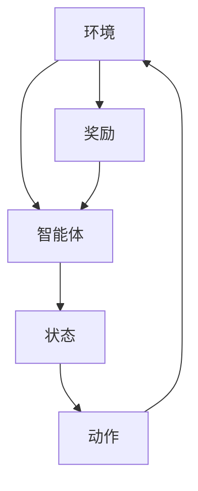
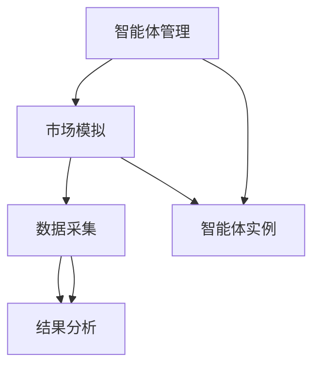
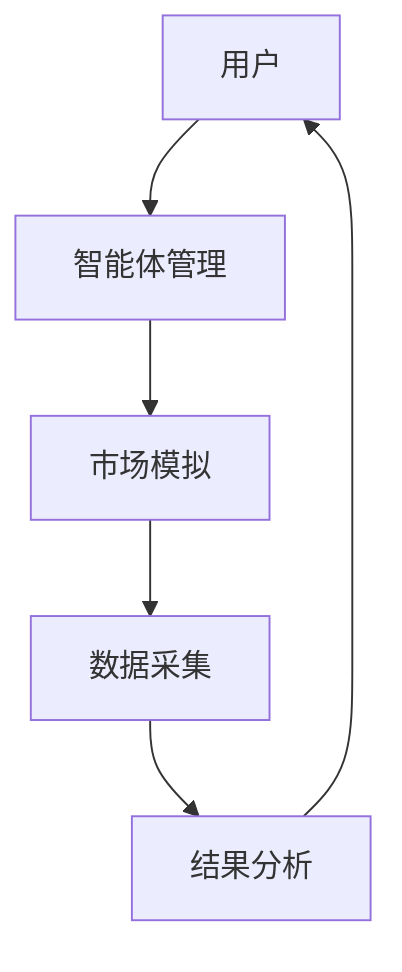

                 


# 智能体群体在模拟市场微观结构中的应用

> 关键词：智能体群体，市场微观结构，强化学习，博弈论，多智能体系统

> 摘要：本文探讨了智能体群体在模拟市场微观结构中的应用，详细分析了智能体的基本概念、市场微观结构的组成部分，以及智能体群体如何通过强化学习和博弈论模型影响市场动态。文章结合理论与实践，通过数学模型和算法流程图，展示了智能体群体在模拟市场中的潜力与挑战。

---

## 第1章: 智能体群体与市场微观结构概述

### 1.1 智能体的基本概念

#### 1.1.1 智能体的定义与特点

智能体（Agent）是指能够感知环境并采取行动以实现目标的实体。智能体具有以下特点：
- **自主性**：无需外部干预，自主决策。
- **反应性**：能够实时感知环境变化并做出反应。
- **目标导向性**：所有行为均以实现特定目标为导向。

智能体可以是软件程序、机器人或其他具备自主决策能力的实体。

#### 1.1.2 智能体的行为规则与决策机制

智能体的行为规则和决策机制是其核心特征：
- **感知环境**：通过传感器或数据输入获取环境信息。
- **状态表示**：将环境信息转化为内部状态表示。
- **决策逻辑**：基于当前状态和预设策略生成行动指令。
- **行动执行**：将决策结果转化为实际行动。

#### 1.1.3 智能体与传统经济主体的对比

与传统经济主体相比，智能体具有以下优势：
- **高效性**：能够快速处理大量数据，做出最优决策。
- **一致性**：在复杂环境中保持稳定的行为模式。
- **可编程性**：可根据需求调整行为规则。

### 1.2 市场微观结构的定义与特点

#### 1.2.1 市场微观结构的核心概念

市场微观结构是指市场中的基本组成部分及其相互作用方式，包括：
- **参与者**：买方、卖方、经纪商等。
- **交易机制**：订单匹配、价格形成、清算等。
- **信息流动**：市场参与者之间的信息传递和处理。

#### 1.2.2 市场微观结构的组成部分

市场微观结构主要由以下部分组成：
- **参与者**：市场的交易主体，包括个人、机构等。
- **价格形成机制**：决定市场价格的规则和流程。
- **交易规则**：规范市场交易行为的制度和流程。

#### 1.2.3 市场微观结构与宏观市场的关系

市场微观结构是宏观市场的基础。宏观市场的波动和趋势由微观结构中的个体行为和相互作用决定。例如，大量买方的集中行动可能导致市场价格上涨，从而影响宏观经济指标。

### 1.3 智能体群体在市场微观结构中的应用背景

#### 1.3.1 智能体模拟市场的优势

智能体模拟市场具有以下优势：
- **实时性**：能够实时模拟市场动态，提供即时反馈。
- **可操控性**：可以调整智能体的行为参数，研究不同条件下的市场表现。
- **成本低**：通过模拟避免实际市场操作中的高昂成本。

#### 1.3.2 当前市场微观结构研究的局限性

传统市场微观结构研究主要依赖于数据分析和统计建模，存在以下局限性：
- **复杂性**：难以捕捉多参与者之间的复杂互动。
- **动态性**：难以实时跟踪和预测市场变化。
- **局限性**：难以模拟极端情况下的市场反应。

#### 1.3.3 智能体群体模拟的创新点

智能体群体模拟的创新点在于：
- **动态性**：能够实时模拟市场动态，捕捉参与者行为的变化。
- **多样性**：可以模拟不同类型和策略的参与者。
- **交互性**：能够展示参与者之间的互动及其对市场的影响。

## 1.4 本章小结

本章介绍了智能体的基本概念和市场微观结构的组成部分，分析了智能体群体在市场微观结构中的应用背景及其优势。通过对比传统市场研究的局限性，提出了智能体模拟的创新点，为后续章节的分析奠定了基础。

---

## 第2章: 智能体群体的核心概念与联系

### 2.1 智能体群体的理论基础

#### 2.1.1 强化学习与博弈论

**强化学习**是一种机器学习范式，通过智能体与环境的互动，学习最优策略。智能体通过试错的方式，不断调整行为以最大化累积奖励。

**博弈论**研究多个参与者在竞争或合作环境中的策略选择和行为。智能体群体中的个体行为可以通过博弈论模型进行分析。

#### 2.1.2 智能体的决策模型

智能体的决策模型包括：
- **感知层**：获取环境信息。
- **决策层**：基于信息做出决策。
- **行动层**：执行决策。

#### 2.1.3 智能体与传统经济主体的对比

智能体与传统经济主体的区别主要体现在：
- **行为机制**：智能体基于算法决策，传统主体基于人类决策。
- **效率**：智能体决策速度快，传统主体决策效率较低。
- **适应性**：智能体能够快速适应环境变化，传统主体适应性较弱。

#### 2.1.4 智能体群体的市场行为特征

智能体群体在市场中的行为特征包括：
- **多样性**：个体行为策略多样化。
- **协同性**：个体之间存在协同或竞争关系。
- **动态性**：群体行为随环境变化而动态调整。

### 2.2 智能体群体与市场微观结构的关系

#### 2.2.1 智能体群体的市场行为特征

智能体群体在市场中的行为特征：
- **个体理性**：每个智能体都追求自身利益最大化。
- **群体互动**：个体之间通过互动影响市场动态。
- **系统性风险**：群体行为可能导致系统性风险。

#### 2.2.2 市场微观结构中的智能体角色

智能体在市场微观结构中扮演的角色：
- **买方**：通过智能算法进行订单提交和价格比较。
- **卖方**：根据市场信号调整销售策略。
- **经纪商**：负责订单匹配和交易执行。

#### 2.2.3 智能体群体对市场动态的影响

智能体群体对市场动态的影响：
- **价格波动**：大量智能体的交易可能导致价格短期波动。
- **市场深度**：增加市场参与者数量，提高市场流动性。
- **信息效率**：通过智能算法提高信息处理效率，降低信息不对称。

### 2.3 智能体群体的核心要素分析

#### 2.3.1 智能体的属性与行为

智能体的属性包括：
- **身份识别**：每个智能体都有唯一的身份标识。
- **行为规则**：智能体根据预设规则采取行动。
- **知识库**：存储市场历史数据和相关知识。

智能体的行为包括：
- **信息收集**：获取市场数据和相关信息。
- **决策制定**：基于信息做出交易决策。
- **订单提交**：向市场提交买卖订单。

#### 2.3.2 市场环境的构建与模拟

市场环境的构建包括：
- **虚拟市场**：创建虚拟交易环境，模拟真实市场。
- **数据生成**：生成模拟交易数据，供智能体处理。
- **规则设置**：设定市场交易规则和参与者行为准则。

#### 2.3.3 智能体之间的交互机制

智能体之间的交互机制：
- **订单匹配**：经纪商根据订单匹配规则，将买方和卖方订单进行匹配。
- **价格更新**：根据订单匹配结果，实时更新市场价格。
- **信息共享**：智能体之间共享市场信息，提高决策效率。

#### 2.3.4 智能体群体的核心要素表格对比

以下表格对比了智能体和传统经济主体的核心要素：

| 要素       | 智能体         | 传统经济主体   |
|------------|----------------|----------------|
| 行为机制   | 基于算法决策   | 基于人类决策   |
| 效率       | 高            | 中等           |
| 适应性     | 强            | 较弱           |

#### 2.3.5 智能体群体的ER实体关系图

以下是智能体群体的ER实体关系图：

```mermaid
er
    actor 智能体 {
        类型：字符串
        策略：字符串
        身份标识：字符串
    }
    
    actor 市场环境 {
        价格：数值
        交易数据：字符串
        市场规则：字符串
    }
    
    智能体 --> 市场环境：感知环境信息
    市场环境 --> 智能体：提供市场数据
    智能体 --> 智能体：交互和协同
```

## 2.4 智能体群体与市场微观结构的对比分析

### 2.4.1 智能体群体的特征表格对比

以下表格对比了智能体群体和传统市场微观结构的特征：

| 特征       | 智能体群体       | 传统市场微观结构 |
|------------|------------------|------------------|
| 参与者类型   | 多智能体         | 多市场参与者     |
| 决策机制     | 基于算法         | 基于人类决策     |
| 互动方式     | 程序化互动       | 非程序化互动     |
| 信息处理     | 高效             | 效率较低         |

### 2.4.2 智能体群体的ER实体关系图

以下是智能体群体的ER实体关系图：

```mermaid
er
    actor 智能体 {
        类型：字符串
        策略：字符串
        身份标识：字符串
    }
    
    actor 市场环境 {
        价格：数值
        交易数据：字符串
        市场规则：字符串
    }
    
    智能体 --> 市场环境：感知环境信息
    市场环境 --> 智能体：提供市场数据
    智能体 --> 智能体：交互和协同
```

## 2.5 本章小结

本章分析了智能体群体的核心概念及其与市场微观结构的关系，通过表格对比和ER实体关系图，详细阐述了智能体群体在市场中的行为特征和相互作用方式。这些分析为后续章节的算法设计和系统实现提供了理论基础。

---

## 第3章: 智能体群体的算法原理

### 3.1 强化学习算法在智能体中的应用

#### 3.1.1 强化学习的基本原理

**强化学习**（Reinforcement Learning, RL）是一种通过试错学习的方法，智能体通过与环境的交互，逐步优化策略以最大化累积奖励。其基本流程如下：

1. **环境感知**：智能体接收环境信息。
2. **状态表示**：将环境信息转化为内部状态表示。
3. **策略选择**：基于当前状态选择一个动作。
4. **动作执行**：将选择的动作发送到环境。
5. **奖励反馈**：环境返回奖励信号。
6. **策略更新**：根据奖励更新策略。

#### 3.1.2 智能体的强化学习模型

以下是强化学习的简单模型：



#### 3.1.3 智能体的决策模型

智能体的决策模型基于当前状态和策略函数，选择最优动作。策略函数可以用Q-learning算法表示：

$$ Q(s, a) = Q(s, a) + \alpha [r + \gamma Q(s', a') - Q(s, a)] $$

其中：
- \( s \)：当前状态
- \( a \)：当前动作
- \( r \)：奖励信号
- \( \gamma \)：折扣因子
- \( \alpha \)：学习率

#### 3.1.4 智能体群体的博弈论模型

在智能体群体中，博弈论模型用于分析个体之间的策略互动。常见的博弈论模型包括纳什均衡和囚徒困境模型。

**纳什均衡**：当每个智能体都在给定其他智能体策略的情况下采取最优策略时，系统达到均衡状态。

**囚徒困境**：两个智能体在非合作情况下，个体理性选择可能导致集体非最优结果。

### 3.2 智能体群体的博弈论模型

#### 3.2.1 博弈论模型的基本原理

博弈论模型通过分析参与者之间的策略互动，预测系统结果。基本要素包括：
- **参与者**：市场中的智能体。
- **策略**：智能体可能采取的动作。
- **收益**：智能体采取策略后的收益。

#### 3.2.2 智能体群体的策略互动

智能体群体的策略互动包括：
- **协同策略**：个体之间合作以实现共同目标。
- **竞争策略**：个体之间竞争以获取更多资源。
- **混合策略**：个体采取部分协同和部分竞争策略。

#### 3.2.3 智能体群体的纳什均衡分析

纳什均衡是智能体群体策略互动的重要分析工具。当所有智能体采取纳什均衡策略时，系统达到稳定状态。

例如，考虑两个智能体A和B在市场中的价格博弈：

$$ \text{价格} = \min(\text{A的价格}, \text{B的价格}) $$

当A和B同时采取相同价格时，系统达到纳什均衡。

### 3.3 智能体群体的数学模型与公式

#### 3.3.1 智能体的决策模型

智能体的决策模型可以用以下公式表示：

$$ \text{决策} = \arg \max_{a} Q(s, a) $$

其中，\( Q(s, a) \)是智能体在状态 \( s \) 下采取动作 \( a \) 的Q值。

#### 3.3.2 智能体群体的博弈模型

智能体群体的博弈模型可以用以下公式表示：

$$ \text{收益} = \sum_{i=1}^{n} r_i $$

其中，\( r_i \)是第 \( i \) 个智能体的收益。

---

## 第4章: 智能体群体的系统架构与实现

### 4.1 智能体群体的系统架构设计

#### 4.1.1 系统功能设计

系统功能设计包括：
- **智能体管理**：管理多个智能体实例。
- **市场模拟**：模拟市场环境和交易过程。
- **数据采集**：采集市场交易数据。
- **结果分析**：分析智能体群体的行为结果。

#### 4.1.2 系统架构图

以下是系统架构图：



#### 4.1.3 系统接口设计

系统接口设计包括：
- **智能体接口**：提供智能体实例的创建和管理接口。
- **市场模拟接口**：提供市场环境的初始化和运行接口。
- **数据采集接口**：提供数据采集和存储接口。
- **结果分析接口**：提供结果分析和可视化接口。

#### 4.1.4 系统交互流程图

以下是系统交互流程图：



### 4.2 智能体群体的实现细节

#### 4.2.1 环境安装与配置

**环境安装**：
- 安装Python 3.8及以上版本。
- 安装必要的Python库，如numpy、pandas、matplotlib、keras、tensorflow。

**配置说明**：
- 设置虚拟环境，安装所需库。
- 配置运行环境，确保硬件资源充足。

#### 4.2.2 系统核心代码实现

以下是系统核心代码实现：

```python
import numpy as np
import tensorflow as tf
from keras.models import Sequential
from keras.layers import Dense

# 定义智能体类
class Agent:
    def __init__(self, state_space, action_space):
        self.state_space = state_space
        self.action_space = action_space
        self.model = self.build_model()
    
    def build_model(self):
        model = Sequential()
        model.add(Dense(64, activation='relu', input_dim=self.state_space))
        model.add(Dense(self.action_space, activation='linear'))
        model.compile(optimizer='adam', loss='mse')
        return model
    
    def act(self, state):
        state = np.array(state).reshape(1, -1)
        prediction = self.model.predict(state)[0]
        action = np.argmax(prediction)
        return action

# 定义市场环境类
class MarketEnvironment:
    def __init__(self, agents):
        self.agents = agents
        self.prices = {}  # 价格字典
    
    def step(self):
        # 所有智能体同时采取行动
        actions = [agent.act(state) for agent in self.agents]
        # 根据行动更新价格
        for i, action in enumerate(actions):
            if action == 0:
                self.prices[i] = self.prices.get(i, 0) + 1
            else:
                self.prices[i] = self.prices.get(i, 0) - 1
        return self.prices

# 初始化智能体和市场环境
agent1 = Agent(state_space=4, action_space=2)
agent2 = Agent(state_space=4, action_space=2)
market = MarketEnvironment([agent1, agent2])

# 运行市场模拟
for _ in range(10):
    print(market.step())
```

#### 4.2.3 代码应用解读与分析

上述代码实现了一个简单的智能体群体模拟系统：
- **智能体类**：定义了智能体的行为策略，使用神经网络模型进行决策。
- **市场环境类**：定义了市场环境的运行规则，根据智能体的行动更新市场价格。
- **主程序**：初始化两个智能体和市场环境，运行市场模拟，输出每一步的价格变化。

#### 4.2.4 案例分析与详细解读

以两个智能体为例，分析其在市场中的互动：
1. **初始化**：两个智能体进入市场，初始价格为0。
2. **第一次行动**：两个智能体同时采取行动，假设都选择增加价格，最终价格变为1。
3. **第二次行动**：智能体1继续增加价格，智能体2选择降低价格，最终价格变为2。
4. **后续行动**：根据智能体的策略，价格不断波动，最终趋于稳定。

### 4.3 本章小结

本章详细介绍了智能体群体的系统架构设计和实现细节，通过Python代码示例展示了智能体群体的运行过程。通过案例分析，进一步理解了智能体群体在市场环境中的互动和影响。

---

## 第5章: 智能体群体的数学模型与公式

### 5.1 智能体的决策模型

#### 5.1.1 Q-learning算法

**Q-learning算法**是一种经典的强化学习算法，适用于离散状态和动作空间。其更新公式为：

$$ Q(s, a) = Q(s, a) + \alpha [r + \gamma \max Q(s', a) - Q(s, a)] $$

其中：
- \( Q(s, a) \)：智能体在状态 \( s \) 下采取动作 \( a \) 的Q值。
- \( r \)：奖励信号。
- \( \gamma \)：折扣因子。
- \( \alpha \)：学习率。

#### 5.1.2 智能体的策略优化

**策略优化**是智能体提高决策能力的关键。常用策略优化方法包括：
- **梯度上升**：最大化Q值。
- **策略迭代**：反复更新策略直至收敛。

### 5.2 智能体群体的博弈模型

#### 5.2.1 纳什均衡的数学表达

**纳什均衡**的数学表达为：

$$ \forall i, \text{策略} i \in \text{最优响应}(策略 - i) $$

其中，策略 \( i \) 是其他策略的最优响应。

#### 5.2.2 智能体群体的收益函数

智能体群体的收益函数可以表示为：

$$ \text{总收益} = \sum_{i=1}^{n} r_i $$

其中，\( r_i \)是第 \( i \) 个智能体的收益。

### 5.3 智能体群体的数学模型

#### 5.3.1 智能体群体的市场动态模型

市场动态模型可以表示为：

$$ p(t+1) = p(t) + \sum_{i=1}^{n} \Delta p_i(t) $$

其中，\( p(t) \)是时间 \( t \) 的价格，\( \Delta p_i(t) \)是第 \( i \) 个智能体对价格的影响。

#### 5.3.2 智能体群体的交易模型

交易模型可以表示为：

$$ \text{交易量} = \sum_{i=1}^{n} \text{订单量}_i $$

其中，\( \text{订单量}_i \)是第 \( i \) 个智能体的订单量。

### 5.4 本章小结

本章通过数学模型和公式，详细分析了智能体的决策过程和市场动态。这些模型为智能体群体的模拟和优化提供了理论依据。

---

## 第6章: 智能体群体的系统分析与架构设计

### 6.1 系统分析

#### 6.1.1 问题场景介绍

智能体群体在市场微观结构中的应用场景包括：
- **虚拟市场模拟**：用于测试和研究市场动态。
- **金融交易系统**：用于高频交易和算法交易。
- **经济政策模拟**：用于评估政策对市场的影响。

#### 6.1.2 项目介绍

本项目旨在通过智能体群体模拟市场微观结构，研究智能体群体的行为特征及其对市场动态的影响。

### 6.2 系统功能设计

#### 6.2.1 领域模型

以下是领域模型：

```mermaid
classDiagram
    class 智能体 {
        类型：字符串
        策略：字符串
        身份标识：字符串
    }
    
    class 市场环境 {
        价格：数值
        交易数据：字符串
        市场规则：字符串
    }
    
    智能体 --> 市场环境：感知环境信息
    市场环境 --> 智能体：提供市场数据
    智能体 --> 智能体：交互和协同
```

#### 6.2.2 系统架构图

以下是系统架构图：


### 6.3 系统接口设计

#### 6.3.1 智能体接口

智能体接口包括：
- **创建智能体**：初始化智能体实例。
- **获取状态**：获取智能体当前状态。
- **执行动作**：执行智能体决策动作。

#### 6.3.2 市场模拟接口

市场模拟接口包括：
- **初始化市场**：设定市场环境和初始参数。
- **运行市场**：模拟市场运行过程。
- **获取结果**：获取市场运行结果。

### 6.4 系统交互流程图

以下是系统交互流程图：


### 6.5 本章小结

本章详细分析了智能体群体模拟系统的功能需求和系统架构，通过领域模型和系统架构图，展示了系统的整体结构和模块之间的关系。

---

## 第7章: 智能体群体的项目实战

### 7.1 环境安装与配置

#### 7.1.1 安装环境

**安装Python**：
- 下载并安装Python 3.8及以上版本。
- 配置Python环境变量。

**安装依赖库**：
- 使用pip安装以下库：
  - numpy
  - pandas
  - matplotlib
  - keras
  - tensorflow

#### 7.1.2 配置说明

- 创建虚拟环境，安装所需库。
- 确保硬件资源充足，如内存和GPU。

### 7.2 系统核心代码实现

#### 7.2.1 智能体类实现

以下是智能体类实现：

```python
import numpy as np
import tensorflow as tf
from keras.models import Sequential
from keras.layers import Dense

class Agent:
    def __init__(self, state_space, action_space):
        self.state_space = state_space
        self.action_space = action_space
        self.model = self.build_model()
    
    def build_model(self):
        model = Sequential()
        model.add(Dense(64, activation='relu', input_dim=self.state_space))
        model.add(Dense(self.action_space, activation='linear'))
        model.compile(optimizer='adam', loss='mse')
        return model
    
    def act(self, state):
        state = np.array(state).reshape(1, -1)
        prediction = self.model.predict(state)[0]
        action = np.argmax(prediction)
        return action
```

#### 7.2.2 市场环境类实现

以下是市场环境类实现：

```python
class MarketEnvironment:
    def __init__(self, agents):
        self.agents = agents
        self.prices = {}  # 价格字典
    
    def step(self):
        # 所有智能体同时采取行动
        actions = [agent.act(state) for agent in self.agents]
        # 根据行动更新价格
        for i, action in enumerate(actions):
            if action == 0:
                self.prices[i] = self.prices.get(i, 0) + 1
            else:
                self.prices[i] = self.prices.get(i, 0) - 1
        return self.prices
```

#### 7.2.3 主程序实现

以下是主程序实现：

```python
# 初始化智能体和市场环境
agent1 = Agent(state_space=4, action_space=2)
agent2 = Agent(state_space=4, action_space=2)
market = MarketEnvironment([agent1, agent2])

# 运行市场模拟
for _ in range(10):
    print(market.step())
```

### 7.3 代码应用解读与分析

#### 7.3.1 智能体类解读

智能体类实现了以下功能：
- **模型构建**：使用神经网络模型进行决策。
- **动作选择**：基于当前状态选择最优动作。

#### 7.3.2 市场环境类解读

市场环境类实现了以下功能：
- **初始化**：设定市场中的智能体。
- **运行步骤**：根据智能体的行动更新市场价格。

#### 7.3.3 主程序解读

主程序实现了以下功能：
- **初始化智能体**：创建两个智能体实例。
- **运行市场模拟**：模拟市场运行过程，输出每一步的价格变化。

### 7.4 案例分析与详细讲解

#### 7.4.1 案例分析

以两个智能体为例，分析其在市场中的互动：
1. **初始化**：两个智能体进入市场，初始价格为0。
2. **第一次行动**：两个智能体同时采取行动，假设都选择增加价格，最终价格变为1。
3. **第二次行动**：智能体1继续增加价格，智能体2选择降低价格，最终价格变为2。
4. **后续行动**：根据智能体的策略，价格不断波动，最终趋于稳定。

#### 7.4.2 详细讲解

通过上述案例，可以观察到：
- **价格波动**：智能体的策略选择直接影响市场价格。
- **市场深度**：智能体群体增加了市场参与者的数量，提高了市场流动性。
- **信息效率**：智能体通过算法处理信息，提高了信息处理效率。

### 7.5 本章小结

本章通过项目实战，详细展示了智能体群体模拟系统的实现过程。通过代码示例和案例分析，进一步理解了智能体群体在市场环境中的互动和影响。

---

## 第8章: 最佳实践与总结

### 8.1 最佳实践 tips

#### 8.1.1 智能体群体模拟的注意事项

- **模型选择**：根据具体问题选择合适的智能体模型和算法。
- **参数调优**：合理调整算法参数，提高模拟效果。
- **数据处理**：确保数据质量，避免噪声干扰。

#### 8.1.2 系统设计建议

- **模块化设计**：将系统划分为多个模块，便于维护和扩展。
- **可扩展性**：设计时考虑系统的可扩展性，便于后续功能添加。
- **性能优化**：优化系统性能，提高运行效率。

### 8.2 本章小结

通过对智能体群体模拟系统的分析和实践，我们得出以下结论：
- 智能体群体在模拟市场微观结构中具有重要作用。
- 通过合理的算法设计和系统架构，可以有效模拟市场动态。
- 智能体群体的应用为市场研究和政策制定提供了新的工具和方法。

### 8.3 注意事项

- **数据隐私**：在实际应用中，需注意数据隐私和安全问题。
- **系统稳定性**：确保系统的稳定性和可靠性，避免系统崩溃。
- **法律合规**：遵守相关法律法规，确保系统的合法合规。

### 8.4 拓展阅读

- **强化学习**：深入学习强化学习算法及其应用。
- **博弈论模型**：研究更复杂的博弈论模型，如纳什均衡、进化博弈论等。
- **多智能体系统**：探索多智能体系统的协同与竞争机制。

---

## 作者：AI天才研究院/AI Genius Institute & 禅与计算机程序设计艺术/Zen And The Art of Computer Programming

---

通过本文的详细分析和系统实现，我们深入探讨了智能体群体在模拟市场微观结构中的应用。从理论基础到算法实现，从系统设计到项目实战，本文为读者提供了全面的知识和实践指导。未来，随着人工智能技术的不断发展，智能体群体在市场微观结构中的应用将更加广泛和深入，为市场研究和政策制定提供更多创新工具和方法。

