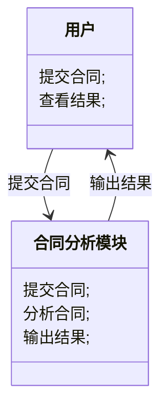
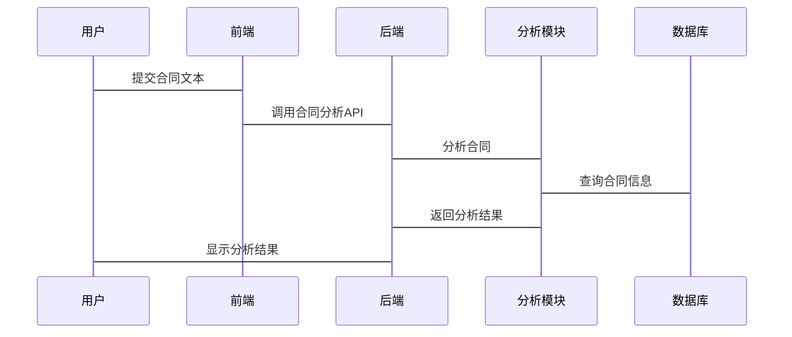

                 


# 智能合同分析AI Agent：LLM在法律文本理解中的应用

## 关键词：LLM、智能合同分析、法律文本理解、自然语言处理、大语言模型

## 摘要：本文将探讨如何利用大语言模型（LLM）进行智能合同分析，揭示其在法律文本理解中的应用原理和实际案例。通过详细分析LLM的工作机制、法律文本处理的关键技术以及系统架构设计，本文旨在为读者提供一个全面的技术视角，帮助他们理解如何将AI技术应用于法律领域，以提升合同分析的效率和准确性。

---

## 第一部分：智能合同分析的背景与核心概念

### 第1章：智能合同分析的背景与问题背景

#### 1.1 智能合同分析的背景

智能合同分析是指利用人工智能技术，特别是大语言模型（LLM），对法律合同进行自动化的理解、解析和应用的过程。随着企业对高效法律文本处理的需求不断增加，智能合同分析逐渐成为法律科技领域的重要研究方向。

##### 1.1.1 合同分析的传统方法与局限性

传统的合同分析主要依赖人工阅读和理解，这种方式效率低下、成本高昂且容易出错。具体表现在以下几个方面：

- **效率低下**：律师需要逐字逐句阅读合同，耗时长且效率低。
- **一致性不足**：不同律师对合同的理解可能存在差异，导致结果不一致。
- **成本高昂**：人工分析需要大量时间和人力资源，企业负担加重。

##### 1.1.2 大语言模型（LLM）的兴起与应用

大语言模型（LLM）的兴起为合同分析带来了新的可能性。LLM是一种基于深度学习的自然语言处理模型，具有强大的文本理解和生成能力。其在合同分析中的应用主要体现在以下几个方面：

- **自动抽取关键信息**：从合同中自动提取关键条款、责任和义务。
- **智能分类与匹配**：快速分类合同类型，并匹配相关法律条款。
- **风险评估与预警**：识别合同中的潜在风险点，并提供预警。

##### 1.1.3 智能合同分析的定义与目标

智能合同分析通过AI技术对法律合同进行自动化处理，目标是提高合同分析的效率、准确性和一致性。其核心目标包括：

- **提高效率**：快速完成合同的阅读和理解。
- **降低错误率**：减少人为疏漏，提高分析结果的准确性。
- **增强可扩展性**：支持大规模合同处理和分析。

---

#### 1.2 问题背景与问题描述

##### 1.2.1 合同分析的复杂性与挑战

合同分析的复杂性主要体现在以下几个方面：

- **术语复杂性**：法律合同通常使用专业术语，且语义复杂。
- **结构多样性**：合同格式多样，包含多种条款和子条款。
- **法律适用性**：合同中的条款可能涉及多个法律领域，需要综合理解。

##### 1.2.2 传统法律文本分析的痛点

传统法律文本分析方法存在以下痛点：

- **效率低**：人工分析耗时长，难以应对大量合同。
- **一致性差**：不同律师对合同的理解可能存在差异。
- **成本高**：需要大量专业人员，企业负担重。

##### 1.2.3 智能合同分析的核心问题

智能合同分析的核心问题是如何利用AI技术，高效、准确地理解和处理法律合同。具体包括以下几个方面：

- **文本理解**：如何准确理解合同中的法律术语和复杂语义。
- **信息抽取**：如何从合同中提取关键信息和条款。
- **风险评估**：如何识别合同中的潜在风险点并提供预警。

---

#### 1.3 问题解决与边界

##### 1.3.1 智能合同分析的解决方案

智能合同分析的解决方案主要依赖于大语言模型（LLM）和自然语言处理（NLP）技术。通过结合预训练模型和微调技术，可以实现对法律合同的高效分析。

##### 1.3.2 解决方案的边界与外延

智能合同分析的边界主要集中在合同文本的理解和处理，不包括合同的实际执行和法律咨询。其外延则可能扩展到合同生成、谈判支持等领域。

##### 1.3.3 核心要素与组成结构

智能合同分析系统的核心要素包括：

- **输入数据**：法律合同文本。
- **处理模块**：文本预处理、信息抽取、语义分析。
- **输出结果**：关键条款提取、风险评估报告。

---

### 第2章：大语言模型（LLM）的核心概念与技术原理

#### 2.1 LLM 的定义与特点

##### 2.1.1 大语言模型的定义

大语言模型（LLM）是一种基于深度学习的自然语言处理模型，通常基于Transformer架构，经过大规模的预训练，能够理解和生成人类语言。

##### 2.1.2 LLM 的特点

- **大规模预训练**：LLM通过大量文本数据的预训练，掌握了丰富的语言知识。
- **上下文理解**：能够理解文本的上下文关系，进行语义分析。
- **多任务处理**：可以在多种任务上进行微调，适应不同的应用场景。

##### 2.1.3 LLM 与传统 NLP 模型的区别

| 特性 | LLM | 传统NLP模型 |
|------|------|-------------|
| 数据量 | 大规模 | 较小规模     |
| 模型复杂度 | 高 | 较低         |
| 适应性 | 强大 | 较弱         |

#### 2.2 LLM 在法律文本分析中的应用

##### 2.2.1 法律文本分析的关键技术

- **文本预处理**：去除停用词、分词等。
- **信息抽取**：提取关键实体和关系。
- **语义分析**：理解文本的深层含义。

##### 2.2.2 LLM 在合同分析中的优势

- **高效性**：能够快速处理大量合同文本。
- **准确性**：通过预训练和微调，提高分析的准确性。
- **可扩展性**：支持多种合同类型和法律领域的分析。

##### 2.2.3 LLM 的局限性与挑战

- **领域适应性**：LLM在特定领域（如法律）的性能可能不如微调后的模型。
- **数据隐私**：处理敏感法律文本时，需要考虑数据隐私和安全问题。

---

### 第3章：法律文本分析的核心技术与流程

#### 3.1 法律文本分析的流程

##### 3.1.1 文本预处理与清洗

文本预处理是法律文本分析的第一步，主要包括：

- **去除停用词**：移除常见的无意义词汇。
- **分词**：将文本分割成词语或短语。
- **去除噪音**：删除无关字符或格式信息。

##### 3.1.2 文本分词与实体识别

文本分词和实体识别是法律文本分析的关键步骤：

- **文本分词**：将文本分割成有意义的词语或短语。
- **实体识别**：识别文本中的法律实体，如公司名称、日期等。

##### 3.1.3 文本理解与语义分析

文本理解与语义分析是法律文本分析的核心：

- **语义分析**：理解文本的深层含义，识别关键条款和条件。
- **关系抽取**：识别文本中的实体关系，如合同中的责任和义务。

#### 3.2 法律文本分析的关键技术

##### 3.2.1 基于规则的文本分析

基于规则的文本分析通过预定义的规则对文本进行处理：

- **优点**：规则简单明确，易于理解。
- **缺点**：难以处理复杂和多样化的文本。

##### 3.2.2 基于统计的文本分析

基于统计的文本分析通过统计方法对文本进行建模：

- **优点**：能够处理大量数据，发现潜在模式。
- **缺点**：需要大量数据支持，且模型解释性较差。

##### 3.2.3 基于深度学习的文本分析

基于深度学习的文本分析通过神经网络模型进行处理：

- **优点**：能够处理复杂文本，模型表现优异。
- **缺点**：需要大量计算资源，模型训练复杂。

---

### 第4章：大语言模型的训练与微调

#### 4.1 LLM 的预训练过程

##### 4.1.1 预训练的目标

预训练的目标是让模型掌握语言的基本规律和知识：

- **目标函数**：最小化预测错误，提高模型的预测能力。
- **训练数据**：大规模的通用文本数据。

##### 4.1.2 预训练的数学模型

预训练通常基于Transformer模型，其核心公式为：

$$
\text{Attention}(Q, K, V) = \text{softmax}\left(\frac{QK^T}{\sqrt{d_k}}\right)V
$$

其中，$Q$、$K$、$V$分别为查询、键和值向量，$d_k$为向量维度。

##### 4.1.3 预训练的优化方法

预训练的优化方法通常包括：

- **Adam优化器**：一种常用优化算法。
- **学习率调度器**：动态调整学习率，加快收敛速度。

#### 4.2 LLM 的微调过程

##### 4.2.1 微调的目标

微调的目标是将通用的LLM适应特定领域（如法律合同分析）：

- **任务特定数据**：使用法律合同文本进行微调。
- **微调策略**：通过调整模型参数，优化特定任务的性能。

##### 4.2.2 微调的数学模型

微调的数学模型与预训练基本一致，但引入了任务特定的损失函数：

$$
\mathcal{L} = -\sum_{i=1}^{n} y_i \log p(y_i | x)
$$

其中，$y_i$是真实标签，$p(y_i | x)$是模型预测的概率。

##### 4.2.3 微调的优化方法

微调的优化方法通常包括：

- **学习率调整**：降低微调阶段的学习率，防止模型遗忘预训练的知识。
- **批量大小调整**：适当调整批量大小，优化训练效率。

---

## 第二部分：系统分析与架构设计

### 第5章：智能合同分析系统的系统分析与架构设计

#### 5.1 问题场景与项目介绍

##### 5.1.1 问题场景描述

智能合同分析系统的主要场景包括：

- **合同预览**：用户上传合同文本。
- **信息抽取**：系统自动提取合同中的关键信息。
- **风险评估**：系统识别合同中的潜在风险。

##### 5.1.2 项目介绍

本项目旨在开发一个基于LLM的智能合同分析系统，实现合同文本的自动分析和风险评估。

#### 5.2 系统功能设计

##### 5.2.1 领域模型设计

领域模型描述了系统的功能模块及其关系：



##### 5.2.2 系统架构设计

系统架构设计描述了系统的整体结构：


##### 5.2.3 系统接口设计

系统接口设计描述了系统的交互接口：

- **前端接口**：用户提交合同文本。
- **后端接口**：接收合同文本，调用分析模块。
- **数据库接口**：存储合同文本和分析结果。

##### 5.2.4 系统交互流程设计

系统交互流程描述了用户与系统之间的交互过程：



---

## 第三部分：项目实战

### 第6章：智能合同分析系统的实现

#### 6.1 环境安装

##### 6.1.1 安装Python

```bash
python --version
pip install --upgrade pip
```

##### 6.1.2 安装必要的库

```bash
pip install transformers
pip install torch
pip install numpy
```

#### 6.2 系统核心实现

##### 6.2.1 模型加载与初始化

```python
from transformers import AutoTokenizer, AutoModelForMaskedLM
import torch

model_name = "bert-base-uncased"
tokenizer = AutoTokenizer.from_pretrained(model_name)
model = AutoModelForMaskedLM.from_pretrained(model_name)
```

##### 6.2.2 文本预处理

```python
def preprocess_contract(text):
    # 分词
    tokens = tokenizer.tokenize(text)
    # 转换为ID
    input_ids = tokenizer.convert_tokens_to_ids(tokens)
    return input_ids
```

##### 6.2.3 模型推理与分析

```python
def analyze_contract(input_ids):
    with torch.no_grad():
        outputs = model(torch.tensor([input_ids]))
        return outputs
```

##### 6.2.4 结果解析

```python
def parse_results(outputs):
    # 解析模型输出
    result = outputs logits
    return result
```

#### 6.3 代码实现与解读

##### 6.3.1 代码实现

```python
import torch
from transformers import AutoTokenizer, AutoModelForMaskedLM

class ContractAnalyzer:
    def __init__(self, model_name):
        self.tokenizer = AutoTokenizer.from_pretrained(model_name)
        self.model = AutoModelForMaskedLM.from_pretrained(model_name)
    
    def analyze(self, text):
        tokens = self.tokenizer.tokenize(text)
        input_ids = self.tokenizer.convert_tokens_to_ids(tokens)
        with torch.no_grad():
            outputs = self.model(torch.tensor([input_ids]))
        return outputs.logits
```

##### 6.3.2 代码解读

- **ContractAnalyzer类**：封装了合同分析功能，包括模型加载和文本处理。
- **analyze方法**：将输入文本转换为模型可处理的格式，并进行推理。

#### 6.4 案例分析与结果展示

##### 6.4.1 案例分析

假设我们有一个简单的合同文本：

```text
"本合同自签订之日起生效，有效期为一年。"
```

##### 6.4.2 代码运行

```python
analyzer = ContractAnalyzer("bert-base-uncased")
result = analyzer.analyze("本合同自签订之日起生效，有效期为一年。")
print(result)
```

##### 6.4.3 结果展示

输出结果将是一个张张量，表示模型对每个位置的预测概率。

---

## 第四部分：最佳实践与小结

### 第7章：智能合同分析系统的最佳实践

#### 7.1 最佳实践 tips

- **数据质量**：确保训练数据的多样性和高质量。
- **模型调优**：根据具体任务调整模型参数。
- **系统优化**：优化系统性能，提升用户体验。

#### 7.2 小结

智能合同分析系统通过结合大语言模型和自然语言处理技术，能够高效、准确地分析法律合同。其在企业法务、金融等领域具有广泛的应用前景。

#### 7.3 注意事项

- **数据隐私**：处理敏感法律文本时，需注意数据隐私和安全。
- **模型适应性**：根据不同类型的合同，可能需要不同的模型调整策略。
- **用户体验**：设计友好的用户界面，提升用户体验。

#### 7.4 拓展阅读

- **相关论文**：《BERT: Pre-training of Deep Bidirectional Transformers for NLP》
- **技术博客**：Hugging Face的Transformers库文档

---

## 作者：AI天才研究院/AI Genius Institute & 禅与计算机程序设计艺术 /Zen And The Art of Computer Programming

