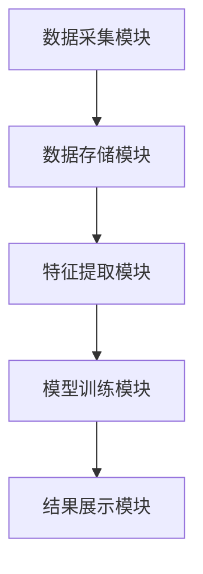

                 


# 智能算法识别市场泡沫形成

> 关键词：智能算法，市场泡沫，异常检测，时间序列，机器学习，LSTM，Transformer

> 摘要：本文深入探讨了如何利用智能算法识别市场泡沫的形成。通过分析市场数据特征、异常检测算法、时间序列模型、神经网络模型等技术，结合实际案例，详细讲解了如何构建市场泡沫识别系统。本文旨在为金融从业者、数据科学家和算法工程师提供一套基于智能算法的市场泡沫识别方法，帮助他们在金融市场中做出更明智的投资决策。

---

# 第一部分: 市场泡沫与智能算法概述

## 第1章: 市场泡沫的定义与特征

### 1.1 市场泡沫的定义
#### 1.1.1 市场泡沫的基本概念
市场泡沫是指某种资产或商品的价格远高于其实际价值的现象。通常表现为价格在短期内急剧上涨，随后突然下跌或崩溃。市场泡沫的形成往往与投资者的非理性行为、信息不对称和市场操纵等因素有关。

#### 1.1.2 市场泡沫的形成机制
市场泡沫的形成机制可以分为以下几个阶段：
1. **初始阶段**：市场参与者基于理性预期进行交易，价格逐渐上涨。
2. **泡沫生成阶段**：投资者预期价格会进一步上涨，开始盲目跟风，价格脱离实际价值。
3. **泡沫破裂阶段**：市场参与者意识到价格虚高，开始抛售资产，价格迅速下跌。

#### 1.1.3 市场泡沫的经济影响
市场泡沫的破裂通常会导致严重的经济损失，例如2008年的全球金融危机和2021年的加密货币市场崩盘。因此，识别市场泡沫的形成是金融市场风险管理的重要环节。

---

### 1.2 智能算法的定义与特点
#### 1.2.1 智能算法的基本概念
智能算法是一种结合了人工智能（AI）和机器学习技术的算法，能够通过数据学习和模式识别，自动优化自身的预测和决策能力。

#### 1.2.2 智能算法的核心特点
1. **自适应性**：能够根据输入数据的变化自动调整模型参数。
2. **高维度数据处理能力**：能够处理大量复杂的数据特征。
3. **实时性**：能够在短时间内完成数据处理和预测。

#### 1.2.3 智能算法与传统算法的区别
| 特性         | 传统算法                | 智能算法                |
|--------------|-------------------------|-------------------------|
| 学习方式     | 基于固定的规则和逻辑     | 基于数据学习和优化       |
| 处理能力     | 适用于简单问题           | 适用于复杂问题           |
| 灵活性       | 较低                    | 较高                    |

---

### 1.3 智能算法在市场泡沫识别中的应用价值
#### 1.3.1 市场泡沫识别的难点与挑战
1. **数据复杂性**：市场数据通常包含噪声和不确定性。
2. **非线性关系**：价格波动往往受到多种复杂因素的影响。
3. **实时性要求**：市场泡沫的识别需要快速响应。

#### 1.3.2 智能算法的优势与潜力
1. **数据驱动**：智能算法能够从大量数据中提取特征，发现潜在的模式。
2. **高精度**：通过深度学习模型，可以实现对市场波动的高精度预测。
3. **实时性**：智能算法能够快速处理实时数据，满足市场的实时需求。

#### 1.3.3 应用智能算法识别市场泡沫的意义
通过智能算法识别市场泡沫，可以帮助投资者做出更明智的决策，避免因市场崩盘带来的重大损失。

---

## 第2章: 市场泡沫识别的核心概念

### 2.1 市场数据特征提取
#### 2.1.1 数据特征的定义
数据特征是指能够反映数据本质属性的指标，例如价格、成交量、波动率等。

#### 2.1.2 数据特征的分类
1. **时间特征**：如价格趋势、成交量变化。
2. **统计特征**：如均值、方差、偏度。
3. **波动特征**：如波动率、最大回撤。

#### 2.1.3 数据特征的提取方法
1. **移动平均线（MA）**：计算一定时间内的平均价格。
2. **相对强弱指数（RSI）**：衡量价格超买或超卖状态。
3. **波动率指数（VIX）**：反映市场的波动程度。

---

### 2.2 异常检测算法原理
#### 2.2.1 异常检测的基本概念
异常检测是指通过分析数据，识别出与正常数据模式显著不同的数据点。

#### 2.2.2 异常检测算法的分类
1. **基于统计的方法**：如Z-Score、Grubbs检验。
2. **基于机器学习的方法**：如Isolation Forest、One-Class SVM。
3. **基于深度学习的方法**：如Autoencoder、LSTM。

#### 2.2.3 异常检测算法的优缺点对比
| 算法类型             | 优点                     | 缺点                     |
|----------------------|--------------------------|--------------------------|
| 基于统计的方法       | 计算简单，易于解释         | 对复杂数据表现较差         |
| 基于机器学习的方法   | 能处理复杂数据             | 计算复杂，解释性较差       |
| 基于深度学习的方法   | 能捕捉数据深层特征           | 需要大量数据，计算资源消耗大 |

---

### 2.3 市场泡沫识别模型构建
#### 2.3.1 模型构建的基本步骤
1. **数据收集**：获取相关市场数据，如股票价格、成交量等。
2. **数据预处理**：清洗数据，提取特征。
3. **模型训练**：使用训练数据训练模型。
4. **模型验证**：使用测试数据验证模型性能。
5. **模型优化**：调整参数，提升模型性能。

#### 2.3.2 模型构建的关键因素
1. **数据质量**：数据的完整性和准确性直接影响模型性能。
2. **特征选择**：选择合适的特征能够提高模型的预测精度。
3. **模型选择**：选择适合数据特征的模型类型。

#### 2.3.3 模型构建的常见问题与解决方案
1. **过拟合问题**：通过交叉验证和正则化方法解决。
2. **数据不平衡问题**：通过过采样和欠采样方法解决。

---

## 第3章: 智能算法的核心原理

### 3.1 数据预处理与特征工程
#### 3.1.1 数据清洗与标准化
数据清洗是指去除噪声数据，填补缺失值。标准化是指将数据归一化，使其具有相同的量纲。

#### 3.1.2 特征选择与降维
特征选择是指从大量特征中筛选出对模型性能影响较大的特征。降维技术如PCA（主成分分析）可以减少特征维度，降低计算复杂度。

#### 3.1.3 数据增强与扩展
数据增强是指通过生成新的数据样本，增加训练数据量，提升模型的泛化能力。

---

### 3.2 基于时间序列的异常检测算法
#### 3.2.1 时间序列的基本概念
时间序列是指按时间顺序排列的数据序列，如股票价格、汇率等。

#### 3.2.2 基于统计的方法（如Z-Score）
Z-Score是一种常用的异常检测方法，公式为：
$$ Z = \frac{x - \mu}{\sigma} $$
其中，$\mu$ 是均值，$\sigma$ 是标准差。

#### 3.2.3 基于机器学习的方法（如LSTM）
LSTM（长短期记忆网络）是一种特殊的RNN（循环神经网络），适用于处理时间序列数据。

---

### 3.3 市场泡沫识别的数学模型
#### 3.3.1 时间序列模型（ARIMA）
ARIMA（自回归积分滑动平均模型）是一种常用的时间序列预测模型。其数学公式为：
$$ ARIMA(p, d, q) $$
其中，$p$ 是自回归阶数，$d$ 是差分阶数，$q$ 是滑动平均阶数。

#### 3.3.2 神经网络模型（LSTM）
LSTM模型的结构包括输入门、遗忘门和输出门，公式如下：
$$ i_t = \sigma(W_i x_t + U_i h_{t-1}) $$
$$ f_t = \sigma(W_f x_t + U_f h_{t-1}) $$
$$ o_t = \sigma(W_o x_t + U_o h_{t-1}) $$
$$ h_t = i_t \cdot \cosh(W_c x_t + U_c h_{t-1}) $$

#### 3.3.3 深度学习模型（Transformer）
Transformer模型是一种基于注意力机制的深度学习模型，其注意力机制公式为：
$$ \text{Attention}(Q, K, V) = \text{softmax}\left(\frac{QK^T}{\sqrt{d_k}}\right)V $$

---

## 第4章: 算法实现与代码解析

### 4.1 环境搭建与工具安装
#### 4.1.1 Python环境的安装与配置
安装Python 3.8及以上版本，推荐使用Anaconda分布。

#### 4.1.2 必需库的安装
安装以下库：
- `numpy`
- `pandas`
- `scikit-learn`
- `tensorflow`
- `pymer4`

---

### 4.2 核心代码实现
#### 4.2.1 数据预处理代码
```python
import numpy as np
import pandas as pd

# 数据加载
data = pd.read_csv('market_data.csv')

# 数据清洗
data.dropna(inplace=True)
data = data[['date', 'price', 'volume']]

# 数据标准化
from sklearn.preprocessing import StandardScaler
scaler = StandardScaler()
data_scaled = scaler.fit_transform(data[['price', 'volume']])
```

#### 4.2.2 LSTM模型实现
```python
from tensorflow.keras.models import Sequential
from tensorflow.keras.layers import LSTM, Dense, Dropout

# 模型构建
model = Sequential()
model.add(LSTM(64, input_shape=(timesteps, features)))
model.add(Dropout(0.5))
model.add(Dense(1, activation='sigmoid'))
model.compile(loss='binary_crossentropy', optimizer='adam', metrics=['accuracy'])
```

#### 4.2.3 模型训练与预测
```python
# 模型训练
model.fit(X_train, y_train, epochs=10, batch_size=32, validation_split=0.2)

# 模型预测
y_pred = model.predict(X_test)
```

---

## 第5章: 系统分析与架构设计

### 5.1 项目介绍
本项目旨在构建一个基于智能算法的市场泡沫识别系统，帮助投资者及时发现市场异常波动，避免重大损失。

---

### 5.2 系统功能设计
1. **数据采集模块**：实时采集市场数据，如股票价格、成交量等。
2. **特征提取模块**：从原始数据中提取特征，如价格趋势、波动率等。
3. **模型训练模块**：基于特征数据训练模型，识别市场泡沫。
4. **结果展示模块**：将模型预测结果可视化，提供预警信息。

---

### 5.3 系统架构设计


---

## 第6章: 项目实战

### 6.1 环境安装
安装Python和相关库，如`numpy`、`pandas`、`tensorflow`等。

---

### 6.2 核心代码实现
```python
import numpy as np
import pandas as pd
from tensorflow.keras.models import Sequential
from tensorflow.keras.layers import LSTM, Dense, Dropout

# 数据加载
data = pd.read_csv('market_data.csv')

# 数据预处理
data = data[['price', 'volume']]
data = data.values

# 数据分割
train_data = data[:int(0.8 * len(data))]
test_data = data[int(0.8 * len(data)):]

# 模型构建
model = Sequential()
model.add(LSTM(64, input_shape=(1, 2)))
model.add(Dropout(0.5))
model.add(Dense(1, activation='sigmoid'))
model.compile(loss='binary_crossentropy', optimizer='adam', metrics=['accuracy'])

# 模型训练
model.fit(train_data, epochs=10, batch_size=32)

# 模型预测
test_pred = model.predict(test_data)
```

---

## 第7章: 总结与展望

### 7.1 总结
本文详细探讨了如何利用智能算法识别市场泡沫的形成，从数据预处理到模型训练，再到系统实现，为读者提供了一套完整的解决方案。

---

### 7.2 展望
未来的研究方向包括：
1. **多模态数据融合**：结合文本、图像等多种数据源，提升模型的预测精度。
2. **在线实时检测**：优化算法，实现市场泡沫的实时检测。

---

## 作者：AI天才研究院/AI Genius Institute & 禅与计算机程序设计艺术 /Zen And The Art of Computer Programming

---

通过以上目录结构，您可以逐步深入理解如何利用智能算法识别市场泡沫的形成。

