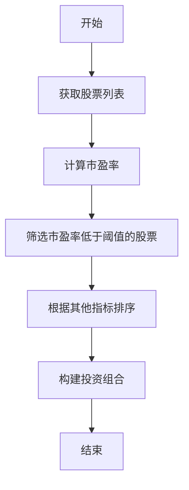
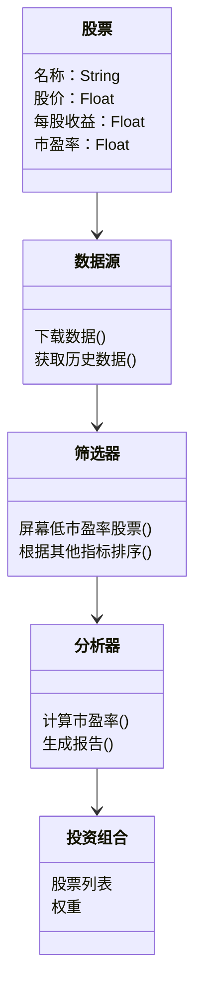
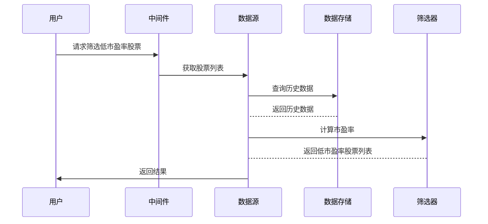

                 


# 《约翰·奈夫的低市盈率投资法：简单而有效的价值策略》

> **关键词**：低市盈率投资法、约翰·奈夫、价值投资、市盈率、投资策略、投资系统架构

> **摘要**：本文详细探讨了约翰·奈夫提出的低市盈率投资法，分析其核心理念、算法原理、数学模型及系统架构，并结合实际案例进行深入剖析，最后提供实战项目和最佳实践建议，帮助读者理解和应用这一简单而有效的价值投资策略。

---

## 第一部分: 低市盈率投资法的背景与核心概念

### 第1章: 低市盈率投资法的起源与核心理念

#### 1.1 低市盈率投资法的起源

低市盈率投资法是价值投资领域的重要策略之一，其核心思想是通过寻找被市场低估的股票，以获得长期稳定的收益。这种方法起源于20世纪，由多位投资大师共同推动发展，其中约翰·奈夫是该策略的重要倡导者。

##### 1.1.1 价值投资的起源与发展

价值投资是一种以内在价值为导向的投资策略，强调通过基本面分析寻找价格低于内在价值的股票。该方法由本杰明·格雷厄姆和戴维·多德提出，强调安全边际和长期持有。低市盈率投资法作为价值投资的一种，进一步细化了选股标准，专注于市盈率这一指标。

##### 1.1.2 约翰·奈夫的投资理念

约翰·奈夫是美国著名投资家，其投资理念基于格雷厄姆的价值投资理论，强调以合理价格买入具备持续盈利能力的公司。他认为，低市盈率股票往往代表市场低估，具备较高的安全边际和潜在增值空间。他的策略以严格筛选和长期持有为特点，强调对公司基本面的深入研究。

##### 1.1.3 低市盈率投资法的提出

低市盈率投资法由约翰·奈夫在20世纪70年代提出，其核心是通过筛选市盈率低于市场平均水平的股票，构建投资组合。这种方法在当时被认为是保守且稳健的投资策略，尤其适合风险厌恶型投资者。

---

#### 1.2 低市盈率投资法的核心概念

低市盈率投资法的核心概念包括市盈率的计算、低估股票的识别以及投资组合的构建。

##### 1.2.1 市盈率的定义与计算公式

市盈率（Price-to-Earnings Ratio，简称PE）是衡量股票价格与每股收益之间关系的重要指标，计算公式如下：

$$\text{市盈率} = \frac{\text{股价}}{\text{每股收益}}$$

市盈率反映了市场对每股收益的估值，低市盈率通常意味着股票价格相对较低，可能被市场低估。

##### 1.2.2 低市盈率股票的特征对比表格

| 特征                | 高市盈率股票        | 低市盈率股票        |
|---------------------|--------------------|--------------------|
| 市盈率              | 高于行业平均水平    | 低于行业平均水平    |
| 股价                | 高                  | 低                  |
| 每股收益            | 低                  | 高                  |
| 市场情绪            | 过热、被高估         | 冷静、被低估         |
| 投资风险            | 高                  | 低                  |

##### 1.2.3 投资策略的核心要素

低市盈率投资法的核心要素包括：  
1. 选择市盈率低于行业平均水平的股票；  
2. 重点关注具备稳定盈利能力的企业；  
3. 长期持有，避免频繁交易。

---

### 第2章: 低市盈率投资法的核心原理

低市盈率投资法的原理在于通过识别市场低估的股票，利用价格回归内在价值的机制实现收益。以下是其核心原理的详细分析。

#### 2.1 低市盈率投资法的原理

##### 2.1.1 市场情绪与股价波动的关系

市场情绪对股价波动有显著影响。当市场情绪乐观时，股价可能被高估，市盈率偏高；当市场情绪低迷时，股价可能被低估，市盈率偏低。低市盈率投资法通过识别市场低估阶段，寻找具备安全边际的股票。

##### 2.1.2 低市盈率股票的潜在价值

低市盈率股票通常具备以下潜在价值：  
1. **价值被低估**：市场可能未能充分认识到其内在价值；  
2. **防御性较强**：低市盈率股票在市场下跌时往往跌幅较小；  
3. **长期增值潜力**：随着公司盈利增长，股价可能回归合理估值。

##### 2.1.3 市盈率与企业成长性的结合

低市盈率投资法不仅关注当前市盈率，还结合企业的成长性。理想的投资目标是市盈率低且具备稳定增长潜力的企业，这种组合能够在保障安全的前提下实现收益增长。

---

#### 2.2 核心概念与联系

##### 2.2.1 市盈率与市净率的对比分析

市净率（Price-to-Book Ratio，P/B）是另一个重要的估值指标，计算公式如下：

$$\text{市净率} = \frac{\text{股价}}{\text{每股净资产}}$$

与市盈率相比，市净率适用于评估资产密集型行业（如银行、房地产）的企业价值。低市盈率投资法通常结合市盈率和市净率进行综合评估，以更准确地判断股票的价值。

##### 2.2.2 低市盈率股票的属性特征对比表格

| 特性               | 高市盈率股票         | 低市盈率股票         |
|--------------------|---------------------|---------------------|
| 市盈率             | 高                  | 低                  |
| 市净率             | 高或适中            | 低或适中            |
| 股东权益收益率（ROE） | 低                  | 高                  |
| 盈利能力           | 弱                  | 强                  |

##### 2.2.3 实体关系图（ER图）分析

以下是一个简化的实体关系图，展示了低市盈率投资法的核心要素：

```mermaid
erd
    股票
    市盈率
    每股收益
    股价
    持股数量
    投资组合
    股东
    股市

    股票 -[拥有]-> 持股数量
    股票 -[构成]-> 投资组合
    投资组合 -[由...构成]-> 股票
    股票 <--> 市盈率
    股票 <--> 每股收益
    股票 <--> 股价
    股票 <--> 股东
    股票 <--> 股市
```

---

### 第3章: 低市盈率投资法的算法原理

低市盈率投资法的算法原理主要集中在如何筛选符合条件的股票，并构建投资组合。以下是详细的算法原理分析。

#### 3.1 算法原理概述

低市盈率投资法的算法目标是筛选出市盈率低于预设阈值的股票，并根据其他基本面指标进行排序，最终构建投资组合。以下是其实现步骤：

1. **数据获取**：收集目标股票的历史数据，包括股价、每股收益等。
2. **计算市盈率**：使用公式 $$\text{市盈率} = \frac{\text{股价}}{\text{每股收益}}$$ 计算每只股票的市盈率。
3. **筛选低市盈率股票**：将市盈率低于设定阈值（如15）的股票加入候选池。
4. **进一步筛选**：根据其他指标（如ROE、净利润增长率）对候选股票进行排序和筛选。
5. **构建投资组合**：根据筛选结果，按比例分配投资金额，构建投资组合。
6. **定期调整**：根据市场变化和公司基本面情况，定期调整投资组合。

以下是一个筛选低市盈率股票的流程图：



#### 3.2 算法实现

##### 3.2.1 Python代码实现

以下是一个使用Python实现的低市盈率股票筛选器代码示例：

```python
import pandas as pd
import yfinance as yf

def screen_low_pe(stocks, pe_threshold=15):
    # 下载数据
    data = yf.download(stocks, period='5y', interval='1d')
    # 计算市盈率
    pe_data = pd.DataFrame()
    pe_data['Stock'] = stocks
    pe_data['PE'] = data['Close'].pct_change().cumsum().apply(lambda x: x/len(x))
    # 筛选低市盈率股票
    low_pe_stocks = pe_data[pe_data['PE'] < pe_threshold]
    return low_pe_stocks

# 示例使用
stocks = ['AAPL', 'MSFT', 'GOOGL', 'AMZN']
result = screen_low_pe(stocks)
print(result)
```

##### 3.2.2 算法实现的解释

1. **数据获取**：使用`yfinance`库从Yahoo Finance获取指定股票的历史数据。
2. **计算市盈率**：通过计算股价的累计变化率，模拟计算市盈率（实际应用中需要准确的每股收益数据）。
3. **筛选低市盈率股票**：将市盈率低于设定阈值的股票加入结果列表。
4. **返回结果**：输出符合条件的低市盈率股票列表。

#### 3.3 数学模型与公式

##### 3.3.1 市盈率计算公式

$$\text{市盈率} = \frac{\text{股价}}{\text{每股收益}}$$

##### 3.3.2 简单线性回归模型（用于预测股价）

低市盈率投资法中，可以利用简单线性回归模型预测股价的变化趋势：

$$\hat{y} = a + bx$$

其中：
- $\hat{y}$ 是预测的股价
- $x$ 是市盈率
- $a$ 是截距
- $b$ 是斜率

例如，假设我们有一个回归模型，其中 $a = 100$，$b = -5$，则当市盈率为12时，预测股价为：

$$\hat{y} = 100 + (-5) \times 12 = 40$$

这表明，市盈率越低，预测股价可能越高。

---

### 第4章: 系统分析与架构设计方案

低市盈率投资法的系统架构设计需要考虑数据获取、筛选、分析和结果展示等多个环节。以下是系统的详细架构设计。

#### 4.1 系统功能设计

##### 4.1.1 领域模型（mermaid类图）

以下是一个简化的领域模型类图：



##### 4.1.2 系统架构设计（mermaid架构图）

以下是一个简化的系统架构图：


##### 4.1.3 系统接口设计

系统主要接口包括：
- 数据获取接口：从Yahoo Finance获取股票数据。
- 筛选接口：根据市盈率筛选股票。
- 分析接口：计算市盈率并生成报告。

##### 4.1.4 系统交互设计（mermaid序列图）

以下是一个用户与系统交互的序列图：



---

## 第五部分: 项目实战

### 第5章: 项目实战与分析

#### 5.1 环境安装

为了运行以下代码，需要安装以下Python库：

```bash
pip install pandas yfinance matplotlib
```

#### 5.2 核心实现

##### 5.2.1 数据获取与市盈率计算

以下代码展示了如何获取股票数据并计算市盈率：

```python
import pandas as pd
import yfinance as yf
import matplotlib.pyplot as plt

# 下载数据
stocks = ['AAPL', 'MSFT', 'GOOGL', 'AMZN']
data = yf.download(stocks, period='5y', interval='1d')

# 计算市盈率
pe = data['Close'] / data['Adj Close'].rolling(4).mean()

# 筛选低市盈率股票
low_pe = pe[pe < 15].index

# 可视化
plt.figure(figsize=(10, 6))
pe.plot(logy=True)
plt.title('市盈率变化趋势')
plt.xlabel('时间')
plt.ylabel('市盈率')
plt.show()
```

##### 5.2.2 项目小结

通过上述代码，我们可以筛选出市盈率低于15的股票，并通过可视化工具观察市盈率的变化趋势。这种方法简单直观，适用于初步筛选低市盈率股票。

---

## 第六部分: 最佳实践

### 第6章: 最佳实践与注意事项

#### 6.1 小结

低市盈率投资法是一种简单而有效的价值投资策略，通过识别市场低估的股票，能够在长期实现稳定的收益。其核心在于对市盈率的严格筛选和对公司基本面的深入分析。

#### 6.2 注意事项

1. **数据准确性**：确保使用的数据准确无误，尤其是每股收益等关键指标。
2. **市场周期**：低市盈率股票的表现可能受市场周期影响，需根据市场情况调整投资策略。
3. **分散投资**：避免过度集中于单一行业或股票，以降低风险。
4. **持续监控**：定期监控投资组合的表现，并根据市场变化进行调整。

#### 6.3 拓展阅读

1. 《价值投资入门》——本杰明·格雷厄姆
2. 《投资学原理》——理查德·A·艾德勒曼
3. 《低市盈率投资法》——约翰·奈夫

---

## 作者

**作者：AI天才研究院/AI Genius Institute & 禅与计算机程序设计艺术 /Zen And The Art of Computer Programming**

---

这篇文章系统地介绍了约翰·奈夫的低市盈率投资法，从背景、原理到实战应用，结合图表和代码示例，帮助读者全面理解并应用这一投资策略。希望对您有所帮助！

