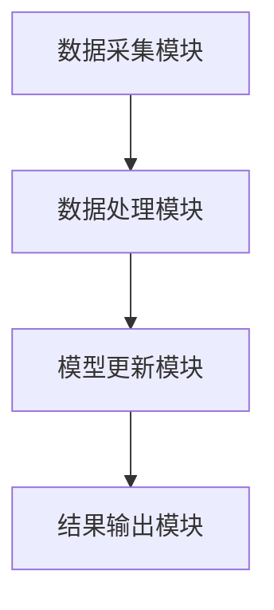
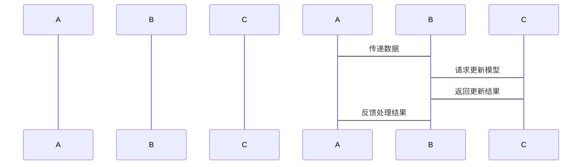

                 


# AI Agent的实时学习与在线更新技术

> 关键词：AI Agent，实时学习，在线更新，增量学习，流数据处理，模型更新策略

> 摘要：本文深入探讨了AI Agent的实时学习与在线更新技术，分析了其实时学习和在线更新的核心原理，详细讲解了相关算法及其优化方法，并结合实际案例展示了如何在系统中实现这些技术。文章内容涵盖实时学习与在线更新的背景、核心概念、算法原理、系统架构设计以及项目实战，旨在为读者提供全面的技术指导。

---

# 第一部分: AI Agent的实时学习与在线更新概述

## 第1章: AI Agent与实时学习概述

### 1.1 AI Agent的基本概念

#### 1.1.1 什么是AI Agent
AI Agent（人工智能代理）是指能够感知环境、自主决策并执行任务的智能体。它通过传感器获取信息，利用计算模型进行推理，并通过执行器与环境交互。AI Agent的核心目标是通过不断学习和适应，提高决策和执行的效率与准确性。

#### 1.1.2 AI Agent的核心特征
- **自主性**：能够自主决策和行动，无需外部干预。
- **反应性**：能够实时感知环境变化并做出响应。
- **学习能力**：能够通过经验或数据不断优化自身的知识库和行为策略。
- **社交能力**：能够与其他Agent或人类进行有效沟通与协作。

#### 1.1.3 AI Agent的分类与应用场景
AI Agent可以分为简单反射型、基于模型的反射型、目标驱动型和效用驱动型。其应用场景包括自动驾驶、智能助手、推荐系统、机器人控制等。

### 1.2 实时学习与在线更新的必要性

#### 1.2.1 传统机器学习的局限性
传统机器学习方法通常需要离线训练，模型更新周期较长，难以应对动态变化的环境。此外，离线训练需要大量的数据存储和计算资源，且难以处理实时数据流。

#### 1.2.2 实时学习与在线更新的优势
- **实时性**：能够快速响应环境变化，实时更新模型。
- **资源效率**：无需存储大量历史数据，节省存储和计算资源。
- **适应性**：能够实时适应环境变化，提高模型的准确性和可靠性。

#### 1.2.3 实时学习的应用场景
实时学习与在线更新技术广泛应用于金融交易、网络流量监测、实时推荐系统等领域，能够实时处理流数据，快速响应业务需求。

### 1.3 本章小结
本章介绍了AI Agent的基本概念及其核心特征，并分析了实时学习与在线更新技术的必要性及其应用场景。

---

## 第2章: 实时学习与在线更新的核心概念与技术

### 2.1 实时学习的基本原理

#### 2.1.1 增量学习的概念
增量学习是一种在新数据到来时，逐步更新模型的机器学习方法。与批量学习不同，增量学习能够实时处理数据流，适用于数据不断变化的场景。

#### 2.1.2 流数据处理机制
流数据处理机制是实时学习的核心，它能够实时处理数据流，快速更新模型。流数据处理机制通常包括数据缓冲、特征提取和模型更新等步骤。

#### 2.1.3 模型更新策略
模型更新策略是实时学习的关键，它决定了如何在新数据到来时更新模型。常见的模型更新策略包括：

1. **全量更新**：每次更新时重新训练整个模型。
2. **增量更新**：每次仅更新模型的部分参数。
3. **混合更新**：结合全量和增量更新的方法。

### 2.2 在线更新的核心机制

#### 2.2.1 在线更新的定义与特点
在线更新是指在数据流中实时更新模型的参数，通常采用增量学习的方法。其特点是实时性强、计算效率高、资源消耗低。

#### 2.2.2 模型更新的实时性要求
模型更新的实时性要求是指在数据流中，模型能够快速响应新数据的到来，及时更新模型参数，以适应环境变化。

#### 2.2.3 更新策略的选择与优化
在选择更新策略时，需要综合考虑模型的准确性和计算效率。常见的优化方法包括：

1. **学习率调整**：动态调整学习率，加快收敛速度。
2. **正则化方法**：通过正则化方法防止过拟合。
3. **模型剪枝**：去除冗余参数，降低模型复杂度。

### 2.3 实时学习与在线更新的关系

#### 2.3.1 实时学习与在线更新的协同作用
实时学习与在线更新是相辅相成的。实时学习提供数据流处理机制，而在线更新提供模型参数更新策略，两者共同实现模型的实时优化。

#### 2.3.2 两者在不同场景下的应用
在实时推荐系统中，实时学习用于处理用户行为数据，而在线更新用于实时优化推荐模型。在自动驾驶中，实时学习用于处理传感器数据，而在线更新用于实时优化路径规划。

#### 2.3.3 实时学习与在线更新的挑战
实时学习与在线更新的挑战主要在于数据流的实时处理、模型的快速收敛以及资源的高效利用。

### 2.4 本章小结
本章详细介绍了实时学习与在线更新的核心概念与技术，分析了它们的协同作用及其在不同场景下的应用。

---

## 第3章: 实时学习与在线更新的算法原理

### 3.1 实时学习算法

#### 3.1.1 增量学习算法
增量学习算法是一种在新数据到来时，逐步更新模型的算法。常见的增量学习算法包括Fossil、iForest等。

#### 3.1.2 流数据处理算法
流数据处理算法是实时学习的核心，它能够实时处理数据流，快速更新模型。常见的流数据处理算法包括基于滑动窗口的处理方法。

#### 3.1.3 模型更新算法
模型更新算法是实时学习的关键，它决定了如何在新数据到来时更新模型。常见的模型更新算法包括在线梯度下降、在线随机梯度下降等。

### 3.2 在线更新算法

#### 3.2.1 在线回归算法
在线回归算法是一种在新数据到来时，实时更新回归模型的算法。其数学模型如下：

$$
y = \theta x + \epsilon
$$

在线回归的更新公式为：

$$
\theta_{new} = \theta_{old} + \eta (y - \theta_{old}x)
$$

其中，$\eta$ 是学习率，$x$ 是输入，$y$ 是目标输出。

#### 3.2.2 在线分类算法
在线分类算法是一种在新数据到来时，实时更新分类模型的算法。常见的在线分类算法包括在线随机梯度下降、AdaBoost等。

### 3.3 算法的收敛性分析

#### 3.3.1 算法收敛的条件
算法收敛的条件通常包括：

1. 学习率 $\eta$ 满足 $0 < \eta < 2/\lambda$，其中 $\lambda$ 是损失函数的二阶导数。
2. 数据分布满足一定的条件，例如数据是独立同分布的。

#### 3.3.2 算法收敛速度的影响因素
算法的收敛速度主要受到学习率、数据分布和模型复杂度的影响。通常，较小的学习率能够提高收敛稳定性，但会降低收敛速度。

#### 3.3.3 实际应用中的收敛性优化
在实际应用中，可以通过动态调整学习率、使用动量优化方法等手段优化算法的收敛性。

### 3.4 本章小结
本章详细讲解了实时学习与在线更新的算法原理，分析了算法的收敛性及其优化方法。

---

## 第4章: 实时学习与在线更新的系统架构与设计

### 4.1 系统架构设计

#### 4.1.1 系统组成模块
实时学习与在线更新系统的典型架构包括数据采集模块、数据处理模块、模型更新模块和结果输出模块。

#### 4.1.2 模块间的交互流程
数据采集模块负责采集实时数据，数据处理模块负责对数据进行预处理，模型更新模块负责实时更新模型参数，结果输出模块负责输出最终结果。

#### 4.1.3 系统架构的mermaid图


### 4.2 系统接口设计

#### 4.2.1 数据接口设计
数据接口设计需要考虑数据格式、数据传输速率和数据存储方式。常见的数据接口包括HTTP接口、WebSocket接口等。

#### 4.2.2 模型接口设计
模型接口设计需要考虑模型参数的更新频率、更新方式和接口调用方式。常见的模型接口包括gRPC接口、RESTful接口等。

### 4.3 系统交互流程设计

#### 4.3.1 数据流的处理流程
数据流的处理流程包括数据采集、数据预处理、数据分发和数据存储。

#### 4.3.2 模型更新的流程
模型更新的流程包括参数初始化、参数更新、模型验证和结果输出。

#### 4.3.3 系统交互的mermaid序列图


### 4.4 本章小结
本章详细介绍了实时学习与在线更新系统的架构设计、接口设计和交互流程设计。

---

## 第5章: 实时学习与在线更新的项目实战

### 5.1 项目背景与目标

#### 5.1.1 项目背景
本项目旨在实现一个实时推荐系统，能够根据用户的实时行为数据，动态更新推荐模型，提供个性化的推荐服务。

#### 5.1.2 项目目标
项目目标包括实时采集用户行为数据、实时更新推荐模型、提供个性化的推荐结果等。

### 5.2 项目环境与工具

#### 5.2.1 环境配置
项目需要配置Python 3.8及以上版本、TensorFlow 2.0及以上版本、Flask框架等。

#### 5.2.2 工具安装
需要安装的工具包括pip、Jupyter Notebook、Git等。

### 5.3 项目核心代码实现

#### 5.3.1 数据采集模块
数据采集模块负责采集用户的点击行为数据，代码示例如下：

```python
import time
import requests

def collect_data():
    while True:
        try:
            response = requests.get("http://localhost:5000/user_action")
            data = response.json()
            yield data
        except Exception as e:
            print(f"Error collecting data: {e}")
            time.sleep(1)
```

#### 5.3.2 数据处理模块
数据处理模块负责对采集到的数据进行预处理，代码示例如下：

```python
def preprocess_data(data):
    # 提取用户ID、商品ID和时间戳
    user_id = data["user_id"]
    item_id = data["item_id"]
    timestamp = data["timestamp"]
    return (user_id, item_id, timestamp)
```

#### 5.3.3 模型更新模块
模型更新模块负责实时更新推荐模型，代码示例如下：

```python
import tensorflow as tf

def update_model(user_id, item_id, label):
    # 定义模型结构
    model = tf.keras.Sequential([
        tf.keras.layers.Dense(64, activation="relu"),
        tf.keras.layers.Dense(1, activation="sigmoid")
    ])
    # 编译模型
    model.compile(optimizer=tf.keras.optimizers.Adam(learning_rate=0.01),
                  loss="binary_crossentropy")
    # 训练模型
    model.fit([user_id], [label], epochs=1, batch_size=1)
    return model
```

#### 5.3.4 结果输出模块
结果输出模块负责输出最终的推荐结果，代码示例如下：

```python
def output_recommendations(model, user_id):
    # 预测推荐结果
    prediction = model.predict([user_id])
    print(f"推荐结果为：{prediction}")
```

### 5.4 项目功能设计

#### 5.4.1 系统功能模块设计
系统功能模块包括数据采集模块、数据处理模块、模型更新模块和结果输出模块。

#### 5.4.2 系统功能流程设计
系统功能流程包括数据采集、数据预处理、模型更新和结果输出四个步骤。

### 5.5 项目实际案例分析

#### 5.5.1 案例背景
本案例以实时推荐系统为例，展示了如何实现用户的实时行为数据采集、模型实时更新和推荐结果输出。

#### 5.5.2 案例分析
通过实际案例分析，展示了实时学习与在线更新技术在推荐系统中的应用效果，包括模型的准确性和响应速度。

### 5.6 项目小结
本章通过一个实时推荐系统的实际案例，展示了如何实现实时学习与在线更新技术，并分析了其在实际应用中的效果。

---

## 第6章: 实时学习与在线更新技术的最佳实践

### 6.1 实时学习与在线更新的注意事项

#### 6.1.1 数据质量的重要性
数据质量直接影响模型的准确性和可靠性，需要确保数据的完整性和一致性。

#### 6.1.2 模型收敛性的优化
模型收敛性是实时学习与在线更新的核心，需要通过合理选择学习率和优化算法等手段优化模型的收敛性。

#### 6.1.3 系统性能的优化
系统性能的优化包括数据处理效率的提升、模型更新速度的优化以及资源消耗的控制。

### 6.2 实时学习与在线更新技术的未来发展方向

#### 6.2.1 深度学习的实时化
随着深度学习的快速发展，实时学习与在线更新技术在深度学习领域的应用将更加广泛。

#### 6.2.2 跨平台与分布式计算
实时学习与在线更新技术将更加注重跨平台与分布式计算，以适应大规模数据处理的需求。

#### 6.2.3 自适应学习策略
未来的实时学习与在线更新技术将更加注重自适应学习策略，能够根据环境变化动态调整学习策略。

### 6.3 本章小结
本章总结了实时学习与在线更新技术的最佳实践，并展望了其未来发展方向。

---

## 第7章: 总结与展望

### 7.1 全文总结

#### 7.1.1 核心内容回顾
本文深入探讨了AI Agent的实时学习与在线更新技术，分析了其实时学习与在线更新的核心原理，详细讲解了相关算法及其优化方法，并结合实际案例展示了如何在系统中实现这些技术。

#### 7.1.2 主要结论
实时学习与在线更新技术是AI Agent实现动态适应环境的关键技术，具有重要的理论意义和实际应用价值。

### 7.2 未来展望

#### 7.2.1 技术发展趋势
未来，实时学习与在线更新技术将更加注重深度学习的实时化、分布式计算和自适应学习策略。

#### 7.2.2 应用场景拓展
实时学习与在线更新技术将在自动驾驶、智能助手、实时推荐系统等领域得到更广泛的应用。

### 7.3 本章小结
本章总结了全文的核心内容，并展望了实时学习与在线更新技术的未来发展趋势。

---

# 作者信息

作者：AI天才研究院/AI Genius Institute & 禅与计算机程序设计艺术/Zen And The Art of Computer Programming

