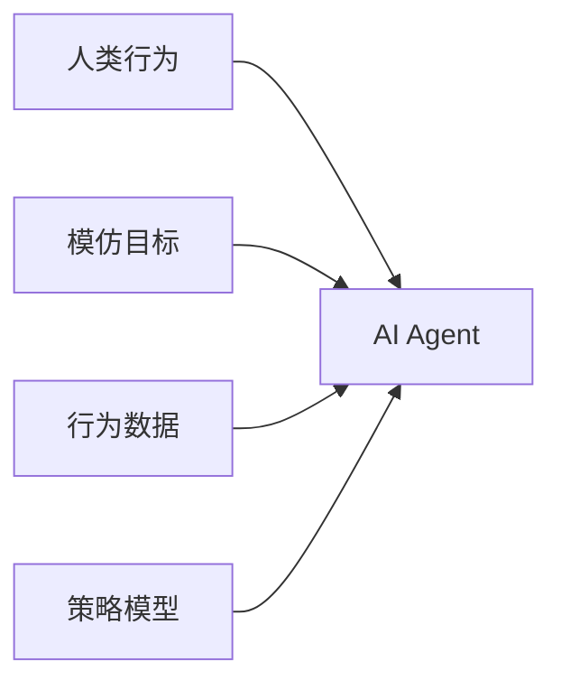
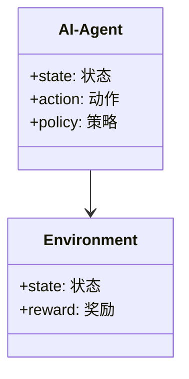
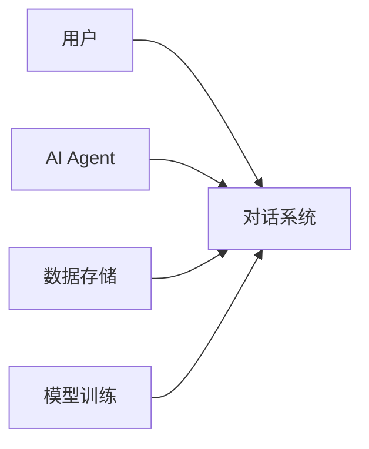
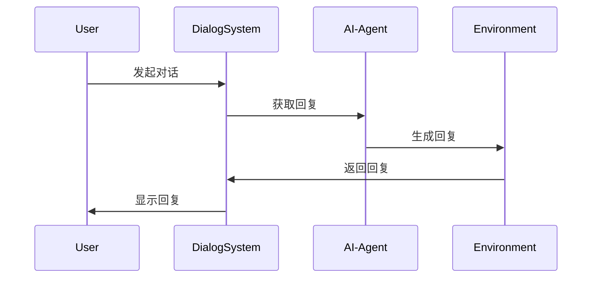

                 


# AI Agent的模仿学习：从人类行为中学习

> 关键词：AI Agent, 模仿学习, 强化学习, 行为数据, 策略模型

> 摘要：本文详细探讨了AI Agent的模仿学习方法，从基础概念到算法原理，再到系统设计和项目实战，全面解析模仿学习的核心思想和应用场景。通过实际案例分析，深入讲解了AI Agent如何通过模仿人类行为来实现智能决策，并给出了最佳实践建议。

---

# 第1章: AI Agent与模仿学习概述

## 1.1 AI Agent的基本概念

### 1.1.1 AI Agent的定义与分类

AI Agent（人工智能代理）是指能够感知环境、做出决策并执行动作的智能体。AI Agent可以分为以下几类：

1. **简单反射型Agent**：基于当前感知做出简单反应，如经典的条件反射模型。
2. **基于模型的规划型Agent**：通过内部模型预测未来状态，做出复杂决策。
3. **强化学习型Agent**：通过与环境互动，学习最优策略。
4. **模仿学习型Agent**：通过观察和模仿人类或其他智能体的行为，学习任务执行方法。

### 1.1.2 智能体的行为模式

AI Agent的行为模式可以分为以下几种：

1. **反应式行为**：基于当前感知做出实时反应。
2. **规划式行为**：基于预设目标和环境模型进行规划。
3. **学习式行为**：通过与环境互动或观察他人行为，逐步优化自身行为。

### 1.1.3 模仿学习的定义与特点

模仿学习（Imitation Learning）是一种机器学习方法，通过观察和模仿人类或其他智能体的行为，学习特定任务的操作方法。其特点包括：

- **数据依赖性**：需要大量高质量的行为数据。
- **任务导向性**：专注于特定任务，而非通用智能。
- **效率性**：相比强化学习，模仿学习通常需要较少的试错次数。

## 1.2 模仿学习的背景与应用

### 1.2.1 模仿学习的背景

随着人工智能技术的快速发展，模仿学习作为一种重要的学习方法，逐渐成为研究热点。其核心思想是通过观察人类或其他智能体的行为，学习如何在特定场景下做出合理决策。

### 1.2.2 模仿学习的应用领域

模仿学习已经在多个领域得到了广泛应用：

1. **自动驾驶**：通过模仿人类司机的驾驶行为，训练自动驾驶系统。
2. **机器人控制**：通过模仿人类动作，实现复杂任务的操作。
3. **自然语言处理**：通过模仿人类对话，训练智能对话系统。
4. **游戏AI**：通过模仿人类玩家的行为，训练游戏AI。

### 1.2.3 模仿学习的挑战与机遇

尽管模仿学习在多个领域取得了显著成果，但仍然面临以下挑战：

- **数据质量**：需要高质量的行为数据。
- **模型泛化能力**：如何让模型在新场景下依然有效。
- **伦理问题**：模仿学习可能带来伦理风险，如算法偏见。

## 1.3 本章小结

本章主要介绍了AI Agent的基本概念、行为模式以及模仿学习的核心思想和应用领域。通过对比模仿学习与其他学习方法的差异，为后续章节的深入分析奠定了基础。

---

# 第2章: 模仿学习的核心概念与联系

## 2.1 模仿学习的核心原理

### 2.1.1 行为模仿的原理

行为模仿的原理是通过观察人类或其他智能体的行为，提取其行为特征，并将其转化为可执行的策略。具体步骤包括：

1. **数据收集**：收集人类或其他智能体的行为数据。
2. **特征提取**：从行为数据中提取关键特征。
3. **策略学习**：基于特征学习模仿策略。

### 2.1.2 策略学习的机制

策略学习的机制包括以下几个步骤：

1. **行为数据输入**：输入人类或其他智能体的行为数据。
2. **特征提取**：提取行为数据中的关键特征。
3. **策略优化**：通过优化算法，学习最优策略。

### 2.1.3 模仿学习与强化学习的对比

以下是对模仿学习与强化学习的对比：

| 对比维度         | 模仿学习                          | 强化学习                          |
|------------------|-----------------------------------|-----------------------------------|
| 数据来源         | 需要模仿对象的行为数据            | 通过与环境互动获取数据            |
| 学习目标         | 学习模仿策略                      | 学习最优策略                      |
| 试错次数         | 较少                             | 较多                             |

## 2.2 模仿学习的核心概念对比

### 2.2.1 模仿学习与监督学习的对比

| 对比维度         | 模仿学习                          | 监督学习                          |
|------------------|-----------------------------------|-----------------------------------|
| 数据来源         | 行为数据                          | 标签数据                          |
| 学习目标         | 学习行为策略                      | 学习函数映射                      |
| 适用场景         | 行为决策                          | 分类或回归问题                    |

### 2.2.2 模仿学习与无监督学习的对比

| 对比维度         | 模仿学习                          | 无监督学习                        |
|------------------|-----------------------------------|-----------------------------------|
| 数据来源         | 行为数据                          | 未标记数据                        |
| 学习目标         | 学习行为策略                      | 发现数据结构或模式                |
| 适用场景         | 行为决策                          | 聚类或降维问题                    |

### 2.2.3 模仿学习与半监督学习的对比

| 对比维度         | 模仿学习                          | 半监督学习                        |
|------------------|-----------------------------------|-----------------------------------|
| 数据来源         | 行为数据                          | 少量标签数据和大量未标签数据      |
| 学习目标         | 学习行为策略                      | 学习函数映射                      |
| 适用场景         | 行为决策                          | 分类或回归问题                    |

## 2.3 模仿学习的ER实体关系图

以下是一个模仿学习的ER实体关系图：



## 2.4 本章小结

本章主要分析了模仿学习的核心概念及其与其他学习方法的联系，通过对比和ER图的形式，帮助读者更好地理解模仿学习的原理和特点。

---

# 第3章: 模仿学习的算法原理

## 3.1 模仿学习的主要算法

### 3.1.1 Dagger算法

Dagger算法是一种基于策略的模仿学习算法，其核心思想是通过专家演示，学习最优策略。Dagger算法的步骤如下：

1. **收集专家数据**：收集专家在特定场景下的行为数据。
2. **训练策略模型**：基于专家数据，训练策略模型。
3. **评估与改进**：通过模拟环境，评估策略模型的性能，并进行改进。

### 3.1.2 BC（Behavioral Cloning）算法

BC算法是一种基于行为的模仿学习算法，其核心思想是通过直接模仿人类行为，学习任务执行方法。BC算法的步骤如下：

1. **收集行为数据**：收集人类或其他智能体的行为数据。
2. **训练行为模型**：基于行为数据，训练行为模型。
3. **执行与优化**：通过执行任务，优化行为模型。

### 3.1.3 DDPG（Deep Deterministic Policy Gradient）算法

DDPG算法是一种结合了深度学习和策略梯度的模仿学习算法，其核心思想是通过深度网络逼近最优策略。DDPG算法的步骤如下：

1. **收集行为数据**：收集人类或其他智能体的行为数据。
2. **训练深度网络**：基于行为数据，训练深度网络。
3. **优化策略**：通过策略梯度，优化策略。

## 3.2 算法原理的数学模型

### 3.2.1 策略梯度的数学公式

策略梯度的数学公式如下：

$$
\nabla J = \mathbb{E}_{\tau \sim \pi} [\nabla \log \pi(a|s) Q(s,a)]
$$

其中，$\tau$表示轨迹，$\pi$表示策略，$Q(s,a)$表示Q值函数。

### 3.2.2 模仿学习的损失函数

模仿学习的损失函数如下：

$$
L = \mathbb{E}_{(s,a) \sim D} [ (Q(s,a) - Q(s,a'))^2 ]
$$

其中，$D$表示行为数据，$Q(s,a)$表示Q值函数，$a'$表示目标动作。

## 3.3 算法实现的步骤

### 3.3.1 数据收集与预处理

1. **数据收集**：收集人类或其他智能体的行为数据。
2. **数据预处理**：对数据进行清洗和归一化处理。

### 3.3.2 模型训练与优化

1. **模型训练**：基于行为数据，训练策略模型。
2. **模型优化**：通过优化算法，优化模型参数。

### 3.3.3 模型评估与测试

1. **模型评估**：在测试环境下，评估模型的性能。
2. **模型测试**：通过实际测试，验证模型的泛化能力。

## 3.4 本章小结

本章主要介绍了模仿学习的主要算法及其数学模型，通过公式推导和算法步骤的讲解，帮助读者理解模仿学习的核心思想。

---

# 第4章: 模仿学习的系统分析与架构设计

## 4.1 系统分析

### 4.1.1 问题场景介绍

以智能客服对话系统为例，AI Agent需要通过模仿人类客服的行为，实现智能对话。

### 4.1.2 项目目标与范围

项目目标是训练一个智能客服对话系统，使其能够通过模仿人类客服的行为，为用户提供高效的咨询服务。

### 4.1.3 系统功能需求

系统功能需求包括：

1. **数据收集**：收集人类客服的对话数据。
2. **模型训练**：训练对话模型。
3. **对话执行**：通过对话模型与用户进行交互。

## 4.2 系统架构设计

### 4.2.1 系统功能设计

以下是一个对话系统的领域模型：



### 4.2.2 系统架构设计

以下是一个对话系统的架构图：



### 4.2.3 系统接口设计

系统接口设计包括：

1. **用户接口**：用户与系统交互的界面。
2. **数据接口**：数据存储与获取的接口。
3. **模型接口**：模型训练与应用的接口。

### 4.2.4 系统交互流程图

以下是一个对话系统的交互流程图：



## 4.3 本章小结

本章主要分析了模仿学习的系统架构设计，通过实际案例的系统分析，帮助读者理解如何将模仿学习应用于实际系统中。

---

# 第5章: 模仿学习的项目实战

## 5.1 环境安装与配置

### 5.1.1 安装依赖

安装以下依赖：

```bash
pip install numpy
pip install tensorflow
pip install gym
```

### 5.1.2 配置环境

配置以下环境变量：

```bash
export PATH=$PATH:/path/to/script
```

## 5.2 系统核心实现

### 5.2.1 数据收集

收集人类客服的对话数据，保存为JSON格式：

```json
{
    "user": "用户提问",
    "response": "客服回答"
}
```

### 5.2.2 模型训练

训练对话模型的代码如下：

```python
import numpy as np
import tensorflow as tf

# 定义模型
model = tf.keras.Sequential([
    tf.keras.layers.Dense(64, activation='relu'),
    tf.keras.layers.Dense(1, activation='sigmoid')
])

# 编译模型
model.compile(optimizer='adam', loss='binary_crossentropy', metrics=['accuracy'])

# 训练模型
model.fit(X_train, y_train, epochs=10, batch_size=32)
```

### 5.2.3 代码实现

对话系统的实现代码如下：

```python
import numpy as np
import tensorflow as tf

# 定义AI Agent
class AIAgent:
    def __init__(self, model):
        self.model = model

    def get_action(self, state):
        return self.model.predict(state)[0]

# 定义环境
class Environment:
    def __init__(self):
        self.state = None

    def step(self, action):
        # 定义环境的执行逻辑
        pass

# 训练AI Agent
def train_agent():
    model = tf.keras.Sequential([
        tf.keras.layers.Dense(64, activation='relu'),
        tf.keras.layers.Dense(1, activation='sigmoid')
    ])
    agent = AIAgent(model)
    # 训练逻辑
    pass

if __name__ == '__main__':
    train_agent()
```

### 5.2.4 实际案例分析

以智能客服对话系统为例，分析对话系统的实现过程：

1. **数据收集**：收集人类客服的对话数据。
2. **模型训练**：训练对话模型。
3. **对话执行**：通过对话模型与用户进行交互。

## 5.3 本章小结

本章通过一个实际案例，详细讲解了模仿学习的项目实现过程，包括环境配置、数据收集、模型训练和代码实现。

---

# 第6章: 模仿学习的最佳实践与注意事项

## 6.1 最佳实践 tips

### 6.1.1 数据质量

确保行为数据的高质量，包括数据的完整性和准确性。

### 6.1.2 模型优化

通过交叉验证和超参数调优，优化模型性能。

### 6.1.3 伦理问题

关注模仿学习可能带来的伦理问题，如算法偏见。

## 6.2 小结

总结模仿学习的核心思想和实际应用，强调数据质量、模型优化和伦理问题的重要性。

## 6.3 注意事项

1. **数据隐私**：注意保护数据隐私，避免数据泄露。
2. **模型泛化**：关注模型的泛化能力，避免过拟合。
3. **伦理合规**：确保模仿学习的应用符合伦理规范。

## 6.4 拓展阅读

推荐以下拓展阅读资料：

1. **Dagger算法论文**：[Dagger: Distilling Safe Policies](https://arxiv.org/abs/1606.03475)
2. **BC算法论文**：[Behavioral Cloning](https://ieeexplore.ieee.org/document/878314)
3. **DDPG算法论文**：[Deep Deterministic Policy Gradient](https://arxiv.org/abs/1509.02971)

---

# 作者：AI天才研究院/AI Genius Institute & 禅与计算机程序设计艺术 /Zen And The Art of Computer Programming

---

以上是《AI Agent的模仿学习：从人类行为中学习》的完整目录和内容框架，涵盖了从基础概念到实际应用的各个方面，通过理论分析和实践案例，深入探讨了AI Agent的模仿学习方法。

