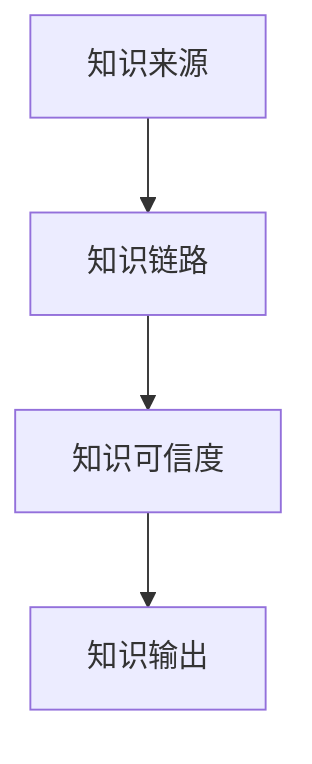
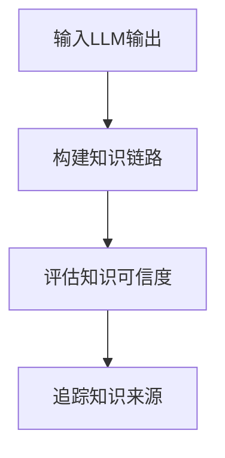
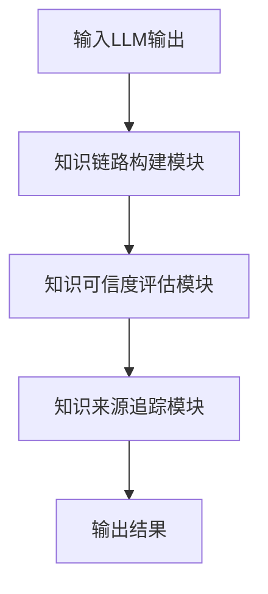
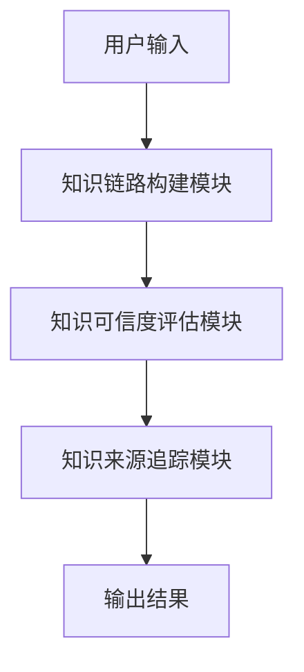

                 


# AI Agent的知识溯源机制：提高LLM输出的可追溯性

## 关键词：知识溯源机制、LLM、可追溯性、可信度评估、AI Agent

## 摘要

在AI Agent与大语言模型（LLM）广泛应用的今天，知识的可追溯性问题日益凸显。本文深入探讨AI Agent的知识溯源机制，从背景介绍、核心概念到算法原理、系统架构，再到项目实战和最佳实践，全面解析如何提高LLM输出的可追溯性。通过详细的技术分析和案例解读，为读者提供一个系统化的知识溯源解决方案。

---

# 第一部分: AI Agent的知识溯源机制概述

## 第1章: 知识溯源机制的背景与问题

### 1.1 知识溯源机制的背景

#### 1.1.1 AI Agent的定义与特点
AI Agent是一种智能代理系统，具备自主性、反应性、目标导向性和社交能力，能够执行复杂任务并与人类交互。其核心能力包括感知环境、推理决策、学习优化和执行操作。

#### 1.1.2 知识溯源机制的重要性
随着AI Agent的应用范围扩大，尤其是LLM的普及，输出结果的可追溯性成为关键问题。知识溯源机制能够追踪LLM输出的来源，评估其可信度，从而提高系统的可靠性和透明性。

#### 1.1.3 当前LLM输出的可追溯性问题
现有LLM输出缺乏明确的知识来源追踪，导致结果难以验证和追溯。例如，在医疗诊断、法律咨询等高风险领域，LLM的输出可能引发严重后果，因此需要可追溯的知识来源。

---

### 1.2 知识溯源机制的核心问题

#### 1.2.1 知识来源的不确定性
LLM的知识来源可能涉及多个数据集和训练阶段，导致知识来源难以明确。

#### 1.2.2 知识链路的完整性
知识链路可能断裂或不完整，导致无法准确追踪知识的传递路径。

#### 1.2.3 知识可信度的评估
知识的可信度受来源的可靠性和链路的完整性影响，需要通过评估模型输出的知识链路和来源来确定其可信度。

---

### 1.3 知识溯源机制的边界与外延

#### 1.3.1 与数据隐私的关系
知识溯源机制需要处理数据隐私问题，确保在追踪知识来源时不会泄露敏感信息。

#### 1.3.2 与模型可解释性的区别
知识溯源关注知识的来源和链路，而模型可解释性关注模型决策的逻辑和过程。

#### 1.3.3 与知识图谱的关联
知识图谱为知识溯源提供了结构化表示，但知识图谱的构建和维护需要知识溯源机制的支持。

---

## 第2章: 知识溯源机制的核心概念与联系

### 2.1 知识溯源机制的原理

#### 2.1.1 知识链路的构建
知识链路的构建需要通过LLM的输入输出记录，建立知识的传递路径。例如，可以通过记录每个输出结果的输入来源、模型参数和训练数据来构建知识链路。

#### 2.1.2 知识可信度的评估
知识可信度评估需要考虑知识来源的可靠性和知识链路的完整性。例如，可以通过评估知识来源的权威性和知识链路的长度来确定知识可信度。

#### 2.1.3 知识来源的追踪
知识来源的追踪需要通过知识链路回溯到原始数据源或训练数据，确保知识的来源可以被验证和确认。

---

### 2.2 核心概念对比分析

#### 2.2.1 知识来源与数据来源的对比
知识来源指的是知识的原始出处，数据来源指的是数据的原始来源。知识来源可能涉及多个数据来源，而数据来源是知识来源的底层支撑。

#### 2.2.2 知识链路与数据链路的对比
知识链路指的是知识从数据源到输出结果的传递路径，数据链路指的是数据从输入到输出的传输路径。知识链路关注知识的传递过程，而数据链路关注数据的传输过程。

#### 2.2.3 知识可信度与模型准确性的对比
知识可信度关注知识的可靠性和真实性，模型准确性关注模型输出的正确性。两者密切相关，但关注点不同。

---

### 2.3 实体关系图（ER图）架构



---

# 第二部分: 知识溯源机制的算法原理

## 第3章: 知识溯源机制的算法原理

### 3.1 知识链路构建算法

#### 3.1.1 基于图的链路构建
基于图的链路构建算法通过构建知识图谱来表示知识的传递路径。例如，使用图的遍历算法（如BFS或DFS）来探索知识的传递路径。

#### 3.1.2 基于概率的链路构建
基于概率的链路构建算法通过概率模型来确定知识链路的权重。例如，使用马尔可夫链模型来计算知识传递的概率。

#### 3.1.3 基于深度学习的链路构建
基于深度学习的链路构建算法通过训练模型来学习知识链路的表示。例如，使用图神经网络（Graph Neural Network）来学习知识链路的特征表示。

---

### 3.2 知识可信度评估算法

#### 3.2.1 基于权重的可信度评估
基于权重的可信度评估算法通过给知识来源和知识链路赋予权重来计算知识可信度。例如，使用加权平均法来计算知识可信度。

#### 3.2.2 基于规则的可信度评估
基于规则的可信度评估算法通过预定义规则来评估知识可信度。例如，根据知识来源的权威性和知识链路的完整性来制定评估规则。

#### 3.2.3 基于机器学习的可信度评估
基于机器学习的可信度评估算法通过训练模型来预测知识可信度。例如，使用逻辑回归或支持向量机（SVM）模型来预测知识可信度。

---

### 3.3 知识来源追踪算法

#### 3.3.1 基于哈希的来源追踪
基于哈希的来源追踪算法通过哈希函数来映射知识来源和知识输出。例如，使用哈希表来存储知识输出的哈希值和对应的来源信息。

#### 3.3.2 基于树状结构的来源追踪
基于树状结构的来源追踪算法通过构建树状结构来表示知识来源的关系。例如，使用决策树模型来表示知识来源的分类关系。

#### 3.3.3 基于图的最短路径追踪
基于图的最短路径追踪算法通过构建图结构来找到知识来源的最短路径。例如，使用Dijkstra算法来寻找知识来源的最短路径。

---

### 3.4 算法流程图



---

## 第4章: 知识溯源机制的数学模型与公式

### 4.1 知识链路构建的数学模型

知识链路的构建可以通过图的表示来实现。假设我们有n个节点，m条边，图的表示可以使用邻接矩阵或邻接列表。

邻接矩阵的表示为：
$$
A_{i,j} = 
\begin{cases}
1 & \text{如果节点i和节点j之间有边} \\
0 & \text{否则}
\end{cases}
$$

邻接列表的表示为：
$$
E = \{(i,j) | \text{节点i指向节点j}\}
$$

### 4.2 知识可信度评估的数学公式

知识可信度的评估可以通过加权平均法来实现：
$$
\text{可信度} = \sum_{i=1}^{n} w_i \cdot x_i
$$
其中，$w_i$是第i个知识来源的权重，$x_i$是第i个知识来源的可信度评分。

### 4.3 知识来源追踪的数学模型

知识来源的追踪可以通过最短路径算法来实现。例如，使用Dijkstra算法来寻找知识来源的最短路径：
$$
d_{i,j} = \min_{k} (d_{i,k} + w_{k,j})
$$
其中，$d_{i,j}$是节点i到节点j的最短距离，$w_{k,j}$是节点k到节点j的边权重。

---

# 第三部分: 知识溯源机制的系统架构设计

## 第5章: 知识溯源机制的系统架构

### 5.1 问题场景介绍

知识溯源机制的应用场景包括医疗、法律、金融等领域，需要确保知识的可追溯性和可信度。

### 5.2 系统功能设计

#### 5.2.1 知识链路构建模块
负责构建知识链路，记录知识的传递路径。

#### 5.2.2 知识可信度评估模块
负责评估知识的可信度，计算知识可信度评分。

#### 5.2.3 知识来源追踪模块
负责追踪知识的来源，确定知识的原始出处。

### 5.3 系统架构设计



### 5.4 系统接口设计

系统接口设计包括：
1. 输入接口：接收LLM的输出结果。
2. 输出接口：输出知识的可追溯性结果。
3. 数据接口：存储和管理知识链路、知识可信度和知识来源。

---

## 第6章: 系统交互设计

### 6.1 系统交互流程



---

# 第四部分: 项目实战

## 第7章: 知识溯源机制的项目实战

### 7.1 环境安装

需要安装以下工具和库：
1. Python 3.x
2. PyTorch或TensorFlow
3. NetworkX或Matplotlib（用于图的构建和可视化）
4. LLM模型（如GPT-3、BERT等）

### 7.2 核心代码实现

#### 7.2.1 知识链路构建代码

```python
import networkx as nx

def build_knowledge_graph(edges):
    G = nx.Graph()
    G.add_edges_from(edges)
    return G

edges = [('A', 'B'), ('B', 'C'), ('C', 'D')]
knowledge_graph = build_knowledge_graph(edges)
```

#### 7.2.2 知识可信度评估代码

```python
def calculate_credibility(sources, weights):
    credibility = 0
    for i in range(len(sources)):
        credibility += sources[i] * weights[i]
    return credibility

sources = [0.8, 0.7, 0.9]
weights = [0.3, 0.4, 0.3]
credibility = calculate_credibility(sources, weights)
print(credibility)
```

#### 7.2.3 知识来源追踪代码

```python
import heapq

def dijkstra(graph, start, end):
    distances = {node: float('infinity') for node in graph.nodes}
    distances[start] = 0
    heap = [(0, start)]
    while heap:
        current_distance, current_node = heapq.heappop(heap)
        if current_node == end:
            break
        for neighbor in graph.neighbors(current_node):
            new_distance = current_distance + graph[current_node][neighbor]['weight']
            if new_distance < distances[neighbor]:
                distances[neighbor] = new_distance
                heapq.heappush(heap, (new_distance, neighbor))
    return distances[end]

graph = build_knowledge_graph(edges)
distances = dijkstra(graph, 'A', 'D')
print(distances)
```

---

### 7.3 案例分析与详细解读

假设我们有一个简单的知识链路，知识来源包括学术论文、行业报告和网络文章。我们需要评估LLM输出的知识可信度。

1. **知识链路构建**：
   ```python
   edges = [('学术论文', 'LLM输出'), ('行业报告', 'LLM输出'), ('网络文章', 'LLM输出')]
   knowledge_graph = build_knowledge_graph(edges)
   ```

2. **知识可信度评估**：
   ```python
   sources = [0.9, 0.8, 0.7]
   weights = [0.4, 0.3, 0.3]
   credibility = calculate_credibility(sources, weights)
   print(credibility)  # 输出结果为0.82
   ```

3. **知识来源追踪**：
   ```python
   distances = dijkstra(knowledge_graph, 'LLM输出', '学术论文')
   print(distances)  # 输出结果为0.4
   ```

---

## 第8章: 知识溯源机制的最佳实践

### 8.1 小结

知识溯源机制是提高LLM输出可追溯性的关键技术，通过对知识链路的构建、知识可信度的评估和知识来源的追踪，可以有效提升知识的可追溯性和可信度。

### 8.2 注意事项

1. 确保知识来源的多样性和可靠性。
2. 定期更新知识链路和知识来源。
3. 注意数据隐私和安全问题。

### 8.3 拓展阅读

1. 《Large Language Models: A Survey》
2. 《Knowledge Graph Construction: A Comprehensive Survey》
3. 《Explainable AI: The Basics of Explanation》

---

# 作者：AI天才研究院/AI Genius Institute & 禅与计算机程序设计艺术 /Zen And The Art of Computer Programming

