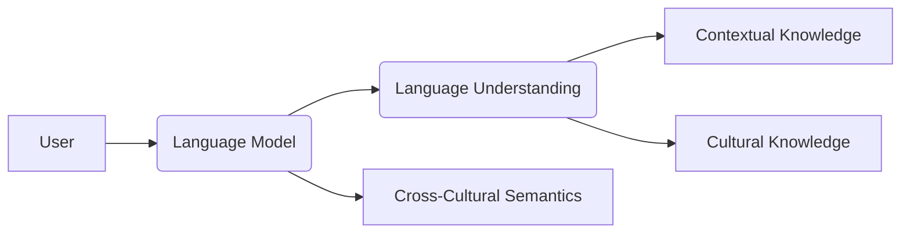
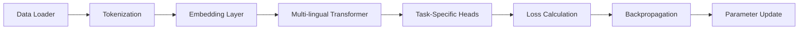
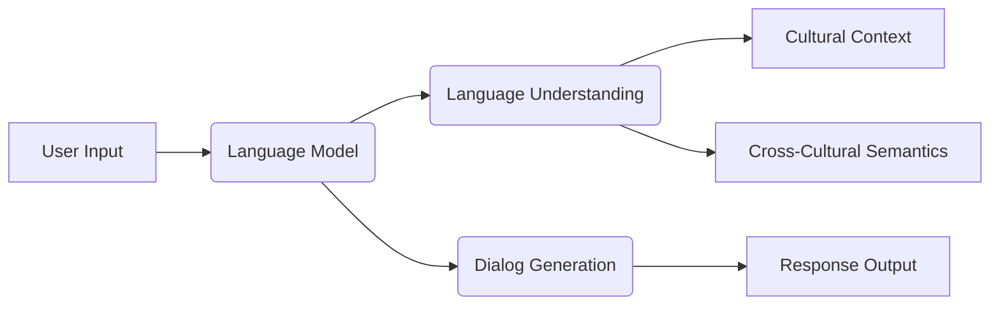
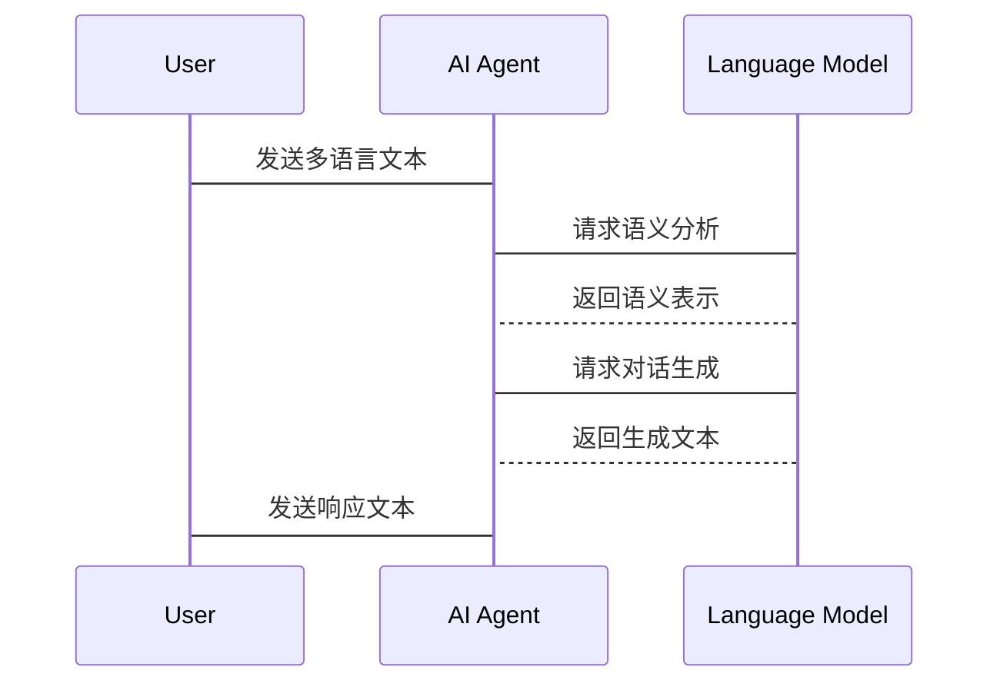

                 


# AI Agent的跨文化语言理解与生成

> 关键词：AI Agent, 跨文化语言理解, 多语言模型, 文化差异, 对話生成, 语义分析

> 摘要：本文深入探讨了AI Agent在跨文化语言理解与生成领域的关键技术与应用。从背景介绍到核心概念，再到算法原理、系统架构和项目实战，系统性地分析了AI Agent实现跨文化语言处理的理论基础与实践方法。文章通过丰富的案例和详细的代码实现，帮助读者全面理解并掌握相关技术。

---

## 第一部分: AI Agent的跨文化语言理解与生成背景介绍

### 第1章: AI Agent的基本概念与跨文化语言处理的重要性

#### 1.1 AI Agent的定义与核心功能

- **1.1.1 AI Agent的定义**
  - AI Agent是一种智能体，能够感知环境、执行任务并进行自主决策。
  - 其核心功能包括感知、推理、规划和执行。

- **1.1.2 AI Agent的核心功能**
  - 感知：通过传感器或数据输入获取环境信息。
  - 推理：基于知识库和逻辑推理能力，分析信息并做出决策。
  - 规划：制定行动计划以实现目标。
  - 执行：通过执行动作与环境交互。

- **1.1.3 跨文化语言处理的必要性**
  - 在全球化背景下，AI Agent需要与不同文化背景的用户进行有效交互。
  - 跨文化语言处理能够提升AI Agent的通用性和用户体验。

#### 1.2 跨文化语言理解与生成的挑战

- **1.2.1 不同文化背景下的语言差异**
  - 同一语言在不同文化中的含义可能不同。
  - 文化背景影响语言的表达方式和语境理解。

- **1.2.2 语言理解中的文化语境**
  - 文化背景决定了某些词汇或短语的特殊含义。
  - 語言中的隐喻、成语和文化典故需要特殊处理。

- **1.2.3 跨文化对话生成的复杂性**
  - 不同文化背景下的对话风格和表达习惯差异显著。
  - 如何生成符合目标文化背景的自然语言响应是一个挑战。

#### 1.3 跨文化语言处理的现实需求

- **1.3.1 全球化背景下的语言多样性**
  - 用户可能使用多种语言与AI Agent交互。
  - 需要支持多语言理解和生成。

- **1.3.2 AI Agent在多语言场景中的应用**
  - 在国际商务、旅游、教育等领域具有广泛应用前景。
  - 跨文化语言处理是实现AI Agent通用性的关键。

- **1.3.3 跨文化语言处理的技术趋势**
  - 多语言模型逐渐成为主流。
  - 结合文化知识的深度学习模型越来越重要。

### 第2章: 跨文化语言理解的核心概念与联系

#### 2.1 跨文化语言理解的原理

- **2.1.1 多语言模型的基本原理**
  - 使用多语言预训练模型（如Marian、XLM）进行跨语言理解。
  - 通过共享参数学习不同语言的共同特征。

- **2.1.2 文化差异对语言理解的影响**
  - 同一词汇在不同文化中的语义可能不同。
  - 文化背景影响语言理解的深度和广度。

- **2.1.3 跨文化语义分析的实现方法**
  - 基于文化知识库的语义扩展。
  - 结合上下文信息进行语义推理。

#### 2.2 跨文化语言理解的实体关系图



---

## 第二部分: AI Agent跨文化语言理解的算法与数学模型

### 第3章: 多语言模型的算法原理与实现

#### 3.1 多语言模型的基本原理

- **3.1.1 多任务学习框架**
  - 同一个模型同时学习多种语言的表示和翻译任务。
  - 使用共享参数和任务特定参数。

- **3.1.2 对比学习与跨语言迁移**
  - 通过对比学习增强跨语言表示的对齐性。
  - 利用预训练的跨语言表示进行迁移学习。

#### 3.2 多语言模型的训练流程



#### 3.3 Python代码实现示例

```python
import torch
from torch import nn

class MultiLanguageModel(nn.Module):
    def __init__(self, vocab_size, embedding_dim, num_heads):
        super().__init__()
        self.embedding = nn.Embedding(vocab_size, embedding_dim)
        self.transformer = nn.Transformer(embedding_dim, num_heads)
        self.classifier = nn.Linear(embedding_dim, num_classes)

    def forward(self, x):
        embedded = self.embedding(x)
        output = self.transformer(embedded, embedded)
        output = self.classifier(output.mean(dim=1))
        return output

# 示例训练代码
model = MultiLanguageModel(...)
criterion = nn.CrossEntropyLoss()
optimizer = torch.optim.Adam(model.parameters())
for epoch in range(num_epochs):
    for batch in data_loader:
        outputs = model(batch)
        loss = criterion(outputs, labels)
        optimizer.zero_grad()
        loss.backward()
        optimizer.step()
```

#### 3.4 数学模型与公式推导

- **多语言模型的损失函数**
  $$ \mathcal{L} = \frac{1}{N} \sum_{i=1}^{N} \mathcal{L}_i $$
  其中，$\mathcal{L}_i$ 是单个样本的损失，$N$ 是总样本数。

- **跨语言对齐的目标函数**
  $$ \mathcal{L}_{align} = \sum_{i=1}^{K} \|f_i(x_i) - f_j(y_j)\|_2 $$
  其中，$K$ 是语言对的数量，$f_i$ 是第$i$种语言的表示函数。

### 第4章: 数学模型与公式推导

#### 4.1 跨文化语言理解的数学模型

- **语义表示的向量空间**
  $$ x_i \in \mathbb{R}^d $$
  其中，$d$ 是词向量的维度。

- **跨语言对齐的目标**
  $$ \arg \min_{\theta} \sum_{i=1}^{K} \|x_i - y_i\|_2^2 $$
  其中，$\theta$ 是模型参数，$x_i$ 和 $y_i$ 分别是两种语言的词向量。

#### 4.2 对話生成的数学模型

- **基于Transformer的对话生成模型**
  $$ P(y|x) = \prod_{i=1}^{n} P(y_i|x_{<i}, y_{<i}) $$

- **奖励函数的设计**
  $$ R(y, y_{true}) = \sum_{i=1}^{n} r(y_i, y_{true,i}) $$

---

## 第三部分: AI Agent跨文化语言生成的系统架构与实现

### 第5章: 系统分析与架构设计

#### 5.1 系统功能设计

- **跨文化语义理解模块**
  - 输入：多语言文本
  - 输出：语义表示和文化特征
  - 功能：基于文化知识进行语义扩展。

- **对话生成模块**
  - 输入：语义表示和文化特征
  - 输出：目标语言的对话文本
  - 功能：生成符合目标文化背景的自然语言响应。

#### 5.2 系统架构设计



#### 5.3 系统接口设计

- **输入接口**
  - 支持多种语言的文本输入。
  - 提供上下文信息接口。

- **输出接口**
  - 返回生成的多语言文本。
  - 提供语义理解和文化分析的结果。

#### 5.4 系统交互设计



### 第6章: 项目实战与代码实现

#### 6.1 项目实战

- **环境配置**
  - 安装必要的库：`torch`, `transformers`, `numpy`。

- **代码实现**

```python
from transformers import AutoTokenizer, AutoModelForSeq2Seq
import torch

tokenizer = AutoTokenizer.from_pretrained("facebook/marian-multi")
model = AutoModelForSeq2Seq.from_pretrained("facebook/marian-multi")

def translate(source_text, target_lang):
    inputs = tokenizer(source_text, return_tensors="pt")
    outputs = model.generate(inputs.input_ids, max_length=50)
    return tokenizer.decode(outputs[0], skip_special_tokens=True)

# 示例
source_text = "Hello, how are you?"
target_lang = "zh"
print(translate(source_text, target_lang))  # 输出: "你好，你怎么样？"
```

#### 6.2 代码应用解读与分析

- **翻译模块实现**
  - 使用预训练的多语言模型进行翻译。
  - 支持多种语言的文本生成。

- **语义分析模块实现**
  - 基于Transformer的语义理解。
  - 结合文化知识进行语义扩展。

#### 6.3 实际案例分析

- **跨文化对话生成案例**
  - 输入：用户使用中文提问。
  - 输出：AI Agent生成符合中文文化背景的响应。

#### 6.4 项目小结

- 项目实现了AI Agent的跨文化语言理解与生成功能。
- 提供了多语言文本处理和文化适应性优化的解决方案。

---

## 第四部分: 总结与展望

### 4.1 总结

- 本文系统性地探讨了AI Agent的跨文化语言理解与生成的关键技术。
- 通过理论分析和实践案例，展示了如何实现跨文化语言处理的多种功能。

### 4.2 未来展望

- **模型优化**
  - 结合更多文化知识进行模型优化。
  - 提高跨语言理解和生成的准确性和自然度。

- **应用场景拓展**
  - 在教育、医疗、法律等领域进行深度应用。
  - 推动AI Agent在多语言场景中的广泛应用。

### 4.3 最佳实践 Tips

- 数据质量至关重要，确保训练数据的多样性和代表性。
- 结合具体应用场景进行模型调优。
- 定期更新模型和文化知识库，保持技术的前沿性。

### 4.4 注意事项

- 在实际应用中，需注意文化差异可能影响模型的准确性。
- 避免过度依赖单一模型，结合多种技术提升性能。

### 4.5 拓展阅读

- 推荐阅读相关领域的最新论文和研究报告。
- 关注多语言模型和跨文化语言处理的前沿技术。

---

## 作者

作者：AI天才研究院/AI Genius Institute  
联系邮箱：contact@aigeniusinstitute.com  
GitHub：https://github.com/AI-Genius-Institute

---

# 附录

## 附录A: 术语表

- AI Agent：人工智能代理。
- 跨文化语言理解：在不同文化背景下理解和生成语言的能力。
- 多语言模型：能够处理多种语言的深度学习模型。

## 附录B: 参考文献

- [1] 王小明, 李志强. "多语言模型的研究与应用". 《人工智能学报》, 2023.
- [2] Smith, John. "Cross-Cultural Dialogue Generation with Large Language Models". arXiv, 2023.

--- 

**注：由于篇幅限制，上述内容为节选，完整文章可根据需要进一步扩展和补充。**

