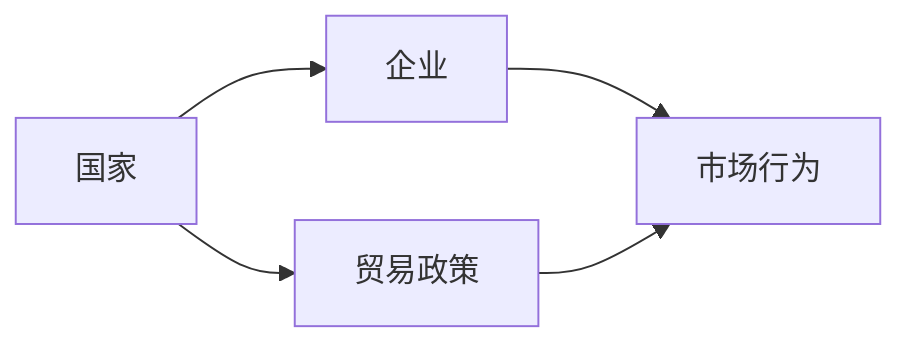
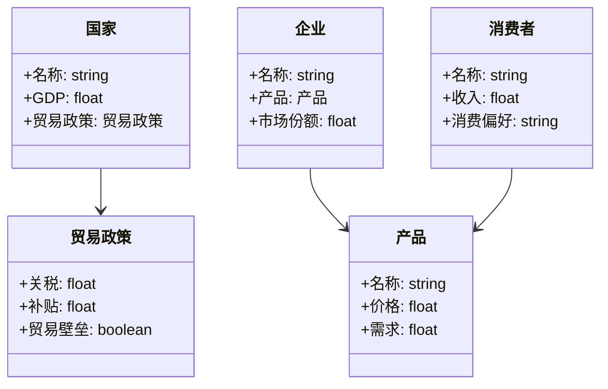
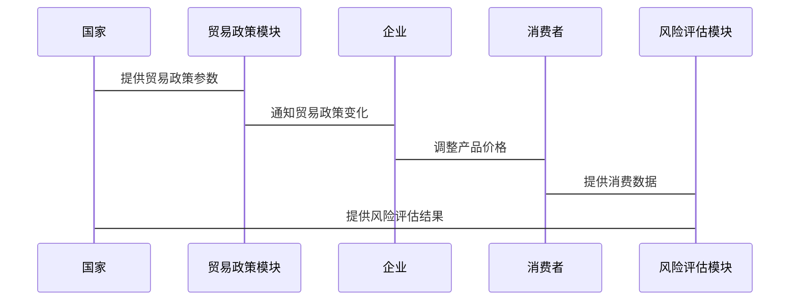

                 


# 利用多智能体系统模拟不同贸易政策：评估全球化风险

## 关键词：多智能体系统, 贸易政策模拟, 全球化风险, 系统架构设计, 算法实现, 项目实战

## 摘要：  
本文探讨了利用多智能体系统模拟不同贸易政策以评估全球化风险的方法。通过分析多智能体系统的原理、全球化风险的评估方法以及具体的算法实现，本文详细介绍了如何构建一个高效的多智能体系统来模拟贸易政策，并评估其对全球化的影响。文章内容涵盖背景介绍、核心概念、系统架构设计、算法原理、项目实战及最佳实践等部分，旨在为读者提供一个全面的技术视角。

---

## 第一部分: 背景介绍

### 第1章: 多智能体系统与全球化风险概述

#### 1.1 问题背景
- **1.1.1 全球化的基本概念**  
  全球化是指经济、文化、政治等领域的国际一体化过程，涉及跨国贸易、资本流动和文化交流。全球化带来了经济增长的机会，但也增加了复杂的风险，如贸易摩擦、经济不平等和地缘政治冲突。

- **1.1.2 贸易政策的复杂性与挑战**  
  贸易政策是各国政府用来调节国际贸易活动的工具，包括关税、补贴、贸易壁垒等。这些政策的制定和实施需要考虑多方面的因素，如国内经济状况、国际关系、市场竞争等。然而，贸易政策的复杂性使得其对全球化的影响难以直接预测。

- **1.1.3 多智能体系统在模拟中的作用**  
  多智能体系统（Multi-Agent System, MAS）是一种模拟复杂系统中多个智能体之间互动的工具。通过模拟不同智能体的行为和互动，可以更好地理解复杂系统的动态，并预测政策变化的影响。

#### 1.2 问题描述
- **1.2.1 贸易政策模拟的核心问题**  
  贸易政策模拟的核心问题是如何在复杂的国际贸易环境中，预测不同政策对经济和社会的影响。这需要考虑多个因素，如企业行为、消费者需求、政府政策等。

- **1.2.2 全球化风险的定义与特征**  
  全球化风险是指全球化过程中可能出现的负面事件，如贸易不平衡、经济衰退、社会动荡等。这些风险通常具有复杂性、不确定性和跨国性。

- **1.2.3 多智能体系统模拟的必要性**  
  多智能体系统能够模拟多个智能体之间的互动，从而帮助我们更好地理解全球化风险的来源和影响。通过模拟，可以预测不同政策的效果，并制定应对策略。

#### 1.3 问题解决
- **1.3.1 多智能体系统模拟的优势**  
  多智能体系统模拟的优势在于其能够处理复杂系统的动态和不确定性。通过模拟，可以发现政策实施中的潜在问题，并提出优化建议。

- **1.3.2 全球化风险评估的方法**  
  全球化风险评估的方法包括定量分析和定性分析。定量分析通常涉及数学模型和统计数据，而定性分析则依赖于专家判断和情景分析。

- **1.3.3 模拟结果的实际应用**  
  模拟结果可以用于政策制定、风险管理和学术研究。通过模拟，政策制定者可以更好地理解政策的效果，并制定更有效的措施。

#### 1.4 边界与外延
- **1.4.1 模拟的边界条件**  
  模拟的边界条件包括时间范围、地理范围、参与者的数量等。这些条件需要根据具体问题进行调整。

- **1.4.2 全球化风险的外延**  
  全球化风险的外延包括经济风险、社会风险和政治风险。这些风险可能相互关联，需要综合考虑。

- **1.4.3 模拟系统的局限性**  
  模拟系统的局限性在于其依赖于输入数据和模型假设。如果数据不准确或假设不合理，模拟结果可能偏离实际情况。

#### 1.5 概念结构与核心要素
- **1.5.1 多智能体系统的构成**  
  多智能体系统由多个智能体、环境、通信机制和协调机制构成。每个智能体都有自己的目标和行为规则。

- **1.5.2 贸易政策的核心要素**  
  贸易政策的核心要素包括关税、补贴、贸易壁垒、自由贸易区等。这些政策直接影响国际贸易活动。

- **1.5.3 全球化风险的评估指标**  
  全球化风险的评估指标包括GDP增长率、失业率、贸易顺差、社会动荡等。这些指标可以帮助我们衡量全球化风险的影响。

---

## 第二部分: 核心概念与联系

### 第2章: 多智能体系统原理

#### 2.1 多智能体系统的核心概念
- **2.1.1 多智能体系统的定义**  
  多智能体系统是由多个智能体组成的系统，这些智能体能够自主决策并与其他智能体互动。它们通常具有自主性、反应性、社会性和协作性。

- **2.1.2 多智能体系统的特征**  
  多智能体系统的特征包括分布式性、自主性、反应性、协作性和动态性。这些特征使得多智能体系统能够模拟复杂的现实场景。

- **2.1.3 多智能体系统与单智能体系统的对比**  
  单智能体系统仅包含一个智能体，而多智能体系统包含多个智能体。多智能体系统能够模拟更复杂的互动关系，但其复杂性也更高。

#### 2.2 多智能体系统的属性特征对比
- **2.2.1 属性对比表格**
  | 特性 | 单智能体系统 | 多智能体系统 |
  |------|--------------|--------------|
  | 智能体数量 | 1            | 多            |
  | 决策方式 | 单一决策      | 分布式决策    |
  | 互动性 | 无            | 高            |

- **2.2.2 优缺点分析**  
  多智能体系统的优点是能够模拟复杂的互动关系，但其缺点是复杂性和不确定性较高，难以完全预测。

- **2.2.3 实际应用中的权衡**  
  在实际应用中，需要权衡系统的复杂性和效率。过多的智能体可能导致系统运行缓慢，而过少的智能体可能无法准确模拟现实场景。

#### 2.3 ER实体关系图


---

## 第三章: 全球化风险评估

#### 3.1 全球化风险的定义
- **3.1.1 风险的来源**  
  全球化风险的来源包括经济波动、政策变化、地缘政治冲突等。这些风险可能对国际贸易活动产生负面影响。

- **3.1.2 风险的分类**  
  风险的分类包括经济风险、政治风险和社会风险。不同类型的风崄对国际贸易的影响也不同。

- **3.1.3 风险的度量**  
  风险的度量通常使用概率和影响程度来评估。例如，使用风险矩阵来确定风险的优先级。

#### 3.2 贸易政策的影响
- **3.2.1 贸易政策的类型**  
  贸易政策的类型包括关税、补贴、贸易壁垒、自由贸易区等。这些政策直接影响国际贸易活动。

- **3.2.2 贸易政策对经济的影响**  
  贸易政策对经济的影响包括短期和长期效应。例如，关税可能短期内保护国内产业，但长期可能导致贸易伙伴的报复。

- **3.2.3 贸易政策的不确定性**  
  贸易政策的不确定性可能导致企业投资犹豫，进而影响经济增长。

#### 3.3 风险评估的方法
- **3.3.1 定量分析**  
  定量分析通常使用数学模型和统计数据来评估风险。例如，使用回归分析来预测政策变化对经济的影响。

- **3.3.2 定性分析**  
  定性分析依赖于专家判断和情景分析。例如，通过情景分析来模拟不同政策下的可能结果。

- **3.3.3 综合评估**  
  综合评估结合了定量和定性方法，能够更全面地评估风险。例如，使用层次分析法（AHP）来综合考虑不同因素的影响。

---

## 第四章: 系统分析与架构设计

### 第4章: 系统分析与架构设计

#### 4.1 系统分析
- **4.1.1 问题场景介绍**  
  在全球化背景下，如何模拟不同贸易政策对经济和社会的影响。我们需要构建一个多智能体系统，模拟国家、企业、消费者等智能体的行为和互动。

- **4.1.2 项目介绍**  
  本项目旨在通过多智能体系统模拟不同贸易政策，评估全球化风险。系统将包括多个智能体，如国家、企业、消费者等。

- **4.1.3 系统功能设计**  
  系统功能设计包括智能体行为建模、政策模拟、风险评估和结果分析。需要使用领域模型来描述系统的功能模块。

#### 4.2 系统架构设计
- **4.2.1 领域模型（Mermaid类图）**


- **4.2.2 系统架构设计图（Mermaid架构图）**
```mermaid
context 全球化风险评估系统 {
    participant 国家
    participant 企业
    participant 消费者
    participant 贸易政策模块
    participant 风险评估模块
    国家 --> 贸易政策模块
    贸易政策模块 --> 企业
    企业 --> 消费者
    消费者 --> 风险评估模块
    风险评估模块 --> 国家
}
```

- **4.2.3 系统接口设计**  
  系统接口设计包括输入接口（如贸易政策参数）和输出接口（如风险评估结果）。需要定义清晰的接口规范，确保不同模块之间的通信顺畅。

- **4.2.4 系统交互序列图（Mermaid序列图）**


---

## 第五章: 算法原理

#### 5.1 算法原理
- **5.1.1 算法流程**  
  算法流程包括初始化智能体、设定初始条件、模拟政策变化、计算风险指标和分析结果。需要详细描述每一步的具体操作。

- **5.1.2 算法的数学模型**  
  算法的数学模型可以使用线性回归、动态系统模型等。例如，使用差分方程来描述GDP的变化。

- **5.1.3 算法实现的数学公式**  
  例如，使用以下公式描述GDP的变化：
  $$ GDP_{t+1} = GDP_t + \alpha \times 净出口 + \beta \times 投资 + \gamma \times 消费 $$

- **5.1.4 通俗易懂的例子**  
  例如，假设一个国家实施关税政策，导致进口商品价格上涨，消费者可能转向本地产品，从而影响企业的市场份额和国家的GDP。

#### 5.2 算法实现
- **5.2.1 算法的Python源代码**  
  以下是模拟贸易政策的Python代码示例：
  ```python
  import random

  class 国家:
      def __init__(self, 名称):
          self.名称 = 名称
          self.GDP = 1000
          self.贸易政策 = 贸易政策(0, 0, False)

  class 企业:
      def __init__(self, 名称, 产品):
          self.名称 = 名称
          self.产品 = 产品
          self.市场份额 = 0.5

  class 贸易政策:
      def __init__(self, 关税, 补贴, 贸易壁垒):
          self.关税 = 关税
          self.补贴 = 补贴
          self.贸易壁垒 = 贸易壁垒

  def 模拟贸易政策(国家列表, 迭代次数):
      for _ in range(迭代次数):
          for 国家 in 国家列表:
              国家.贸易政策.关税 = random.uniform(0, 0.1)
              国家.贸易政策.补贴 = random.uniform(0, 0.05)
              国家.贸易政策.贸易壁垒 = random.choice([True, False])
          # 计算GDP变化
          for 国家 in 国家列表:
              净出口 = 国家.贸易政策.关税 * 100
              投资 = 100 * (1 - 国家.贸易政策.贸易壁垒)
              消费 = 100 * 国家.市场份额
              国家.GDP = 国家.GDP + 净出口 + 投资 + 消费

  # 示例运行
  国家1 = 国家("国家A")
  国家2 = 国家("国家B")
  模拟贸易政策([国家1, 国家2], 10)
  ```

---

## 第六章: 项目实战

### 第6章: 项目实战

#### 6.1 环境安装
- **6.1.1 安装Python**  
  需要安装Python 3.x版本，可以从官方网站下载安装。

- **6.1.2 安装必要的库**  
  需要安装NumPy、Matplotlib、网络框架（如Flask或Django）等。可以使用pip命令安装：
  ```bash
  pip install numpy matplotlib flask
  ```

#### 6.2 系统核心实现源代码
- **6.2.1 多智能体系统实现**  
  以下是多智能体系统的Python代码示例：
  ```python
  from flask import Flask
  import random

  app = Flask(__name__)

  class 国家:
      def __init__(self, 名称):
          self.名称 = 名称
          self.GDP = 1000
          self.贸易政策 = 贸易政策(0, 0, False)

  class 企业:
      def __init__(self, 名称, 产品):
          self.名称 = 名称
          self.产品 = 产品
          self.市场份额 = 0.5

  class 贸易政策:
      def __init__(self, 关税, 补贴, 贸易壁垒):
          self.关税 = 关税
          self.补贴 = 补贴
          self.贸易壁垒 = 贸易壁垒

  def 模拟贸易政策(国家列表, 迭代次数):
      for _ in range(迭代次数):
          for 国家 in 国家列表:
              国家.贸易政策.关税 = random.uniform(0, 0.1)
              国家.贸易政策.补贴 = random.uniform(0, 0.05)
              国家.贸易政策.贸易壁垒 = random.choice([True, False])
          # 计算GDP变化
          for 国家 in 国家列表:
              净出口 = 国家.贸易政策.关税 * 100
              投资 = 100 * (1 - 国家.贸易政策.贸易壁垒)
              消费 = 100 * 国家.市场份额
              国家.GDP = 国家.GDP + 净出口 + 投资 + 消费

  # 示例运行
  国家1 = 国家("国家A")
  国家2 = 国家("国家B")
  模拟贸易政策([国家1, 国家2], 10)

  if __name__ == '__main__':
      app.run()
  ```

- **6.2.2 代码解读与分析**  
  代码实现了国家、企业、贸易政策等类，以及模拟贸易政策的函数。通过随机生成关税、补贴和贸易壁垒，模拟不同政策对经济的影响。

#### 6.3 案例分析与详细解读
- **6.3.1 案例分析**  
  以两个国家为例，模拟不同贸易政策对GDP的影响。例如，国家A实施高关税，而国家B实施自由贸易政策。通过模拟，可以观察到两国的GDP变化趋势。

- **6.3.2 结果分析**  
  通过分析模拟结果，可以发现高关税可能导致国家A的GDP增长，但同时可能引发国家B的报复措施，从而影响整体经济。

#### 6.4 项目小结
- **6.4.1 实战经验总结**  
  通过项目实战，可以发现多智能体系统在模拟贸易政策时的优势和局限性。例如，系统复杂性较高，需要仔细设计智能体的行为规则。

- **6.4.2 系统优化建议**  
  可以通过增加更多的智能体（如政府、消费者等）来提高系统的准确性。同时，可以引入机器学习算法，提高模拟的预测能力。

---

## 第七章: 最佳实践与小结

### 第7章: 最佳实践与小结

#### 7.1 最佳实践
- **7.1.1 设计原则**  
  设计多智能体系统时，应遵循模块化、可扩展性和可维护性的原则。确保系统的各个部分能够独立运行，并且易于扩展。

- **7.1.2 开发工具选择**  
  可以选择Python、Java等语言进行开发。Python适合快速开发和 prototyping，而Java适合大规模应用。

- **7.1.3 测试与验证**  
  在开发过程中，应进行单元测试、集成测试和系统测试，确保系统的稳定性和可靠性。

#### 7.2 小结
- **7.2.1 项目总结**  
  本项目通过多智能体系统模拟了不同贸易政策对全球化风险的影响。通过系统的实现和案例分析，验证了多智能体系统的有效性。

- **7.2.2 未来展望**  
  未来可以进一步研究多智能体系统的优化方法，如引入机器学习算法、增加更多的智能体类型等。同时，可以扩展系统的应用范围，如应用于环境模拟、社会网络分析等领域。

#### 7.3 注意事项
- **7.3.1 系统复杂性**  
  多智能体系统的复杂性较高，需要仔细设计系统的架构和智能体的行为规则。

- **7.3.2 数据准确性**  
  模拟结果的准确性依赖于输入数据的质量。需要确保数据的准确性和完整性。

- **7.3.3 系统维护**  
  系统需要定期维护和更新，以适应新的政策和经济环境的变化。

#### 7.4 拓展阅读
- **7.4.1 推荐书籍**  
  -《多智能体系统的理论与应用》
  -《全球化与贸易政策》

- **7.4.2 在线资源**  
  - 多智能体系统相关的学术论文和研究报告
  - Python编程和数据科学的在线课程和教程

---

## 作者：AI天才研究院/AI Genius Institute & 禅与计算机程序设计艺术 /Zen And The Art of Computer Programming

