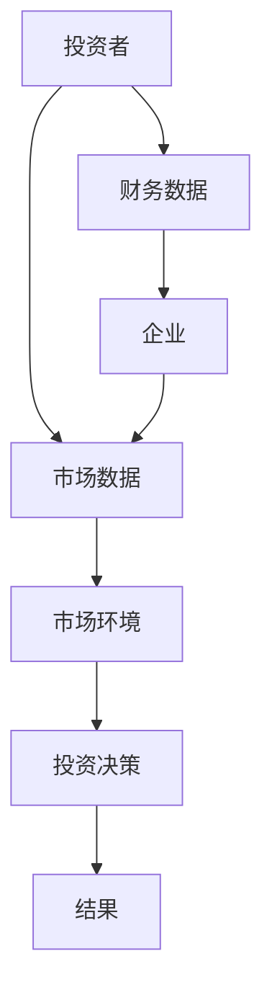
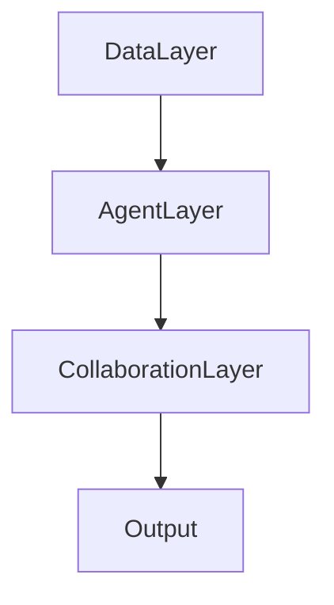
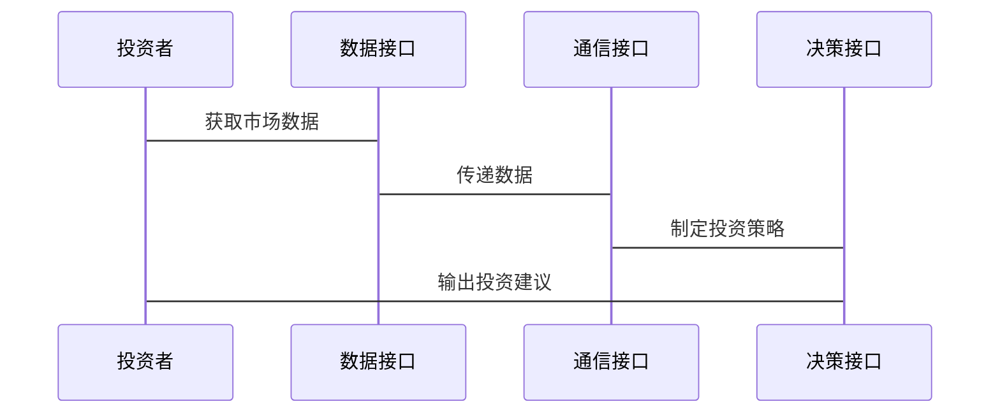

                 


# 利用多智能体系统进行全球价值投资机会筛选

**关键词**：多智能体系统、价值投资、全球市场、数据分析、机器学习、投资机会筛选、人工智能

**摘要**：  
本文探讨了如何利用多智能体系统在全球范围内筛选价值投资机会。通过分析多智能体系统的协作机制、算法原理和系统架构，结合实际案例，详细阐述了其在金融投资中的应用。文章从背景介绍、核心概念、算法实现、系统设计到项目实战，层层深入，展示了多智能体系统如何在复杂金融市场中协助投资者发现潜在机会。

---

# 第1章：多智能体系统与全球价值投资背景

## 1.1 多智能体系统的基本概念

### 1.1.1 多智能体系统的定义  
多智能体系统（Multi-Agent System, MAS）是由多个智能体组成的分布式系统，每个智能体能够感知环境、自主决策并与其他智能体协作完成复杂任务。智能体之间通过通信和协作，实现整体目标的最优解。

### 1.1.2 多智能体系统的特征  
- **分布式性**：智能体独立运行，无中央控制节点。  
- **协作性**：智能体之间通过通信协作，共同完成任务。  
- **反应性**：智能体能够实时感知环境变化并做出反应。  
- **适应性**：系统能够自适应环境变化和任务需求。  

### 1.1.3 多智能体系统与传统AI的区别  
传统AI通常基于单一智能体，而多智能体系统强调多个智能体的协作与交互。多智能体系统在处理复杂任务时更具灵活性和适应性，能够应对动态变化的环境。

## 1.2 全球价值投资的基本概念

### 1.2.1 价值投资的定义  
价值投资是一种投资策略，通过分析企业的基本面（如财务状况、盈利能力、行业地位等），寻找市场价格低于其内在价值的投资标的。

### 1.2.2 价值投资的核心原则  
- **安全边际**：买入价格低于内在价值，确保一定的安全空间。  
- **长期视角**：关注企业的长期盈利能力，而非短期市场波动。  
- **独立思考**：基于深入研究做出投资决策，避免盲目跟风。  

### 1.2.3 全球化视角下的价值投资  
在全球化背景下，价值投资不仅关注本地市场，还涉及全球范围内的资产配置。通过分析不同市场的经济周期、政策环境和行业趋势，寻找具有持续增长潜力的企业。

## 1.3 多智能体系统在价值投资中的应用前景

### 1.3.1 价值投资中的数据处理需求  
价值投资依赖于大量的数据支持，包括财务数据、市场数据、行业数据等。多智能体系统能够高效处理和分析这些数据，为投资决策提供支持。

### 1.3.2 多智能体系统在投资决策中的优势  
- **分布式计算**：多个智能体可以同时处理不同来源的数据，提高计算效率。  
- **协作决策**：多个智能体可以结合不同的信息和视角，提供更全面的投资建议。  
- **动态适应**：智能体能够实时调整策略，适应市场变化。  

### 1.3.3 全球化投资中的挑战与机遇  
全球化投资面临市场波动大、政策环境复杂等挑战。多智能体系统能够通过分布式协作和实时数据分析，帮助投资者在全球范围内发现投资机会。

---

# 第2章：多智能体系统的核心概念与联系

## 2.1 多智能体系统的组成与结构

### 2.1.1 实体关系图（ER图）分析  
通过ER图分析，我们可以清晰地看到多智能体系统中各实体之间的关系。例如，投资者、企业、市场环境等实体之间的关联。

```mermaid
er
    actor 投资者
    actor 企业
    actor 市场环境
    database 市场数据
    database 财务数据
    database 行业数据
    relationship -[拥有]-> 投资者 -- 市场数据
    relationship -[拥有]-> 投资者 -- 财务数据
    relationship -[拥有]-> 企业 -- 财务数据
    relationship -[影响]-> 市场环境 -- 市场数据
```

### 2.1.2 多智能体系统的核心要素  
- **智能体**：具有感知和决策能力的个体。  
- **通信协议**：智能体之间交互的规则和方式。  
- **协作机制**：智能体如何共同完成任务的策略。  
- **环境**：智能体所处的外部世界，包括市场数据、政策环境等。  

### 2.1.3 系统的协作机制  
协作机制是多智能体系统的核心，通过智能体之间的协作完成复杂任务。协作机制可以基于分布式计算和博弈论，确保系统整体目标的实现。

## 2.2 价值投资中的多智能体系统架构

### 2.2.1 系统的层次结构  
多智能体系统在价值投资中的架构通常分为三层：  
1. **数据层**：包括市场数据、财务数据、行业数据等。  
2. **智能体层**：负责数据处理、分析和投资决策。  
3. **协作层**：智能体之间的协作和通信机制。  

### 2.2.2 各实体之间的关系  
通过ER图可以看出，投资者、企业、市场环境等实体之间的关系。例如，投资者依赖市场数据和财务数据做出投资决策，而企业的影响则通过市场环境反映到市场数据中。

```mermaid
er
    actor 投资者
    actor 企业
    actor 市场环境
    database 市场数据
    database 财务数据
    database 行业数据
    relationship -[拥有]-> 投资者 -- 市场数据
    relationship -[拥有]-> 投资者 -- 财务数据
    relationship -[拥有]-> 企业 -- 财务数据
    relationship -[影响]-> 市场环境 -- 市场数据
```

### 2.2.3 系统的动态交互过程  
通过Mermaid流程图可以清晰地展示多智能体系统的动态交互过程。例如，投资者根据市场数据和财务数据做出投资决策，同时与企业和其他投资者互动，影响市场环境。



## 2.3 多智能体系统的数学模型

### 2.3.1 系统的数学表达  
多智能体系统的数学模型通常涉及多个变量和方程。例如，收益预测模型可以表示为：  
$$ R = \alpha x_1 + \beta x_2 + \gamma x_3 $$  
其中，$R$ 表示收益，$x_1, x_2, x_3$ 表示不同的影响因素，$\alpha, \beta, \gamma$ 是对应的权重系数。

### 2.3.2 实体之间的关系模型  
通过数学模型可以描述智能体之间的关系。例如，智能体A和智能体B之间的协作关系可以用以下公式表示：  
$$ C(A, B) = \theta \cdot (R(A) + R(B)) $$  
其中，$\theta$ 是协作系数，$R(A)$ 和 $R(B)$ 分别表示智能体A和B的收益。

### 2.3.3 系统的动态方程  
系统的动态方程可以描述智能体的决策过程。例如，智能体的决策可以表示为：  
$$ D_i = f(x_i, y_i) $$  
其中，$x_i$ 是输入数据，$y_i$ 是决策变量，$f$ 是决策函数。

---

# 第3章：多智能体系统的算法原理

## 3.1 多智能体系统的协作机制

### 3.1.1 分布式计算的基本原理  
分布式计算通过将任务分解到多个智能体，利用并行计算提高效率。例如，一个复杂的投资决策任务可以分解为多个子任务，由不同的智能体分别完成。

### 3.1.2 多智能体系统的通信协议  
通信协议是智能体之间交互的基础。通过定义明确的通信规则，确保智能体之间的有效协作。例如，智能体A可以向智能体B发送数据，B处理后将结果反馈给A。

### 3.1.3 系统的协同决策过程  
协同决策过程通常包括信息收集、分析和决策制定。例如，智能体通过收集市场数据，分析企业基本面，最终制定投资策略。

## 3.2 强化学习在多智能体系统中的应用

### 3.2.1 强化学习的基本原理  
强化学习通过智能体与环境的交互，逐步优化策略。例如，智能体通过试错，找到最优的投资策略。

### 3.2.2 多智能体系统的强化学习框架  
多智能体强化学习框架通常包括多个智能体，每个智能体都有自己的策略。例如，智能体A和智能体B分别负责不同的投资领域，通过协作优化整体收益。

### 3.2.3 系统的训练过程  
系统的训练过程包括数据收集、模型训练和策略优化。例如，通过训练智能体在不同市场环境下的决策能力，提高整体投资收益。

## 3.3 多智能体系统的博弈论模型

### 3.3.1 博弈论的基本概念  
博弈论研究多个决策主体之间的互动关系。例如，智能体之间的竞争和协作可以用博弈论模型进行分析。

### 3.3.2 多智能体系统的博弈模型  
通过构建博弈模型，可以分析智能体之间的互动关系。例如，智能体A和智能体B在投资决策中的博弈关系可以用纳什均衡进行分析。

---

# 第4章：多智能体系统的数学模型与公式

## 4.1 多智能体系统的数学表达

### 4.1.1 收益预测模型  
收益预测模型可以表示为：  
$$ R = \alpha x_1 + \beta x_2 + \gamma x_3 $$  
其中，$x_1, x_2, x_3$ 是影响收益的因素，$\alpha, \beta, \gamma$ 是对应的权重系数。

### 4.1.2 风险评估模型  
风险评估模型可以表示为：  
$$ V = \sigma R $$  
其中，$V$ 是风险值，$R$ 是收益，$\sigma$ 是标准差。

## 4.2 实体之间的关系模型

### 4.2.1 智能体协作模型  
智能体协作模型可以表示为：  
$$ C(A, B) = \theta \cdot (R(A) + R(B)) $$  
其中，$\theta$ 是协作系数，$R(A)$ 和 $R(B)$ 分别表示智能体A和B的收益。

### 4.2.2 系统的动态方程  
系统的动态方程可以表示为：  
$$ D_i = f(x_i, y_i) $$  
其中，$x_i$ 是输入数据，$y_i$ 是决策变量，$f$ 是决策函数。

---

# 第5章：多智能体系统的系统架构设计

## 5.1 系统的层次结构

### 5.1.1 功能模块设计  
多智能体系统的功能模块包括数据采集、数据分析、投资决策和结果输出。例如，数据采集模块负责收集市场数据，数据分析模块负责处理数据，投资决策模块负责制定投资策略。

### 5.1.2 系统架构图  
通过Mermaid图可以清晰地展示系统的层次结构。例如，系统由数据层、智能体层和协作层组成。



## 5.2 系统接口设计

### 5.2.1 接口定义  
系统接口包括数据接口、通信接口和决策接口。例如，数据接口负责数据的输入和输出，通信接口负责智能体之间的通信，决策接口负责投资决策的制定。

### 5.2.2 接口交互流程  
通过Mermaid序列图可以展示接口的交互流程。例如，投资者通过数据接口获取市场数据，智能体通过通信接口进行协作，最终输出投资决策。



---

# 第6章：多智能体系统的项目实战

## 6.1 环境安装与配置

### 6.1.1 系统环境  
确保安装Python 3.8及以上版本，安装必要的库如numpy、pandas、scikit-learn、matplotlib等。

### 6.1.2 项目依赖  
安装以下依赖：  
```bash
pip install numpy pandas scikit-learn matplotlib
```

## 6.2 系统核心实现

### 6.2.1 数据采集模块  
实现数据采集功能，包括从API获取市场数据，存储到数据库中。

```python
import requests
import pandas as pd

def get_market_data(api_key):
    url = f'https://api.example.com/markets?api_key={api_key}'
    response = requests.get(url)
    data = response.json()
    df = pd.DataFrame(data)
    return df
```

### 6.2.2 数据分析模块  
实现数据分析功能，包括计算财务指标、行业分析等。

```python
import pandas as pd
import numpy as np

def calculate_financial_metrics(df):
    df['PE_ratio'] = df['Price'] / df['Earnings']
    df['ROE'] = df['Net Profit'] / df['Total Equity']
    return df
```

### 6.2.3 投资决策模块  
实现投资决策功能，基于数据分析结果制定投资策略。

```python
def make_investment_decision(df):
    # 筛选低PE比率和高ROE的股票
    selected_stocks = df[(df['PE_ratio'] < 15) & (df['ROE'] > 10)]
    return selected_stocks
```

## 6.3 代码实现与解读

### 6.3.1 数据采集与处理  
从API获取市场数据，并进行清洗和转换。

```python
import requests
import pandas as pd

def get_market_data(api_key):
    url = f'https://api.example.com/markets?api_key={api_key}'
    response = requests.get(url)
    data = response.json()
    df = pd.DataFrame(data)
    return df

# 示例代码
api_key = 'your_api_key'
market_data = get_market_data(api_key)
market_data = market_data.dropna()
print(market_data.head())
```

### 6.3.2 数据分析与建模  
基于数据分析结果，构建收益预测模型。

```python
import pandas as pd
from sklearn.linear_model import LinearRegression

def calculate_financial_metrics(df):
    df['PE_ratio'] = df['Price'] / df['Earnings']
    df['ROE'] = df['Net Profit'] / df['Total Equity']
    return df

# 示例代码
market_data = calculate_financial_metrics(market_data)
X = market_data[['PE_ratio', 'ROE']]
y = market_data['Return']
model = LinearRegression()
model.fit(X, y)
print('Coefficients:', model.coef_)
print('Intercept:', model.intercept_)
```

### 6.3.3 投资决策与结果输出  
基于模型结果，制定投资策略并输出结果。

```python
def make_investment_decision(df):
    # 筛选低PE比率和高ROE的股票
    selected_stocks = df[(df['PE_ratio'] < 15) & (df['ROE'] > 10)]
    return selected_stocks

# 示例代码
selected_stocks = make_investment_decision(market_data)
print('Selected stocks:', selected_stocks['Ticker'])
```

## 6.4 实际案例分析

### 6.4.1 数据来源与处理  
从实际市场数据出发，展示数据处理的过程和结果。

```python
import pandas as pd

# 示例数据
market_data = pd.DataFrame({
    'Ticker': ['AAPL', 'MSFT', 'GOOGL', 'AMZN'],
    'Price': [150, 300, 120, 100],
    'Earnings': [10, 15, 12, 8],
    'Net Profit': [50, 75, 60, 40],
    'Total Equity': [200, 300, 250, 200],
    'Return': [10, 15, 20, 25]
})

market_data = calculate_financial_metrics(market_data)
print(market_data.head())
```

### 6.4.2 投资决策与结果展示  
基于模型结果，展示最终的投资决策和收益预测。

```python
selected_stocks = make_investment_decision(market_data)
print('Selected stocks:', selected_stocks['Ticker'])
print('Predicted Return:', selected_stocks['Return'])
```

---

# 第7章：高级主题与最佳实践

## 7.1 多智能体系统的扩展性与可维护性

### 7.1.1 系统的可扩展性  
通过模块化设计，确保系统的可扩展性。例如，新增智能体时，只需添加新的模块，不影响现有系统的运行。

### 7.1.2 系统的可维护性  
通过清晰的代码结构和文档，确保系统的可维护性。例如，定期进行代码审查和优化，确保代码的可读性和可维护性。

## 7.2 多智能体系统的实际应用中的注意事项

### 7.2.1 数据质量的重要性  
数据质量是系统运行的基础。确保数据的准确性和完整性，避免因数据问题导致的错误决策。

### 7.2.2 系统的实时性要求  
在实际应用中，系统的实时性要求较高。例如，高频交易需要系统能够实时处理数据并做出决策。

## 7.3 小结与未来展望

### 7.3.1 小结  
本文详细探讨了多智能体系统在全球价值投资中的应用，从系统架构到算法实现，再到项目实战，全面展示了其在投资机会筛选中的潜力。

### 7.3.2 未来展望  
随着人工智能技术的不断发展，多智能体系统在金融领域的应用前景广阔。未来，可以通过引入更复杂的算法和更大的数据集，进一步提升系统的投资决策能力。

---

# 作者信息

**作者**：AI天才研究院/AI Genius Institute & 禅与计算机程序设计艺术/Zen And The Art of Computer Programming

