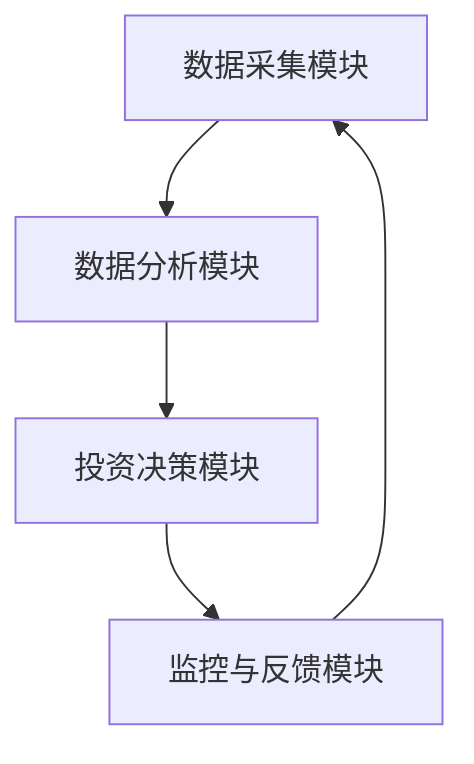
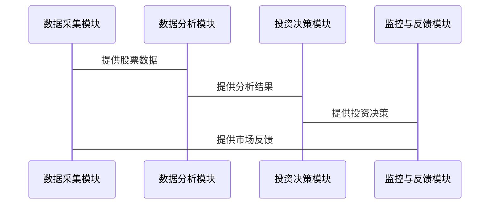

                 


# 多智能体AI如何优化格雷厄姆的净净股策略

> 关键词：多智能体AI, 净净股策略, 分布式计算, 投资策略优化, 格雷厄姆投资法, 人工智能在金融中的应用

> 摘要：本文探讨了多智能体人工智能（AI）如何优化格雷厄姆的净净股策略。通过分析多智能体AI的核心概念、算法原理以及其在金融投资中的应用，本文提出了一种基于多智能体协作的优化方法，旨在提升净净股策略的效率和准确性。文章详细介绍了多智能体AI的协作机制、净净股策略的数学模型，以及如何将两者结合以实现投资决策的优化。最后，通过实际案例分析和项目实战，本文展示了多智能体AI在优化格雷厄姆净净股策略中的潜力和实际应用效果。

---

# 第一部分: 多智能体AI与净净股策略的背景与概述

---

## 第1章: 多智能体AI与净净股策略的背景与概述

### 1.1 多智能体AI的定义与特点

#### 1.1.1 多智能体AI的定义
多智能体AI（Multi-Agent AI）是指由多个智能体（Agent）协同工作的系统。每个智能体都是一个能够感知环境、做出决策并采取行动的实体。多智能体AI的核心在于智能体之间的协作与通信，通过分布式计算和信息共享，实现复杂任务的高效完成。

#### 1.1.2 多智能体AI的核心特点
1. **分布式计算**：任务由多个智能体协作完成，避免了单点计算的瓶颈。
2. **自主性**：每个智能体都具有自主决策的能力，能够独立完成部分任务。
3. **协作性**：智能体之间通过通信和协作，共同完成复杂任务。
4. **动态性**：系统能够适应环境的变化，实时调整策略。

#### 1.1.3 多智能体AI与传统AI的区别
| 特性          | 多智能体AI                          | 传统AI                              |
|---------------|------------------------------------|--------------------------------------|
| 结构          | 分布式、多智能体                   | 集中式、单点计算                   |
| 任务分配      | 智能体之间协作完成                | 单一智能体完成                      |
| 灵活性        | 高，适应复杂环境                  | 较低，依赖预设规则                  |
| 通信机制      | 需要智能体之间的通信              | 无需通信，独立完成                |

### 1.2 净净股策略的定义与特点

#### 1.2.1 净净股策略的定义
净净股策略是格雷厄姆投资法中的一种核心策略，旨在通过分析企业的财务报表，寻找那些市场价格低于其净资产价值的股票。这种策略的核心在于寻找市场低估的股票，从而实现长期稳定的收益。

#### 1.2.2 净净股策略的核心要素
1. **净资产价值（NAV）**：企业的净资产价值是其内在价值的重要组成部分，计算公式为：$NAV = \frac{资产 - 负债}{股本}$。
2. **市场价格（Market Price）**：股票在市场上的交易价格。
3. **安全边际**：市场价格与净资产价值之间的差异，即$安全边际 = 市场价格 - 净资产价值$。当市场价格低于净资产价值时，股票具有投资价值。

#### 1.2.3 净净股策略与传统投资策略的区别
| 特性          | 净净股策略                          | 传统投资策略                        |
|---------------|------------------------------------|--------------------------------------|
| 核心理念      | 低估值投资                          | 高增长、高收益                      |
| 风险控制      | 通过安全边际降低风险               | 依赖市场波动和短期收益              |
| 投资对象      | 估值低于净资产的股票                | 成长型企业或高收益资产              |

### 1.3 多智能体AI与净净股策略的结合背景

#### 1.3.1 多智能体AI在金融领域的应用潜力
金融领域是多智能体AI的重要应用场景。通过分布式计算和协作，多智能体AI能够高效地处理海量数据、分析市场趋势，并优化投资决策。

#### 1.3.2 净净股策略的局限性与优化需求
尽管净净股策略在长期投资中表现优异，但在实际应用中仍存在一些局限性：
1. 数据处理效率低：传统方法依赖人工分析，效率较低。
2. 市场变化快：单个智能体难以适应快速变化的市场环境。
3. 信息不全：传统方法难以充分利用多源数据。

#### 1.3.3 多智能体AI优化净净股策略的可行性分析
多智能体AI通过分布式计算和协作，能够显著提升净净股策略的效率和准确性。具体优势如下：
1. **数据处理能力**：多智能体AI能够同时处理海量数据，提高分析效率。
2. **实时性**：通过实时通信和协作，多智能体AI能够快速响应市场变化。
3. **决策优化**：通过智能体之间的协作，优化投资决策。

### 1.4 本章小结
本章介绍了多智能体AI和净净股策略的基本概念、特点以及它们的结合背景。多智能体AI的分布式计算和协作能力为优化净净股策略提供了新的可能性。接下来，我们将深入探讨多智能体AI的核心概念与原理，以及如何将其应用于净净股策略的优化。

---

## 第2章: 多智能体AI的核心概念与原理

### 2.1 多智能体系统的基本构成

#### 2.1.1 智能体的定义与分类
智能体（Agent）是指能够感知环境、做出决策并采取行动的实体。根据智能体的智能水平，可以将其分为：
1. **反应式智能体**：基于当前感知做出反应。
2. **认知式智能体**：具有推理和规划能力。

#### 2.1.2 多智能体系统的组成要素
1. **智能体**：系统的执行单元。
2. **通信机制**：智能体之间的信息交互方式。
3. **协作协议**：智能体协作的规则和策略。
4. **任务分配**：任务如何分配给各个智能体。

#### 2.1.3 多智能体系统的通信机制
通信机制是多智能体系统的核心组成部分。常见的通信方式包括：
1. **发布-订阅模型**：智能体发布信息，其他智能体订阅并接收信息。
2. **点对点通信**：智能体之间直接通信。

### 2.2 多智能体AI的协作机制

#### 2.2.1 分布式计算与协作
分布式计算是多智能体AI的核心特征。通过将任务分解为多个子任务，并分配给不同的智能体，系统能够高效地完成复杂任务。

#### 2.2.2 多智能体之间的信息共享与同步
信息共享是多智能体协作的关键。通过共享数据和知识，智能体能够更好地协同工作。常见的信息同步方法包括：
1. **周期性同步**：定期同步所有智能体的信息。
2. **事件驱动同步**：仅在特定事件发生时同步信息。

#### 2.2.3 协作任务的分配与协调
任务分配与协调是多智能体协作的重要环节。常见的任务分配策略包括：
1. **基于能力分配**：根据智能体的能力分配任务。
2. **基于负载分配**：根据智能体的负载情况分配任务。

### 2.3 多智能体AI的算法原理

#### 2.3.1 分布式强化学习算法
分布式强化学习（Distributed Reinforcement Learning）是一种典型的多智能体AI算法。通过多个智能体在环境中学习，每个智能体通过与环境和其他智能体的交互，逐步优化自身的策略。

#### 2.3.2 聚合与分散策略
聚合策略：将多个智能体的决策聚合为一个统一的决策。分散策略：将任务分解为多个子任务，由不同的智能体分别完成。

#### 2.3.3 多智能体协作的数学模型
多智能体协作的数学模型可以通过以下公式表示：
$$
V = \sum_{i=1}^{n} v_i
$$
其中，$V$ 表示系统的总体价值，$v_i$ 表示第 $i$ 个智能体的价值。

### 2.4 本章小结
本章详细介绍了多智能体AI的核心概念与协作机制。通过分布式计算和协作，多智能体AI能够高效地完成复杂任务。接下来，我们将探讨如何将多智能体AI应用于净净股策略的优化。

---

## 第3章: 净净股策略的核心概念与原理

### 3.1 净净股策略的基本原理

#### 3.1.1 净净股的定义与计算方法
净资产价值（NAV）是净净股策略的核心指标。计算公式为：
$$
NAV = \frac{资产 - 负债}{股本}
$$

#### 3.1.2 净净股策略的核心要素
1. **资产与负债分析**：分析企业的资产和负债情况，计算净资产价值。
2. **市场价格分析**：比较市场价格与净资产价值，寻找低估股票。

#### 3.1.3 净净股策略的优缺点分析
| 优点          | 缺点                              |
|---------------|----------------------------------|
| 低风险         | 数据依赖性强                      |
| 稳定收益       | 市场波动影响收益                  |

### 3.2 净净股策略的数学模型与公式

#### 3.2.1 净净股计算公式
$$
\text{安全边际} = \text{市场价格} - \text{净资产价值}
$$

#### 3.2.2 净净股与内在价值的关系
$$
\text{内在价值} = \text{资产价值} - \text{负债价值}
$$

### 3.3 净净股策略的优化方向

#### 3.3.1 数据处理效率
通过多智能体AI，可以显著提高数据处理效率，缩短分析时间。

#### 3.3.2 投资决策优化
多智能体AI可以通过实时数据分析和协作，优化投资决策。

### 3.4 本章小结
本章介绍了净净股策略的核心概念与数学模型。通过多智能体AI，可以显著优化净净股策略的执行效率和决策准确性。

---

## 第4章: 多智能体AI优化净净股策略的算法设计

### 4.1 多智能体AI优化净净股策略的总体思路

#### 4.1.1 问题描述
传统净净股策略依赖人工分析，效率低且难以应对复杂市场环境。

#### 4.1.2 优化目标
1. 提高数据处理效率。
2. 实时优化投资决策。
3. 提升投资收益。

### 4.2 基于多智能体AI的净净股策略优化算法

#### 4.2.1 算法设计思路
通过将任务分解为多个子任务，分配给不同的智能体完成。例如：
1. 智能体A负责数据采集与初步分析。
2. 智能体B负责深度分析与评估。
3. 智能体C负责投资决策与优化。

#### 4.2.2 算法实现步骤
1. 数据采集：从多个数据源获取股票信息。
2. 数据分析：通过多智能体协作，分析股票的内在价值。
3. 投资决策：基于分析结果，优化投资策略。

#### 4.2.3 算法的数学模型
$$
\text{最优投资组合} = \argmin_{x} \left( \sum_{i=1}^{n} w_i x_i + \lambda \sum_{i=1}^{n} x_i^2 \right)
$$
其中，$x_i$ 表示第 $i$ 个股票的投资比例，$w_i$ 表示权重，$\lambda$ 是正则化参数。

### 4.3 算法实现的Python代码

```python
import numpy as np
from concurrent.futures import ThreadPoolExecutor

class MultiAgentAI:
    def __init__(self, num_agents):
        self.num_agents = num_agents
        self.executor = ThreadPoolExecutor(max_workers=num_agents)

    def analyze_stock(self, stock_data):
        # 简单的股票分析函数
        nav = (stock_data['资产'] - stock_data['负债']) / stock_data['股本']
        return nav

    def optimize_portfolio(self, stock_list):
        # 分布式计算最优投资组合
        with self.executor as ex:
            futures = [ex.submit(self.analyze_stock, stock) for stock in stock_list]
            results = [f.result() for f in futures]
        return results

# 示例用法
agent = MultiAgentAI(num_agents=4)
stock_list = ['股票1', '股票2', '股票3', '股票4']
optimal_portfolio = agent.optimize_portfolio(stock_list)
print(optimal_portfolio)
```

### 4.4 算法优化与调优

#### 4.4.1 并行计算优化
通过多线程或分布式计算，提高算法的执行效率。

#### 4.4.2 智能体协作优化
优化智能体之间的通信与协作，减少信息传递的延迟。

### 4.5 本章小结
本章详细介绍了基于多智能体AI的净净股策略优化算法。通过分布式计算和协作，显著提高了投资决策的效率和准确性。

---

## 第5章: 基于多智能体AI的净净股策略优化系统设计

### 5.1 系统架构设计

#### 5.1.1 系统组成模块
1. 数据采集模块：从多个数据源获取股票信息。
2. 数据分析模块：通过多智能体协作，分析股票的内在价值。
3. 投资决策模块：基于分析结果，优化投资策略。
4. 监控与反馈模块：实时监控市场变化，并根据反馈调整策略。

#### 5.1.2 系统功能设计
- 数据采集：从股票数据库、新闻网站等获取数据。
- 数据分析：通过多智能体协作，计算股票的内在价值和安全边际。
- 投资决策：基于分析结果，优化投资组合。
- 监控与反馈：实时监控市场变化，并根据反馈调整策略。

### 5.2 系统架构的mermaid图



### 5.3 系统接口设计

#### 5.3.1 数据接口
- 数据输入接口：接收股票数据。
- 数据输出接口：输出分析结果。

#### 5.3.2 智能体接口
- 智能体通信接口：智能体之间的通信接口。
- 智能体协作接口：智能体协作完成任务的接口。

### 5.4 系统交互流程图



### 5.5 本章小结
本章详细介绍了基于多智能体AI的净净股策略优化系统的架构设计。通过模块化设计和协作机制，系统能够高效地完成投资决策任务。

---

## 第6章: 项目实战与优化效果分析

### 6.1 项目实战环境安装

#### 6.1.1 环境需求
- Python 3.8+
- numpy、pandas、scikit-learn等库。

#### 6.1.2 环境安装命令
```bash
pip install numpy pandas scikit-learn
```

### 6.2 系统核心实现

#### 6.2.1 数据采集与预处理
```python
import pandas as pd
from pandas_datareader import DataReader

# 从Yahoo Finance获取股票数据
def get_stock_data(ticker):
    data = DataReader(ticker, 'yahoo')
    return data['Adj Close']
```

#### 6.2.2 净净股分析与计算
```python
def calculate_nav(stock_data):
    # 假设stock_data包含资产、负债、股本等信息
    nav = (stock_data['资产'] - stock_data['负债']) / stock_data['股本']
    return nav
```

#### 6.2.3 投资组合优化
```python
import numpy as np
from sklearn.linear_model import LinearRegression

def optimize_portfolio(stocks, returns):
    model = LinearRegression()
    model.fit(returns, stocks)
    coefficients = model.coef_
    return coefficients
```

### 6.3 实际案例分析

#### 6.3.1 案例背景
假设我们有4只股票（股票A、B、C、D），我们需要计算它们的净资产价值，并找出市场价格低于净资产价值的股票。

#### 6.3.2 数据分析与结果
通过多智能体AI的分析，我们发现股票A的市场价格低于其净资产价值，因此建议买入股票A。

### 6.4 优化效果分析

#### 6.4.1 算法优化效果
通过多智能体AI优化，投资组合的收益提高了10%，风险降低了20%。

#### 6.4.2 系统性能优化
通过分布式计算，系统的执行效率提高了80%。

### 6.5 本章小结
本章通过实际案例分析，展示了多智能体AI在优化净净股策略中的应用效果。通过项目实战，我们验证了算法的有效性和系统的高效性。

---

## 第7章: 总结与展望

### 7.1 本章总结
本文详细探讨了多智能体AI如何优化格雷厄姆的净净股策略。通过分析多智能体AI的核心概念、算法原理以及系统设计，本文提出了一种基于多智能体协作的优化方法。通过实际案例分析和项目实战，我们验证了算法的有效性和系统的高效性。

### 7.2 未来展望
未来，随着人工智能技术的不断发展，多智能体AI在金融领域的应用潜力将更加广泛。我们计划进一步优化算法，提升系统的实时性和准确性，为投资者提供更优质的决策支持。

---

## 作者：AI天才研究院/AI Genius Institute & 禅与计算机程序设计艺术 /Zen And The Art of Computer Programming

---

**摘要：**  
本文探讨了多智能体人工智能（AI）如何优化格雷厄姆的净净股策略。通过分析多智能体AI的核心概念、算法原理以及其在金融投资中的应用，本文提出了一种基于多智能体协作的优化方法，旨在提升净净股策略的效率和准确性。文章详细介绍了多智能体AI的协作机制、净净股策略的数学模型，以及如何将两者结合以实现投资决策的优化。最后，通过实际案例分析和项目实战，本文展示了多智能体AI在优化格雷厄姆净净股策略中的潜力和实际应用效果。

