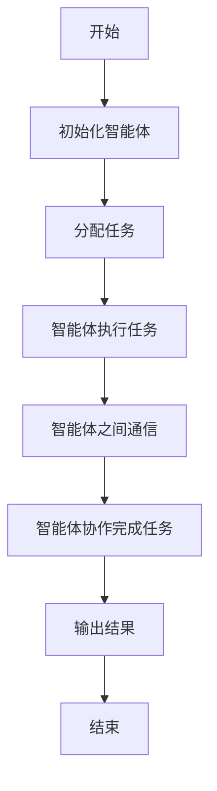
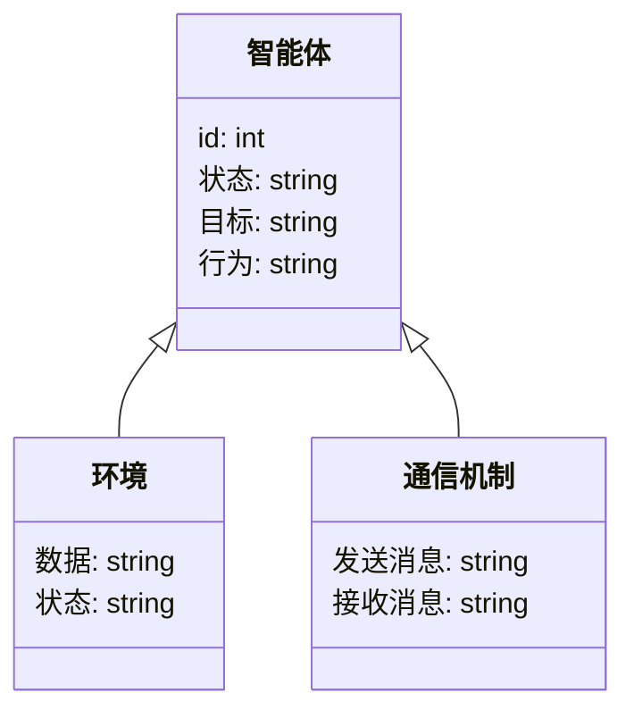
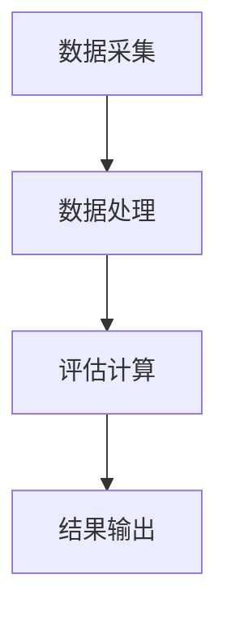

                 


# 多智能体系统在品牌资产评估中的应用：量化品牌价值

> **关键词**：多智能体系统，品牌资产评估，品牌价值，智能体协同，算法设计，系统架构

> **摘要**：本文探讨了多智能体系统（MAS）在品牌资产评估中的应用，重点分析了如何通过多智能体系统的协同工作来量化品牌价值。文章从背景介绍、核心概念、算法原理、系统架构到项目实战，全面阐述了多智能体系统在品牌资产评估中的优势和实现方法，为读者提供了一个系统化、理论化和实践化的解决方案。

---

# 第1章 多智能体系统与品牌资产评估概述

## 1.1 多智能体系统的基本概念

### 1.1.1 多智能体系统的定义
多智能体系统（Multi-Agent Systems，MAS）是由多个智能体组成的分布式系统，这些智能体能够通过感知环境、自主决策、协同合作来完成特定任务。每个智能体都有自己的目标、知识库和行为规则，能够独立或与其他智能体协作完成复杂任务。

### 1.1.2 多智能体系统的特征
多智能体系统的特征包括：
1. **自主性**：智能体能够自主决策和行动。
2. **反应性**：智能体能够根据环境变化动态调整行为。
3. **协作性**：多个智能体能够协同工作，共同完成复杂任务。
4. **分布性**：智能体分布在不同的空间或网络节点上，通过通信和协调实现目标。

### 1.1.3 多智能体系统与传统单智能体系统的区别
| 特性                | 多智能体系统                          | 单智能体系统                          |
|---------------------|--------------------------------------|---------------------------------------|
| 组件数量            | 多个智能体                            | 单个智能体                            |
| 任务分配            | 分布式任务分配                        | 中央化任务分配                        |
| 协作能力            | 高度协作                             | 无需协作                              |
| 系统复杂度          | 高                                   | 较低                                 |

---

## 1.2 品牌资产评估的定义与挑战

### 1.2.1 品牌价值的定义
品牌价值是品牌在市场中的经济价值，通常通过品牌知名度、品牌忠诚度、品牌影响力等因素来衡量。品牌价值是企业在市场中的核心竞争力之一。

### 1.2.2 品牌资产评估的难点
品牌资产评估的难点包括：
1. **数据多样性**：品牌价值受多种因素影响，如市场表现、消费者行为、竞争对手策略等，数据来源复杂。
2. **动态变化**：品牌价值会随着市场环境的变化而波动，难以静态评估。
3. **主观性**：品牌价值的评估涉及主观判断，不同评估方法可能得出不同结果。

### 1.2.3 多智能体系统在品牌资产评估中的优势
多智能体系统能够通过多个智能体协同工作，分别从不同维度收集和分析数据，从而提供更全面和动态的品牌价值评估。例如，一个智能体负责收集市场数据，另一个负责分析消费者行为，第三个负责预测品牌发展趋势。

---

## 1.3 多智能体系统在品牌资产评估中的应用前景

### 1.3.1 多智能体系统的潜在应用场景
1. **品牌监测**：实时监测品牌在社交媒体、新闻媒体中的提及情况。
2. **竞争对手分析**：分析竞争对手的品牌策略和市场表现。
3. **市场趋势预测**：通过多智能体协同分析市场趋势，预测品牌未来发展。

### 1.3.2 多智能体系统在品牌资产评估中的优势
1. **高效性**：多智能体系统能够同时处理大量数据，提高评估效率。
2. **准确性**：通过多个智能体的协同分析，减少评估的片面性，提高准确性。
3. **动态性**：能够实时更新数据，适应市场环境的变化。

### 1.3.3 多智能体系统应用的挑战与机遇
- **挑战**：多智能体系统的实现复杂，需要解决智能体之间的通信、协作和协调问题。
- **机遇**：多智能体系统能够提供更全面的品牌评估，帮助企业制定更精准的市场策略。

---

## 1.4 本章小结

本章介绍了多智能体系统的基本概念和品牌资产评估的定义与挑战。通过对比分析，展示了多智能体系统在品牌资产评估中的优势和应用前景。接下来的章节将深入探讨多智能体系统的核心概念、算法原理和系统架构。

---

# 第2章 多智能体系统的核心概念与联系

## 2.1 多智能体系统的核心概念

### 2.1.1 智能体的定义与特征
智能体（Agent）是一个能够感知环境、自主决策、执行行动的实体。智能体的特征包括自主性、反应性、目标导向性和社会能力。

### 2.1.2 多智能体系统的组成要素
多智能体系统由多个智能体、通信机制、协调机制和共享知识库组成。智能体之间通过通信机制交换信息，通过协调机制达成一致行动。

### 2.1.3 多智能体系统与传统单智能体系统的区别
| 特性                | 多智能体系统                          | 单智能体系统                          |
|---------------------|--------------------------------------|---------------------------------------|
| 组件数量            | 多个智能体                            | 单个智能体                            |
| 任务分配            | 分布式任务分配                        | 中央化任务分配                        |
| 协作能力            | 高度协作                             | 无需协作                              |

---

## 2.2 多智能体系统的属性特征对比

### 2.2.1 智能体的属性特征
| 属性                | 描述                                |
|---------------------|------------------------------------|
| 自主性              | 智能体能够自主决策和行动            |
| 反应性              | 智能体能够根据环境变化调整行为      |
| 目标导向性          | 智能体有明确的目标和行动动机        |
| 社会能力            | 智能体能够与其他智能体或人类交互    |

### 2.2.2 多智能体系统的属性特征
| 属性                | 描述                                |
|---------------------|------------------------------------|
| 分布性              | 智能体分布在网络或系统中             |
| 协作性              | 智能体之间能够协作完成任务         |
| 动态性              | 系统状态和环境动态变化              |
| 复杂性              | 系统复杂，涉及多个智能体的交互      |

### 2.2.3 智能体与多智能体系统的对比分析
智能体强调单个实体的自主性和反应性，而多智能体系统强调多个智能体的协作和分布性。多智能体系统通过智能体之间的协同工作，能够完成更复杂和多样化的任务。

---

## 2.3 多智能体系统的ER实体关系图

### 2.3.1 实体关系图的定义
实体关系图（Entity-Relationship Diagram，ER图）用于描述系统中各个实体之间的关系。在多智能体系统中，实体包括智能体、环境、任务、通信机制等。

### 2.3.2 多智能体系统的实体关系图设计

```mermaid
erd
    title 多智能体系统实体关系图
    系统环境 -[拥有]-> 智能体
    智能体 <--[属于]-> 任务
    智能体 -[通过]-> 通信机制
    通信机制 -[连接]-> 知识库
```

### 2.3.3 实体关系图的实现与应用
通过实体关系图可以清晰地展示多智能体系统中各实体之间的关系，有助于系统设计和实现。

---

## 2.4 本章小结

本章详细介绍了多智能体系统的核心概念，包括智能体的定义、特征和多智能体系统的组成要素。通过对比分析，展示了多智能体系统与传统单智能体系统的区别。接下来的章节将深入探讨多智能体系统的算法原理和系统架构。

---

# 第3章 多智能体系统的算法原理

## 3.1 多智能体系统的算法概述

### 3.1.1 多智能体系统的主要算法
多智能体系统中常用的算法包括分布式计算、博弈论模型、协调算法等。这些算法能够帮助智能体在分布式环境中高效协作。

### 3.1.2 多智能体系统算法的特点
1. **分布式**：算法分布在多个智能体上执行。
2. **动态性**：算法能够适应环境的变化。
3. **协作性**：算法通过智能体之间的协作实现目标。

### 3.1.3 多智能体系统算法的选择与优化
在选择算法时，需要考虑系统的复杂性、智能体的数量和任务的性质。优化算法的关键在于提高智能体之间的通信效率和协作能力。

---

## 3.2 多智能体系统的算法流程图

### 3.2.1 多智能体系统算法的流程设计



### 3.2.2 多智能体系统算法的实现步骤
1. 初始化智能体，分配任务。
2. 智能体根据任务执行操作。
3. 智能体之间通过通信机制交换信息。
4. 智能体协作完成任务，输出结果。

### 3.2.3 多智能体系统算法的优化与改进
通过优化通信机制和协调算法，可以提高多智能体系统的效率和准确性。

---

## 3.3 多智能体系统算法的数学模型

### 3.3.1 多智能体系统的数学模型
多智能体系统的数学模型通常包括智能体的状态、动作和目标函数。状态表示智能体的当前情况，动作表示智能体的决策，目标函数表示智能体的目标。

### 3.3.2 多智能体系统算法的数学公式
$$ V_i = \max_{a_i} \sum_{j=1}^n \lambda_j V_j(a_i) $$
其中，$V_i$ 表示智能体i的效用函数，$\lambda_j$ 表示权重，$V_j(a_i)$ 表示智能体j在智能体i选择动作$a_i$下的效用。

---

## 3.4 本章小结

本章详细介绍了多智能体系统的算法原理，包括算法概述、流程图和数学模型。通过数学模型的分析，展示了如何通过多智能体系统实现品牌价值的量化评估。接下来的章节将探讨系统的架构设计和项目实战。

---

# 第4章 多智能体系统的系统架构设计

## 4.1 系统功能设计

### 4.1.1 品牌资产评估的领域模型



### 4.1.2 系统功能模块
系统功能模块包括数据采集、数据处理、评估计算、结果输出等。

---

## 4.2 系统架构设计

### 4.2.1 系统架构图



### 4.2.2 模块交互流程
1. 数据采集模块负责收集品牌相关数据。
2. 数据处理模块对数据进行清洗和预处理。
3. 评估计算模块通过多智能体协同计算品牌价值。
4. 结果输出模块将评估结果展示给用户。

---

## 4.3 本章小结

本章设计了多智能体系统的系统架构，包括功能模块和架构图。通过模块化设计，展示了如何实现品牌价值的量化评估。接下来的章节将通过项目实战，展示系统的具体实现和应用。

---

# 第5章 项目实战：多智能体系统在品牌资产评估中的应用

## 5.1 环境安装与配置

### 5.1.1 安装Python与相关库
安装Python和以下库：
- `numpy`
- `pandas`
- `scikit-learn`
- `networkx`

### 5.1.2 配置开发环境
配置Jupyter Notebook或PyCharm作为开发环境。

---

## 5.2 系统核心代码实现

### 5.2.1 智能体类实现

```python
class Agent:
    def __init__(self, id, target):
        self.id = id
        self.target = target
        self.state = 'idle'
        
    def act(self):
        pass
```

### 5.2.2 通信机制实现

```python
class Communication:
    def __init__(self):
        self.messages = []
        
    def send(self, sender, message):
        self.messages.append((sender, message))
        
    def receive(self, receiver):
        messages = [msg for msg in self.messages if msg[0] != receiver]
        return messages
```

### 5.2.3 评估计算实现

```python
class BrandEvaluator:
    def __init__(self, agents):
        self.agents = agents
        self.communication = Communication()
        
    def evaluate(self):
        for agent in self.agents:
            self.communication.send(agent.id, 'start evaluation')
        # 智能体协同计算品牌价值
        pass
```

---

## 5.3 代码解读与分析

### 5.3.1 智能体类解读
智能体类`Agent`包含智能体的ID、目标和状态。`act`方法用于智能体执行具体操作。

### 5.3.2 通信机制解读
通信机制类`Communication`用于智能体之间的消息传递。`send`方法发送消息，`receive`方法接收消息。

### 5.3.3 评估计算解读
`BrandEvaluator`类负责协调多个智能体进行品牌价值评估。通过通信机制，智能体之间可以协同完成评估任务。

---

## 5.4 实际案例分析与代码实现

### 5.4.1 案例背景
假设我们有一个品牌A，需要评估其品牌价值。我们可以通过多个智能体分别评估品牌知名度、品牌忠诚度和市场表现。

### 5.4.2 代码实现

```python
# 初始化智能体
agent1 = Agent(1, 'brand awareness')
agent2 = Agent(2, 'customer loyalty')
agent3 = Agent(3, 'market performance')

# 创建评估器
evaluator = BrandEvaluator([agent1, agent2, agent3])

# 执行评估
evaluator.evaluate()
```

---

## 5.5 项目小结

本章通过项目实战，展示了多智能体系统在品牌资产评估中的具体实现。通过代码实现，读者可以理解如何通过多智能体系统量化品牌价值。接下来的章节将总结最佳实践和注意事项。

---

# 第6章 最佳实践与注意事项

## 6.1 小结

通过本文的探讨，我们了解了多智能体系统在品牌资产评估中的应用，包括核心概念、算法原理和系统架构设计。多智能体系统通过多个智能体的协同工作，能够提供更全面和动态的品牌价值评估。

---

## 6.2 注意事项

1. **系统复杂性**：多智能体系统的实现复杂，需要考虑智能体之间的通信和协作。
2. **数据隐私**：在品牌资产评估中，需要保护品牌相关数据的隐私和安全。
3. **算法优化**：需要不断优化算法，提高系统的效率和准确性。

---

## 6.3 未来趋势

未来，多智能体系统在品牌资产评估中的应用将更加广泛。随着人工智能和大数据技术的发展，多智能体系统将能够更精准地评估品牌价值，为企业提供更有力的决策支持。

---

## 6.4 拓展阅读

1. **《Multi-Agent Systems: Algorithmic, Complexity Theoretic, and Economic Aspects》** - 约翰·豪肯·史密斯（Johann H.霍夫曼）
2. **《Multi-Agent Machine Learning: A Reinforcement Approach》** - 达米安·布龙伯格（Danie Brachman）

---

# 结语

多智能体系统在品牌资产评估中的应用，不仅提高了评估的准确性和效率，还为企业提供了更全面的市场洞察。通过本文的探讨，我们希望能够为读者提供一个系统化、理论化和实践化的解决方案。

---

# 作者

作者：AI天才研究院/AI Genius Institute & 禅与计算机程序设计艺术/Zen And The Art of Computer Programming

