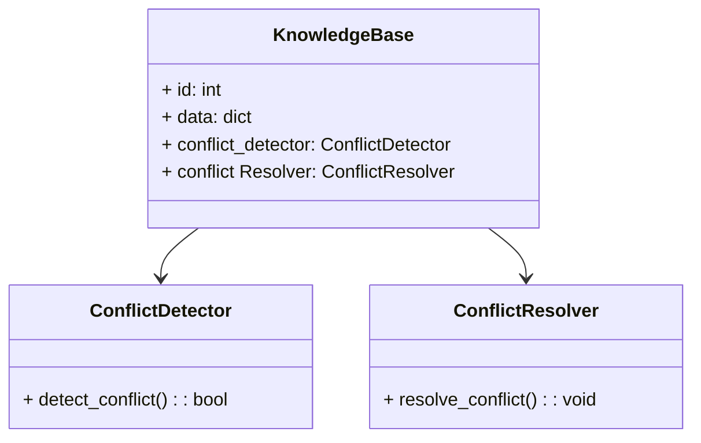
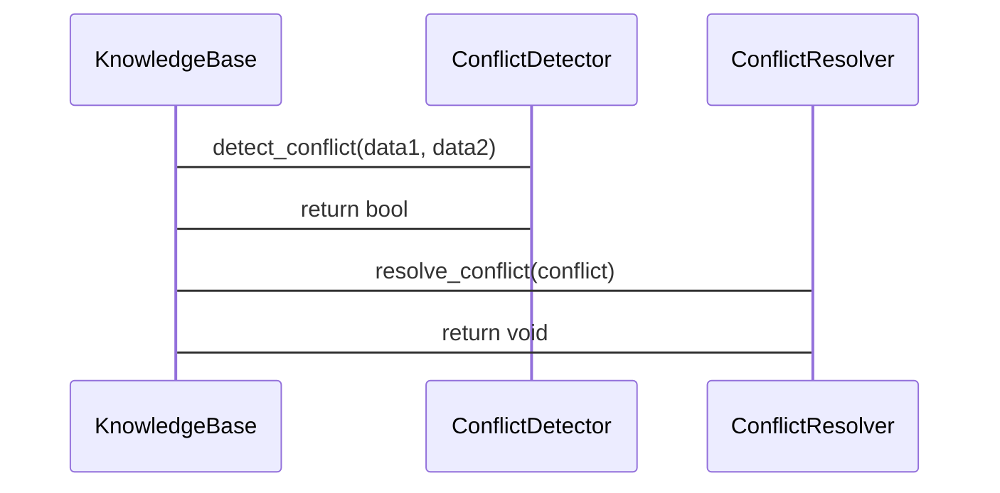

                 


# 实现AI Agent的动态知识库冲突解决机制

> 关键词：AI Agent，动态知识库，冲突解决机制，知识管理，算法原理

> 摘要：本文详细探讨了AI Agent在动态知识库中的冲突解决机制，从核心概念、算法原理、系统架构设计到项目实战，全面分析了如何实现高效的动态知识库冲突解决机制。通过本篇文章，读者可以深入了解动态知识库冲突的成因、检测与消解方法，并掌握基于相似度的冲突检测算法的实现细节。

---

## 第1章 动态知识库与AI Agent概述

### 1.1 动态知识库的基本概念

#### 1.1.1 知识库的定义与特点
知识库（Knowledge Base）是一个结构化的数据集合，用于存储和管理特定领域的知识。它通常以图结构或数据库的形式存在，能够支持复杂的查询和推理操作。知识库的特点包括：
- **结构化**：数据以规则的形式组织，便于计算机理解和推理。
- **动态性**：知识库中的内容可以实时更新，以反映最新的信息。
- **可扩展性**：能够方便地添加新知识和规则。

#### 1.1.2 动态知识库的特性
动态知识库（Dynamic Knowledge Base）是一种能够实时更新和适应变化的知识库。其主要特性包括：
- **实时更新**：能够快速响应新数据的输入，保持知识库的最新性。
- **自适应性**：能够根据环境的变化自动调整知识存储和推理方式。
- **容错性**：在面对冲突信息时，能够自动检测并进行合理的消解。

#### 1.1.3 AI Agent的基本概念
AI Agent（人工智能代理）是一种能够感知环境、执行任务并做出决策的智能实体。它可以是一个软件程序，也可以是一个物理设备。AI Agent的核心特点包括：
- **自主性**：能够在没有外部干预的情况下独立运行。
- **反应性**：能够实时感知环境并做出相应的反应。
- **学习能力**：能够通过经验改进自身的性能。

### 1.2 知识库冲突的定义与分类

#### 1.2.1 知识库冲突的定义
知识库冲突（Knowledge Base Conflict）是指在知识库中存在相互矛盾或不一致的信息。例如，同一实体在不同来源中被赋予了不同的属性或关系。

#### 1.2.2 冲突的分类与特征
冲突可以分为以下几类：
1. **语义冲突**：信息在语义上存在矛盾，例如“张三是学生”和“张三是老师”。
2. **属性冲突**：同一实体的不同属性存在矛盾，例如“张三的年龄是20岁”和“张三的年龄是25岁”。
3. **关系冲突**：实体之间的关系存在矛盾，例如“张三是李的父亲”和“李是王的父亲”。

冲突的特征包括：
- **隐蔽性**：冲突可能隐藏在大量信息中，难以被发现。
- **动态性**：随着知识库的更新，冲突可能频繁出现。
- **复杂性**：冲突可能涉及多个实体和多个属性，难以简单解决。

#### 1.2.3 动态知识库冲突的特点
在动态知识库中，冲突的特点更加复杂：
- **实时性**：冲突可能随时出现，需要实时处理。
- **多样性**：冲突可能涉及多种类型，需要灵活的处理方法。
- **不确定性**：冲突的原因可能不明确，需要结合上下文进行判断。

### 1.3 AI Agent中的知识库冲突问题

#### 1.3.1 知识库冲突对AI Agent的影响
知识库冲突可能对AI Agent造成以下影响：
- **决策错误**：由于信息不一致，导致决策失误。
- **推理失败**：冲突的信息可能导致推理过程无法正常进行。
- **性能下降**：冲突的检测和消解需要额外的计算资源。

#### 1.3.2 动态知识库冲突的挑战
动态知识库冲突的解决面临以下挑战：
- **实时性要求**：需要快速检测和消解冲突，以保证知识库的实时性。
- **复杂性**：冲突可能涉及多个实体和属性，需要复杂的处理逻辑。
- **资源限制**：在资源受限的环境中，如何高效解决冲突是一个难题。

#### 1.3.3 解决冲突的必要性
解决动态知识库冲突的必要性体现在以下几个方面：
- **保证知识库的正确性**：冲突的存在会影响知识库的可信度。
- **提升AI Agent的性能**：通过消除冲突，可以提高AI Agent的决策能力和推理能力。
- **支持动态环境的需求**：动态知识库需要能够适应快速变化的环境。

## 1.4 本章小结
本章从动态知识库和AI Agent的基本概念出发，分析了知识库冲突的定义、分类及其对AI Agent的影响。同时，还探讨了动态知识库冲突解决的挑战和必要性，为后续章节的深入分析奠定了基础。

---

## 第2章 动态知识库冲突解决机制的核心概念

### 2.1 冲突检测机制

#### 2.1.1 冲突检测的定义
冲突检测（Conflict Detection）是指通过算法或规则，识别知识库中是否存在相互矛盾的信息的过程。

#### 2.1.2 冲突检测的方法
冲突检测的方法包括：
1. **基于规则的方法**：通过预定义的规则检测冲突。
2. **基于相似度的方法**：通过计算信息之间的相似度来判断是否存在冲突。
3. **基于图结构的方法**：通过分析知识图中的关系来检测冲突。

#### 2.1.3 冲突检测的实现步骤
1. **信息获取**：从知识库中获取相关数据。
2. **冲突检查**：将获取的信息与现有知识进行比较，判断是否存在冲突。
3. **冲突标记**：对检测到的冲突进行标记，以便后续处理。

#### 2.1.4 冲突检测的优化策略
为了提高冲突检测的效率，可以采取以下优化策略：
- **分层检测**：先检测高层次的冲突，再处理低层次的冲突。
- **增量检测**：仅检测新增信息可能引起的冲突。

### 2.2 冲突消解机制

#### 2.2.1 冲突消解的定义
冲突消解（Conflict Resolution）是指通过一定的策略和方法，消除知识库中的冲突信息，确保知识库的一致性。

#### 2.2.2 冲突消解的策略
冲突消解的策略包括：
1. **优先级规则**：根据冲突信息的优先级进行消解。
2. **协商机制**：通过协商的方式确定冲突信息的正确性。
3. **合并规则**：将冲突的信息合并为一个合理的结果。

#### 2.2.3 冲突消解的实现步骤
1. **冲突分析**：分析冲突的原因和影响。
2. **策略选择**：选择合适的冲突消解策略。
3. **信息更新**：根据策略更新知识库中的信息。

### 2.3 动态知识库的更新机制

#### 2.3.1 动态知识库更新的定义
动态知识库更新（Dynamic Knowledge Base Update）是指实时添加、修改或删除知识库中的信息，以保持知识库的最新性。

#### 2.3.2 更新机制的核心要素
更新机制的核心要素包括：
- **更新规则**：定义如何处理新增或修改的信息。
- **冲突检测**：在更新过程中检测可能引发的冲突。
- **冲突消解**：在更新后消除冲突。

#### 2.3.3 更新机制的实现步骤
1. **信息接收**：接收新的知识信息。
2. **冲突检测**：检测新信息与现有知识是否冲突。
3. **冲突处理**：根据检测结果进行冲突消解。
4. **知识更新**：更新知识库中的信息。

### 2.4 核心概念之间的关系

#### 2.4.1 冲突检测与消解的关系
冲突检测是冲突消解的前提，只有检测到冲突，才能进行后续的消解。冲突消解的结果又会反过来影响冲突检测的过程。

#### 2.4.2 更新机制与冲突解决的关系
动态知识库的更新过程需要依赖冲突检测和消解机制，而冲突检测和消解的结果又会反馈到更新机制中，以确保知识库的正确性。

#### 2.4.3 动态知识库的整体架构
动态知识库的整体架构包括：
1. **知识存储层**：存储知识库中的信息。
2. **冲突检测层**：实时检测知识库中的冲突。
3. **冲突消解层**：消除检测到的冲突。
4. **更新层**：根据消解结果更新知识库。

---

## 第3章 冲突检测算法原理

### 3.1 冲突检测的基本原理

#### 3.1.1 冲突检测的数学模型
冲突检测的数学模型可以用以下公式表示：
$$
\text{冲突相似度} = \text{max}(|\text{相似度} - 1|, 0)
$$

其中，相似度是通过某种相似度计算方法得到的值。如果相似度小于1，说明存在冲突。

#### 3.1.2 冲突检测的算法步骤
1. **获取信息**：从知识库中获取需要检测冲突的信息。
2. **计算相似度**：使用相似度计算方法计算信息之间的相似度。
3. **判断冲突**：根据相似度判断是否存在冲突。

### 3.2 基于相似度的冲突检测算法

#### 3.2.1 算法原理
基于相似度的冲突检测算法通过计算信息之间的相似度来判断是否存在冲突。如果相似度低于某个阈值，则认为存在冲突。

#### 3.2.2 算法实现
以下是基于相似度的冲突检测算法的Python代码示例：

```python
def detect_conflict(data1, data2):
    # 计算相似度
    similarity = calculate_similarity(data1, data2)
    # 判断冲突
    if similarity < threshold:
        return True  # 存在冲突
    else:
        return False  # 无冲突
```

#### 3.2.3 算法优缺点分析
优点：
- 实现简单，易于理解。
缺点：
- 可能存在误判，特别是在相似度计算不准确的情况下。

### 3.3 冲突检测的数学模型

#### 3.3.1 冲突相似度公式
冲突相似度公式：
$$
\text{冲突相似度} = \begin{cases}
\text{相似度} & \text{如果相似度} < \text{阈值} \\
0 & \text{否则}
\end{cases}
$$

其中，相似度可以通过余弦相似度、Jaccard相似度等方法计算。

---

## 第4章 系统分析与架构设计

### 4.1 问题场景介绍

#### 4.1.1 问题背景
在动态知识库中，由于信息的实时更新，冲突检测和消解需要高效且准确。

#### 4.1.2 问题描述
知识库中的冲突信息可能会影响AI Agent的决策能力，因此需要实时检测和消解冲突。

### 4.2 系统功能设计

#### 4.2.1 领域模型
以下是领域模型的Mermaid类图：



#### 4.2.2 系统架构
以下是系统架构的Mermaid架构图：


#### 4.2.3 接口设计
以下是系统接口的描述：
- **detect_conflict(data1, data2)**：检测数据是否存在冲突。
- **resolve_conflict(conflict)**：消解检测到的冲突。

#### 4.2.4 交互流程
以下是交互流程的Mermaid序列图：



### 4.3 系统优化与性能分析

#### 4.3.1 系统优化策略
1. **增量检测**：仅检测新增信息可能引发的冲突。
2. **分层处理**：先处理高层次的冲突，再处理低层次的冲突。

#### 4.3.2 性能分析
- **时间复杂度**：冲突检测的时间复杂度取决于相似度计算方法。
- **空间复杂度**：知识库的存储空间取决于知识的规模。

---

## 第5章 项目实战

### 5.1 环境安装与配置

#### 5.1.1 安装Python环境
安装Python 3.8及以上版本。

#### 5.1.2 安装依赖库
安装以下依赖库：
```bash
pip install numpy
pip install scikit-learn
```

### 5.2 系统核心实现

#### 5.2.1 冲突检测模块实现
以下是冲突检测模块的Python代码：

```python
from sklearn.metrics.pairwise import cosine_similarity

def calculate_similarity(data1, data2):
    # 假设data1和data2是向量表示
    return cosine_similarity([data1], [data2])[0][0]

def detect_conflict(data1, data2, threshold=0.8):
    similarity = calculate_similarity(data1, data2)
    return similarity < threshold
```

#### 5.2.2 冲突消解模块实现
以下是冲突消解模块的Python代码：

```python
def resolve_conflict(conflicting_data):
    # 假设conflicting_data是冲突的数据对
    # 这里采用优先级规则进行消解
    return conflicting_data[0]  # 简单示例，实际应根据具体规则选择
```

### 5.3 代码解读与分析

#### 5.3.1 冲突检测模块
冲突检测模块使用余弦相似度计算数据之间的相似度。如果相似度低于阈值，则认为存在冲突。

#### 5.3.2 冲突消解模块
冲突消解模块采用优先级规则，选择优先级较高的数据作为正确的信息。

### 5.4 实际案例分析

#### 5.4.1 案例背景
假设知识库中有两条信息：
- 张三的年龄是20岁。
- 张三的年龄是25岁。

#### 5.4.2 冲突检测
使用余弦相似度计算两条信息的相似度：
$$
\text{相似度} = 0.6
$$
由于相似度小于阈值0.8，检测到冲突。

#### 5.4.3 冲突消解
采用优先级规则，选择优先级较高的数据（例如，来源更权威的数据）进行消解，最终确定张三的年龄为20岁。

### 5.5 项目小结
通过本节的实战，读者可以掌握动态知识库冲突解决机制的具体实现方法，并能够将其应用到实际项目中。

---

## 第6章 总结与扩展

### 6.1 最佳实践 tips

#### 6.1.1 冲突检测的优化
- 使用增量检测减少计算量。
- 结合多种相似度计算方法提高准确性。

#### 6.1.2 冲突消解的策略选择
- 根据具体场景选择合适的消解策略。
- 定期更新冲突消解规则以适应变化。

#### 6.1.3 系统性能的优化
- 使用缓存技术减少重复计算。
- 并行处理冲突检测和消解任务。

### 6.2 本章小结
本章总结了动态知识库冲突解决机制的核心内容，并给出了实际应用中的注意事项和优化建议。

### 6.3 注意事项
- 冲突检测和消解需要结合具体场景进行调整。
- 确保冲突消解规则的合理性和可扩展性。

### 6.4 拓展阅读
- 《Dynamic Knowledge Bases: Theory and Application》
- 《Conflict Resolution in Knowledge Engineering》

---

## 作者信息

作者：AI天才研究院/AI Genius Institute & 禅与计算机程序设计艺术/Zen And The Art of Computer Programming

---

通过以上章节的详细分析，本文为实现AI Agent的动态知识库冲突解决机制提供了全面的理论和实践指导，帮助读者深入理解动态知识库冲突的检测与消解方法，并能够将其应用于实际项目中。

