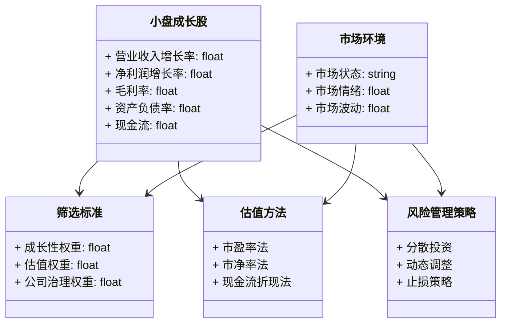

                 


# 彼得林奇的"小盘成长股"在不同市场环境下的筛选策略

> 关键词：小盘成长股、彼得·林奇、投资策略、市场环境、风险管理

> 摘要：本文深入探讨了彼得·林奇在不同市场环境下筛选小盘成长股的策略，分析了小盘成长股的定义、特点、筛选标准与方法，以及在不同市场环境下的动态调整策略。通过实际案例分析和系统架构设计，为投资者提供了实用的筛选方法和风险管理方案。

---

## 第一部分: 小盘成长股的定义与特点

### 第1章: 小盘成长股的定义与特点

#### 1.1 小盘成长股的定义
小盘成长股是指市值较小但具备较高成长潜力的股票。这类股票通常来自新兴行业或中小型公司，具有较高的增长空间和较低的估值倍数。彼得·林奇是小盘成长股投资领域的代表人物之一，他通过深入研究和长期持有优质小盘成长股，取得了卓越的投资业绩。

**核心要素：**
- **市场规模**：公司市值较小，通常在10亿到50亿美元之间。
- **成长性**：营业收入和净利润持续增长，年增长率一般在15%以上。
- **估值**：市盈率（P/E）和市净率（P/B）相对合理，具有较高的性价比。

#### 1.2 小盘成长股的特点
小盘成长股具有以下显著特点：
- **高增长潜力**：公司处于成长阶段，营业收入和净利润持续增长。
- **低估值优势**：相对于其成长潜力，估值较低，具有较大的上涨空间。
- **高风险高回报**：由于公司规模较小，抗风险能力较弱，市场波动较大。
- **行业集中**：多集中在新兴行业或朝阳产业，如科技、医疗、消费等。

#### 1.3 彼得·林奇与小盘成长股
彼得·林奇是小盘成长股投资的鼻祖，他的投资理念强调：
- **深入研究**：通过基本面分析，寻找具有持续增长潜力的公司。
- **长期持有**：买入优质小盘成长股后，长期持有，等待其成长。
- **分散投资**：通过分散投资降低风险，同时抓住多个成长机会。

### 第2章: 不同市场环境下的投资策略

#### 2.1 市场环境的分类
市场环境可以分为三种主要类型：
1. **牛市环境**：市场整体上涨，投资者情绪乐观。
2. **熊市环境**：市场整体下跌，投资者情绪悲观。
3. **震荡市环境**：市场波动较大，缺乏明确趋势。

#### 2.2 不同市场环境下的小盘成长股筛选策略
- **牛市环境下的筛选策略**：
  - 重点筛选具有高成长潜力的公司，关注营业收入和净利润的持续增长。
  - 估值可以适当放宽，但需确保公司具有合理的市盈率和市净率。
  - 偏好具有行业龙头地位的公司，以降低风险。

- **熊市环境下的筛选策略**：
  - 重点筛选估值低、基本面稳定的公司，关注市盈率和市净率的双重优势。
  - 优先选择具有较强抗风险能力的公司，如现金流充裕、负债率低。
  - 建议分散投资，降低市场波动带来的风险。

- **震荡市环境下的筛选策略**：
  - 重点筛选具有防御性特征的公司，如稳定的现金流和较高的分红率。
  - 适当关注行业周期性，选择处于上升周期的行业。
  - 灵活调整持仓结构，根据市场波动动态调整仓位。

#### 2.3 市场环境变化对小盘成长股的影响
- **市场规模**：市场环境变化会影响小盘成长股的市场规模，尤其是在牛市中，小盘股可能被快速推高，但在熊市中可能面临较大的估值压力。
- **成长性**：市场环境变化会影响小盘成长股的成长性，尤其是在经济下行周期，部分公司可能面临增长放缓的风险。
- **估值与风险**：市场环境变化对小盘成长股的估值影响较大，尤其是在牛市中，估值可能被高估，而在熊市中，估值可能被低估。

---

## 第二部分: 小盘成长股的筛选标准与方法

### 第3章: 小盘成长股的筛选标准

#### 3.1 财务指标分析
小盘成长股的筛选需要结合财务指标进行综合评估：
- **营业收入增长率**：衡量公司成长性的重要指标，通常要求年增长率在15%以上。
- **净利润率**：反映公司盈利能力，通常要求净利润率高于行业平均水平。
- **毛利率**：衡量公司产品盈利能力，通常要求毛利率较高且稳定。
- **资产负债率**：衡量公司财务健康状况，通常要求资产负债率低于50%。
- **现金流**：现金流是公司健康发展的基石，通常要求经营活动现金流为正。

#### 3.2 行业地位与竞争优势
- **行业地位**：公司是否在行业中占据领先地位，是否具有竞争优势。
- **竞争优势**：公司是否具有独特的竞争优势，如品牌、技术、成本等。
- **行业前景**：行业是否具有较大的增长空间，是否处于朝阳产业。

#### 3.3 公司治理
- **管理团队**：公司管理团队是否具有丰富的经验和良好的声誉。
- **公司治理结构**：公司治理是否透明、规范，是否存在较大的关联交易风险。
- **分红政策**：公司是否具有稳定的分红政策，是否注重股东回报。

### 第4章: 小盘成长股的筛选方法

#### 4.1 基于财务指标的筛选方法
- **筛选流程**：
  1. 筛选营业收入和净利润持续增长的公司。
  2. 筛选毛利率较高且稳定的公司。
  3. 筛选资产负债率较低的公司。
  4. 筛选经营活动现金流为正的公司。
- **示例**：
  以某科技公司为例，假设其营业收入增长率高达25%，净利润率为15%，毛利率为60%，资产负债率为30%，经营活动现金流为正，符合上述筛选标准。

#### 4.2 基于行业分析的筛选方法
- **行业分析**：
  1. 研究行业发展趋势，选择处于上升周期的行业。
  2. 分析行业竞争格局，选择具有竞争优势的公司。
  3. 关注行业政策变化，选择符合政策支持的行业。
- **示例**：
  在医疗行业，选择具有较高研发能力、市场占有率较高的公司，如某创新药公司。

#### 4.3 基于公司治理的筛选方法
- **公司治理分析**：
  1. 研究公司管理团队的背景和经验。
  2. 分析公司治理结构的透明度和规范性。
  3. 关注公司的分红政策和股东回报。
- **示例**：
  某公司管理团队经验丰富，治理结构透明，且有稳定的分红政策，符合公司治理筛选标准。

### 第5章: 动态调整筛选策略

#### 5.1 不同市场环境下筛选标准的动态调整
- **牛市环境**：
  - 适当放宽估值标准，关注高成长潜力的公司。
  - 增加对行业龙头公司的关注。
- **熊市环境**：
  - 严格控制估值，重点关注低估值、高分红的公司。
  - 偏好具有较强抗风险能力的公司。
- **震荡市环境**：
  - 灵活调整估值和成长性的权重，关注防御性特征的公司。
  - 根据市场波动动态调整持仓结构。

#### 5.2 筛选标准的权重调整
- **牛市环境**：
  - 成长性权重：60%
  - 估值权重：30%
  - 公司治理权重：10%
- **熊市环境**：
  - 估值权重：60%
  - 成长性权重：20%
  - 公司治理权重：20%
- **震荡市环境**：
  - 估值权重：40%
  - 成长性权重：40%
  - 公司治理权重：20%

#### 5.3 筛选策略的实时更新与优化
- **实时更新**：
  - 定期更新财务数据和行业分析，确保筛选标准的准确性。
  - 根据市场变化及时调整筛选标准和权重。
- **优化策略**：
  - 通过历史回测优化筛选策略，确保策略的有效性。
  - 不断总结经验，优化筛选流程。

---

## 第三部分: 小盘成长股的估值方法与风险管理

### 第6章: 小盘成长股的估值方法

#### 6.1 估值方法概述
- **市盈率法**：适用于成长性较强的公司，通常使用未来盈利预测进行估值。
- **市净率法**：适用于资产重的公司，如制造业和房地产公司。
- **现金流折现法**：适用于具有稳定现金流的公司，如公用事业和成熟企业。

#### 6.2 不同市场环境下估值方法的适用性
- **牛市环境**：
  - 市盈率法：由于市场情绪乐观，未来盈利预测可能被高估，需谨慎使用。
  - 市净率法：适用于资产重的公司，具有较高的防御性。
- **熊市环境**：
  - 市盈率法：需结合历史盈利数据进行估值，避免未来盈利预测的不确定性。
  - 现金流折现法：适用于现金流稳定的公司，具有较高的防御性。
- **震荡市环境**：
  - 综合使用多种估值方法，根据市场波动调整估值权重。

#### 6.3 估值中的常见误区与注意事项
- **高估与低估的风险**：避免过度依赖单一估值方法，需结合多种方法进行交叉验证。
- **市场情绪对估值的影响**：在牛市中，市场情绪可能推高估值，需警惕泡沫风险。
- **估值模型的局限性**：估值模型无法完全预测未来市场变化，需结合市场环境进行动态调整。

### 第7章: 小盘成长股投资的风险管理

#### 7.1 风险管理的重要性
- **市场风险**：小盘成长股受市场波动影响较大，需通过分散投资降低风险。
- **流动性风险**：小盘股流动性较低，可能面临变现困难。
- **公司风险**：公司基本面变化可能影响股价，需通过深入研究降低风险。

#### 7.2 风险管理的具体措施
- **分散投资**：通过投资多只小盘成长股分散风险，避免过度集中。
- **动态调整**：根据市场环境变化及时调整持仓结构，降低风险。
- **止损策略**：设定止损点，避免亏损过大。
- **仓位控制**：根据市场环境和自身风险承受能力，合理控制仓位。

---

## 第四部分: 小盘成长股投资的系统架构设计

### 第8章: 系统功能设计

#### 8.1 系统功能模块
- **数据采集模块**：采集小盘成长股的财务数据、行业数据和市场数据。
- **筛选模块**：根据筛选标准和权重进行综合评估，筛选出符合条件的小盘成长股。
- **估值模块**：根据市场环境选择合适的估值方法，对小盘成长股进行估值。
- **风险管理模块**：根据市场环境和持仓情况，动态调整风险管理策略。

#### 8.2 领域模型类图


#### 8.3 系统架构图


#### 8.4 接口设计与交互
- **接口设计**：
  - 数据采集模块提供API接口，供前端调用。
  - 筛选模块提供筛选结果接口，供前端展示。
  - 估值模块提供估值结果接口，供前端展示。
  - 风险管理模块提供风险管理建议接口，供前端展示。

- **交互流程**：
  1. 前端用户输入筛选条件和市场环境。
  2. 数据采集模块根据输入条件采集数据。
  3. 数据存储模块存储采集的数据。
  4. 筛选模块根据筛选标准进行筛选，返回筛选结果。
  5. 估值模块根据估值方法进行估值，返回估值结果。
  6. 风险管理模块根据市场环境和持仓情况，返回风险管理建议。
  7. 前端展示筛选结果、估值结果和风险管理建议。

---

## 第五部分: 项目实战与总结

### 第9章: 项目实战

#### 9.1 环境安装与配置
- **工具安装**：
  - 数据采集工具：网络爬虫工具（如Python的requests库）。
  - 数据分析工具：Python的pandas库。
  - 数据可视化工具：Python的matplotlib库。
- **数据源**：
  - 财务数据：公司财报数据。
  - 行业数据：行业研究报告。
  - 市场数据：股票价格、市场指数等。

#### 9.2 核心实现源代码
```python
import pandas as pd
import requests

def get_financial_data(company):
    # 网络爬虫获取公司财务数据
    url = f"https://finance.yahoo.com/quote/{company}/financials"
    response = requests.get(url)
    data = pd.read_html(response.text)
    return data

def screen_growth_stocks(financial_data, market_environment):
    # 根据筛选标准筛选小盘成长股
    selected_stocks = []
    for company in financial_data:
        if (company['营业收入增长率'] > 15 and 
            company['净利润增长率'] > 10 and 
            company['毛利率'] > 50 and 
            company['资产负债率'] < 50):
            selected_stocks.append(company)
    return selected_stocks

def calculate_valuation(selected_stocks, market_environment):
    # 根据市场环境选择合适的估值方法
    for stock in selected_stocks:
        if market_environment == 'bull':
            # 牛市环境，使用市盈率法
            stock['估值'] = stock['未来盈利预测'] * stock['市盈率']
        elif market_environment == 'bear':
            # 熊市环境，使用市净率法
            stock['估值'] = stock['资产总额'] / stock['市净率']
        else:
            # 震荡市环境，使用现金流折现法
            stock['估值'] = stock['未来现金流'] / stock['折现率']
    return selected_stocks

def risk_management(selected_stocks, market_environment):
    # 根据市场环境动态调整风险管理策略
    if market_environment == 'bull':
        # 牛市环境，分散投资
        return selected_stocks[:10]
    elif market_environment == 'bear':
        # 熊市环境，降低仓位
        return selected_stocks[:5]
    else:
        # 震荡市环境，动态调整
        return selected_stocks[:8]

# 示例代码
financial_data = get_financial_data('AAPL')
selected_stocks = screen_growth_stocks(financial_data, 'bull')
valuated_stocks = calculate_valuation(selected_stocks, 'bull')
risk_managed_stocks = risk_management(valuated_stocks, 'bull')

print("筛选结果：", selected_stocks)
print("估值结果：", evaluated_stocks)
print("风险管理结果：", risk_managed_stocks)
```

#### 9.3 代码解读与分析
- **数据采集模块**：使用网络爬虫工具获取公司财务数据。
- **筛选模块**：根据筛选标准筛选出符合条件的小盘成长股。
- **估值模块**：根据市场环境选择合适的估值方法，计算股票的估值。
- **风险管理模块**：根据市场环境动态调整风险管理策略，降低投资风险。

#### 9.4 实际案例分析
- **案例背景**：
  假设当前市场环境为牛市，我们需要筛选出具有高成长潜力的小盘成长股。
- **筛选过程**：
  1. 数据采集：获取某科技公司（如AAPL）的财务数据。
  2. 筛选：根据筛选标准筛选出符合条件的公司。
  3. 估值：使用市盈率法进行估值。
  4. 风险管理：根据牛市环境，分散投资，选择前10名股票。
- **结果分析**：
  通过代码筛选出的股票具有较高的成长性和合理的估值，符合小盘成长股的特征。

---

## 第六部分: 总结与展望

### 第10章: 总结与展望

#### 10.1 总结
- 本文深入探讨了彼得·林奇的小盘成长股筛选策略，分析了不同市场环境下的筛选方法和风险管理措施。
- 通过系统架构设计和项目实战，为投资者提供了实用的筛选方法和风险管理方案。

#### 10.2 展望
- **未来研究方向**：
  - 探讨小盘成长股在不同经济周期下的表现。
  - 研究人工智能技术在小盘成长股筛选中的应用。
  - 探索全球化背景下小盘成长股的投资机会。

#### 10.3 最佳实践 Tips
- **长期持有优质小盘成长股**：选择具有持续增长潜力的公司，长期持有，避免频繁交易。
- **分散投资**：通过分散投资降低风险，同时抓住多个成长机会。
- **动态调整策略**：根据市场环境变化及时调整筛选标准和风险管理策略。

---

## 作者：AI天才研究院/AI Genius Institute & 禅与计算机程序设计艺术/Zen And The Art of Computer Programming

