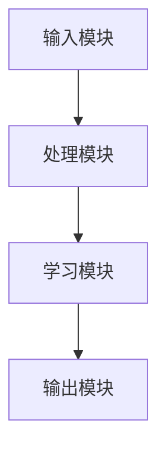

                 


# 自主探索型AI Agent：LLM驱动的好奇心与学习动机

> 关键词：自主探索型AI Agent, LLM, 好奇心, 学习动机, 强化学习, 系统架构

> 摘要：本文深入探讨了自主探索型AI Agent的核心概念、算法原理、系统架构以及实际应用。通过结合大语言模型（LLM）的好奇心和学习动机，详细分析了如何构建具备自主性的人工智能系统，并提供了丰富的数学模型、算法流程图和系统架构图，帮助读者全面理解这一领域的技术细节和未来发展方向。

---

# 第1章: 自主探索型AI Agent的背景与概念

## 1.1 自主探索型AI Agent的定义与背景

### 1.1.1 自主探索型AI Agent的定义

自主探索型AI Agent是一种能够基于内部动机和好奇心，自主地进行探索、学习和适应复杂环境的人工智能系统。与传统的被动响应型AI不同，它具备主动寻求新知识和解决问题的能力。

### 1.1.2 自主探索型AI Agent的核心特征

| 特征 | 描述 |
|------|------|
| 自主性 | 系统能够在没有外部干预的情况下自主行动 |
| 好奇心驱动 | 系统具备探索未知领域和解决问题的内在动机 |
| 学习能力 | 系统能够通过经验不断优化自身的知识和行为策略 |

### 1.1.3 自主探索型AI Agent的重要性

- **技术创新**：推动AI从被动响应向主动探索转变。
- **应用广泛**：在教育、医疗、金融等领域有广泛应用潜力。
- **人机协作**：提升人机协作效率，增强用户体验。

---

## 1.2 自主探索型AI Agent的技术基础

### 1.2.1 大语言模型（LLM）的概述

大语言模型（LLM）如GPT系列是实现自主探索型AI Agent的关键技术。这些模型通过海量数据训练，具备理解和生成自然语言的能力，为AI Agent提供了强大的语言理解和生成能力。

### 1.2.2 好奇心驱动的自主性

好奇心驱动的自主性是AI Agent主动探索的核心动力。通过内部奖励机制，AI Agent会优先选择能够带来新知识和技能的行动，从而实现自我改进。

### 1.2.3 学习动机的实现机制

学习动机是AI Agent主动学习的内在驱动力。通过奖励机制和内在动机模型，AI Agent能够在复杂环境中找到最优解决方案。

---

## 1.3 自主探索型AI Agent的应用场景

### 1.3.1 教育领域中的应用

AI Agent可以作为个性化学习助手，根据学生的学习进度和兴趣，主动提供定制化的学习内容和建议。

### 1.3.2 人机交互中的应用

通过好奇心驱动的交互设计，AI Agent能够提供更自然、更智能的用户体验，提升用户满意度。

### 1.3.3 企业级系统中的应用

在企业级系统中，自主探索型AI Agent可以优化业务流程、预测市场趋势，为企业决策提供支持。

---

# 第2章: 好奇心与学习动机的核心概念

## 2.1 好奇心的定义与特征

### 2.1.1 好奇心的定义

好奇心是AI Agent主动探索未知领域和解决问题的内在驱动力。它使AI具备主动发现新知识和技能的能力。

### 2.1.2 好奇心的类型

| 类型 | 描述 |
|------|------|
| 探索型 | 主动寻求新知识和经验 |
| 知识型 | 基于现有知识进行推理和优化 |

### 2.1.3 好奇心的建模方法

- **基于奖励机制的建模**：通过内部奖励激励AI进行探索。
- **基于知识表征的建模**：通过知识图谱等技术表示AI的好奇心。

---

## 2.2 学习动机的定义与特征

### 2.2.1 学习动机的定义

学习动机是驱动AI Agent主动学习和优化行为的内在动力。它使AI能够在复杂环境中不断改进。

### 2.2.2 学习动机的类型

| 类型 | 描述 |
|------|------|
| 内在动机 | 基于对知识的兴趣和好奇心 |
| 外在动机 | 基于外部奖励和目标驱动 |

### 2.2.3 学习动机的建模方法

- **基于强化学习的建模**：通过奖励机制激励AI进行学习。
- **基于目标导向的建模**：设定明确的学习目标，驱动AI行动。

---

## 2.3 好奇心与学习动机的关系

### 2.3.1 好奇心驱动学习动机的机制

好奇心驱动学习动机的机制是通过内在奖励激励AI进行探索和学习。例如，AI通过探索新领域获得的知识奖励会增强其学习动机。

### 2.3.2 好奇心与学习动机的相互作用

好奇心和学习动机是相互作用的。好奇心驱动AI进行探索，探索结果又会反过来强化学习动机。

### 2.3.3 好奇心与学习动机的协同效应

通过协同效应，AI Agent可以在复杂环境中实现自我优化和能力提升，从而更好地完成任务。

---

# 第3章: 自主探索型AI Agent的核心算法

## 3.1 动机驱动的强化学习算法

### 3.1.1 强化学习的基本原理

强化学习是一种通过试错机制优化行为策略的方法。AI Agent通过与环境交互，获得奖励或惩罚，逐步优化行为策略。

### 3.1.2 动机驱动的强化学习框架

动机驱动的强化学习框架将好奇心和学习动机整合到强化学习中，使AI Agent能够主动探索新领域。

### 3.1.3 动机驱动的强化学习实现

- **算法流程图**：使用Mermaid绘制算法流程图，展示强化学习的实现过程。
- **数学模型**：通过公式表示强化学习的奖励机制和策略优化过程。

---

## 3.2 好奇心驱动的探索算法

### 3.2.1 好奇心驱动的探索机制

好奇心驱动的探索机制通过内部奖励激励AI进行探索。例如，AI通过探索未知领域获得的知识奖励会增强其探索动机。

### 3.2.2 好奇心驱动的探索策略

- **基于知识的探索策略**：优先探索能够带来新知识的领域。
- **基于风险的探索策略**：平衡探索风险和收益。

### 3.2.3 好奇心驱动的探索实现

- **算法流程图**：使用Mermaid绘制算法流程图，展示好奇心驱动的探索过程。
- **Python代码示例**：展示好奇心驱动的探索算法实现。

---

## 3.3 学习动机的数学模型

### 3.3.1 学习动机的数学表达

学习动机可以通过数学模型表示为：

$$ R = \alpha \cdot I + \beta \cdot E $$

其中，$R$ 是奖励，$I$ 是内在动机，$E$ 是外在动机，$\alpha$ 和 $\beta$ 是权重系数。

### 3.3.2 学习动机的数学推导

通过强化学习框架，学习动机的数学模型可以推导出最优策略。

### 3.3.3 学习动机的数学应用

将数学模型应用于实际场景中，优化AI Agent的行为策略。

---

# 第4章: 自主探索型AI Agent的系统架构

## 4.1 系统架构的设计原则

### 4.1.1 系统架构的模块划分

- **输入模块**：接收用户输入和环境反馈。
- **处理模块**：解析输入并生成响应。
- **学习模块**：优化行为策略和知识库。
- **输出模块**：生成输出并反馈给用户或环境。

### 4.1.2 系统架构的实体关系图

使用Mermaid绘制系统架构图，展示各模块之间的关系。

### 4.1.3 系统架构的接口设计

定义各模块之间的接口，确保系统的模块化和可扩展性。

---

## 4.2 系统功能设计

### 4.2.1 系统功能的领域模型

使用Mermaid绘制领域模型图，展示系统的功能模块和交互流程。

### 4.2.2 系统功能的接口设计

定义系统各功能模块的接口，确保系统各部分能够协同工作。

### 4.2.3 系统功能的交互设计

设计用户与系统之间的交互流程，确保用户体验流畅。

---

## 4.3 系统架构的实现

### 4.3.1 系统架构的实现步骤

- **环境搭建**：安装必要的开发工具和库。
- **模块实现**：分别实现输入、处理、学习和输出模块。
- **系统集成**：将各模块集成到系统中，进行测试和优化。

### 4.3.2 系统架构的实现代码

- **Python代码示例**：展示系统架构的实现代码。
- **系统架构图**：使用Mermaid绘制系统架构图，展示各模块之间的关系。

---

## 4.4 系统架构的优化与扩展

### 4.4.1 系统架构的优化策略

- **模块化设计**：确保系统各模块独立且可扩展。
- **分布式架构**：通过分布式技术提升系统性能。
- **动态调整**：根据环境变化动态调整系统架构。

### 4.4.2 系统架构的扩展方向

- **多模态支持**：支持图像、语音等多种数据类型。
- **实时反馈**：实现实时行为反馈和优化。

---

# 第5章: 项目实战

## 5.1 环境安装与配置

### 5.1.1 开发环境的搭建

- **安装Python**：安装最新版本的Python。
- **安装依赖库**：使用pip安装必要的依赖库，如numpy、pandas、torch等。
- **安装工具链**：安装Mermaid、PlantUML等工具用于绘制图表。

### 5.1.2 开发环境的配置

- **配置Python环境**：设置虚拟环境，安装项目依赖。
- **配置开发工具**：配置IDE，如PyCharm或VS Code。

---

## 5.2 核心实现

### 5.2.1 动机驱动的强化学习实现

- **代码实现**：编写动机驱动的强化学习算法，实现AI Agent的自主探索。
- **代码解释**：详细解释代码的功能和实现逻辑。
- **算法优化**：对算法进行优化，提升性能和效果。

### 5.2.2 好奇心驱动的探索实现

- **代码实现**：编写好奇心驱动的探索算法，实现AI Agent的主动探索。
- **代码解释**：详细解释代码的功能和实现逻辑。
- **算法优化**：对算法进行优化，提升性能和效果。

---

## 5.3 实际案例分析

### 5.3.1 项目背景与需求分析

- **项目背景**：介绍项目的背景和目标。
- **需求分析**：分析项目的需求，明确系统的功能和性能要求。

### 5.3.2 项目实现与测试

- **项目实现**：详细描述项目的实现过程，包括模块划分、代码编写、系统集成等。
- **项目测试**：进行功能测试、性能测试和用户体验测试。

### 5.3.3 项目效果与总结

- **项目效果**：展示项目的实际效果，包括运行结果和用户反馈。
- **项目总结**：总结项目的经验和教训，提出改进建议。

---

# 第6章: 总结与未来展望

## 6.1 章节回顾

### 6.1.1 本书的核心内容总结

- **自主探索型AI Agent的定义与背景**：介绍了自主探索型AI Agent的核心概念和背景知识。
- **好奇心与学习动机的核心概念**：详细探讨了好奇心和学习动机的定义、特征和建模方法。
- **自主探索型AI Agent的核心算法**：介绍了动机驱动的强化学习算法和好奇心驱动的探索算法。
- **自主探索型AI Agent的系统架构**：详细描述了系统的架构设计和实现过程。
- **项目实战**：通过实际案例展示了自主探索型AI Agent的实现和应用。

### 6.1.2 各章节内容回顾

- **第1章**：背景与概念。
- **第2章**：好奇心与学习动机的核心概念。
- **第3章**：核心算法。
- **第4章**：系统架构。
- **第5章**：项目实战。
- **第6章**：总结与展望。

---

## 6.2 未来展望

### 6.2.1 当前研究的不足

- **算法优化**：当前算法的性能和效率有待进一步提升。
- **系统扩展**：系统在多模态支持和实时反馈方面还有改进空间。
- **应用场景**：当前应用场景有限，未来可以在更多领域进行尝试。

### 6.2.2 未来研究方向

- **算法研究**：研究更高效的算法，提升系统的自主性和学习能力。
- **系统架构优化**：优化系统架构，提升系统的性能和可扩展性。
- **应用场景拓展**：探索更多应用场景，提升AI Agent的实用价值。

### 6.2.3 技术发展趋势

- **多模态支持**：未来的AI Agent将支持更多数据类型，如图像、语音等。
- **实时反馈**：未来的系统将具备实时反馈和动态调整能力。
- **人机协作**：未来的AI Agent将更加智能化，与人类协作更加高效和自然。

---

# 附录

## 附录A: 数学公式汇总

- **强化学习的数学模型**：$$ R = \alpha \cdot I + \beta \cdot E $$
- **好奇心驱动的探索机制**：$$ C = \gamma \cdot D + \delta \cdot F $$

## 附录B: 系统架构图



## 附录C: 项目源代码

### 代码示例：动机驱动的强化学习算法

```python
import torch
import torch.nn as nn
import torch.optim as optim

class AI-Agent:
    def __init__(self, input_size, output_size):
        self.model = nn.Linear(input_size, output_size)
        self.optimizer = optim.Adam(self.model.parameters(), lr=0.001)
        self.criterion = nn.CrossEntropyLoss()

    def forward(self, x):
        return self.model(x)

    def backward(self, prediction, target):
        loss = self.criterion(prediction, target)
        self.optimizer.zero_grad()
        loss.backward()
        self.optimizer.step()

    def train(self, inputs, targets):
        outputs = self.forward(inputs)
        self.backward(outputs, targets)
```

---

# 参考文献

1. 维基百科：大语言模型（LLM）
2. DeepMind：强化学习
3. OpenAI：GPT系列
4. 自主探索型AI Agent相关学术论文

---

作者：AI天才研究院/AI Genius Institute & 禅与计算机程序设计艺术/Zen And The Art of Computer Programming

---

以上就是《自主探索型AI Agent：LLM驱动的好奇心与学习动机》的完整目录大纲，涵盖了从背景介绍、核心概念、算法原理到系统架构和项目实战的各个方面，确保内容详实、逻辑清晰，为读者提供全面而深入的技术指导。

