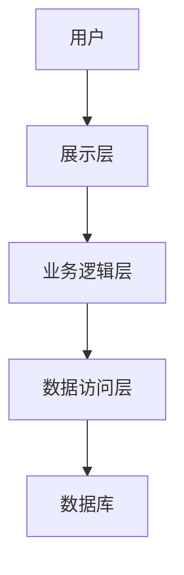
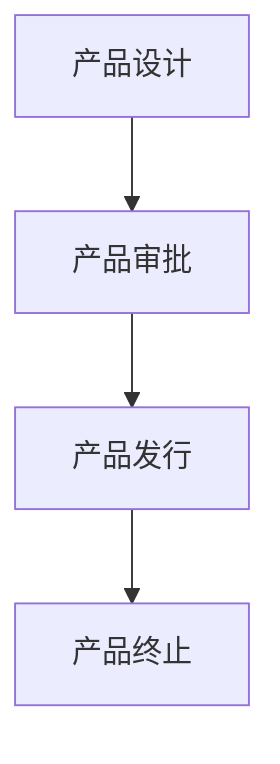
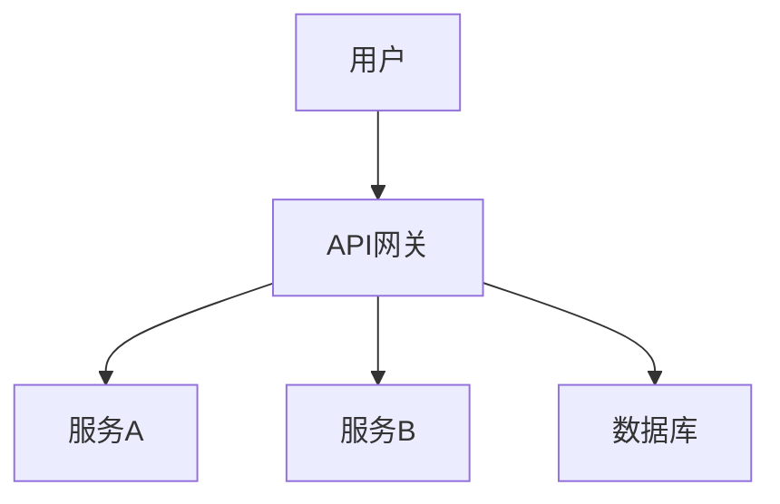
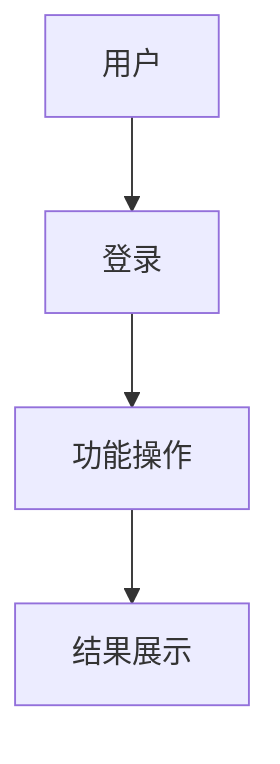

                 


```markdown
# 《金融产品生命周期管理自动化平台》

## 关键词：
金融产品生命周期、自动化管理、系统架构设计、算法原理、风险管理、项目实战

## 摘要：
金融产品生命周期管理是金融机构日常运营中的核心任务之一，传统的管理方式存在效率低、数据孤岛、风险高等问题。本文介绍了一种基于数字化技术的金融产品生命周期管理自动化平台，该平台通过模块化设计和自动化流程，实现了从产品设计、审批、发行到终止的全生命周期管理。文章详细阐述了平台的系统架构、核心算法、项目实现和实际应用案例，展示了如何利用技术手段提升金融产品管理的效率和安全性。

---

# 第一部分: 金融产品生命周期管理自动化平台背景与概念

## 第1章: 金融产品生命周期管理概述

### 1.1 金融产品生命周期的定义与特点
#### 1.1.1 金融产品的定义与分类
- 金融产品是金融机构提供的各种服务或工具，包括存款、贷款、证券、保险、基金等。
- 根据功能和风险，金融产品可以分为低风险（如存款）、中风险（如债券）和高风险（如股票）类别。

#### 1.1.2 金融产品生命周期的阶段划分
- 产品设计阶段：需求分析、产品定义、风险评估。
- 产品审批阶段：合规性检查、风险定价、审批流程。
- 产品发行阶段：市场推广、客户销售、产品上线。
- 产品终止阶段：产品下架、客户通知、资产清算。

#### 1.1.3 金融产品生命周期管理的重要性
- 有效的生命周期管理可以提高产品上线效率，降低运营成本。
- 通过全生命周期管理，金融机构可以更好地控制风险，提升客户满意度。

### 1.2 传统金融产品管理的痛点
#### 1.2.1 人工操作的低效性
- 传统模式下，产品设计、审批、发行等环节依赖大量人工操作，效率低下。
- 数据分散在不同系统中，导致信息孤岛，难以实现高效协同。

#### 1.2.2 数据孤岛与信息不透明
- 不同部门之间数据不通，导致信息不透明，难以进行统一管理。
- 缺乏实时数据监控，难以快速响应市场变化。

#### 1.2.3 风险控制的挑战
- 传统模式下，风险评估和控制依赖人工经验，存在主观性和滞后性。
- 难以实现对产品全生命周期的风险监控和预警。

### 1.3 金融产品生命周期管理自动化的必要性
#### 1.3.1 自动化管理的优势
- 提高管理效率，减少人工干预。
- 实现数据的实时共享和协同，提升信息透明度。
- 提升风险控制能力，通过自动化监控和预警，降低风险发生概率。

#### 1.3.2 数字化转型的行业趋势
- 金融机构纷纷拥抱数字化转型，利用技术手段提升竞争力。
- 自动化管理是数字化转型的重要组成部分，能够帮助金融机构实现降本增效。

#### 1.3.3 平台化管理的未来方向
- 通过平台化管理，金融机构可以实现对产品全生命周期的统一管理。
- 平台化管理能够支持创新业务的快速上线，增强市场响应能力。

## 第2章: 金融产品生命周期管理自动化平台的概念与价值

### 2.1 平台的核心概念
#### 2.1.1 平台的功能模块
- 产品设计模块：支持产品需求分析、风险评估和定价。
- 产品审批模块：实现合规性检查和自动化审批流程。
- 产品发行模块：提供市场推广和客户销售支持。
- 产品终止模块：管理产品下架和客户通知。

#### 2.1.2 平台的用户角色
- 产品设计人员：负责产品需求和技术实现。
- 产品审批人员：负责合规性检查和风险评估。
- 产品发行人：负责市场推广和客户销售。
- 客户：通过平台购买和管理金融产品。

#### 2.1.3 平台的业务流程
- 产品设计：需求分析 → 风险评估 → 产品定义。
- 产品审批：合规性检查 → 风险定价 → 审批通过。
- 产品发行：市场推广 → 客户销售 → 产品上线。
- 产品终止：产品下架 → 客户通知 → 资产清算。

### 2.2 平台的价值体现
#### 2.2.1 提升管理效率
- 通过自动化流程减少人工干预，提高管理效率。
- 实现数据的实时共享和协同，提升信息透明度。

#### 2.2.2 降低运营成本
- 通过自动化管理减少人工成本。
- 优化资源分配，降低运营成本。

#### 2.2.3 增强风险控制能力
- 通过自动化监控和预警，实时识别和处理风险。
- 提高风险评估的准确性和及时性。

### 2.3 平台的目标与定位
#### 2.3.1 平台的目标
- 实现金融产品全生命周期的自动化管理。
- 提供高效、安全、可靠的管理解决方案。

#### 2.3.2 平台的市场定位
- 成为金融机构数字化转型的重要工具。
- 提供行业领先的自动化管理解决方案。

#### 2.3.3 平台的未来发展
- 不断优化和扩展平台功能，满足更多金融产品管理需求。
- 推动行业自动化管理的普及和发展。

---

# 第二部分: 金融产品生命周期管理自动化平台的系统架构

## 第3章: 系统架构设计

### 3.1 系统功能模块设计
#### 3.1.1 产品设计模块
- 需求分析：支持用户输入产品需求，自动生成需求文档。
- 风险评估：基于历史数据和模型，评估产品风险。
- 产品定义：支持用户定义产品参数和属性。

#### 3.1.2 产品审批模块
- 合规性检查：自动检查产品是否符合监管要求。
- 风险定价：基于风险评估结果，自动定价。
- 审批流程：支持自动化审批流程，减少人工干预。

#### 3.1.3 产品发行模块
- 市场推广：自动生成推广方案和渠道。
- 客户销售：支持在线销售和客户通知。
- 产品上线：自动化上线流程，减少人工操作。

#### 3.1.4 产品终止模块
- 产品下架：自动化下架流程，确保产品退出市场。
- 客户通知：自动通知客户产品终止。
- 资产清算：自动化资产清算流程，确保客户资金安全。

### 3.2 系统架构设计
#### 3.2.1 分层架构设计
- 展示层：用户界面，支持用户操作。
- 业务逻辑层：实现业务逻辑，处理用户请求。
- 数据访问层：实现数据的存储和访问。

#### 3.2.2 微服务架构设计
- 采用微服务架构，实现模块化设计。
- 每个功能模块独立运行，支持高可用性。

#### 3.2.3 数据库设计
- 使用关系型数据库，实现数据的结构化存储。
- 设计合理的数据表结构，支持高效查询和操作。

### 3.3 系统接口设计
#### 3.3.1 API接口定义
- 使用RESTful API，实现系统间的数据交互。
- 支持JSON格式数据交换，确保数据传输的高效性。

#### 3.3.2 接口调用流程
- 定义接口调用流程，确保系统间的协同工作。
- 使用API网关，实现接口的统一管理和鉴权。

#### 3.3.3 接口安全设计
- 使用JWT实现身份认证，确保接口的安全性。
- 配置访问控制策略，限制接口的访问权限。

## 第4章: 系统交互流程设计

### 4.1 用户角色与权限管理
#### 4.1.1 用户角色划分
- 系统管理员：负责系统配置和权限管理。
- 产品设计人员：负责产品需求和技术实现。
- 产品审批人员：负责合规性检查和风险评估。
- 产品发行人：负责市场推广和客户销售。
- 客户：通过平台购买和管理金融产品。

#### 4.1.2 权限分配策略
- 基于角色的权限控制，确保用户只能访问其权限范围内的功能。
- 支持细粒度权限控制，实现灵活的权限管理。

#### 4.1.3 用户操作流程
- 用户登录：通过用户名和密码进行身份认证。
- 功能操作：根据用户权限，展示相应的功能菜单。
- 操作日志：记录用户的操作记录，便于审计和追溯。

### 4.2 产品生命周期管理流程
#### 4.2.1 产品设计流程
- 用户输入产品需求，系统自动生成需求文档。
- 系统基于历史数据和模型，评估产品风险。
- 用户定义产品参数和属性，系统生成产品定义。

#### 4.2.2 产品审批流程
- 系统自动检查产品是否符合监管要求。
- 系统基于风险评估结果，自动定价。
- 审批人员确认审批结果，系统记录审批日志。

#### 4.2.3 产品发行流程
- 系统自动生成推广方案和渠道。
- 系统支持在线销售和客户通知。
- 系统自动化上线流程，减少人工操作。

#### 4.2.4 产品终止流程
- 系统自动化下架流程，确保产品退出市场。
- 系统自动通知客户产品终止。
- 系统自动化资产清算流程，确保客户资金安全。

---

## 第三部分: 金融产品生命周期管理自动化平台的算法原理

## 第5章: 算法原理讲解

### 5.1 算法概述
- 算法是平台的核心，用于实现风险评估、定价和预测。

### 5.2 算法选择
#### 5.2.1 风险评估算法
- 使用逻辑回归模型，基于客户特征和历史行为，预测客户违约概率。
- 使用XGBoost模型，基于特征工程，提升模型的准确性和稳定性。

#### 5.2.2 定价算法
- 使用随机森林模型，基于市场数据和产品特性，自动定价。
- 使用时间序列分析，预测产品生命周期中的价格波动。

#### 5.2.3 预测算法
- 使用LSTM模型，基于时间序列数据，预测市场趋势。
- 使用ARIMA模型，基于历史数据，预测产品销售量。

### 5.3 算法实现
#### 5.3.1 风险评估模型
- 逻辑回归模型：$$ P(Y=1|x) = \frac{e^{w \cdot x + b}}{1 + e^{w \cdot x + b}} $$
- XGBoost模型：使用梯度提升树，优化模型的准确性和稳定性。

#### 5.3.2 定价模型
- 随机森林模型：基于特征工程，实现产品的自动定价。
- 时间序列分析：使用历史数据，预测产品生命周期中的价格波动。

### 5.4 算法优化
#### 5.4.1 参数调优
- 使用网格搜索，优化模型的参数，提升模型性能。
- 使用交叉验证，评估模型的泛化能力，防止过拟合。

#### 5.4.2 特征选择
- 使用特征重要性分析，筛选出对模型影响最大的特征。
- 使用特征工程，对数据进行标准化、归一化等预处理，提升模型的性能。

#### 5.4.3 模型评估
- 使用准确率、召回率、F1分数等指标，评估模型的性能。
- 使用混淆矩阵，分析模型的分类效果。

---

## 第四部分: 金融产品生命周期管理自动化平台的项目实战

## 第6章: 项目实战

### 6.1 环境安装
- 安装Python、Jupyter Notebook、Pandas、NumPy、Scikit-learn、XGBoost、TensorFlow、PyTorch等工具。
- 安装Django或Flask框架，用于开发Web界面。
- 安装PostgreSQL或MySQL，用于存储数据。

### 6.2 核心代码实现
#### 6.2.1 风险评估模型
- 使用逻辑回归模型实现客户违约概率预测。
```python
from sklearn.linear_model import LogisticRegression
import pandas as pd

# 加载数据
data = pd.read_csv('customer_data.csv')
# 分离特征和标签
X = data.drop('label', axis=1)
y = data['label']

# 训练模型
model = LogisticRegression()
model.fit(X, y)
# 预测概率
proba = model.predict_proba(X)
# 输出结果
print(proba)
```

#### 6.2.2 定价模型
- 使用随机森林模型实现产品定价。
```python
from sklearn.ensemble import RandomForestRegressor
import pandas as pd

# 加载数据
data = pd.read_csv('product_data.csv')
# 分离特征和标签
X = data.drop('price', axis=1)
y = data['price']

# 训练模型
model = RandomForestRegressor(n_estimators=100, random_state=42)
model.fit(X, y)
# 预测价格
price = model.predict(X)
# 输出结果
print(price)
```

#### 6.2.3 预测模型
- 使用LSTM模型实现市场趋势预测。
```python
import numpy as np
from keras.models import Sequential
from keras.layers import LSTM, Dense

# 加载数据
data = np.array([...])  # 数据集
# 分离训练集和测试集
train_data = data[:700]
test_data = data[700:]

# 构建模型
model = Sequential()
model.add(LSTM(50, input_shape=(None, 1)))
model.add(Dense(1))
model.compile(loss='mean_squared_error', optimizer='adam')

# 训练模型
model.fit(train_data, epochs=50, batch_size=32, verbose=1)
# 预测结果
预测结果
预测结果
```

### 6.3 实际案例分析
- 某银行开发一个金融产品生命周期管理平台，使用上述算法实现产品风险评估和定价。
- 通过平台，银行实现了产品管理的自动化，提高了效率和准确性。

---

## 第五部分: 金融产品生命周期管理自动化平台的系统实现

## 第7章: 系统实现

### 7.1 系统架构图
- 使用Mermaid绘制系统架构图，展示系统的模块划分和交互流程。


### 7.2 功能模块图
- 使用Mermaid绘制功能模块图，展示系统的功能模块和交互流程。


### 7.3 系统接口设计
- 使用Mermaid绘制系统接口设计图，展示系统的API接口和调用流程。


### 7.4 系统交互流程图
- 使用Mermaid绘制系统交互流程图，展示系统的交互流程和用户操作。


---

## 第六部分: 金融产品生命周期管理自动化平台的总结与展望

## 第8章: 总结与展望

### 8.1 总结
- 本文介绍了金融产品生命周期管理自动化平台的背景、概念、系统架构、算法原理和项目实战。
- 平台通过模块化设计和自动化流程，实现了金融产品全生命周期的高效管理。

### 8.2 未来展望
- 进一步优化平台功能，支持更多类型的金融产品管理。
- 推动行业自动化管理的普及，提升金融机构的竞争力。

### 8.3 最佳实践 Tips
- 在实施平台前，充分评估自身需求和资源，选择合适的方案。
- 定期更新算法和模型，保持平台的准确性和有效性。
- 加强数据安全和隐私保护，确保平台的安全性和合规性。

---

## 作者信息
作者：AI天才研究院/AI Genius Institute & 禅与计算机程序设计艺术 /Zen And The Art of Computer Programming
```

