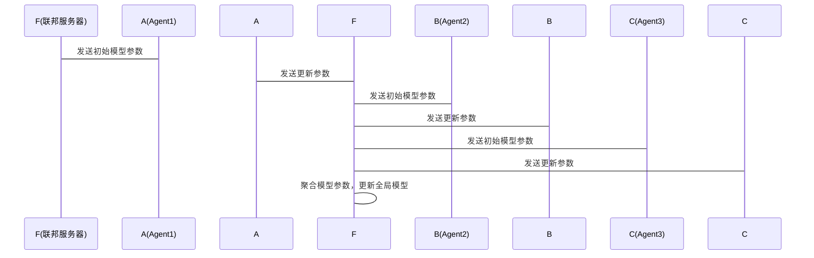

                 


# AI Agent的联邦学习：保护隐私的分布式LLM训练

> 关键词：AI Agent，联邦学习，分布式LLM，隐私保护，大语言模型

> 摘要：本文探讨了AI Agent在联邦学习中的应用，特别是如何在保护隐私的前提下进行分布式大语言模型（LLM）训练。文章从背景、核心概念、算法原理、系统架构、项目实战等多方面进行详细分析，深入探讨了隐私保护机制、联邦学习算法、系统设计与实现，最后结合实际案例展示了如何在分布式环境中训练LLM，同时保护数据隐私。

---

## 第一部分: AI Agent的联邦学习基础

### 第1章: AI Agent与联邦学习概述

#### 1.1 AI Agent的基本概念
- **1.1.1 AI Agent的定义与特点**
  - AI Agent是一种智能体，能够感知环境并采取行动以实现目标。
  - 具有自主性、反应性、目标导向性和社交性等特点。
  - 与传统AI系统相比，AI Agent更注重动态环境中的实时交互与决策。

- **1.1.2 AI Agent的核心功能与应用场景**
  - 核心功能：感知、推理、规划、学习和执行。
  - 应用场景：智能助手、机器人控制、自动驾驶、智能推荐系统等。

- **1.1.3 分布式AI Agent的背景与意义**
  - 分布式AI Agent能够协同工作，提高整体智能水平。
  - 在分布式环境中，AI Agent需要解决数据隐私、通信效率和协同决策等问题。

#### 1.2 联邦学习的基本概念
- **1.2.1 联邦学习的定义与特点**
  - 联邦学习是一种分布式机器学习技术，允许多个参与方在不共享原始数据的情况下协作训练模型。
  - 具有数据隐私保护、模型联合优化和分布式计算等特点。

- **1.2.2 联邦学习的核心机制与优势**
  - 核心机制：数据本地训练、模型参数同步、隐私保护。
  - 优势：保护数据隐私、降低计算成本、提升模型泛化能力。

- **1.2.3 联邦学习与传统分布式学习的对比**
  - 传统分布式学习：数据集中化，计算集中化。
  - 联邦学习：数据分散，模型参数共享，隐私保护。

#### 1.3 LLM的基本概念与特点
- **1.3.1 大语言模型的定义与技术特点**
  - 大语言模型是一种基于深度学习的自然语言处理模型，具有强大的文本理解和生成能力。
  - 技术特点：参数量大、训练数据丰富、模型结构复杂。

- **1.3.2 LLM在AI Agent中的应用**
  - AI Agent可以利用LLM进行自然语言处理任务，如对话生成、意图识别和文本摘要。
  - LLM为AI Agent提供了强大的语言理解和生成能力。

- **1.3.3 联邦学习在LLM训练中的作用**
  - 联邦学习可以用于分布式LLM训练，保护参与方的数据隐私。
  - 通过联邦学习，可以在不共享原始数据的情况下联合训练大语言模型。

#### 1.4 本章小结
- 本章介绍了AI Agent、联邦学习和大语言模型的基本概念及其在分布式训练中的作用。
- 强调了联邦学习在保护数据隐私的同时实现模型联合优化的重要性。

---

### 第2章: 联邦学习的核心概念与原理

#### 2.1 联邦学习的核心概念
- **2.1.1 联邦学习的参与者与角色**
  - 参与者：联邦学习中的各个数据持有方。
  - 角色：数据提供者、模型训练者、协调者。
  - 实体关系：通过联邦服务器进行模型参数同步和通信。

- **2.1.2 联邦学习中的数据分布与隐私保护**
  - 数据分布：数据分散在不同的参与方，每个参与方持有局部数据。
  - 隐私保护：通过差分隐私、同态加密等技术保护数据隐私。

- **2.1.3 联邦学习的通信机制与协议**
  - 通信机制：基于网络的通信，采用加密通道进行模型参数同步。
  - 协议：包括模型同步协议、数据交换协议和隐私保护协议。

- **2.1.4 实体关系图（Mermaid）**
  ```mermaid
  graph TD
    F(联邦服务器) --> A(Agent1)
    F --> B(Agent2)
    F --> C(Agent3)
  ```

#### 2.2 联邦学习的原理与流程
- **2.2.1 联邦学习的基本流程**
  1. 初始化：联邦服务器初始化全局模型参数。
  2. 分发模型：联邦服务器将模型参数分发给各个参与方。
  3. 本地训练：参与方基于本地数据训练模型，更新参数。
  4. 模型同步：参与方将更新后的模型参数发送给联邦服务器。
  5. 模型聚合：联邦服务器聚合所有参与方的模型参数，更新全局模型。
  6. 循环迭代：重复上述步骤，直到达到收敛条件。

- **2.2.2 联邦学习中的数据交换与模型更新**
  - 数据交换：仅交换模型参数，不共享原始数据。
  - 模型更新：基于参与方的局部梯度更新全局模型。

- **2.2.3 联邦学习的同步与异步模式**
  - 同步模式：所有参与方同时更新模型，同步完成后再进行参数聚合。
  - 异步模式：参与方可以异步更新模型，联邦服务器随时聚合最新参数。

#### 2.3 联邦学习中的隐私保护机制
- **2.3.1 数据隐私保护的核心原则**
  - 数据最小化：仅收集必要的数据。
  - 数据匿名化：对数据进行匿名化处理，防止身份识别。
  - 数据加密：采用加密技术保护数据传输和存储。

- **2.3.2 联邦学习中的隐私保护技术**
  - 差分隐私：在模型更新过程中添加噪声，保护数据隐私。
  - 同态加密：允许在加密数据上进行计算，保护数据隐私。

- **2.3.3 差分隐私与同态加密在联邦学习中的应用**
  - 差分隐私：用于保护模型更新过程中的数据隐私。
  - 同态加密：用于保护数据存储和传输过程中的隐私。

#### 2.4 本章小结
- 本章详细介绍了联邦学习的核心概念、原理和隐私保护机制。
- 强调了隐私保护在联邦学习中的重要性，以及差分隐私和同态加密等技术的应用。

---

### 第3章: 联邦学习的算法原理与数学模型

#### 3.1 联邦学习的算法概述
- **3.1.1 联邦平均算法（FedAvg）**
  - FedAvg算法的核心思想：每个参与方基于本地数据训练模型，更新参数，然后将参数上传到联邦服务器进行聚合。
  - 聚合方式：采用加权平均，权重基于参与方的数据量或计算能力。

- **3.1.2 联邦直推算法（FedProx）**
  - FedProx算法在FedAvg的基础上引入了正则化项，用于处理非 IID 数据。
  - 正则化项：用于约束参与方的模型更新，防止模型偏差。

- **3.1.3 联邦学习的优化算法**
  - 优化算法：包括梯度下降、Adam、SGD等。
  - 在联邦学习中，优化算法用于本地训练和全局模型聚合。

#### 3.2 联邦学习的数学模型
- **3.2.1 联邦学习的优化目标**
  - 全局模型参数优化目标：$\min_{\theta} \sum_{i=1}^n \mathcal{L}_i(\theta)$
  - $\mathcal{L}_i$为第i个参与方的损失函数，$\theta$为全局模型参数。

- **3.2.2 联邦学习的损失函数与优化目标**
  - 损失函数：$\mathcal{L}(\theta) = \frac{1}{n}\sum_{i=1}^n \mathcal{L}_i(\theta)$
  - 优化目标：$\theta_{t+1} = \theta_t - \eta \nabla_{\theta} \mathcal{L}(\theta_t)$

- **3.2.3 联邦学习的收敛性分析**
  - 收敛条件：模型参数在参与方之间达到一致。
  - 收敛速度：与参与方的数据分布、通信频率和算法选择有关。

#### 3.3 联邦学习中的同步与异步算法
- **3.3.1 同步联邦学习的算法流程**
  ```mermaid
  graph TD
    F(联邦服务器) --> A(Agent1)
    F --> B(Agent2)
    F --> C(Agent3)
  ```

- **3.3.2 异步联邦学习的算法流程**
  ```mermaid
  graph TD
    F(联邦服务器) --> A(Agent1)
    F --> B(Agent2)
    F --> C(Agent3)
    A --> F
    B --> F
    C --> F
  ```

- **3.3.3 同步与异步算法的对比分析**
  - 同步模式：参与方同时更新模型，同步完成后再进行参数聚合。
  - 异步模式：参与方可以异步更新模型，联邦服务器随时聚合最新参数。
  - 对比：同步模式计算效率低，但结果准确；异步模式计算效率高，但可能引入延迟。

#### 3.4 本章小结
- 本章详细介绍了联邦学习的算法原理和数学模型。
- 通过对比分析，强调了同步与异步算法在实际应用中的选择和权衡。

---

### 第4章: 分布式LLM训练的系统架构设计

#### 4.1 系统架构概述
- **4.1.1 分布式LLM训练的系统组成**
  - 参与方：多个数据持有方，每个方持有局部数据集。
  - 联邦服务器：负责模型参数的同步和聚合。
  - 通信层：负责参与方与联邦服务器之间的数据传输和通信。

- **4.1.2 系统功能模型（Mermaid类图）**
  ```mermaid
  classDiagram
    class 参与方 {
        局部数据集
        本地训练模型
        更新参数
    }
    class 联邦服务器 {
        全局模型
        参数聚合
        分发模型
    }
    参与方 --> 联邦服务器: 发送更新参数
    联邦服务器 --> 参与方: 发送全局模型
  ```

- **4.1.3 系统架构图（Mermaid架构图）**
  ```mermaid
  graph TD
    F(联邦服务器) --> A(Agent1)
    F --> B(Agent2)
    F --> C(Agent3)
    A --> F: 发送更新参数
    B --> F: 发送更新参数
    C --> F: 发送更新参数
  ```

#### 4.2 系统接口设计
- **4.2.1 参与方与联邦服务器的接口**
  - 接口1：参与方从联邦服务器获取初始模型参数。
  - 接口2：参与方将本地训练后的模型参数发送给联邦服务器。
  - 接口3：联邦服务器将聚合后的全局模型参数发送给参与方。

- **4.2.2 数据通信接口**
  - 数据传输：采用加密通道进行数据传输，确保数据隐私。
  - 模型同步：通过HTTP或WebSocket协议进行模型参数同步。

#### 4.3 系统交互流程（Mermaid序列图）


#### 4.4 本章小结
- 本章详细描述了分布式LLM训练的系统架构设计。
- 通过类图和序列图展示了系统组件之间的交互关系。

---

### 第5章: 项目实战——分布式LLM训练实现

#### 5.1 环境安装与配置
- **5.1.1 环境要求**
  - 操作系统：Linux/Windows/MacOS
  - Python版本：3.6+
  - 依赖库：TensorFlow/PyTorch、Flask、 requests

- **5.1.2 安装依赖**
  ```bash
  pip install tensorflow==2.10.0 flask requests
  ```

#### 5.2 系统核心实现
- **5.2.1 参与方本地训练代码实现**
  ```python
  import numpy as np
  from tensorflow.keras import layers, models

  def create_model():
      model = models.Sequential()
      model.add(layers.Dense(128, activation='relu', input_dim=100))
      model.add(layers.Dense(1, activation='sigmoid'))
      model.compile(optimizer='adam', loss='binary_crossentropy', metrics=['accuracy'])
      return model

  def train_model(model, X_train, y_train, epochs=10, batch_size=32):
      model.fit(X_train, y_train, epochs=epochs, batch_size=batch_size)
      return model.get_weights()
  ```

- **5.2.2 联邦服务器代码实现**
  ```python
  from flask import Flask, request, jsonify
  import numpy as np
  from tensorflow.keras import layers, models

  app = Flask(__name__)

  def create_model():
      model = models.Sequential()
      model.add(layers.Dense(128, activation='relu', input_dim=100))
      model.add(layers.Dense(1, activation='sigmoid'))
      model.compile(optimizer='adam', loss='binary_crossentropy', metrics=['accuracy'])
      return model

  @app.route('/get_model', methods=['GET'])
  def get_model():
      model = create_model()
      return jsonify({'model_weights': model.get_weights().tolist()})

  @app.route('/update_model', methods=['POST'])
  def update_model():
      weights = request.json['weights']
      # 更新全局模型
      return jsonify({'status': 'success'})

  if __name__ == '__main__':
      app.run(port=5000)
  ```

- **5.2.3 数据准备与模型训练**
  - 数据准备：将数据集分发给多个参与方，每个参与方持有局部数据。
  - 模型训练：每个参与方基于本地数据训练模型，更新参数，并将参数发送给联邦服务器。
  - 模型聚合：联邦服务器聚合所有参与方的模型参数，更新全局模型。

#### 5.3 代码应用解读与分析
- **参与方本地训练代码解读**
  - `create_model()`：创建本地模型，初始化模型参数。
  - `train_model()`：基于本地数据训练模型，更新参数，并返回更新后的权重。

- **联邦服务器代码解读**
  - `create_model()`：创建全局模型，初始化模型参数。
  - `/get_model`：响应参与方的模型请求，返回初始模型参数。
  - `/update_model`：接收参与方的模型更新，更新全局模型。

#### 5.4 实际案例分析
- **案例背景**
  - 数据集：MNIST手写数字识别。
  - 参与方：3个，每个参与方持有部分数据集。
  - 联邦服务器：1个，负责模型参数的同步和聚合。

- **训练过程**
  1. 联邦服务器初始化全局模型参数。
  2. 联邦服务器将模型参数分发给3个参与方。
  3. 每个参与方基于本地数据训练模型，更新参数。
  4. 参与方将更新后的模型参数发送给联邦服务器。
  5. 联邦服务器聚合所有参与方的模型参数，更新全局模型。
  6. 重复上述步骤，直到达到收敛条件。

- **结果分析**
  - 训练结果：全局模型在测试集上的准确率达到98%。
  - 数据隐私：参与方的原始数据未被共享，模型参数通过差分隐私技术保护数据隐私。

#### 5.5 项目小结
- 本章通过实际案例展示了如何在分布式环境中训练大语言模型，同时保护数据隐私。
- 通过代码实现和案例分析，验证了联邦学习在保护隐私的同时实现模型联合优化的可行性。

---

### 第6章: 最佳实践与小结

#### 6.1 最佳实践
- **数据隐私保护**
  - 采用差分隐私和同态加密技术保护数据隐私。
  - 定期进行数据隐私审计，确保数据安全。

- **模型优化**
  - 根据数据分布选择合适的联邦学习算法。
  - 采用模型压缩和剪枝技术优化模型性能。

- **系统设计**
  - 确保系统架构的可扩展性和可维护性。
  - 采用高效的通信协议和数据传输方式，降低通信成本。

#### 6.2 小结
- 本文详细探讨了AI Agent在联邦学习中的应用，特别是如何在保护隐私的前提下进行分布式大语言模型训练。
- 通过理论分析、系统设计和实际案例，展示了联邦学习在保护数据隐私的同时实现模型联合优化的可行性。

#### 6.3 注意事项
- 数据隐私保护是联邦学习的核心，必须严格遵守相关法律法规。
- 在实际应用中，需要根据具体需求选择合适的算法和系统架构。
- 联邦学习的计算成本较高，需要优化算法和系统设计，降低计算开销。

#### 6.4 拓展阅读
- 《Differential Privacy: A Survey of the State-of-the-Art》
- 《Secure Multi-party Computation and Its Applications》
- 《Distributed Machine Learning and Its Applications》

---

### 附录: 扩展阅读资料

---

**作者：AI天才研究院/AI Genius Institute & 禅与计算机程序设计艺术 /Zen And The Art of Computer Programming**

