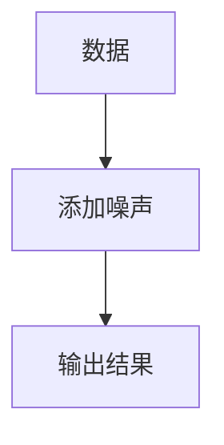
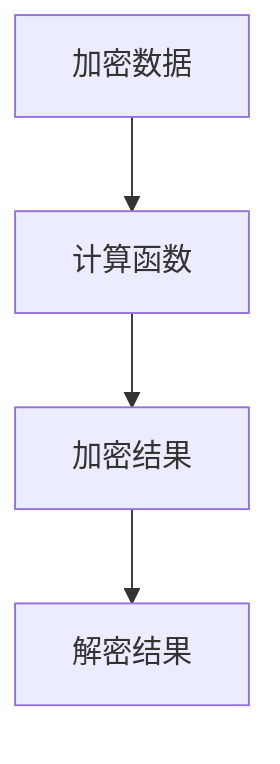
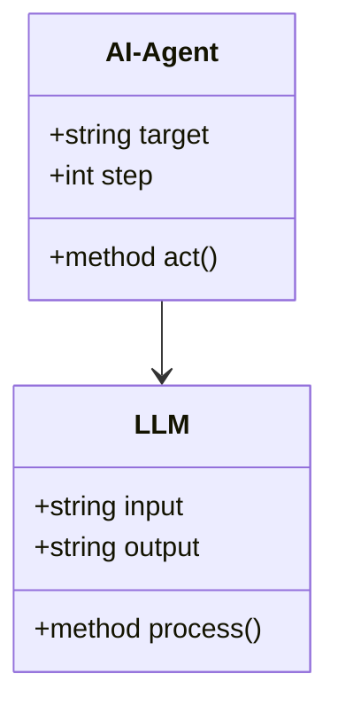
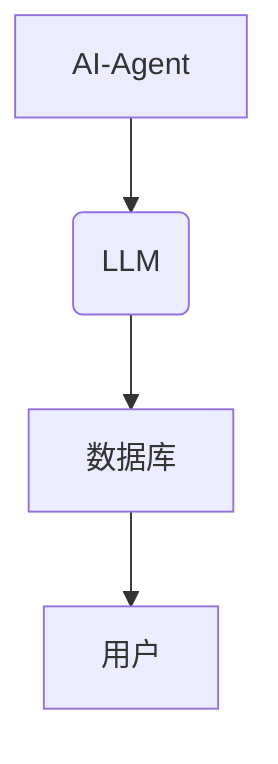
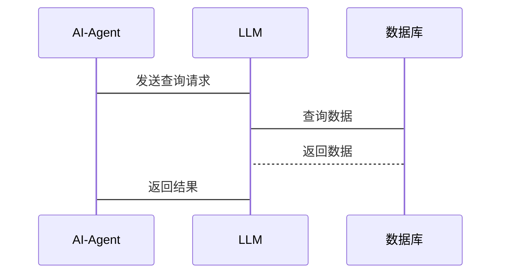

                 


# AI Agent的隐私保护：确保LLM应用的数据安全

> 关键词：AI Agent，隐私保护，数据安全，LLM，差分隐私，同态加密，系统架构

> 摘要：本文探讨了AI Agent在应用大语言模型（LLM）时的隐私保护问题，分析了隐私保护的核心概念、算法原理、系统架构设计及其实现。通过实际案例分析，展示了如何在AI Agent中实现数据安全，确保用户隐私，同时提出了最佳实践和未来研究方向。

---

## 第1章 AI Agent与隐私保护的背景介绍

### 1.1 AI Agent的基本概念

#### 1.1.1 AI Agent的定义
AI Agent（人工智能代理）是指能够感知环境并采取行动以实现目标的智能实体。它可以是一个软件程序，也可以是嵌入在硬件中的智能系统，具备自主决策和问题解决能力。

#### 1.1.2 AI Agent的核心特点
- **自主性**：AI Agent能够自主决策，无需外部干预。
- **反应性**：能够实时感知环境变化并做出反应。
- **目标导向**：所有行动均以实现特定目标为导向。

#### 1.1.3 AI Agent与传统AI的区别
AI Agent不仅是一个静态的知识库，而是能够动态适应环境并采取行动的实体。它结合了感知、推理和行动的能力，使其在实际应用中更具灵活性和实用性。

### 1.2 LLM应用的背景与现状

#### 1.2.1 LLM的定义与技术特点
大语言模型（Large Language Model，LLM）是指基于深度学习技术训练的大型神经网络模型，具有强大的自然语言处理能力。其技术特点包括：
- 大规模数据训练
- 分布式计算能力
- 高精度的自然语言理解与生成

#### 1.2.2 LLM在AI Agent中的应用
AI Agent可以通过LLM实现自然语言处理、信息检索、决策支持等功能。例如，智能助手Siri、Alexa等都基于LLM技术实现对话交互。

#### 1.2.3 当前LLM应用中的隐私问题
- **数据泄露风险**：LLM训练和推理过程中可能暴露用户隐私数据。
- **模型滥用**：恶意攻击者可能利用LLM进行非法活动。
- **数据存储风险**：大量用户数据集中存储，容易成为攻击目标。

### 1.3 隐私保护的重要性

#### 1.3.1 数据安全的定义与分类
数据安全是指保护数据的机密性、完整性和可用性。数据分类通常包括：
- **机密数据**：仅限特定权限用户访问。
- **公开数据**：可自由访问的数据。
- **敏感数据**：涉及个人隐私或企业机密的数据。

#### 1.3.2 隐私保护的法律与伦理要求
- **法律层面**：如欧盟的GDPR（通用数据保护条例）要求企业保护用户数据。
- **伦理层面**：企业有责任确保用户数据不被滥用，尊重用户隐私。

#### 1.3.3 AI Agent中的隐私保护挑战
AI Agent在处理数据时，可能面临数据泄露、模型滥用等风险，如何在功能实现与隐私保护之间找到平衡点是当前亟待解决的问题。

---

## 第2章 隐私保护的核心概念与联系

### 2.1 隐私保护的核心概念

#### 2.1.1 数据安全与隐私保护的关系
数据安全是隐私保护的基础，隐私保护是数据安全的目标。两者相辅相成，共同确保数据的机密性、完整性和可用性。

#### 2.1.2 AI Agent中的数据流分析
AI Agent在运行过程中，数据从输入、处理、存储到输出的全生命周期中，都需要进行隐私保护。

#### 2.1.3 隐私保护的关键技术
- **数据加密**：防止数据在传输和存储过程中被窃取。
- **数据匿名化**：通过技术手段去除数据中的敏感信息。
- **访问控制**：限制只有授权用户才能访问敏感数据。

### 2.2 核心概念的原理与联系

#### 2.2.1 数据生命周期中的隐私保护
数据生命周期包括数据生成、收集、处理、存储、共享和销毁。在每个阶段都需要考虑隐私保护措施。

#### 2.2.2 数据加密与匿名化技术
- **数据加密**：对数据进行加密处理，确保只有授权用户才能解密。
- **数据匿名化**：通过技术手段去除数据中的个人信息，如使用哈希函数。

#### 2.2.3 数据访问控制机制
- **基于角色的访问控制（RBAC）**：根据用户角色分配数据访问权限。
- **基于属性的访问控制（ABAC）**：根据用户属性（如职位、部门）分配数据访问权限。

### 2.3 概念属性对比表

| 概念       | 属性               | 描述                                   |
|------------|--------------------|----------------------------------------|
| 数据安全   | 保护对象           | 数据                                   |
| 隐私保护   | 保护方式           | 加密、匿名化、访问控制                |
| AI Agent   | 应用场景           | 智能助手、自动化决策、数据分析        |

### 2.4 ER实体关系图

```mermaid
er
actor(AI Agent) -|-> entity(数据)
actor(action) -|-> entity(操作)
```

---

## 第3章 隐私保护的算法原理

### 3.1 差分隐私

#### 3.1.1 差分隐私的定义
差分隐私是一种数据隐私保护技术，通过在数据中添加噪声，使得单个数据点的贡献无法被识别。

#### 3.1.2 差分隐私的数学模型
$$P(q, D) \geq P(q, D') \geq P(q, D) - \epsilon$$
其中，$P(q, D)$是查询$q$在数据集$D$上的结果概率，$D'$是与$D$相差一条记录的数据集，$\epsilon$是隐私预算，控制隐私泄露的风险。

#### 3.1.3 差分隐私的实现步骤


### 3.2 同态加密

#### 3.2.1 同态加密的定义
同态加密是一种加密技术，允许在不 decrypt 数据的情况下对数据进行计算，最终结果可以用解密后的数据表示。

#### 3.2.2 同态加密的实现流程


### 3.3 隐私保护算法的代码实现

#### 3.3.1 差分隐私实现代码
```python
import numpy as np

def add_noise(data, epsilon, sensitivity):
    return data + np.random.laplace(0, sensitivity/epsilon)

# 示例数据
data = np.array([1, 2, 3, 4, 5])
epsilon = 1
sensitivity = 1
 noisy_data = add_noise(data, epsilon, sensitivity)
 print("原始数据:", data)
 print("加噪声数据:", noisy_data)
```

#### 3.3.2 同态加密实现代码
```python
from cryptography.fernet import Fernet

# 生成密钥
key = Fernet.generate_key()
cipher = Fernet(key)

# 加密数据
encrypted_data = cipher.encrypt(b"敏感数据")
# 解密数据
decrypted_data = cipher.decrypt(encrypted_data)
 print("加密数据:", encrypted_data)
 print("解密数据:", decrypted_data.decode())
```

---

## 第4章 系统分析与架构设计

### 4.1 问题场景介绍

#### 4.1.1 系统目标
确保AI Agent在使用LLM时，用户的隐私数据得到保护，防止数据泄露和滥用。

#### 4.1.2 问题分析
- **数据泄露风险**：用户的隐私数据可能在传输或存储过程中被窃取。
- **模型滥用风险**：恶意攻击者可能利用模型进行非法活动。
- **数据存储风险**：集中存储的大量数据容易成为攻击目标。

### 4.2 系统功能设计

#### 4.2.1 功能模块
- **数据加密模块**：对敏感数据进行加密处理。
- **匿名化处理模块**：去除数据中的敏感信息。
- **访问控制模块**：限制只有授权用户才能访问敏感数据。

#### 4.2.2 领域模型



### 4.3 系统架构设计

#### 4.3.1 架构图



#### 4.3.2 接口设计
- **输入接口**：接收用户的查询请求。
- **输出接口**：返回处理后的结果。
- **数据库接口**：与数据库进行交互，存储和检索数据。

#### 4.3.3 交互流程



---

## 第5章 项目实战

### 5.1 环境安装

#### 5.1.1 安装Python
```bash
python --version
pip install --upgrade pip
```

#### 5.1.2 安装依赖库
```bash
pip install cryptography numpy
```

### 5.2 核心代码实现

#### 5.2.1 数据加密模块
```python
from cryptography.fernet import Fernet

def encrypt_data(key, data):
    cipher = Fernet(key)
    return cipher.encrypt(data)

def decrypt_data(key, encrypted_data):
    cipher = Fernet(key)
    return cipher.decrypt(encrypted_data)
```

#### 5.2.2 匿名化处理模块
```python
import pandas as pd

def anonymize_data(df, sensitive_columns):
    for col in sensitive_columns:
        df[col] = df[col].apply(lambda x: "匿名" if x else "")
    return df
```

#### 5.2.3 访问控制模块
```python
from flask import Flask, request
from flask_restful import Resource, Api

app = Flask(__name__)
api = Api(app)

class SecureEndpoint(Resource):
    def get(self):
        auth_header = request.headers.get('Authorization')
        if not auth_header:
            return {"message": "Unauthorized"}, 401
        # 验证权限
        if auth_header != "valid_token":
            return {"message": "Invalid credentials"}, 400
        return {"message": "Authorized"}, 200

api.add_resource(SecureEndpoint, '/api/secure')
if __name__ == '__main__':
    app.run(debug=True)
```

### 5.3 代码解读与分析

#### 5.3.1 数据加密模块
- 使用`Fernet`库对敏感数据进行加密。
- 加密和解密函数接受密钥和数据，返回加密后的数据或解密后的数据。

#### 5.3.2 匿名化处理模块
- 使用Pandas库对数据框中的敏感列进行匿名化处理。
- 将敏感列的值替换为“匿名”，确保数据不可逆。

#### 5.3.3 访问控制模块
- 使用Flask框架创建一个Web服务。
- 在SecureEndpoint类中实现访问控制逻辑，验证用户的授权头。
- 如果授权头不存在或无效，返回相应的错误信息。

### 5.4 实际案例分析

#### 5.4.1 案例背景
假设我们有一个AI Agent，用于为用户提供天气预报服务。用户可能需要提供地理位置信息，这属于敏感数据，需要进行匿名化处理。

#### 5.4.2 实施步骤
1. **数据收集**：用户提交地理位置信息。
2. **数据处理**：对地理位置信息进行匿名化处理。
3. **数据存储**：将匿名化后的数据存储到数据库中。
4. **数据检索**：AI Agent根据匿名化数据查询天气预报。
5. **结果返回**：将天气预报结果返回给用户。

### 5.5 项目小结
通过项目实战，我们实现了数据加密、匿名化处理和访问控制功能，确保了AI Agent在使用LLM时用户的隐私数据得到保护。

---

## 第6章 最佳实践

### 6.1 小结
- **数据安全**是隐私保护的基础。
- **隐私保护**是数据安全的目标。
- **AI Agent**需要在功能实现与隐私保护之间找到平衡点。

### 6.2 注意事项
- 定期进行安全审计，确保系统无漏洞。
- 做好数据备份和恢复工作，防止数据丢失。
- 定期更新安全策略，应对新的安全威胁。

### 6.3 拓展阅读
- **《数据加密与隐私保护》**：深入探讨数据加密技术。
- **《人工智能与数据安全》**：分析人工智能技术对数据安全的影响。

---

## 作者信息

作者：AI天才研究院/AI Genius Institute & 禅与计算机程序设计艺术/Zen And The Art of Computer Programming

---

通过以上内容，我们详细探讨了AI Agent在隐私保护方面的技术实现，从理论到实践，确保AI Agent在应用LLM时能够有效保护用户隐私，避免数据泄露和滥用风险。

