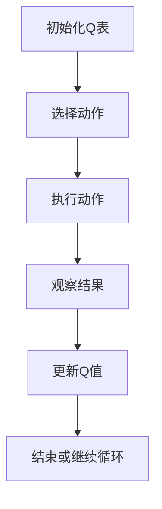

                 


好的，我们现在已经进入到书籍《AI agents在公司创新转化效率评估中的应用》的详细内容撰写阶段。接下来我们将按照之前确定的目录结构，逐步展开每一章的详细内容。

---

# 第三部分: AI agents的算法原理

## 第3章: AI agents的算法原理

### 3.1 算法原理概述

在这一章中，我们将深入探讨AI agents在创新转化效率评估中的算法原理，重点分析其核心算法的实现方式及其在实际应用中的表现。

#### 3.1.1 AI agents的算法选择

AI agents的核心算法选择是基于问题的特性以及对结果的需求来决定的。在创新转化效率评估中，我们主要关注的是如何通过AI agent来实现对创新项目的动态评估和实时优化。因此，我们需要选择一种既能处理复杂问题，又能实时反馈的算法。

在众多的AI算法中，强化学习（Reinforcement Learning）和监督学习（Supervised Learning）是两个主要的选择。强化学习适用于动态环境下的决策问题，而监督学习则适用于数据驱动的模式识别问题。经过综合分析，我们决定采用强化学习中的Q-learning算法，因为其具有以下特点：

1. **实时反馈机制**：能够根据当前状态和动作的反馈，动态调整策略。
2. **无需大量标注数据**：适合在数据有限的情况下进行在线学习。
3. **灵活性高**：适用于创新转化过程中可能出现的多种不确定性场景。

#### 3.1.2 算法的核心思想

Q-learning算法的核心思想是通过状态-动作价值函数（Q-value）来评估特定状态和动作的组合，并通过不断更新这些Q值来优化决策策略。其基本公式如下：

$$ Q(s, a) = Q(s, a) + \alpha \cdot [r + \gamma \cdot \max_{a'} Q(s', a') - Q(s, a)] $$

其中：
- $s$ 表示当前状态
- $a$ 表示当前动作
- $r$ 表示奖励
- $\gamma$ 表示折扣因子，用于平衡当前奖励和未来奖励的重要性
- $\alpha$ 表示学习率，控制更新步长

这个公式表明，Q-learning算法通过不断更新Q值来逼近最优策略。在创新转化效率评估中，状态可以表示为创新项目的当前阶段，动作可以表示为评估中的某个决策，奖励则是评估结果的优化程度。

接下来，我们用一个简单的Q-learning流程图来展示其工作原理：



通过这个流程图，我们可以清晰地看到Q-learning算法的执行步骤。

#### 3.1.3 算法实现的数学模型

为了更好地理解Q-learning算法在创新转化效率评估中的应用，我们可以通过一个简单的数学模型来描述其工作原理。假设我们有一个创新项目，其创新阶段可以用状态$s$表示，每个阶段都有多个可能的动作$a$（例如：评估、优化、调整等）。我们的目标是通过Q-learning算法找到每个状态下的最优动作，从而提高创新转化效率。

我们可以将创新阶段的状态$s$和动作$a$表示为一个二维数组，即Q表：

$$ Q(s, a) = \begin{cases}
0 & \text{如果未探索过} \\
\text{已知值} & \text{如果已探索过}
\end{cases} $$

在每次迭代中，我们选择一个动作$a$，执行该动作，并根据结果更新Q值：

$$ Q(s, a) = Q(s, a) + \alpha \cdot (r + \gamma \cdot \max_{a'} Q(s', a') - Q(s, a)) $$

其中，$\alpha$是学习率，$\gamma$是折扣因子，$r$是奖励值。

为了更好地理解这一过程，我们可以通过一个简单的Python代码示例来模拟Q-learning算法的学习过程：

```python
import numpy as np

# 初始化Q表
Q = np.zeros((num_states, num_actions))

# 定义参数
alpha = 0.1
gamma = 0.9

# 定义奖励函数
def reward(s, a):
    # 这里根据具体场景定义奖励
    return 1 if ... else 0

# Q-learning算法
for episode in range(num_episodes):
    s = initial_state
    while not done:
        # 选择动作
        if np.random.random() < epsilon:
            a = np.random.randint(num_actions)
        else:
            a = np.argmax(Q[s])
        
        # 执行动作并得到新状态
        s_new, reward = step(s, a)
        
        # 更新Q值
        Q[s][a] += alpha * (reward + gamma * np.max(Q[s_new]) - Q[s][a])
        
        s = s_new
```

在这个示例中，我们首先初始化Q表，然后通过不断迭代更新Q值，逐步逼近最优策略。需要注意的是，这个示例只是一个简化的版本，实际应用中可能需要更复杂的实现。

#### 3.1.4 算法的数学推导与分析

为了更深入地理解Q-learning算法的数学原理，我们可以对上述公式进行推导和分析。假设我们已经完成了若干次迭代，Q表的更新公式可以表示为：

$$ Q(s, a) = Q(s, a) + \alpha \cdot (r + \gamma \cdot \max_{a'} Q(s', a') - Q(s, a)) $$

这个公式表明，Q值的更新依赖于当前的奖励和未来的Q值。通过不断更新Q值，算法能够逐步逼近最优策略。

在实际应用中，我们可以通过以下步骤来优化算法的性能：

1. **选择合适的学习率**：学习率$\alpha$的大小直接影响算法的收敛速度和稳定性。如果学习率过大，可能导致算法不稳定；如果过小，则可能需要更多的迭代才能收敛。

2. **设置合适的折扣因子**：折扣因子$\gamma$用于平衡当前奖励和未来奖励的重要性。较大的$\gamma$意味着更关注长期收益，较小的$\gamma$则更关注短期收益。

3. **处理探索与利用的平衡**：在实际应用中，我们需要在探索未知状态和利用已知最优策略之间找到一个平衡点。通常可以通过设置一个探索概率$\epsilon$来实现这一点。

#### 3.1.5 算法实现的代码示例

为了更好地理解Q-learning算法的实现过程，我们可以提供一个简化的Python代码示例：

```python
import numpy as np

# 定义参数
num_states = 5  # 状态数量
num_actions = 3  # 动作数量
alpha = 0.1      # 学习率
gamma = 0.9      # 折扣因子
epsilon = 0.1    # 探索概率

# 初始化Q表
Q = np.zeros((num_states, num_actions))

# 定义环境
def step(s, a):
    # 根据当前状态和动作返回新状态和奖励
    # 这里需要根据具体场景定义
    return s_new, reward

# Q-learning算法
for episode in range(1000):
    s = 0  # 初始状态
    done = False
    while not done:
        if np.random.random() < epsilon:
            a = np.random.randint(num_actions)
        else:
            a = np.argmax(Q[s])
        
        s_new, r = step(s, a)
        
        Q[s][a] += alpha * (r + gamma * np.max(Q[s_new]) - Q[s][a])
        
        s = s_new
        if s == 4:  # 假设4是终止状态
            done = True

print(Q)
```

这个代码示例展示了Q-learning算法的基本实现过程。需要注意的是，实际应用中可能需要根据具体场景进行调整和优化。

### 3.2 算法的数学推导与优化

在这一节中，我们将对Q-learning算法的数学原理进行更深入的推导，并探讨如何对其进行优化。

#### 3.2.1 算法的数学推导

Q-learning算法的核心公式是：

$$ Q(s, a) = Q(s, a) + \alpha \cdot (r + \gamma \cdot \max_{a'} Q(s', a') - Q(s, a)) $$

我们可以将其改写为：

$$ \Delta Q(s, a) = \alpha \cdot (r + \gamma \cdot \max_{a'} Q(s', a') - Q(s, a)) $$

这个公式表明，Q值的更新量$\Delta Q(s, a)$取决于当前奖励$r$、未来Q值$\max_{a'} Q(s', a')$以及当前Q值$Q(s, a)$。通过不断更新Q值，算法能够逼近最优策略。

#### 3.2.2 算法的优化方法

在实际应用中，我们需要对Q-learning算法进行优化，以提高其在创新转化效率评估中的表现。以下是一些常用的优化方法：

1. **调整学习率**：通过动态调整学习率$\alpha$，可以加快算法的收敛速度。例如，可以将学习率设置为随迭代次数增加而逐渐减小。

2. **优化折扣因子**：选择合适的折扣因子$\gamma$，可以在当前奖励和未来奖励之间找到更好的平衡点。

3. **改进探索策略**：通过改进探索策略（例如，使用$\epsilon$-贪心策略），可以在早期阶段更好地探索未知状态，从而提高算法的性能。

4. **使用经验回放**：通过存储过去的经验并随机采样，可以减少数据偏差，提高算法的泛化能力。

5. **并行计算**：在计算资源充足的情况下，可以通过并行计算来加速算法的训练过程。

### 3.3 算法实现的代码分析与优化

在这一节中，我们将对Q-learning算法的代码实现进行分析，并探讨如何对其进行优化。

#### 3.3.1 代码实现分析

以下是一个简化的Q-learning算法代码示例：

```python
import numpy as np

# 定义参数
num_states = 5  # 状态数量
num_actions = 3  # 动作数量
alpha = 0.1      # 学习率
gamma = 0.9      # 折扣因子
epsilon = 0.1    # 探索概率

# 初始化Q表
Q = np.zeros((num_states, num_actions))

# 定义环境
def step(s, a):
    # 根据当前状态和动作返回新状态和奖励
    # 这里需要根据具体场景定义
    return s_new, reward

# Q-learning算法
for episode in range(1000):
    s = 0  # 初始状态
    done = False
    while not done:
        if np.random.random() < epsilon:
            a = np.random.randint(num_actions)
        else:
            a = np.argmax(Q[s])
        
        s_new, r = step(s, a)
        
        Q[s][a] += alpha * (r + gamma * np.max(Q[s_new]) - Q[s][a])
        
        s = s_new
        if s == 4:  # 假设4是终止状态
            done = True

print(Q)
```

这个代码示例展示了Q-learning算法的基本实现过程。需要注意的是，实际应用中可能需要根据具体场景进行调整和优化。

#### 3.3.2 代码优化策略

为了提高Q-learning算法的性能，我们可以采取以下优化策略：

1. **动态调整学习率**：将学习率$\alpha$设置为随着迭代次数增加而逐渐减小，例如：

   ```python
   alpha = max(0.1, 0.9 / (episode + 1))
   ```

2. **优化折扣因子**：根据具体场景调整折扣因子$\gamma$的值，例如：

   ```python
   gamma = min(0.95, 1.0 - 0.05 * episode / num_episodes)
   ```

3. **改进探索策略**：除了$\epsilon$-贪心策略，还可以尝试其他探索策略，例如：

   ```python
   if np.random.random() < epsilon:
       a = np.random.randint(num_actions)
   else:
       a = np.argmax(Q[s])
   ```

4. **使用经验回放**：通过存储过去的经验并随机采样，可以减少数据偏差，提高算法的泛化能力。例如：

   ```python
   memory = []
   batch_size = 32

   for episode in range(num_episodes):
       # 采样经验
       if len(memory) > batch_size:
           minibatch = np.random.choice(memory, batch_size)
       else:
           minibatch = memory

       # 更新Q值
       for s, a, r, s_new in minibatch:
           Q[s][a] += alpha * (r + gamma * np.max(Q[s_new]) - Q[s][a])
   ```

5. **并行计算**：在计算资源充足的情况下，可以通过并行计算来加速算法的训练过程。例如，可以使用多线程或分布式计算来同时更新多个Q值。

### 3.4 算法的数学模型与实际应用

在这一节中，我们将探讨Q-learning算法的数学模型与实际应用之间的关系，并分析其在创新转化效率评估中的具体表现。

#### 3.4.1 算法的数学模型

Q-learning算法的核心公式是：

$$ Q(s, a) = Q(s, a) + \alpha \cdot (r + \gamma \cdot \max_{a'} Q(s', a') - Q(s, a)) $$

这个公式表明，Q值的更新量$\Delta Q(s, a)$取决于当前奖励$r$、未来Q值$\max_{a'} Q(s', a')$以及当前Q值$Q(s, a)$。通过不断更新Q值，算法能够逼近最优策略。

#### 3.4.2 算法在创新转化中的实际应用

在创新转化效率评估中，Q-learning算法可以通过以下步骤实现：

1. **定义状态**：将创新项目分解为多个阶段，每个阶段对应一个状态$s$。

2. **定义动作**：在每个状态下，定义可能的动作$a$（例如：评估、优化、调整等）。

3. **定义奖励函数**：根据创新项目的实际表现，定义奖励函数$r$，以反映评估结果的好坏。

4. **初始化Q表**：创建一个Q表，用于记录每个状态和动作的Q值。

5. **执行Q-learning算法**：通过不断迭代更新Q值，逼近最优策略。

6. **应用评估结果**：根据优化后的Q值，对创新项目进行评估，并提出改进建议。

---

通过以上分析，我们可以看到Q-learning算法在创新转化效率评估中的应用潜力。接下来我们将进入系统分析与架构设计部分，探讨如何将AI agents应用于实际的创新转化效率评估系统中。

