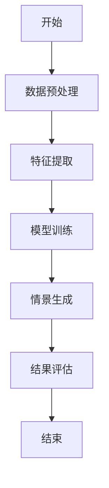
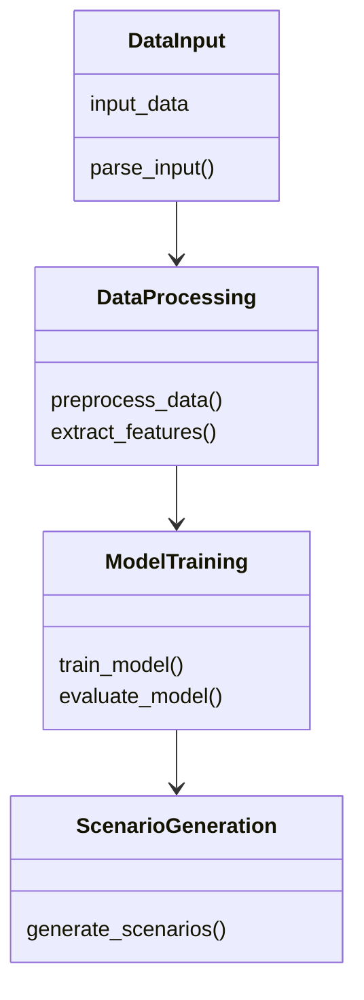

                 


# AI辅助的投资组合压力测试情景生成

> 关键词：AI辅助，投资组合，压力测试，情景生成，机器学习，风险评估

> 摘要：本文将详细探讨如何利用人工智能技术辅助投资组合的压力测试情景生成。通过结合机器学习和大数据分析，我们能够更高效、更准确地生成多种压力测试情景，从而帮助投资者更好地管理和应对市场风险。本文将从压力测试的基本概念出发，逐步深入探讨AI在压力测试中的应用原理、算法实现、系统架构设计以及实际案例分析。

---

## 第1章: 投资组合压力测试概述

### 1.1 什么是投资组合压力测试
#### 1.1.1 压力测试的定义与目的
压力测试是一种金融风险评估方法，用于评估投资组合在极端市场条件下的表现。其目的是帮助投资者了解在极端情况下投资组合可能面临的损失，并制定相应的风险管理策略。

#### 1.1.2 投资组合压力测试的背景与意义
随着金融市场日益复杂，传统的基于历史数据的回测方法难以应对极端市场条件下的风险评估。压力测试能够模拟极端市场环境，帮助投资者更好地应对潜在风险。

#### 1.1.3 压力测试的分类与应用场景
压力测试可以分为历史模拟法、情景分析法和蒙特卡洛模拟法。其中，情景分析法是投资组合压力测试的主要方法，常用于评估投资组合在特定极端市场情况下的表现。

### 1.2 AI辅助压力测试的必要性
#### 1.2.1 传统压力测试的局限性
传统压力测试方法依赖于历史数据，难以模拟未知的极端市场情景。此外，手工生成压力测试情景效率低下，且容易受到主观因素的影响。

#### 1.2.2 AI在压力测试中的优势
AI技术能够基于大数据分析，生成多样化的压力测试情景，并通过机器学习模型预测极端市场条件下的投资组合表现。

#### 1.2.3 AI辅助压力测试的核心价值
通过AI辅助，压力测试情景生成更加高效、准确，并能够捕捉到传统方法难以发现的潜在风险。

---

## 第2章: AI辅助压力测试的核心概念

### 2.1 投资组合压力测试的数学模型
#### 2.1.1 投资组合风险的定义
投资组合风险可以表示为投资组合在不同市场情景下的收益波动性。常用的风险指标包括波动率、VaR（Value at Risk）和CVaR（Conditional Value at Risk）。

#### 2.1.2 压力测试的数学表达式
压力测试可以通过以下公式表示：
$$ \text{投资组合损失} = \max(\mu + \sigma \times \text{极端值}, 0) $$
其中，$\mu$ 是投资组合的平均收益，$\sigma$ 是收益的标准差，极端值是压力测试情景中的极端市场条件。

#### 2.1.3 压力测试的主要指标
压力测试的主要指标包括：
1. VaR：在特定置信水平下，投资组合可能遭受的最大损失。
2. CVaR：在VaR基础上，考虑超过VaR的潜在损失。

### 2.2 AI在压力测试中的核心算法
#### 2.2.1 机器学习在压力测试中的应用
机器学习可以通过历史市场数据训练模型，生成多种压力测试情景。常用算法包括支持向量机（SVM）、随机森林（Random Forest）和神经网络。

#### 2.2.2 基于AI的压力测试模型
基于AI的压力测试模型通常包括数据预处理、特征提取、模型训练和情景生成四个步骤。

#### 2.2.3 深度学习在压力测试中的优势
深度学习模型（如LSTM）可以捕捉时间序列数据中的复杂模式，从而更准确地预测极端市场情景。

### 2.3 压力测试情景生成的关键要素
#### 2.3.1 压力测试情景的定义
压力测试情景是模拟极端市场条件下的各种可能情况，例如市场崩盘、经济衰退或突发的黑天鹅事件。

#### 2.3.2 情景生成的核心要素
情景生成的核心要素包括市场波动率、资产相关性、宏观经济指标和投资者行为等因素。

#### 2.3.3 情景生成的边界条件
边界条件是指情景生成过程中需要考虑的限制条件，例如历史数据的时间范围、资产种类和市场环境等。

---

## 第3章: 压力测试情景生成的算法原理

### 3.1 基于AI的情景生成算法
#### 3.1.1 基于聚类的场景生成
基于聚类的场景生成算法通过将历史市场数据聚类，生成具有代表性的压力测试情景。

#### 3.1.2 基于生成对抗网络（GAN）的情景生成
生成对抗网络通过生成器和判别器的对抗训练，生成多样化的压力测试情景。以下是一个简单的GAN模型实现示例：

```python
import tensorflow as tf
from tensorflow.keras import layers

# 定义生成器
def generator():
    model = tf.keras.Sequential()
    model.add(layers.Dense(256, activation='relu', input_shape=(100,)))
    model.add(layers.Dense(128, activation='relu'))
    model.add(layers.Dense(64, activation='sigmoid'))
    return model

# 定义判别器
def discriminator():
    model = tf.keras.Sequential()
    model.add(layers.Dense(64, activation='relu', input_shape=(64,)))
    model.add(layers.Dense(32, activation='relu'))
    model.add(layers.Dense(1, activation='sigmoid'))
    return model

# 初始化生成器和判别器
generator = generator()
discriminator = discriminator()

# 定义损失函数
cross_entropy = tf.keras.losses.BinaryCrossentropy()

# 生成器损失
def generator_loss(fake_output):
    return cross_entropy(tf.ones_like(fake_output), fake_output)

# 判别器损失
def discriminator_loss(real_output, fake_output):
    return cross_entropy(tf.ones_like(real_output), real_output) + cross_entropy(tf.zeros_like(fake_output), fake_output)

# 训练循环
optimizer = tf.keras.optimizers.Adam(0.0002)
for epoch in range(epochs):
    for batch in dataset:
        noise = tf.random.normal([batch_size, 100])
        fake = generator(noise)
        real = batch
        # 判别器训练
        with tf.GradientTape() as tape:
            real_output = discriminator(real)
            fake_output = discriminator(fake)
            d_loss = discriminator_loss(real_output, fake_output)
        gradients = tape.gradient(d_loss, discriminator.trainable_weights)
        optimizer.apply_gradients(zip(gradients, discriminator.trainable_weights))
        # 生成器训练
        with tf.GradientTape() as tape:
            fake_output = discriminator(fake)
            g_loss = generator_loss(fake_output)
        gradients = tape.gradient(g_loss, generator.trainable_weights)
        optimizer.apply_gradients(zip(gradients, generator.trainable_weights))
```

#### 3.1.3 基于强化学习的情景生成
强化学习通过智能体与环境的交互，生成最优的压力测试情景。以下是一个简单的强化学习模型实现示例：

```python
import gym
import numpy as np

# 定义强化学习环境
class PortfolioEnv(gym.Env):
    def __init__(self):
        super(PortfolioEnv, self).__init__()
        self.action_space = gym.spaces.Box(low=-1, high=1, shape=(1,))
        self.observation_space = gym.spaces.Box(low=0, high=1, shape=(64,))
        self.current_state = None

    def step(self, action):
        # 计算投资组合收益
        next_state = self.current_state + action * np.random.normal(0, 0.1, 64)
        reward = -np.mean((next_state - self.current_state) ** 2)
        done = False
        info = {}
        return next_state, reward, done, info

    def reset(self):
        self.current_state = np.zeros(64)
        return self.current_state

# 初始化环境
env = PortfolioEnv()
state = env.reset()

# 定义强化学习模型
model = tf.keras.Sequential([
    layers.Dense(64, activation='relu', input_shape=(64,)),
    layers.Dense(1)
])

# 编译模型
model.compile(optimizer='adam', loss='mean_squared_error')

# 训练模型
for _ in range(1000):
    action = model.predict(state[np.newaxis, :])[0]
    action = np.tanh(action)
    next_state, reward, done, _ = env.step(action)
    target = next_state
    model.fit(state[np.newaxis, :], target[np.newaxis, :], epochs=1, verbose=0)
    state = next_state
```

### 3.2 算法实现的数学模型
#### 3.2.1 GAN模型的数学公式
生成器的损失函数：
$$ \text{生成器损失} = \mathbb{E}_{z}[\log(1 - D(G(z)))] $$
判别器的损失函数：
$$ \text{判别器损失} = \mathbb{E}_{x}[\log(D(x))] + \mathbb{E}_{z}[\log(1 - D(G(z)))] $$

#### 3.2.2 强化学习模型的数学公式
状态值函数：
$$ Q(s, a) = \sum_{i=1}^{n} \theta_i \phi_i(s, a) $$
其中，$\phi_i(s, a)$ 是特征函数，$\theta_i$ 是参数。

---

## 第4章: 压力测试情景生成的过程

### 4.1 情景生成的主要步骤
#### 4.1.1 确定输入特征
输入特征包括历史市场数据、宏观经济指标、资产相关性等。

#### 4.1.2 数据预处理
数据预处理包括数据清洗、标准化和特征选择。

#### 4.1.3 模型训练
模型训练包括选择算法、调整超参数和验证模型性能。

#### 4.1.4 情景生成
根据训练好的模型，生成多种压力测试情景，并进行结果评估。

### 4.2 基于AI的情景生成流程
以下是一个基于AI的情景生成流程图：



---

## 第5章: 系统架构设计

### 5.1 系统功能模块
#### 5.1.1 数据输入模块
数据输入模块负责接收和解析输入数据，包括历史市场数据和宏观经济指标。

#### 5.1.2 数据处理模块
数据处理模块对输入数据进行清洗、标准化和特征选择。

#### 5.1.3 模型训练模块
模型训练模块负责训练压力测试模型，包括选择算法、调整超参数和验证模型性能。

#### 5.1.4 情景生成模块
情景生成模块根据训练好的模型，生成多种压力测试情景。

### 5.2 系统架构设计
以下是一个基于AI的压力测试系统的架构图：



---

## 第6章: 项目实战

### 6.1 环境安装
为了运行本项目，需要安装以下Python库：
- TensorFlow
- Keras
- Scikit-learn
- Pandas
- NumPy

### 6.2 核心实现代码
以下是一个基于生成对抗网络的压力测试情景生成代码示例：

```python
import tensorflow as tf
from tensorflow.keras import layers
import numpy as np

# 定义生成器
def generator():
    model = tf.keras.Sequential()
    model.add(layers.Dense(256, activation='relu', input_shape=(100,)))
    model.add(layers.Dense(128, activation='relu'))
    model.add(layers.Dense(64, activation='sigmoid'))
    return model

# 定义判别器
def discriminator():
    model = tf.keras.Sequential()
    model.add(layers.Dense(64, activation='relu', input_shape=(64,)))
    model.add(layers.Dense(32, activation='relu'))
    model.add(layers.Dense(1, activation='sigmoid'))
    return model

# 初始化生成器和判别器
generator = generator()
discriminator = discriminator()

# 定义损失函数
cross_entropy = tf.keras.losses.BinaryCrossentropy()

# 生成器损失
def generator_loss(fake_output):
    return cross_entropy(tf.ones_like(fake_output), fake_output)

# 判别器损失
def discriminator_loss(real_output, fake_output):
    return cross_entropy(tf.ones_like(real_output), real_output) + cross_entropy(tf.zeros_like(fake_output), fake_output)

# 训练循环
optimizer = tf.keras.optimizers.Adam(0.0002)
for epoch in range(100):
    for _ in range(100):
        noise = tf.random.normal([64, 100])
        fake = generator(noise)
        real = np.random.randn(64, 64)
        # 判别器训练
        with tf.GradientTape() as tape:
            real_output = discriminator(real)
            fake_output = discriminator(fake)
            d_loss = discriminator_loss(real_output, fake_output)
        gradients = tape.gradient(d_loss, discriminator.trainable_weights)
        optimizer.apply_gradients(zip(gradients, discriminator.trainable_weights))
        # 生成器训练
        with tf.GradientTape() as tape:
            fake_output = discriminator(fake)
            g_loss = generator_loss(fake_output)
        gradients = tape.gradient(g_loss, generator.trainable_weights)
        optimizer.apply_gradients(zip(gradients, generator.trainable_weights))
```

### 6.3 实际案例分析
以下是一个实际案例分析，展示了如何利用生成对抗网络生成压力测试情景：

1. 数据预处理：收集历史市场数据，包括股票价格、债券收益率和宏观经济指标。
2. 特征提取：提取关键特征，例如波动率、资产相关性和宏观经济指标。
3. 模型训练：训练生成对抗网络模型，生成多种压力测试情景。
4. 情景生成：根据生成好的模型，生成多种压力测试情景，并评估投资组合在不同情景下的表现。

---

## 第7章: 总结与展望

### 7.1 总结
本文详细探讨了如何利用人工智能技术辅助投资组合的压力测试情景生成。通过结合机器学习和大数据分析，我们能够更高效、更准确地生成多种压力测试情景，从而帮助投资者更好地应对市场风险。

### 7.2 注意事项
在实际应用中，需要注意以下几点：
1. 数据质量：确保输入数据的准确性和完整性。
2. 模型选择：根据具体需求选择合适的算法和模型。
3. 结果验证：对生成的压力测试情景进行验证和调整。

### 7.3 拓展阅读
1. 《Deep Learning》 —— Ian Goodfellow
2. 《Python机器学习》 —— Aurélien Géron
3. 《投资组合管理与金融工程》 —— 李朝锋

---

## 作者
作者：AI天才研究院/AI Genius Institute  
作者：禅与计算机程序设计艺术/Zen And The Art of Computer Programming

