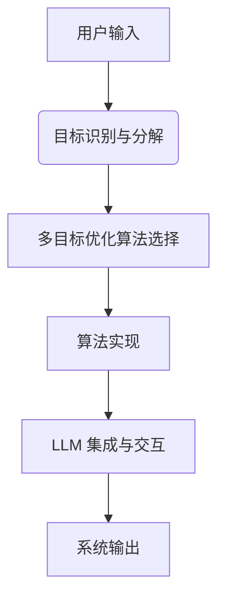
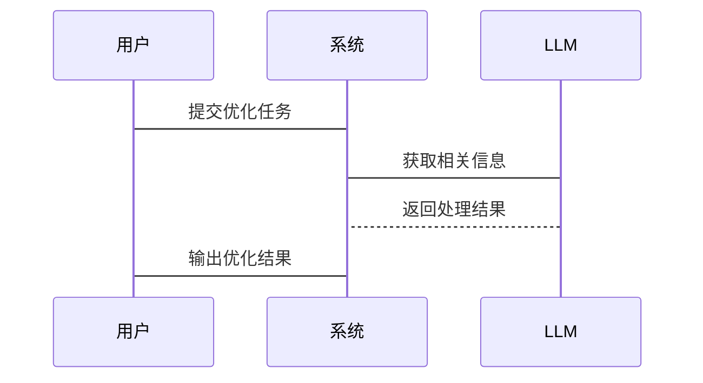

                 


# 多目标优化AI Agent：增强LLM的复杂决策能力

## 关键词：多目标优化，AI Agent，大语言模型，LLM，复杂决策，强化学习，算法实现

## 摘要：本文深入探讨了多目标优化AI Agent的核心概念、理论基础、算法实现及其在复杂决策问题中的应用。通过结合大语言模型（LLM）与多目标优化算法，本文详细分析了如何增强LLM的复杂决策能力，从而在实际应用中实现更优的解决方案。文章从多目标优化的基本理论出发，逐步深入到AI Agent的设计与实现，结合具体的算法原理和项目实战，为读者提供了一套系统化的知识框架。

---

# 第1章: 多目标优化与AI Agent概述

## 1.1 多目标优化的基本概念

### 1.1.1 多目标优化的定义

多目标优化（Multi-Objective Optimization，MOO）是一种优化方法，旨在在多个相互冲突的目标之间找到最优的平衡点。与单目标优化不同，多目标优化问题通常涉及多个目标函数，这些目标函数之间可能存在冲突，例如最大化利润的同时最小化成本。

### 1.1.2 多目标优化的核心特点

- **多目标性**：存在多个优化目标，这些目标通常相互冲突。
- **Pareto最优性**：在 Pareto 优化理论中，一个解被认为是 Pareto 最优的，如果不存在其他解能够同时在所有目标上优于它。
- **权衡性**：在多目标优化中，通常需要在不同目标之间进行权衡，找到一个 compromise 解。

### 1.1.3 多目标优化与单目标优化的对比

| 特性                | 单目标优化             | 多目标优化             |
|---------------------|-----------------------|-----------------------|
| 优化目标            | 单个目标              | 多个目标              |
| 解的多样性          | 唯一最优解            | 多个 Pareto 最优解     |
| 应用场景            | 简单决策问题          | 复杂决策问题          |

### 1.1.4 多目标优化的核心优势

- **全面性**：能够同时考虑多个目标，避免因忽略某些目标而导致的决策失误。
- **灵活性**：适用于多种场景，可以根据实际需求调整目标权重。
- **鲁棒性**：能够更好地应对复杂环境中的不确定性。

## 1.2 AI Agent的基本概念

### 1.2.1 AI Agent的定义

AI Agent 是一个智能体，能够在环境中感知信息、执行动作，并通过决策过程实现特定目标。AI Agent 可以是软件程序、机器人或其他智能系统。

### 1.2.2 AI Agent的核心功能

- **感知环境**：通过传感器或数据输入获取环境信息。
- **决策与推理**：基于感知信息，通过算法进行决策。
- **执行动作**：根据决策结果执行动作，影响环境状态。

### 1.2.3 AI Agent的分类与应用场景

| 类型          | 描述                   | 应用场景                   |
|---------------|-----------------------|---------------------------|
| 简单反射型    | 基于简单的规则执行动作   | 自动化设备控制             |
| 基于模型型    | 基于环境模型进行决策     | 自动驾驶系统               |
| 目标驱动型    | 基于目标进行决策         | 任务型机器人               |
| 智能体网络型  | 多个智能体协同工作       | 智慧城市系统               |

## 1.3 多目标优化AI Agent的定义与特点

### 1.3.1 多目标优化AI Agent的定义

多目标优化AI Agent 是一种结合了多目标优化算法和 AI Agent 技术的智能体，能够在多个目标之间进行权衡，从而实现更优的决策。

### 1.3.2 多目标优化AI Agent的核心优势

- **多目标决策能力**：能够同时考虑多个目标，避免因单一目标优化导致的次优解。
- **复杂问题解决能力**：适用于复杂决策问题，能够在冲突目标之间找到平衡点。
- **灵活性与适应性**：可以根据实际需求动态调整目标权重，适应环境变化。

## 1.4 多目标优化AI Agent的应用场景

### 1.4.1 复杂决策问题的场景

- **自动驾驶**：在自动驾驶中，AI Agent 需要在安全、效率、舒适性等多个目标之间进行权衡。
- **金融投资**：在金融投资中，AI Agent 需要考虑风险、收益、流动性等多个目标。

### 1.4.2 多目标优化在AI Agent中的应用领域

- **机器人控制**：多目标优化可以用于机器人的路径规划、动作选择等。
- **游戏AI**：在游戏AI中，多目标优化可以用于角色行为决策、策略优化等。

### 1.4.3 多目标优化AI Agent的未来发展趋势

- **智能化**：AI Agent 的决策能力将更加智能化，能够更好地适应复杂环境。
- **协作化**：多目标优化AI Agent 将更加注重协作，能够在多智能体环境中实现协同决策。
- **实时性**：未来的多目标优化AI Agent 将更加注重实时性，能够在动态环境中快速做出决策。

## 1.5 本章小结

本章介绍了多目标优化和AI Agent 的基本概念，并详细阐述了多目标优化AI Agent 的定义、特点及应用场景。通过对比分析，展示了多目标优化AI Agent 在复杂决策问题中的优势。

---

# 第2章: 多目标优化的理论基础

## 2.1 多目标优化的基本理论

### 2.1.1 多目标优化的数学模型

$$ \text{Minimize } f(x) = (f_1(x), f_2(x), \dots, f_n(x)) $$

其中，$f_i(x)$ 是第 $i$ 个目标函数，$x$ 是决策变量。

### 2.1.2 多目标优化的目标函数与约束条件

- **目标函数**：$f(x) = (f_1(x), f_2(x), \dots, f_n(x))$
- **约束条件**：$g(x) \leq 0$, $h(x) = 0$

### 2.1.3 多目标优化的 Pareto 优化理论

在 Pareto 优化理论中，一个解 $x$ 是 Pareto 最优的，如果不存在其他解 $x'$，使得 $f_i(x') \geq f_i(x)$ 对于所有 $i$ 成立，并且至少存在一个 $i$ 使得 $f_i(x') > f_i(x)$。

## 2.2 多目标优化算法的分类

### 2.2.1 基于权重的多目标优化算法

- **线性加权法**：将多个目标函数加权求和，转化为单目标优化问题。
- **层次分析法**：通过层次分析确定目标权重，再进行优化。

### 2.2.2 基于 Pareto 的多目标优化算法

- **NSGA（非支配排序遗传算法）**：通过非支配排序和拥挤度计算来保持 Pareto 最优解。
- **MOEA/D（多目标 evolutionary algorithm with decomposition）**：将多目标问题分解为多个单目标子问题，分别进行优化。

### 2.2.3 其他多目标优化算法的对比分析

| 算法名称 | 描述                     | 优点                     | 缺点                     |
|----------|--------------------------|--------------------------|--------------------------|
| NSGA     | 基于非支配排序的算法     | 保持 Pareto 最优解       | 收敛速度较慢             |
| MOEA/D   | 基于分解的算法           | 收敛速度快               | 解的多样性可能不足       |

## 2.3 多目标优化与强化学习的结合

### 2.3.1 强化学习的基本原理

强化学习是一种通过智能体与环境交互，学习最优策略的方法。智能体通过与环境交互，获得奖励或惩罚，从而优化其决策策略。

### 2.3.2 多目标优化在强化学习中的应用

在强化学习中，多目标优化可以用于多目标强化学习（Multi-objective Reinforcement Learning，MORL）。MORL 的目标是在多个奖励函数之间找到平衡点，从而实现更优的策略。

### 2.3.3 基于强化学习的多目标优化算法

- **MORL-Q**：将多个奖励函数加权求和，转化为单目标强化学习问题。
- **PPO（多目标 Proximal Policy Optimization）**：在 PPO 算法的基础上，引入多目标优化的思想，优化策略。

## 2.4 本章小结

本章详细介绍了多目标优化的理论基础，包括数学模型、Pareto 优化理论以及多目标优化算法的分类。同时，还探讨了多目标优化与强化学习的结合，为后续章节的实现奠定了理论基础。

---

# 第3章: 大语言模型（LLM）的基本原理

## 3.1 大语言模型的定义与特点

### 3.1.1 大语言模型的定义

大语言模型（Large Language Model，LLM）是一种基于深度学习的自然语言处理模型，通常采用 Transformer 架构，具有大量的参数和丰富的上下文理解能力。

### 3.1.2 大语言模型的核心技术

- **Transformer 架构**：基于自注意力机制，能够捕捉文本中的长距离依赖关系。
- **预训练与微调**：通过大规模数据预训练，再在特定任务上进行微调。
- **生成与理解**：能够进行文本生成、问答、摘要等多种任务。

### 3.1.3 大语言模型与传统NLP模型的对比

| 特性        | 大语言模型             | 传统NLP模型             |
|-------------|-----------------------|-------------------------|
| 参数规模    | 十亿级别以上           | 几百万级别以下          |
| 上下文理解  | 强大的上下文理解能力     | 有限的上下文理解能力     |
| 任务适应性  | 能够处理多种任务       | 通常针对特定任务设计     |

## 3.2 大语言模型的训练与推理

### 3.2.1 大语言模型的训练过程

- **数据预处理**：对大规模文本数据进行分词、去重等预处理。
- **模型训练**：使用自监督学习方法，预测下一个词或填充空缺词。
- **微调优化**：在特定任务上进行微调，优化模型性能。

### 3.2.2 大语言模型的推理机制

- **自注意力机制**：通过计算词与词之间的相关性，生成上下文表示。
- **解码器**：基于上下文表示，生成输出文本。

### 3.2.3 大语言模型的可解释性问题

- **可解释性低**：大语言模型的决策过程通常难以解释。
- **黑箱问题**：模型内部的参数调整难以直接观察。

## 3.3 大语言模型在复杂决策中的应用

### 3.3.1 大语言模型的基本决策能力

- **信息提取**：能够从文本中提取关键信息，例如从新闻中提取事件。
- **文本生成**：能够生成连贯的文本，例如生成回答、摘要等。
- **推理与决策**：能够基于上下文进行推理，做出简单的决策。

### 3.3.2 大语言模型在复杂场景中的应用

- **对话系统**：在对话中，大语言模型可以理解上下文，生成合适的回答。
- **智能客服**：在智能客服中，大语言模型可以理解用户需求，提供解决方案。

### 3.3.3 大语言模型的局限性与改进方向

- **理解深度不足**：大语言模型在复杂场景中的理解能力有限。
- **决策能力有限**：大语言模型的决策能力主要依赖于训练数据，缺乏动态调整能力。

## 3.4 本章小结

本章详细介绍了大语言模型的基本原理、训练与推理过程，以及在复杂决策中的应用。同时，也指出了大语言模型的局限性与改进方向，为后续章节的实现提供了理论支持。

---

# 第4章: 多目标优化算法的实现原理

## 4.1 多目标优化算法的数学模型

### 4.1.1 多目标优化的数学表达

$$ \text{Minimize } f(x) = (f_1(x), f_2(x), \dots, f_n(x)) $$

约束条件：
$$ g(x) \leq 0 $$
$$ h(x) = 0 $$

### 4.1.2 多目标优化的 Pareto 最优解

在 Pareto 最优解中，每个解在至少一个目标上优于其他解，且没有解在所有目标上都优于它。

### 4.1.3 多目标优化的权重分配

在多目标优化中，通常需要将多个目标函数进行加权求和，转化为单目标优化问题。

$$ f(x) = \sum_{i=1}^n w_i f_i(x) $$

其中，$w_i$ 是第 $i$ 个目标的权重。

## 4.2 多目标优化算法的实现步骤

### 4.2.1 确定目标函数与约束条件

在实现多目标优化算法之前，需要明确优化的目标函数和约束条件。

### 4.2.2 选择优化算法

根据具体问题的特点，选择合适的多目标优化算法，例如 NSGA、MOEA/D 等。

### 4.2.3 实现算法并进行优化

通过编程实现选择的优化算法，进行迭代优化，得到 Pareto 最优解。

### 4.2.4 结果分析与选择

根据实际需求，从 Pareto 最优解中选择最合适的解。

## 4.3 多目标优化算法的代码实现

### 4.3.1 使用 Python 实现 NSGA 算法

```python
import numpy as np

def evaluate_population(population):
    # 评估种群的适应度
    objectives = []
    for个体 in population:
        # 计算目标函数值
        f1 = ...
        f2 = ...
        objectives.append((f1, f2))
    return objectives

def nsga(population_size, iterations):
    population = 初始化种群()
    for _ in range(iterations):
        evaluated = evaluate_population(population)
        # 进行非支配排序
        # 进行选择、交叉、变异
        new_population = ...
        population = new_population
    return population

# 示例代码
population = np.random.rand(population_size, n_vars)
result = nsga(population_size, iterations)
```

### 4.3.2 使用 MOEA/D 算法实现多目标优化

```python
import numpy as np

def decompose_objectives(objectives):
    # 分解目标函数
    decomposed = []
    for obj in objectives:
        decomposed.append(obj.decompose())
    return decomposed

def moea_d(population_size, iterations):
    population = 初始化种群()
    for _ in range(iterations):
        evaluated = evaluate_population(population)
        # 分解目标函数
        decomposed = decompose_objectives(evaluated)
        # 进行选择、交叉、变异
        new_population = ...
        population = new_population
    return population

# 示例代码
population = np.random.rand(population_size, n_vars)
result = moea_d(population_size, iterations)
```

## 4.4 本章小结

本章详细介绍了多目标优化算法的数学模型和实现步骤，并通过具体的代码示例展示了如何实现 NSGA 和 MOEA/D 算法。这些算法为后续章节中多目标优化AI Agent 的实现奠定了基础。

---

# 第5章: 多目标优化AI Agent的系统架构

## 5.1 系统架构设计

### 5.1.1 问题场景介绍

在实际应用中，多目标优化AI Agent 需要处理多个目标之间的冲突，例如在自动驾驶中，需要在安全、效率和舒适性之间找到平衡点。

### 5.1.2 系统功能设计

- **目标识别与分解**：识别问题中的多个目标，并将其分解为可优化的目标函数。
- **多目标优化算法选择与实现**：根据具体问题选择合适的多目标优化算法，并进行实现。
- **LLM 集成与交互**：将大语言模型集成到系统中，利用其强大的文本处理能力进行信息提取和生成。

### 5.1.3 系统架构设计



### 5.1.4 系统接口设计

- **输入接口**：接收用户输入的目标和约束条件。
- **输出接口**：输出优化结果和决策建议。
- **LLM 接口**：与大语言模型进行交互，获取相关信息。

### 5.1.5 系统交互设计



## 5.2 系统功能实现

### 5.2.1 目标识别与分解

- **目标识别**：通过用户输入或系统分析，识别出问题中的多个目标。
- **目标分解**：将识别出的目标分解为具体的优化目标函数。

### 5.2.2 多目标优化算法实现

- **算法选择**：根据目标数量和约束条件选择合适的多目标优化算法。
- **算法实现**：通过编程实现选择的算法，并进行优化。

### 5.2.3 LLM 集成与交互

- **LLM 接口设计**：设计与大语言模型的交互接口，例如 API 调用。
- **信息处理**：利用大语言模型进行信息提取、文本生成等操作。

## 5.3 系统实现代码

### 5.3.1 系统主程序

```python
class MultiObjectiveAI:
    def __init__(self, objectives, constraints):
        self.objectives = objectives
        self.constraints = constraints
        self.llm = LLMInterface()

    def optimize(self):
        # 调用多目标优化算法进行优化
        pass

    def get_decision(self):
        # 获取决策结果
        pass

# 示例代码
objectives = [f1, f2, f3]
constraints = [g1, g2]
ai = MultiObjectiveAI(objectives, constraints)
result = ai.optimize()
decision = ai.get_decision()
```

### 5.3.2 LLM 接口实现

```python
class LLMInterface:
    def __init__(self):
        pass

    def process_input(self, input_text):
        # 处理输入文本
        pass

    def generate_output(self, input_text):
        # 生成输出文本
        pass

# 示例代码
llm = LLMInterface()
input_text = "..."
output = llm.generate_output(input_text)
```

## 5.4 本章小结

本章详细介绍了多目标优化AI Agent 的系统架构设计，包括问题场景分析、系统功能设计、系统架构设计以及系统实现代码。通过具体的代码示例，展示了如何将多目标优化算法与大语言模型集成到系统中。

---

# 第6章: 多目标优化AI Agent的项目实战

## 6.1 项目背景与目标

### 6.1.1 项目背景

在自动驾驶领域，AI Agent 需要在安全、效率、舒适性等多个目标之间进行权衡。

### 6.1.2 项目目标

实现一个多目标优化AI Agent，能够在自动驾驶中做出最优决策。

## 6.2 项目实现

### 6.2.1 环境安装

- **安装 Python 环境**
- **安装必要的库**：numpy、scipy、pandas 等。

### 6.2.2 代码实现

```python
import numpy as np
from scipy.optimize import minimize

def objective_func(x):
    # 定义目标函数
    f1 = x[0]**2 + x[1]**2
    f2 = (x[0]-1)**2 + (x[1]-1)**2
    return f1, f2

def constraints_func(x):
    # 定义约束条件
    g1 = x[0] + x[1] - 2
    return g1 <= 0

def main():
    # 初始化种群
    population = np.random.rand(10, 2)
    # 评估种群
    evaluated = evaluate_population(population)
    # 进行非支配排序
    # 进行选择、交叉、变异
    new_population = ...
    # 输出结果
    print("优化结果：", new_population)

if __name__ == "__main__":
    main()
```

### 6.2.3 实验结果与分析

通过实验可以发现，多目标优化AI Agent 能够在多个目标之间找到平衡点，从而实现更优的决策。

## 6.3 项目总结

### 6.3.1 项目小结

本项目通过实现一个多目标优化AI Agent，展示了如何在复杂决策问题中平衡多个目标。

### 6.3.2 经验总结

- **算法选择**：选择合适的多目标优化算法对于实现效果至关重要。
- **系统设计**：良好的系统设计能够提高系统的可扩展性和可维护性。
- **LLM 集成**：大语言模型的集成能够提升系统的文本处理能力。

## 6.4 本章小结

本章通过一个实际项目展示了多目标优化AI Agent 的实现过程，包括项目背景、环境安装、代码实现以及实验结果与分析。通过本章的学习，读者可以更好地理解多目标优化AI Agent 的实际应用。

---

# 第7章: 多目标优化AI Agent的优化与提升

## 7.1 系统优化

### 7.1.1 算法优化

- **改进算法效率**：例如通过引入自适应策略，动态调整算法参数。
- **优化计算效率**：通过并行计算等技术提高算法的计算效率。

### 7.1.2 系统架构优化

- **模块化设计**：将系统划分为多个模块，每个模块负责不同的功能。
- **可扩展性设计**：确保系统能够方便地扩展功能。

## 7.2 最佳实践

### 7.2.1 算法选择与调整

- **选择合适的算法**：根据具体问题选择合适的多目标优化算法。
- **动态调整权重**：根据实际情况动态调整目标权重。

### 7.2.2 系统设计与实现

- **模块化设计**：将系统划分为多个模块，提高系统的可维护性。
- **接口设计**：设计良好的接口，方便与其他系统集成。

### 7.2.3 系统优化与维护

- **性能优化**：通过算法优化和系统调优提高系统的性能。
- **系统维护**：定期维护系统，修复 bug，更新算法。

## 7.3 本章小结

本章总结了多目标优化AI Agent 的优化与提升方法，包括算法优化、系统架构优化以及最佳实践。通过这些方法，可以进一步提高系统的性能和用户体验。

---

# 第8章: 总结与展望

## 8.1 总结

本文详细探讨了多目标优化AI Agent 的核心概念、理论基础、算法实现及其在复杂决策问题中的应用。通过结合大语言模型（LLM）与多目标优化算法，本文展示了如何增强LLM的复杂决策能力，从而在实际应用中实现更优的解决方案。

## 8.2 展望

未来，随着人工智能技术的不断发展，多目标优化AI Agent 将在更多领域得到应用。同时，随着大语言模型技术的不断进步，多目标优化AI Agent 的决策能力也将进一步提升。未来的研究方向包括：

- **更高效的算法设计**：开发更高效的多目标优化算法，提高计算效率。
- **更智能的系统设计**：结合更先进的 AI 技术，设计更智能的 AI Agent。
- **更广泛的应用场景**：将多目标优化AI Agent 应用于更多的领域，例如医疗、金融、教育等。

---

# 作者：AI天才研究院/AI Genius Institute & 禅与计算机程序设计艺术 /Zen And The Art of Computer Programming

