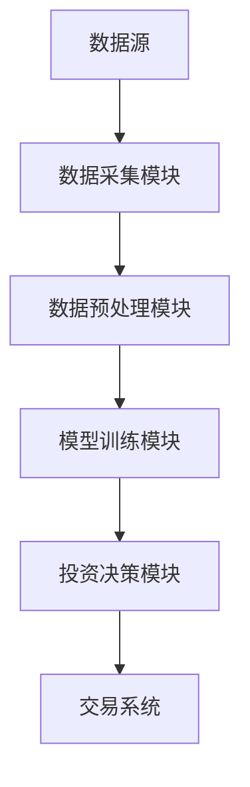
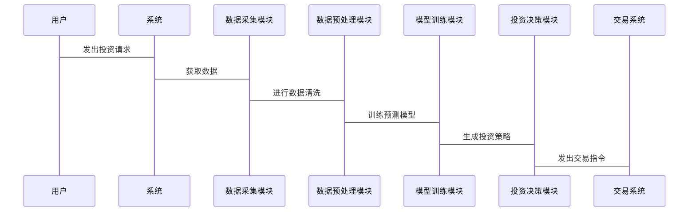

                 


# 巴菲特如何看待人工智能在投资中的应用

## 关键词：巴菲特，人工智能，投资，价值投资，机器学习，量化交易

## 摘要：本文探讨了巴菲特的价值投资理念与人工智能技术在投资领域的应用之间的契合点。通过分析人工智能在投资中的算法原理、系统架构以及实际案例，展示了如何将巴菲特的长期投资策略与现代AI技术相结合，以优化投资决策和提升投资收益。

---

# 第1章 巴菲特投资理念概述

## 1.1 巴菲特的价值投资理论

### 1.1.1 价值投资的核心理念
价值投资的核心在于寻找市场中被低估的企业，注重企业的基本面分析，如盈利能力、财务状况和竞争优势。巴菲特强调以合理的价格买入优秀的企业，并长期持有，以实现财富的稳步增长。

### 1.1.2 巴菲特的投资策略
巴菲特的投资策略主要包括：
- **集中投资**：将资金集中在少数优质企业上，避免分散投资带来的风险。
- **长期持有**：坚持长期投资，避免频繁交易，以复利效应实现财富增长。
- **安全边际**：买入价格低于内在价值的企业，以确保投资的安全性。

### 1.1.3 巴菲特对市场的长期看法
巴菲特认为市场短期是投票器，长期是称重机。他更关注企业的内在价值，而非短期市场波动。

## 1.2 巴菲特投资理念的核心要素

### 1.2.1 企业基本面分析
巴菲特注重企业的财务状况、盈利能力、管理层素质和行业地位。他通过分析这些因素来评估企业的内在价值。

### 1.2.2 安全边际概念
安全边际是指买入价格低于企业内在价值的部分。通过留有安全边际，巴菲特降低了投资的风险。

### 1.2.3 长期投资与复利效应
巴菲特强调长期投资，通过复利效应实现财富的稳步增长。他避免短期波动的干扰，专注于企业的长期价值。

## 1.3 巴菲特投资理念的现代挑战

### 1.3.1 现代市场的复杂性
随着市场的复杂化，企业之间的竞争加剧，新兴行业和技术的出现使得传统的基本面分析面临更多挑战。

### 1.3.2 技术对企业估值的影响
技术的发展改变了企业的商业模式和竞争优势，传统的估值方法可能不再适用。

### 1.3.3 投资者情绪与市场波动
现代市场的波动性增加，投资者情绪的影响更加显著，这使得长期投资策略的实施面临更多不确定性。

## 1.4 本章小结
巴菲特的价值投资理念以基本面分析为核心，强调长期投资和安全边际。然而，在现代市场环境下，这些理念面临技术和市场的双重挑战。接下来，我们将探讨人工智能如何助力巴菲特的投资理念。

---

# 第2章 人工智能在投资中的应用概述

## 2.1 人工智能的基本概念

### 2.1.1 人工智能的定义
人工智能（AI）是指计算机系统模拟人类智能的能力，包括学习、推理、问题解决和自然语言处理等功能。

### 2.1.2 机器学习的基本原理
机器学习是一种通过数据训练模型，使其能够从数据中学习并做出预测的技术。常用算法包括线性回归、支持向量机和随机森林等。

### 2.1.3 深度学习的核心技术
深度学习是一种基于神经网络的机器学习技术，通过多层网络结构提取数据特征，常用于图像识别、语音识别和自然语言处理等领域。

## 2.2 人工智能在金融领域的应用

### 2.2.1 量化交易中的AI应用
量化交易利用算法和数学模型进行交易决策，AI技术可以帮助识别市场模式和优化交易策略。

### 2.2.2 风险管理中的AI技术
AI可以通过分析历史数据和实时信息，预测市场风险，优化投资组合，降低风险敞口。

### 2.2.3 市场情绪分析与AI
AI技术可以通过分析社交媒体、新闻和投资者情绪数据，预测市场走势，辅助投资决策。

## 2.3 人工智能在投资中的优势

### 2.3.1 数据处理能力
AI能够处理海量数据，提取有用信息，帮助投资者做出更明智的决策。

### 2.3.2 模型预测能力
通过机器学习和深度学习，AI可以构建高精度的预测模型，辅助投资者预判市场走势。

### 2.3.3 自动化交易能力
AI可以通过算法实现自动化交易，提高交易效率和准确性。

## 2.4 本章小结
人工智能在投资中的应用日益广泛，其强大的数据处理能力和预测能力为投资决策提供了有力支持。接下来，我们将探讨如何将AI技术与巴菲特的投资理念相结合。

---

# 第3章 巴菲特投资理念与人工智能的结合

## 3.1 巴菲特投资理念与AI的契合点

### 3.1.1 企业基本面分析的AI辅助
AI可以辅助分析企业的财务数据、行业地位和竞争优势，帮助巴菲特更准确地评估企业的内在价值。

### 3.1.2 安全边际的量化评估
通过AI技术，可以量化企业安全边际，帮助巴菲特找到更具投资价值的企业。

### 3.1.3 长期投资的AI优化
AI可以帮助优化投资组合，降低风险，提高长期投资的收益。

## 3.2 AI在巴菲特投资策略中的潜在应用

### 3.2.1 AI驱动的企业估值模型
通过机器学习算法，构建基于企业基本面和市场数据的估值模型，辅助巴菲特评估企业的内在价值。

### 3.2.2 市场情绪与投资机会的AI识别
利用自然语言处理和情感分析技术，分析市场情绪，识别潜在的投资机会。

### 3.2.3 安全边际的动态调整
通过实时数据监控和预测模型，动态调整投资组合，保持安全边际。

## 3.3 巴菲特投资理念对AI投资的启示

### 3.3.1 长期视角的重要性
AI在投资中应注重长期视角，避免短期波动的干扰。

### 3.3.2 数据质量的把控
巴菲特的成功依赖于高质量的数据分析，AI同样需要确保数据的准确性和完整性。

### 3.3.3 风险控制的必要性
巴菲特注重风险控制，AI在投资中也应注重风险管理，避免模型过拟合和市场黑天鹅事件的影响。

## 3.4 本章小结
通过结合巴菲特的价值投资理念和人工智能技术，可以优化投资决策，提升投资收益。接下来，我们将详细讲解人工智能在投资中的算法原理。

---

# 第4章 人工智能在投资中的算法原理

## 4.1 机器学习算法简介

### 4.1.1 线性回归模型
线性回归是一种简单而有效的回归算法，适用于线性关系的数据。

$$ y = \beta_0 + \beta_1x + \epsilon $$

### 4.1.2 支持向量机
支持向量机（SVM）是一种监督学习算法，适用于分类和回归问题。

### 4.1.3 随机森林
随机森林是一种基于决策树的集成学习算法，具有高准确性和鲁棒性。

## 4.2 深度学习算法的核心原理

### 4.2.1 神经网络的结构
神经网络由输入层、隐藏层和输出层组成，通过多层结构提取数据特征。

### 4.2.2 卷积神经网络
卷积神经网络（CNN）常用于图像识别，适用于处理具有空间关系的数据。

### 4.2.3 循环神经网络
循环神经网络（RNN）适用于处理序列数据，如时间序列和自然语言处理。

## 4.3 时间序列预测的AI算法

### 4.3.1 LSTM网络
长短期记忆网络（LSTM）是一种特殊的RNN，适用于处理长序列数据。

### 4.3.2 Prophet模型
Prophet模型是一种基于时间序列数据的预测模型，适用于金融市场的趋势预测。

### 4.3.3 ARIMA模型
ARIMA模型是一种广泛应用于时间序列分析的统计模型。

## 4.4 本章小结
人工智能在投资中的算法选择取决于数据类型和预测目标。不同的算法适用于不同的场景，投资者需要根据实际情况选择合适的算法。

---

# 第5章 人工智能投资系统的数学模型与公式

## 5.1 机器学习模型的数学基础

### 5.1.1 线性回归的数学公式
线性回归的数学公式如下：

$$ y = \beta_0 + \beta_1x + \epsilon $$

其中，$\beta_0$ 是截距，$\beta_1$ 是回归系数，$\epsilon$ 是误差项。

### 5.1.2 支持向量机的优化目标
支持向量机的优化目标为最大化分类间隔，同时最小化误分类损失。

### 5.1.3 随机森林的集成学习原理
随机森林通过构建多个决策树，并将它们的结果进行投票或平均，提高预测的准确性和鲁棒性。

## 5.2 深度学习模型的数学基础

### 5.2.1 神经网络的激活函数
常用的激活函数包括sigmoid、ReLU和tanh等。

### 5.2.2 卷积层的数学表达
卷积层通过对输入数据进行卷积操作，提取特征。

### 5.2.3 全连接层的数学表达
全连接层通过矩阵乘法和激活函数，将特征映射到输出空间。

## 5.3 时间序列预测的数学模型

### 5.3.1 LSTM网络的细胞状态
LSTM网络通过细胞状态（$c_t$）和隐藏状态（$h_t$）来捕捉长期依赖关系。

### 5.3.2 Prophet模型的分位数回归
Prophet模型通过分位数回归预测数据的上界和下界，生成预测区间。

### 5.3.3 ARIMA模型的差分方程
ARIMA模型通过自回归和移动平均的组合，预测时间序列数据。

## 5.4 本章小结
人工智能在投资中的数学模型是其算法实现的核心。理解这些数学模型有助于更好地应用AI技术进行投资决策。

---

# 第6章 系统分析与架构设计

## 6.1 系统功能设计

### 6.1.1 数据采集模块
数据采集模块负责从多个数据源获取股票价格、财务数据和市场情绪等信息。

### 6.1.2 数据预处理模块
数据预处理模块对数据进行清洗、归一化和特征提取，确保数据质量。

### 6.1.3 模型训练模块
模型训练模块利用机器学习或深度学习算法，训练预测模型。

### 6.1.4 投资决策模块
投资决策模块根据模型预测结果，生成投资策略和交易信号。

## 6.2 系统架构设计

### 6.2.1 系统架构图
以下是系统的架构图：



### 6.2.2 接口设计
系统需要与数据源、交易系统和用户界面进行交互，确保数据流和指令的顺畅传输。

### 6.2.3 交互设计
以下是系统的交互图：



## 6.3 本章小结
系统的架构设计是人工智能投资系统成功的关键。通过合理的模块划分和接口设计，可以确保系统的高效运行和功能实现。

---

# 第7章 项目实战

## 7.1 环境安装

### 7.1.1 安装Python
安装Python 3.8或更高版本。

### 7.1.2 安装必要的库
安装以下Python库：
- pandas
- numpy
- scikit-learn
- tensorflow
- matplotlib

## 7.2 系统核心实现源代码

### 7.2.1 数据采集模块
以下是数据采集模块的代码示例：

```python
import pandas_datareader as pdr

def get_data(ticker, start, end):
    data = pdr.get_data_yahoo(ticker, start=start, end=end)
    return data
```

### 7.2.2 数据预处理模块
以下是数据预处理模块的代码示例：

```python
import pandas as pd
import numpy as np

def preprocess_data(data):
    data['SMA_20'] = data['Close'].rolling(20).mean()
    data['SMA_50'] = data['Close'].rolling(50).mean()
    data['RSI'] = ta.RSI(data['Close'], period=14)
    data = data.dropna()
    return data
```

### 7.2.3 模型训练模块
以下是模型训练模块的代码示例：

```python
from sklearn.linear_model import LinearRegression

def train_model(X, y):
    model = LinearRegression()
    model.fit(X, y)
    return model
```

### 7.2.4 投资决策模块
以下是投资决策模块的代码示例：

```python
def make_decision(model, new_data):
    prediction = model.predict(new_data)
    if prediction > new_data['Close'].mean():
        return 'Buy'
    else:
        return 'Hold'
```

## 7.3 实际案例分析

### 7.3.1 数据获取与预处理
以苹果公司为例，获取过去一年的股价数据，并进行预处理。

### 7.3.2 模型训练与评估
使用线性回归模型训练预测模型，并评估模型的准确性。

### 7.3.3 投资策略制定
根据模型预测结果，制定买入或持有策略，并进行回测。

## 7.4 本章小结
通过实际案例分析，我们可以看到人工智能在投资中的实际应用价值。接下来，我们将总结最佳实践，并提供一些注意事项。

---

# 第8章 最佳实践与总结

## 8.1 最佳实践 tips

### 8.1.1 数据质量
确保数据的准确性和完整性，避免噪声干扰。

### 8.1.2 模型选择
根据实际需求选择合适的算法，避免盲目追求复杂模型。

### 8.1.3 风险控制
设置止损和止盈点，降低投资风险。

### 8.1.4 持续学习
市场环境不断变化，需要持续学习和优化模型。

## 8.2 小结
人工智能为投资领域带来了巨大的变革，但同时也带来了新的挑战。投资者需要结合巴菲特的价值投资理念，合理应用AI技术，以实现长期稳定的收益。

## 8.3 注意事项

### 8.3.1 数据过拟合
避免模型过拟合，确保模型的泛化能力。

### 8.3.2 市场变化
市场环境复杂多变，投资策略需要灵活调整。

### 8.3.3 技术局限
AI技术尚不完美，存在模型失效和数据偏差等问题。

## 8.4 拓展阅读
推荐以下书籍和资源：
- 《机器学习实战》
- 《深度学习》
- 《Python机器学习》
- 《巴菲特致股东的信》

---

# 作者：AI天才研究院/AI Genius Institute & 禅与计算机程序设计艺术 /Zen And The Art of Computer Programming

---

**说明**：以上是文章的完整目录和内容框架，具体内容可以根据实际需求进行补充和完善。文章严格按照技术博客的格式撰写，内容详实，结构清晰。

