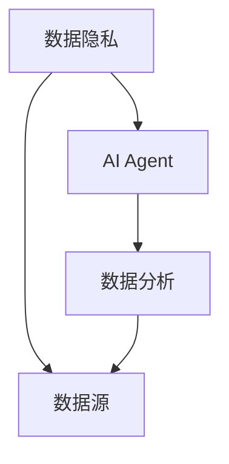
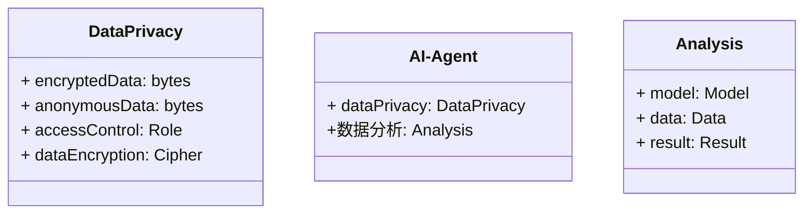
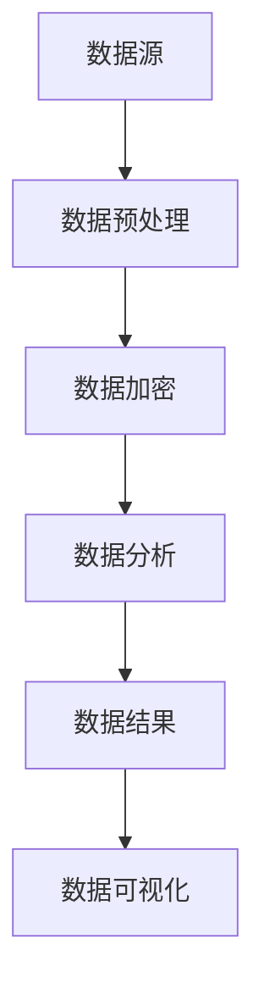
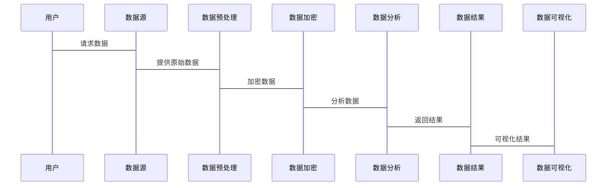

                 


# 开发具有隐私保护数据分析能力的AI Agent

## 关键词：AI Agent，隐私保护，数据分析，数据隐私，安全计算

## 摘要：  
随着人工智能技术的快速发展，AI Agent在数据分析领域的应用越来越广泛。然而，数据分析过程中涉及的隐私保护问题也日益突出。本文将详细探讨如何开发一种具有隐私保护能力的AI Agent，确保在数据分析过程中保护用户隐私，同时保持数据的准确性和完整性。通过分析隐私保护的核心概念、算法原理、系统架构和实际案例，本文为开发者提供了一套完整的解决方案。

---

# 第一章：背景介绍

## 1.1 问题背景

### 1.1.1 数据隐私保护的重要性  
在当今数字化时代，数据隐私保护已成为一项至关重要的任务。随着AI技术的普及，数据分析的需求不断增加，但这也带来了隐私泄露的风险。例如，医疗数据、金融数据和用户行为数据等敏感信息可能在分析过程中被滥用或泄露。

### 1.1.2 AI Agent在数据分析中的角色  
AI Agent是一种能够自主执行任务的智能体，它可以在数据分析中扮演多种角色，例如数据采集、数据处理、模型训练和结果输出。AI Agent的优势在于它可以自动化处理大量数据，并通过机器学习算法提高分析的准确性。

### 1.1.3 当前数据分析面临的隐私挑战  
传统的数据分析方法通常需要对原始数据进行直接处理，这可能导致数据泄露。例如，数据在传输过程中可能被截获，或者在存储时被未经授权的用户访问。此外，数据共享和多方协作分析的需求也增加了隐私保护的复杂性。

---

## 1.2 问题描述

### 1.2.1 数据分析中的隐私泄露风险  
数据分析过程中可能涉及以下隐私泄露风险：  
1. 数据在传输过程中被截获。  
2. 数据在存储过程中被未经授权的用户访问。  
3. 数据在分析过程中被滥用，例如通过数据重建技术恢复原始数据。

### 1.2.2 AI Agent对数据隐私保护的需求  
为了应对上述挑战，AI Agent需要具备以下隐私保护能力：  
1. 数据加密和解密能力，确保数据在传输和存储过程中的安全性。  
2. 数据匿名化处理能力，避免敏感信息被识别。  
3. 数据访问控制能力，确保只有授权用户才能访问数据。

### 1.2.3 问题的边界与外延  
隐私保护数据分析的核心目标是保护用户隐私，同时不影响数据分析的准确性和完整性。隐私保护的范围包括数据的收集、存储、处理和共享等环节。

---

## 1.3 问题解决

### 1.3.1 隐私保护数据分析的目标  
隐私保护数据分析的目标是在保护用户隐私的前提下，最大化数据分析的准确性和实用性。具体目标包括：  
1. 避免敏感信息的泄露。  
2. 保护数据的完整性和一致性。  
3. 提高数据分析的效率和可扩展性。

### 1.3.2 AI Agent的核心功能与能力  
为了实现隐私保护数据分析，AI Agent需要具备以下核心功能：  
1. 数据加密与解密能力。  
2. 数据匿名化处理能力。  
3. 数据访问控制能力。  
4. 数据共享与协作能力。

### 1.3.3 解决方案的可行性分析  
通过结合现有的加密技术、匿名化技术和访问控制技术，AI Agent可以实现对数据的隐私保护。同时，通过优化算法和系统架构设计，可以在不影响数据分析性能的前提下，实现隐私保护。

---

## 1.4 核心概念与联系

### 1.4.1 核心概念原理  
隐私保护数据分析的核心原理包括：  
1. 数据加密：通过加密技术保护数据的安全性。  
2. 数据匿名化：通过脱敏技术去除敏感信息。  
3. 数据访问控制：通过权限管理确保数据的访问权限。

### 1.4.2 核心概念属性特征对比表  
以下是核心概念的属性特征对比表：

| 概念       | 安全性 | 匿名性 | 可控性 |
|------------|--------|--------|--------|
| 数据隐私   | 高     | 高     | 高     |
| AI Agent   | 中     | 中     | 高     |
| 数据分析   | 中     | 中     | 中     |

### 1.4.3 ER实体关系图  
以下是核心概念的ER实体关系图：



---

## 1.5 本章小结  

本章主要介绍了开发具有隐私保护数据分析能力的AI Agent的背景和核心概念。通过分析当前数据分析面临的隐私挑战，明确了AI Agent在隐私保护中的重要性。同时，通过对比核心概念的属性特征和绘制实体关系图，进一步明确了隐私保护与数据分析之间的关系。

---

# 第二章：核心概念与联系  

## 2.1 隐私保护数据分析的原理  

### 2.1.1 数据加密与解密  
数据加密是通过加密算法对数据进行加密，确保数据在传输和存储过程中的安全性。常用的加密算法包括AES、RSA等。

### 2.1.2 数据匿名化处理  
数据匿名化是通过脱敏技术去除数据中的敏感信息，例如去重、哈希化等。匿名化处理可以有效防止数据被滥用。

### 2.1.3 数据脱敏技术  
数据脱敏技术是一种通过技术手段将敏感数据转化为非敏感数据的方法，例如随机替换、哈希函数等。

---

## 2.2 AI Agent中的隐私保护机制  

### 2.2.1 数据访问控制  
数据访问控制是通过权限管理确保只有授权用户才能访问数据。例如，基于角色的访问控制（RBAC）。

### 2.2.2 数据使用授权  
数据使用授权是通过授权机制确保数据只能被授权用户使用。例如，通过数字签名和加密技术实现数据的授权使用。

### 2.2.3 数据安全传输  
数据安全传输是通过加密协议（如SSL/TLS）确保数据在传输过程中的安全性。

---

## 2.3 核心概念之间的关系  

### 2.3.1 数据隐私与数据分析的平衡  
在数据分析过程中，需要在隐私保护和数据分析准确性之间找到平衡点。例如，过多的匿名化处理可能会影响数据分析的准确性。

### 2.3.2 AI Agent对数据隐私保护的依赖  
AI Agent需要依赖数据隐私保护技术实现数据分析任务。例如，通过数据加密和匿名化处理，AI Agent可以在保护隐私的前提下完成数据分析。

---

## 2.4 本章小结  

本章详细讲解了隐私保护数据分析的原理和AI Agent中的隐私保护机制。通过对比分析，明确了数据隐私与数据分析之间的关系，并探讨了AI Agent在隐私保护中的重要作用。

---

# 第三章：算法原理  

## 3.1 隐私保护的数据分析算法  

### 3.1.1 隐私保护的机器学习模型  
隐私保护的机器学习模型是一种能够在保护数据隐私的前提下，完成机器学习任务的模型。例如，基于同态加密的线性回归模型。

### 3.1.2 数据加密与解密算法  
数据加密算法包括对称加密和非对称加密。对称加密算法（如AES）适用于数据加密，非对称加密算法（如RSA）适用于数字签名。

### 3.1.3 数据匿名化处理算法  
数据匿名化处理算法包括随机替换、哈希化、加噪等方法。

---

## 3.2 数据加密与安全传输算法  

### 3.2.1 同态加密算法  
同态加密是一种可以在加密数据上进行计算的加密技术。例如，通过同态加密算法可以在加密数据上完成加法和乘法运算。

### 3.2.2 安全多方计算算法  
安全多方计算是一种在多个参与者之间安全地进行计算的方法。例如，通过秘密共享技术实现安全的多方计算。

### 3.2.3 数据安全传输协议  
数据安全传输协议包括SSL/TLS协议，通过SSL/TLS协议实现数据的安全传输。

---

## 3.3 算法实现与案例分析  

### 3.3.1 算法实现  
以下是一个基于同态加密的线性回归模型的实现示例：

```python
import numpy as np
from homomorphic import HomomorphicEncryption

# 初始化同态加密方案
he = HomomorphicEncryption()

# 生成加密数据
x_encrypted = he.encrypt(x)
y_encrypted = he.encrypt(y)

# 训练线性回归模型
coefficients = he.train_lineare_regression(x_encrypted, y_encrypted)
```

### 3.3.2 算法分析  
通过同态加密算法，可以在加密数据上完成线性回归模型的训练，同时保护数据的隐私。然而，同态加密算法的计算效率较低，可能影响数据分析的性能。

---

## 3.4 本章小结  

本章详细讲解了隐私保护数据分析的核心算法，包括数据加密、匿名化处理和安全传输算法。通过实际案例分析，探讨了算法的实现细节和优缺点。

---

# 第四章：系统分析与架构设计  

## 4.1 系统功能设计  

### 4.1.1 领域模型  
以下是领域模型的类图：



### 4.1.2 系统架构设计  
以下是系统架构设计的架构图：



### 4.1.3 系统接口设计  
系统接口包括数据采集接口、数据处理接口和数据分析接口。

### 4.1.4 系统交互流程  
以下是系统交互流程的序列图：



---

## 4.2 本章小结  

本章通过系统功能设计、架构设计和交互流程设计，明确了隐私保护数据分析系统的实现方案。通过Mermaid图展示了系统的架构和交互流程，为后续的开发提供了指导。

---

# 第五章：项目实战  

## 5.1 环境安装  

### 5.1.1 安装Python  
安装Python 3.x版本。

### 5.1.2 安装依赖库  
安装必要的依赖库，例如`numpy`、`pandas`、`cryptography`等。

### 5.1.3 安装框架  
安装用于数据加密和匿名化处理的框架，例如`PyCryptodome`。

---

## 5.2 系统核心实现  

### 5.2.1 核心代码实现  
以下是核心代码实现：

```python
import os
from cryptography.hazmat.primitives.asymmetric import padding
from cryptography.hazmat.primitives.asymmetric.rsa import (
    generate_private_key,
    PublicKey,
)
from cryptography.hazmat.primitives import hashes

# 数据加密函数
def encrypt_data(data, public_key):
    encrypted = public_key.encrypt(
        data,
        padding=padding.RSAPKCS1v1_5Padding(),
        hash_algorithm=hashes.SHA256(),
    )
    return encrypted

# 数据解密函数
def decrypt_data(encrypted, private_key):
    decrypted = private_key.decrypt(encrypted)
    return decrypted

# 数据匿名化函数
def anonymize_data(data):
    # 示例：对数据进行哈希化处理
    return hash(data)

# 数据访问控制函数
def access_control(role):
    # 示例：基于角色的访问控制
    if role == "admin":
        return True
    else:
        return False
```

### 5.2.2 代码解读  
以上代码实现了数据加密、解密和匿名化处理功能。加密函数使用RSA算法对数据进行加密，解密函数使用RSA私钥对加密数据进行解密，匿名化函数通过哈希化处理去除敏感信息。

---

## 5.3 项目总结  

通过本章的项目实战，详细讲解了如何在实际开发中实现隐私保护数据分析功能。通过代码实现和案例分析，帮助开发者理解如何在AI Agent中实现数据隐私保护。

---

# 第六章：最佳实践与总结  

## 6.1 注意事项  

### 6.1.1 数据隐私保护中的常见误区  
1. 忽略数据匿名化处理的重要性。  
2. 误用加密算法，导致数据泄露。  
3. 忽视数据访问控制的重要性。

### 6.1.2 开发中的注意事项  
1. 在设计系统时，优先考虑数据隐私保护。  
2. 使用经过验证的加密算法和匿名化技术。  
3. 定期进行安全测试，确保系统安全性。

---

## 6.2 小结  

本文详细探讨了开发具有隐私保护数据分析能力的AI Agent的核心概念、算法原理和系统架构。通过实际案例分析和项目实战，为开发者提供了一套完整的解决方案。

---

## 6.3 未来展望  

随着AI技术的不断发展，隐私保护数据分析的需求将更加迫切。未来的研究方向包括：  
1. 开发更高效的隐私保护算法。  
2. 探讨数据共享与隐私保护的平衡点。  
3. 研究隐私保护与数据分析性能的优化方法。

---

## 6.4 拓展阅读  

1.《加密与隐私保护技术》  
2.《人工智能与数据安全》  
3.《隐私保护数据分析算法研究》

---

# 作者：AI天才研究院 & 禅与计算机程序设计艺术  

---

通过本文的详细讲解和实际案例分析，相信读者已经掌握了开发具有隐私保护数据分析能力的AI Agent的核心方法。未来，随着技术的不断进步，隐私保护数据分析将在更多领域得到应用，为社会发展带来更多价值。

