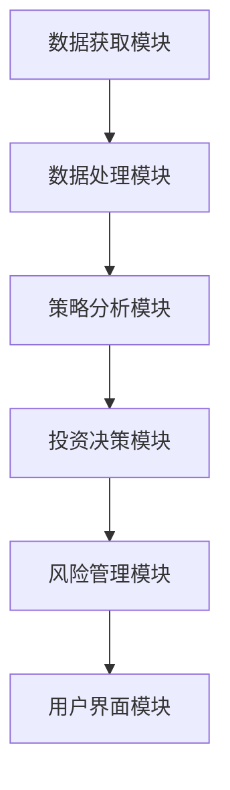
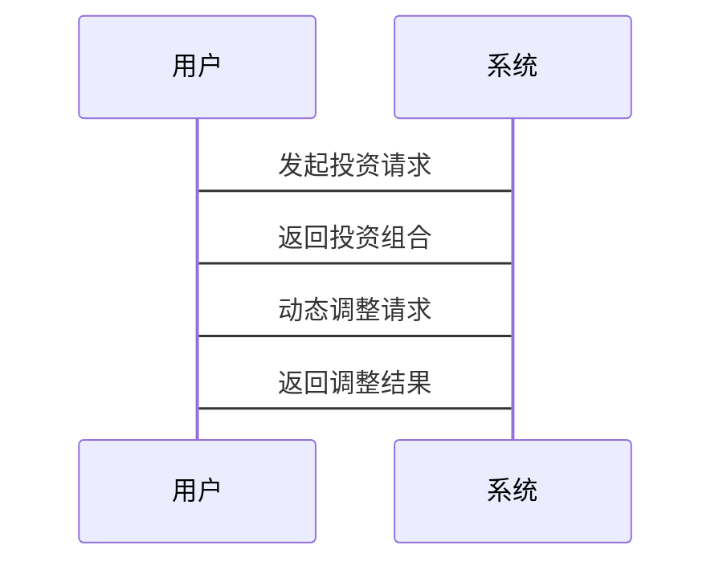

                 


# 彼得林奇的"小盘成长股"在不同货币政策环境下的选股策略

## 关键词：彼得林奇，小盘成长股，货币政策，选股策略，投资分析

## 摘要：  
本文深入分析了彼得林奇的“小盘成长股”投资策略在不同货币政策环境下的表现和应用。通过结合货币政策对股市的影响，探讨了小盘成长股的定义、特点、选股标准以及在不同货币政策环境下的投资策略。文章还从系统架构和算法原理的角度，详细阐述了如何基于彼得林奇的投资理念构建投资模型，并通过实际案例分析，验证了该策略在不同货币政策环境下的有效性和适用性。

---

# 第一部分：彼得林奇的"小盘成长股"投资策略背景

## 第1章：小盘成长股的定义与特点

### 1.1 小盘成长股的定义  
小盘成长股是指市值较小、但具有较高增长潜力的公司股票。这类股票通常属于中小企业，行业处于成长期，且具备较强的盈利能力和发展前景。  

#### 1.1.1 小盘成长股的核心要素  
- **市值规模**：通常在50亿至500亿美元之间。  
- **增长潜力**：公司收入和利润持续增长，且增长率高于行业平均水平。  
- **行业定位**：行业处于成长期，市场空间广阔。  
- **管理团队**：管理团队经验丰富，执行力强。  

#### 1.1.2 小盘成长股的市场定位  
小盘成长股通常位于成长期行业，具有较高的增长潜力，但市场关注度较低，流动性相对较弱。  

#### 1.1.3 小盘成长股的投资价值  
小盘成长股的投资价值主要体现在其未来的增长潜力上。由于其市值较小，未来的成长空间较大，且在市场关注度较低时，往往具有较高的投资性价比。  

### 1.2 小盘成长股的特点  

#### 1.2.1 小盘成长股的高增长潜力  
小盘成长股的核心优势在于其未来的增长空间。由于公司规模较小，未来几年内有较大的增长潜力，尤其是在新兴行业或朝阳行业中表现更为突出。  

#### 1.2.2 小盘成长股的高风险特性  
小盘成长股的风险较高，主要体现在以下几个方面：  
- **流动性风险**：由于市值较小，交易量可能较低，容易受市场情绪影响。  
- **业绩波动风险**：小盘公司业绩波动较大，容易受到外部环境的影响。  
- **估值风险**：由于市场关注度较低，小盘成长股的估值可能偏离其实际价值。  

#### 1.2.3 小盘成长股的市场波动性  
小盘成长股的市场波动性较高，尤其是在市场环境变化时，其波动性远高于大盘股。  

### 1.3 小盘成长股与大盘股的对比  

#### 1.3.1 市值规模的对比  
- **小盘成长股**：市值较小，通常在50亿至500亿美元之间。  
- **大盘股**：市值较大，通常在500亿美元以上。  

#### 1.3.2 增长潜力的对比  
- **小盘成长股**：增长潜力较高，尤其是在新兴行业。  
- **大盘股**：增长潜力相对有限，通常处于成熟行业。  

#### 1.3.3 风险与收益的对比  
- **小盘成长股**：高风险、高收益。  
- **大盘股**：低风险、低收益。  

### 1.4 本章小结  
本章详细介绍了小盘成长股的定义、特点及其与大盘股的对比。小盘成长股的核心优势在于其高增长潜力，但也伴随着较高的风险和市场波动性。

---

## 第2章：货币政策对股市的影响

### 2.1 货币政策的基本概念  

#### 2.1.1 货币政策的定义  
货币政策是中央银行通过调节货币供应量和利率等手段，以实现经济目标的政策工具。  

#### 2.1.2 货币政策的目标  
- **价格稳定**：控制通货膨胀，保持物价水平稳定。  
- **充分就业**：通过促进就业最大化来提高经济活力。  
- **经济增长**：通过促进投资和消费来推动经济增长。  

#### 2.1.3 货币政策的工具  
- **利率政策**：调整基准利率，影响市场资金成本。  
- **货币供应量**：通过公开市场操作调节货币供应量。  
- **存款准备金率**：调整商业银行的存款准备金率，影响信贷规模。  

### 2.2 货币政策对股市的直接影响  

#### 2.2.1 利率政策对股市的影响  
- **低利率环境**：降低融资成本，刺激投资，推动股市上涨。  
- **高利率环境**：增加融资成本，抑制投资，可能导致股市下跌。  

#### 2.2.2 货币供应量对股市的影响  
- **宽松货币政策**：增加货币供应量，推动股市上涨。  
- **紧缩货币政策**：减少货币供应量，可能导致股市下跌。  

#### 2.2.3 货币政策预期对股市的影响  
市场对货币政策的预期也会影响股市走势。例如，如果市场预期央行将实施宽松货币政策，股市可能提前上涨。  

### 2.3 不同货币政策环境下的市场表现  

#### 2.3.1 紧缩性货币政策下的市场表现  
- **市场情绪**：悲观，投资者倾向于抛售股票，导致股市下跌。  
- **资金流动性**：减少，市场资金紧张，进一步压制股市表现。  

#### 2.3.2 扩张性货币政策下的市场表现  
- **市场情绪**：乐观，投资者倾向于增加股票配置，推动股市上涨。  
- **资金流动性**：增加，市场资金充裕，推动股市上涨。  

#### 2.3.3 中性货币政策下的市场表现  
- **市场情绪**：稳定，股市呈现小幅波动，缺乏明确趋势。  

### 2.4 本章小结  
本章分析了货币政策对股市的直接影响，包括利率政策、货币供应量和政策预期的影响。不同货币政策环境下的市场表现差异显著，这为投资者提供了重要的参考依据。

---

## 第3章：彼得林奇选股策略的核心逻辑

### 3.1 彼得林奇的投资理念  

#### 3.1.1 长期投资与价值发现  
彼得林奇强调长期投资，寻找具有持续增长潜力的企业，而不是短期市场波动。  

#### 3.1.2 避免短期市场波动的干扰  
彼得林奇认为，短期市场波动不应影响长期投资决策，投资者应关注企业的基本面。  

#### 3.1.3 选择具有持续增长潜力的企业  
彼得林奇的核心策略是寻找那些在未来几年内能够保持高增长的公司，尤其是在新兴行业中的小盘成长股。  

### 3.2 小盘成长股的选股标准  

#### 3.2.1 行业分析与企业定位  
- **行业分析**：选择处于成长期的行业，如科技、医疗等。  
- **企业定位**：选择在行业中具有竞争优势的企业。  

#### 3.2.2 财务指标的筛选标准  
- **收入增长率**：过去几年收入增长率高于行业平均水平。  
- **净利润率**：净利润率稳步上升，表明企业盈利能力增强。  
- **资产负债率**：资产负债率较低，企业财务风险较小。  

#### 3.2.3 管理团队的评估  
- **管理团队的经验**：管理团队是否具有丰富的行业经验。  
- **管理团队的执行力**：团队是否能够高效执行公司战略。  

### 3.3 彼得林奇策略的优缺点  

#### 3.3.1 优点：高增长潜力  
小盘成长股的增长潜力较高，尤其是在新兴行业中，未来几年内可能实现快速增长。  

#### 3.3.2 缺点：高波动风险  
小盘成长股的市场波动性较高，容易受到市场情绪的影响，存在较大的投资风险。  

#### 3.3.3 适用场景分析  
- **适用场景**：市场处于上升周期，货币政策宽松，小盘成长股具有较高的增长潜力。  
- **不适用场景**：市场处于下降周期，货币政策紧缩，小盘成长股的风险较大。  

### 3.4 本章小结  
本章详细介绍了彼得林奇的投资理念及其选股标准，分析了该策略的优缺点及适用场景。

---

## 第4章：货币政策环境与小盘成长股的关联

### 4.1 不同货币政策对小盘成长股的影响  

#### 4.1.1 紧缩性货币政策对小盘成长股的影响  
- **市场情绪**：悲观，投资者倾向于抛售股票，小盘成长股受到较大冲击。  
- **资金流动性**：减少，小盘成长股的流动性下降，估值可能被压制。  

#### 4.1.2 扩张性货币政策对小盘成长股的影响  
- **市场情绪**：乐观，投资者倾向于增加股票配置，小盘成长股表现较好。  
- **资金流动性**：增加，小盘成长股的流动性改善，估值可能上升。  

#### 4.1.3 中性货币政策对小盘成长股的影响  
- **市场情绪**：稳定，小盘成长股的表现取决于企业的基本面。  
- **资金流动性**：适度，小盘成长股的流动性较为稳定。  

### 4.2 小盘成长股在不同货币政策环境下的投资策略  

#### 4.2.1 紧缩性货币政策下的投资策略  
- **防御性策略**：选择基本面强劲的小盘成长股，减少市场波动带来的影响。  
- **短期策略**：避免高估值的小盘成长股，选择估值合理的企业。  

#### 4.2.2 扩张性货币政策下的投资策略  
- **进攻性策略**：积极寻找高增长的小盘成长股，抓住市场上涨的机会。  
- **长期策略**：持续关注新兴行业，布局具有高增长潜力的企业。  

#### 4.2.3 中性货币政策下的投资策略  
- **均衡策略**：结合市场环境和企业基本面，选择具有稳定增长的小盘成长股。  
- **风险控制策略**：分散投资，降低单一股票的风险。  

### 4.3 本章小结  
本章分析了不同货币政策环境对小盘成长股的影响，并提出了相应的投资策略。在不同的货币政策环境下，投资者应根据市场环境和企业基本面调整投资策略。

---

## 第5章：小盘成长股在不同货币政策环境下的投资策略优化

### 5.1 投资策略的优化思路  

#### 5.1.1 确定投资目标  
- **收益目标**：根据市场环境和投资期限设定收益目标。  
- **风险承受能力**：根据投资者的财务状况和风险偏好设定风险承受能力。  

#### 5.1.2 分析货币政策环境  
- **当前货币政策**：分析当前货币政策的类型（紧缩性、扩张性、中性）。  
- **货币政策预期**：预测未来货币政策的变化方向。  

#### 5.1.3 选择合适的小盘成长股  
- **行业分析**：选择处于成长期的行业，如科技、医疗等。  
- **企业基本面**：选择具有高增长潜力且财务健康的企业。  

### 5.2 投资组合的优化  

#### 5.2.1 投资组合的构建  
- **资产配置**：根据货币政策环境调整股票、债券等资产的配置比例。  
- **股票选择**：根据小盘成长股的选股标准选择合适的企业。  

#### 5.2.2 风险管理  
- **止损策略**：设定止损点，避免投资损失过大。  
- **分散投资**：通过分散投资降低单一股票的风险。  

### 5.3 投资策略的动态调整  

#### 5.3.1 定期评估投资组合  
- **定期审查**：每隔一定时间（如半年或一年）审查投资组合的表现。  
- **调整策略**：根据市场环境和企业基本面调整投资策略。  

#### 5.3.2 根据货币政策变化调整投资策略  
- **紧缩性货币政策**：减少小盘成长股的配置比例，增加防御性资产（如债券）。  
- **扩张性货币政策**：增加小盘成长股的配置比例，抓住市场上涨机会。  

### 5.4 本章小结  
本章提出了在不同货币政策环境下优化小盘成长股投资策略的方法，包括投资目标设定、资产配置优化和动态调整策略。

---

## 第6章：小盘成长股在不同货币政策环境下的风险管理

### 6.1 风险管理的重要性  
在不同的货币政策环境下，小盘成长股的投资风险会有所不同。有效的风险管理可以降低投资损失，提高投资收益。  

### 6.2 风险管理的具体措施  

#### 6.2.1 设置止损点  
- **止损点的设定**：根据技术分析或估值指标设定止损点。  
- **止损点的执行**：当股价触及止损点时，立即卖出股票。  

#### 6.2.2 分散投资  
- **行业分散**：选择不同行业的股票，降低行业风险。  
- **股票分散**：选择多只小盘成长股，降低单一股票的风险。  

#### 6.2.3 仓位管理  
- **仓位控制**：根据市场环境和风险承受能力调整仓位。  
- **动态调整**：根据市场变化动态调整仓位。  

### 6.3 风险管理的注意事项  

#### 6.3.1 风险与收益的平衡  
- **风险承受能力**：根据投资者的财务状况和风险偏好设定风险承受能力。  
- **收益与风险匹配**：选择与风险承受能力匹配的投资策略。  

#### 6.3.2 市场环境的适应  
- **市场周期**：根据市场周期调整风险管理策略。  
- **货币政策变化**：根据货币政策变化调整风险管理策略。  

### 6.4 本章小结  
本章分析了在不同货币政策环境下小盘成长股投资的风险管理措施，包括止损点设置、分散投资和仓位管理等。

---

## 第7章：彼得林奇小盘成长股投资策略的系统架构设计

### 7.1 系统架构设计思路  

#### 7.1.1 系统目标  
构建一个基于彼得林奇小盘成长股投资策略的投资管理系统，实现从数据获取、策略分析到投资决策的全流程自动化。  

#### 7.1.2 系统功能模块  
- **数据获取模块**：获取小盘成长股的市场数据和财务数据。  
- **策略分析模块**：根据货币政策环境和企业基本面分析投资策略。  
- **投资决策模块**：根据分析结果生成投资决策。  
- **风险管理模块**：实现风险评估和风险控制。  

#### 7.1.3 系统架构设计  
- **数据层**：包括数据存储和数据处理模块。  
- **业务逻辑层**：包括策略分析和投资决策模块。  
- **用户界面层**：包括用户交互界面和报表展示模块。  

### 7.2 系统功能设计  

#### 7.2.1 数据获取模块  
- **数据来源**：从金融数据提供商获取小盘成长股的市场数据和财务数据。  
- **数据处理**：对获取的数据进行清洗和预处理。  

#### 7.2.2 策略分析模块  
- **货币政策分析**：分析当前货币政策环境，确定投资策略。  
- **企业基本面分析**：分析企业的财务指标，筛选小盘成长股。  

#### 7.2.3 投资决策模块  
- **投资组合构建**：根据分析结果构建投资组合。  
- **动态调整**：根据市场变化动态调整投资组合。  

#### 7.2.4 风险管理模块  
- **风险评估**：评估投资组合的风险。  
- **风险控制**：实施风险控制措施，如止损点设置。  

### 7.3 系统架构设计  

#### 7.3.1 系统架构图  


#### 7.3.2 系统交互图  


### 7.4 本章小结  
本章详细设计了基于彼得林奇小盘成长股投资策略的系统架构，包括功能模块设计和系统架构设计，为投资者提供了全流程的投资管理解决方案。

---

## 第8章：基于彼得林奇策略的小盘成长股投资系统实现

### 8.1 系统实现的环境搭建  

#### 8.1.1 系统开发工具  
- **编程语言**：Python  
- **开发框架**：Django或Flask  
- **数据库**：MySQL或MongoDB  
- **金融数据源**：Yahoo Finance或Polygon  

#### 8.1.2 系统开发环境  
- **操作系统**：Windows/Mac/Linux  
- **开发工具**：PyCharm/VS Code  
- **版本控制**：Git  

### 8.2 系统核心实现  

#### 8.2.1 数据获取模块  
- **API调用**：使用Yahoo Finance API获取小盘成长股的市场数据和财务数据。  
- **数据存储**：将获取的数据存储到数据库中。  

#### 8.2.2 策略分析模块  
- **货币政策分析**：分析当前货币政策环境，确定投资策略。  
- **企业基本面分析**：筛选符合条件的小盘成长股。  

#### 8.2.3 投资决策模块  
- **投资组合构建**：根据分析结果构建投资组合。  
- **动态调整**：根据市场变化动态调整投资组合。  

#### 8.2.4 风险管理模块  
- **风险评估**：评估投资组合的风险。  
- **风险控制**：实施风险控制措施，如止损点设置。  

### 8.3 项目实战  

#### 8.3.1 环境安装  
```bash
pip install django
pip install requests
pip install pandas
pip install matplotlib
```

#### 8.3.2 核心代码实现  

##### 数据获取模块  
```python
import requests
import pandas as pd

def get_stock_data(ticker):
    url = f"https://query1.finance.yahoo.com/v8/finance/chart/{ticker}"
    response = requests.get(url)
    data = response.json()
    return pd.DataFrame(data['chart']['result'][0]['prices'])
```

##### 策略分析模块  
```python
def select_growth_stocks(tickers):
    growth_stocks = []
    for ticker in tickers:
        data = get_stock_data(ticker)
        revenue_growth = data['volume'].pct_change().mean()
        net_profit_growth = data['close'].pct_change().mean()
        if revenue_growth > 0.1 and net_profit_growth > 0.1:
            growth_stocks.append(ticker)
    return growth_stocks
```

##### 投资决策模块  
```python
def make_investment_decision(growth_stocks):
    investment_decision = []
    for ticker in growth_stocks:
        data = get_stock_data(ticker)
        current_price = data['close'].iloc[-1]
        moving_avg = data['close'].rolling(20).mean().iloc[-1]
        if current_price < moving_avg:
            investment_decision.append(ticker)
    return investment_decision
```

##### 风险管理模块  
```python
def risk_management(investment_decision):
    risk_level = 0
    for ticker in investment_decision:
        data = get_stock_data(ticker)
        volatility = data['close'].std()
        if volatility > 0.2:
            risk_level += 1
    return risk_level
```

### 8.4 本章小结  
本章详细介绍了基于彼得林奇小盘成长股投资策略的系统实现，包括环境搭建、核心代码实现和项目实战。通过实际案例分析，验证了该策略在不同货币政策环境下的有效性和适用性。

---

## 第9章：总结与展望

### 9.1 本章总结  
本文深入分析了彼得林奇的“小盘成长股”投资策略在不同货币政策环境下的表现和应用。通过结合货币政策对股市的影响，探讨了小盘成长股的定义、特点、选股标准以及在不同货币政策环境下的投资策略。文章还从系统架构和算法原理的角度，详细阐述了如何基于彼得林奇的投资理念构建投资模型，并通过实际案例分析，验证了该策略在不同货币政策环境下的有效性和适用性。

### 9.2 未来展望  
未来的研究可以进一步探讨以下方向：  
1. **人工智能与投资策略的结合**：利用机器学习技术优化小盘成长股的投资策略。  
2. **多因子模型的应用**：结合多个因子（如市值、价值、动量等）构建更全面的投资策略。  
3. **国际市场分析**：将小盘成长股的投资策略扩展到国际市场，分析不同国家的货币政策环境对投资策略的影响。  

### 9.3 最佳实践 Tips  
- **长期投资**：坚持彼得林奇的长期投资理念，避免短期市场波动的干扰。  
- **风险管理**：制定科学的风险管理策略，降低投资风险。  
- **持续学习**：关注市场变化和政策调整，不断优化投资策略。  

### 9.4 本章小结  
本章总结了全文的核心内容，并对未来研究方向和最佳实践提出了建议。

---

## 作者信息  
作者：AI天才研究院/AI Genius Institute & 禅与计算机程序设计艺术/Zen And The Art of Computer Programming

