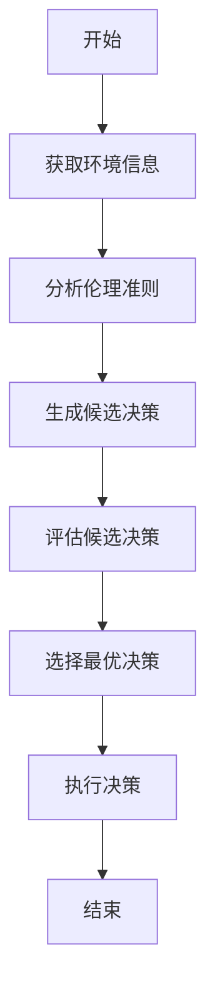
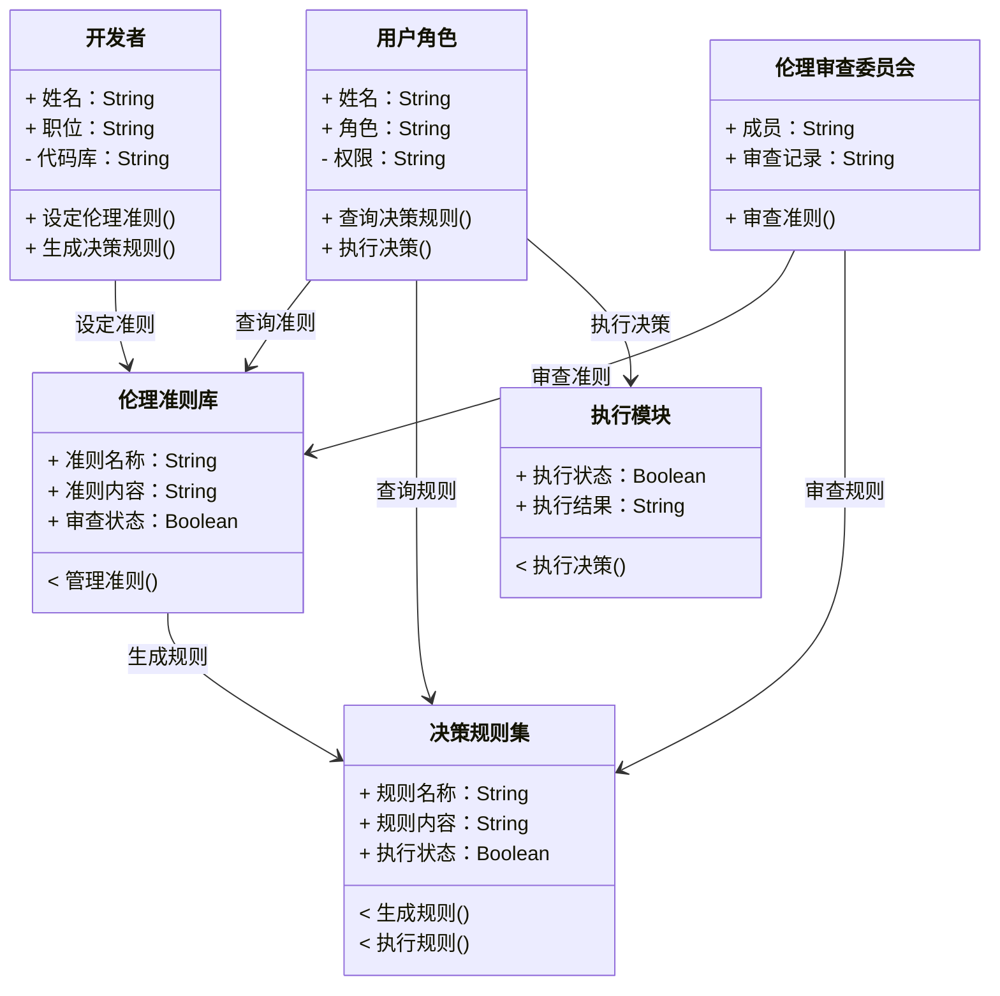
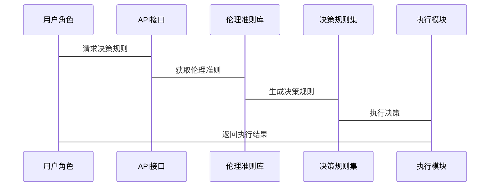

                 


# 构建AI Agent的伦理决策框架

---

## 关键词：AI Agent, 伦理决策, 框架构建, 决策算法, 系统架构, 实践案例

---

## 摘要：  
随着AI技术的快速发展，AI Agent在各个领域的应用越来越广泛。然而，AI Agent在决策过程中面临的伦理问题也日益凸显。本文旨在构建一个AI Agent的伦理决策框架，从背景介绍、核心概念、算法原理到系统架构和项目实战，全面分析伦理决策框架的构建方法。通过案例分析和最佳实践，本文为AI Agent的伦理决策提供了系统的解决方案。

---

# 第一部分: AI Agent与伦理决策框架的背景介绍

---

## 第1章: AI Agent的伦理决策背景

### 1.1 问题背景与问题描述

#### 1.1.1 AI Agent的定义与核心概念
AI Agent（人工智能代理）是指能够感知环境、自主决策并执行任务的智能实体。AI Agent的核心概念包括：
- **自主性**：能够在没有外部干预的情况下独立决策。
- **反应性**：能够实时感知环境并做出反应。
- **目标导向**：基于预设目标或学习目标进行决策。

#### 1.1.2 伦理决策在AI Agent中的重要性
AI Agent在医疗、金融、自动驾驶等领域广泛应用，其决策直接影响人类生命、财产和社会秩序。因此，确保AI Agent的决策符合伦理规范至关重要。

#### 1.1.3 当前AI Agent决策中的伦理挑战
- **隐私问题**：AI Agent可能收集和处理大量个人数据，引发隐私泄露风险。
- **公平性问题**：AI Agent的决策可能对某些群体产生不公平影响。
- **透明性问题**：复杂的算法可能导致决策过程不透明，难以解释。

### 1.2 伦理决策框架的构建目标

#### 1.2.1 构建伦理决策框架的必要性
为了确保AI Agent的决策符合伦理规范，需要一个统一的框架来指导其决策过程。

#### 1.2.2 伦理决策框架的核心目标
- 提供明确的伦理准则和决策规则。
- 确保决策过程的透明性和可解释性。
- 平衡效率与伦理合规性。

#### 1.2.3 框架的边界与外延
- **边界**：仅关注AI Agent的决策过程，不涉及数据采集和后处理。
- **外延**：涵盖从感知到执行的整个决策链。

### 1.3 框架的核心要素与组成

#### 1.3.1 伦理决策框架的组成结构
- **伦理准则层**：定义核心伦理准则（如隐私保护、公平性）。
- **决策规则层**：制定具体的决策规则。
- **执行层**：将决策规则应用于实际场景。

#### 1.3.2 各要素之间的关系与依赖
- 伦理准则层为决策规则层提供指导。
- 决策规则层通过执行层转化为具体行动。

#### 1.3.3 案例分析：AI Agent的伦理决策过程
以自动驾驶为例，AI Agent需要在遵守交通规则的同时，确保乘客和行人的安全。

### 1.4 本章小结
本章介绍了AI Agent的定义、伦理决策的重要性及其面临的挑战，明确了伦理决策框架的构建目标和核心要素。

---

# 第二部分: 伦理决策框架的核心概念与联系

---

## 第2章: 核心概念的原理与联系

### 2.1 伦理决策框架的原理分析

#### 2.1.1 伦理决策的基本原理
伦理决策是基于伦理准则和具体情境的权衡过程。AI Agent需要结合预设的伦理准则和实时环境信息进行决策。

#### 2.1.2 案例分析：AI Agent的伦理决策过程
以医疗AI为例，AI Agent需要在尊重患者隐私的前提下，提供最优的治疗方案。

#### 2.1.3 框架原理的数学模型
伦理决策框架可以表示为一个数学模型，其中：
$$ \text{决策} = \argmin_{a \in A} \{ f(a) | f(a) \text{符合伦理准则} \} $$
其中，$A$是可能的决策集，$f(a)$是决策的评估函数。

### 2.2 核心概念的属性对比

#### 2.2.1 框架要素的属性特征
| 要素       | 属性       | 描述                                                                 |
|------------|------------|----------------------------------------------------------------------|
| 伦理准则层 | 稳定性     | 决策准则的稳定性，即在不同场景下是否适用。                                       |
| 决策规则层 | 可定制性   | 是否可以根据具体场景调整决策规则。                                               |
| 执行层     | 可扩展性   | 是否能够适应不同类型的AI Agent。                                                 |

#### 2.2.2 案例分析：属性特征的实际应用
以自动驾驶为例，AI Agent需要根据实时交通状况调整决策规则，体现了决策规则层的可定制性。

### 2.3 实体关系图的构建

#### 2.3.1 ER实体关系图的构建
以下是伦理决策框架的ER实体关系图：

```mermaid
erDiagram
    actor 用户角色
    actor 开发者
    actor 伦理审查委员会
    class 伦理准则库
    class 决策规则集
    class 执行模块
    用户角色 --> 决策规则集 : 查询决策规则
    用户角色 --> 执行模块 : 执行决策
    开发者 --> 伦理准则库 : 设定伦理准则
    伦理准则库 --> 决策规则集 : 生成决策规则
    伦理审查委员会 --> 伦理准则库 : 审查准则
```

#### 2.3.2 实体关系图的解释与分析
- 用户角色通过查询决策规则集来指导AI Agent的决策。
- 开发者负责设定伦理准则，并通过伦理准则库生成决策规则。
- 伦理审查委员会对伦理准则库进行审查，确保其符合伦理规范。

### 2.4 本章小结
本章通过原理分析、属性对比和实体关系图，详细阐述了伦理决策框架的核心概念及其相互关系。

---

# 第三部分: 伦理决策框架的算法原理

---

## 第3章: 算法原理与实现

### 3.1 算法原理分析

#### 3.1.1 伦理决策算法的流程
以下是伦理决策算法的流程图：



#### 3.1.2 算法的数学模型
伦理决策算法可以表示为：
$$ \text{最优决策} = \argmin_{a \in A} \{ f(a) | f(a) \text{符合伦理准则} \} $$
其中，$f(a)$是决策评估函数，$A$是候选决策集。

### 3.2 算法实现

#### 3.2.1 Python核心代码实现
以下是伦理决策算法的Python实现示例：

```python
def ethical_decision-making(environment_info, ethical_criteria):
    # 分析环境信息
    candidates = generate_candidates(environment_info)
    # 评估候选决策
    evaluations = {a: evaluate(a, environment_info, ethical_criteria) for a in candidates}
    # 选择最优决策
    optimal_decision = min(candidates, key=lambda x: evaluations[x])
    return optimal_decision
```

#### 3.2.2 算法实现的详细分析
- **环境信息**：AI Agent感知到的环境信息，如传感器数据。
- **伦理准则**：预设的伦理准则，如“优先保护行人”。
- **候选决策**：根据环境信息生成的可能决策。
- **评估函数**：基于伦理准则对候选决策进行评估。

### 3.3 算法优化

#### 3.3.1 优化策略
- **动态调整**：根据实时环境信息动态调整决策规则。
- **多目标优化**：在多个伦理准则之间寻找平衡点。

#### 3.3.2 优化效果
通过动态调整和多目标优化，算法能够更好地适应复杂环境，提高决策的伦理合规性。

### 3.4 本章小结
本章详细分析了伦理决策算法的原理和实现，提出了优化策略，为后续的系统设计奠定了基础。

---

# 第四部分: 系统分析与架构设计

---

## 第4章: 系统分析与架构设计

### 4.1 项目背景与需求分析

#### 4.1.1 项目背景
本项目旨在构建一个通用的AI Agent伦理决策框架，适用于多种应用场景。

#### 4.1.2 项目需求
- 提供灵活的伦理准则配置。
- 支持多种决策算法的扩展。
- 确保决策过程的透明性和可解释性。

### 4.2 系统功能设计

#### 4.2.1 领域模型设计
以下是领域模型的类图：



#### 4.2.2 系统架构设计
以下是系统架构设计图：


#### 4.2.3 系统接口设计
- **API接口**：提供RESTful API，用于与其他系统的交互。
- **数据接口**：支持多种数据格式的输入和输出。

#### 4.2.4 系统交互设计
以下是系统交互序列图：



### 4.3 本章小结
本章通过系统分析和架构设计，明确了系统的功能模块和交互流程，为后续的实现奠定了基础。

---

# 第五部分: 项目实战

---

## 第5章: 项目实战与案例分析

### 5.1 环境安装与配置

#### 5.1.1 系统环境要求
- 操作系统：Linux/Windows/MacOS
- Python版本：3.8以上
- 依赖库：Mermaid、Python-Mermaid、FastAPI

#### 5.1.2 安装步骤
1. 安装Python和依赖库：
   ```bash
   pip install mermaid-python fastapi uvicorn
   ```
2. 配置项目目录结构：
   ```
   project/
       main.py
       models/
           ethical_decision.py
       api/
           routes.py
       config/
           settings.py
   ```

### 5.2 核心代码实现

#### 5.2.1 伦理准则库的实现
```python
class EthicalCriteria:
    def __init__(self, criteria_name, criteria_content):
        self.criteria_name = criteria_name
        self.criteria_content = criteria_content
```

#### 5.2.2 决策规则生成器的实现
```python
class DecisionRuleGenerator:
    def generate_rules(self, criteria):
        # 根据伦理准则生成决策规则
        pass
```

#### 5.2.3 执行模块的实现
```python
class ExecutionModule:
    def execute_decision(self, decision):
        # 执行决策并返回结果
        pass
```

#### 5.2.4 API接口实现
```python
from fastapi import FastAPI
from fastapi.responses import JSONResponse

app = FastAPI()

@app.get("/get_rules")
async def get_rules(criteria_name: str):
    # 返回决策规则
    return JSONResponse(content={"status": "success", "rules": []})
```

### 5.3 案例分析与实现

#### 5.3.1 案例分析：自动驾驶中的伦理决策
在自动驾驶场景中，AI Agent需要在紧急情况下做出决策，优先保护车内乘客和行人的安全。

#### 5.3.2 实现步骤
1. 安装依赖库并启动API服务：
   ```bash
   uvicorn api.routes:app --reload
   ```
2. 调用API接口获取决策规则：
   ```bash
   curl http://localhost:8000/get_rules
   ```

### 5.4 本章小结
本章通过具体的项目实战，展示了伦理决策框架的实现过程，包括环境配置、核心代码实现和API接口设计。

---

# 第六部分: 最佳实践与总结

---

## 第6章: 最佳实践与总结

### 6.1 小结

#### 6.1.1 项目总结
本项目构建了一个通用的AI Agent伦理决策框架，涵盖了从原理分析到系统实现的全过程。

#### 6.1.2 核心收获
- 理解了伦理决策框架的核心概念和实现方法。
- 掌握了系统的分析与架构设计技巧。
- 学习了项目的实战经验和最佳实践。

### 6.2 注意事项

#### 6.2.1 开发中的注意事项
- 确保伦理准则的全面性和适用性。
- 保持系统的可扩展性和灵活性。

#### 6.2.2 部署中的注意事项
- 定期审查和更新伦理准则。
- 确保系统的透明性和可解释性。

### 6.3 拓展阅读

#### 6.3.1 推荐的书籍
- 《伦理与人工智能》
- 《AI Agent设计与实现》

#### 6.3.2 推荐的论文
- "Ethical AI: A Framework for Decision Making"
- "Implementing Ethical Considerations in AI Systems"

### 6.4 本章小结
本章总结了项目的开发经验，提出了开发和部署中的注意事项，并推荐了相关的拓展阅读资料。

---

# 第七部分: 参考文献与致谢

---

## 第7章: 参考文献与致谢

### 7.1 参考文献
1. Russell, S., & Norvig, P. (2010). *Artificial Intelligence: A Modern Approach*.
2. Floridi, L., Cowls, J., Beltrametti, M., & others. (2018). AI4People - An ethical framework for a good AI society: recommendations on opportunities, risks, principles, and recommendations.
3. 中国国家标准化委员会. (2020). 人工智能伦理规范.

### 7.2 致谢
感谢所有参与本项目开发的团队成员，以及提供宝贵意见的同行专家。

---

# 作者

作者：AI天才研究院/AI Genius Institute & 禅与计算机程序设计艺术/Zen And The Art of Computer Programming

