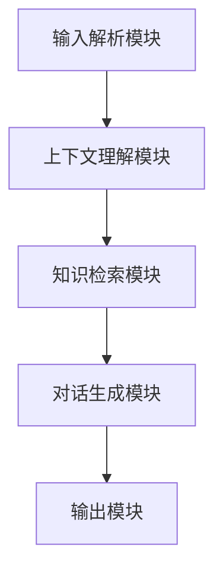

                 


# 构建LLM驱动的AI Agent情境感知系统

> 关键词：LLM, AI Agent, 情境感知, 自然语言处理, 人工智能, 对话系统

> 摘要：本文将详细介绍如何构建一个基于大语言模型（LLM）的AI Agent情境感知系统。通过逐步分析，我们将探讨LLM在AI Agent中的作用，情境感知的核心原理，算法实现，系统架构设计以及实际项目中的应用。文章内容涵盖从理论到实践的各个方面，旨在帮助读者全面理解并掌握构建此类系统的知识和技能。

---

# 第1章: AI Agent与情境感知系统概述

## 1.1 AI Agent的基本概念

### 1.1.1 AI Agent的定义与特点
AI Agent（人工智能代理）是指能够感知环境并采取行动以实现目标的智能实体。与传统程序不同，AI Agent具备以下特点：
- **自主性**：能够在没有外部干预的情况下自主运行。
- **反应性**：能够根据环境的变化实时调整行为。
- **目标导向性**：所有行动都以实现特定目标为导向。
- **社会能力**：能够与其他Agent或人类进行交互和协作。

### 1.1.2 情境感知的基本概念
情境感知是指AI Agent能够理解和感知当前环境的状态、用户的需求以及可能影响决策的各种因素。它是实现智能化交互的核心能力，主要包括以下三个层次：
1. **环境理解**：识别和解析环境中的各种信息，例如地理位置、时间、用户行为等。
2. **意图识别**：通过分析用户的行为和语言，理解用户的意图和需求。
3. **上下文理解**：基于历史交互和当前对话内容，理解上下文关系。

### 1.1.3 LLM在AI Agent中的作用
大语言模型（LLM）通过其强大的自然语言处理能力，为AI Agent提供了以下关键支持：
- **语义理解**：能够理解用户输入的自然语言文本，并生成符合语境的回复。
- **知识库调用**：能够基于上下文检索和调用外部知识库中的信息。
- **多轮对话**：能够维护对话历史，确保连续交互的连贯性。

## 1.2 LLM驱动的AI Agent的优势

### 1.2.1 LLM的自然语言处理能力
- **强大的文本生成能力**：LLM能够生成自然流畅的文本，支持多种语言和风格。
- **上下文理解**：通过大规模预训练，模型能够理解复杂的上下文关系。
- **可扩展性**：LLM可以通过微调或提示工程技术，适应不同领域和任务。

### 1.2.2 情境感知的实现方式
- **意图识别**：通过分析用户输入，识别用户的深层需求和目标。
- **对话管理**：基于对话历史和当前输入，生成符合情境的回复。
- **知识检索**：根据上下文信息，检索相关知识或数据。

### 1.2.3 LLM与AI Agent的结合场景
- **智能助手**：例如虚拟助手（如Siri、Alexa）可以根据用户的指令完成任务。
- **客服机器人**：在客户服务场景中，AI Agent可以理解用户的问题并提供解决方案。
- **教育辅助**：在教育领域，AI Agent可以根据学生的需求提供个性化的学习建议。

## 1.3 情境感知系统的关键技术

### 1.3.1 意图识别
- **技术原理**：通过分析用户的输入文本，识别用户的意图。常用的技术包括基于规则的方法、统计模型和深度学习模型。
- **挑战**：需要处理歧义性、上下文依赖性等问题。

### 1.3.2 上下文理解
- **技术原理**：通过维护对话历史和上下文信息，理解当前输入的含义。常用的技术包括记忆网络、Transformer模型等。
- **挑战**：需要处理信息冗余和信息缺失的问题。

### 1.3.3 对话管理
- **技术原理**：通过对话状态跟踪，生成符合当前对话情境的回复。常用的技术包括基于规则的对话树和基于模型的生成式方法。
- **挑战**：需要处理对话的多样性和不确定性。

## 1.4 本章小结
本章介绍了AI Agent和情境感知的基本概念，探讨了LLM在AI Agent中的作用，并分析了情境感知系统的关键技术。通过这些内容，读者可以理解构建LLM驱动的AI Agent情境感知系统的基本框架和核心要素。

---

# 第2章: LLM与AI Agent的核心原理

## 2.1 LLM的基本原理

### 2.1.1 大语言模型的训练过程
- **预训练**：通过大规模的无监督学习，模型学习语言的语法、语义和上下文关系。
- **微调**：在特定领域或任务上进行有监督学习，优化模型的性能。
- **提示工程技术**：通过设计提示（prompt），引导模型生成符合需求的输出。

### 2.1.2 模型的编码与解码机制
- **编码器**：将输入文本转换为向量表示。
- **解码器**：根据编码器生成的向量，生成目标输出文本。
- **注意力机制**：用于处理长序列和捕捉上下文关系。

### 2.1.3 模型的可扩展性
- **多语言支持**：模型可以支持多种语言的文本生成和理解。
- **多任务学习**：模型可以通过微调适应不同的任务和场景。

## 2.2 AI Agent的核心原理

### 2.2.1 Agent的感知与决策过程
- **感知**：通过传感器或输入接口获取环境信息。
- **决策**：基于感知信息和内部状态，生成行动策略。
- **行动**：执行决策结果，影响环境状态。

### 2.2.2 情境感知的实现逻辑
- **输入解析**：将用户输入解析为意图和需求。
- **上下文分析**：分析对话历史和环境信息，生成符合情境的回复。
- **知识检索**：根据上下文信息，检索相关知识或数据。

### 2.2.3 LLM在AI Agent中的应用
- **语义理解**：通过LLM理解用户的输入。
- **知识调用**：通过LLM检索和调用外部知识库。
- **对话生成**：通过LLM生成自然流畅的对话回复。

## 2.3 LLM与AI Agent的结合原理

### 2.3.1 LLM作为Agent的智能核心
- **智能决策**：LLM作为AI Agent的智能核心，负责理解和生成文本。
- **知识库调用**：LLM可以调用外部知识库，提供更准确的信息。
- **多模态交互**：LLM可以通过多模态输入（如图像、语音）进行交互。

### 2.3.2 情境感知的实现方式
- **意图识别**：通过LLM分析用户输入，识别用户的意图。
- **上下文理解**：通过LLM分析对话历史和环境信息，理解上下文关系。
- **对话管理**：通过LLM生成符合情境的回复，并维护对话状态。

### 2.3.3 Agent与LLM的交互机制
- **输入输出交互**：Agent通过输入接口获取用户输入，通过输出接口生成回复。
- **上下文记忆**：Agent维护对话历史和上下文信息，确保连续交互的连贯性。
- **知识库调用**：Agent根据需要调用外部知识库，提供更准确的信息。

## 2.4 本章小结
本章详细探讨了LLM与AI Agent的核心原理，分析了LLM在AI Agent中的应用方式，并总结了Agent与LLM的交互机制。通过这些内容，读者可以理解构建LLM驱动的AI Agent的理论基础和技术实现。

---

# 第3章: 基于LLM的对话生成算法

## 3.1 对话生成的基本原理

### 3.1.1 基于生成式模型的对话生成
- **生成式模型**：通过生成式模型（如GPT系列）生成对话回复。
- **文本生成流程**：
  1. 输入文本经过编码器转换为向量表示。
  2. 解码器根据向量生成目标文本。
  3. 生成的文本经过后处理，输出最终回复。
- **数学公式**：生成式模型的损失函数为：
  $$ \mathcal{L} = -\sum_{i=1}^{n} \log p(x_i|x_{<i}) $$

### 3.1.2 基于上下文的对话生成
- **上下文理解**：通过分析对话历史和环境信息，理解上下文关系。
- **多轮对话生成**：基于上下文生成连贯的对话回复。
- **数学公式**：上下文理解的注意力机制为：
  $$ \alpha_i = \frac{\exp(e_i)}{\sum_{j=1}^{n} \exp(e_j)} $$
  其中，$e_i$ 是第$i$个词的编码向量。

## 3.2 基于LLM的对话生成算法

### 3.2.1 基于Transformer的对话生成
- **Transformer模型**：由编码器和解码器组成，通过自注意力机制处理输入文本。
- **对话生成流程**：
  1. 输入对话历史和当前输入，经过编码器生成向量表示。
  2. 解码器根据向量表示生成目标文本。
  3. 生成的文本经过后处理，输出最终回复。

### 3.2.2 基于提示的对话生成
- **提示工程技术**：通过设计提示（prompt），引导模型生成符合需求的对话回复。
- **提示设计原则**：
  - 清晰性：提示必须清晰明确，避免歧义。
  - 相关性：提示必须与任务目标相关。
  - 灵活性：提示必须能够适应不同的对话场景。

### 3.2.3 对话生成的优化方法
- **温度参数**：通过调整温度参数，控制生成文本的随机性。
- **Top-k采样**：选择生成文本的前$k$个候选，降低低质量回复的概率。
- **核对机制**：通过核对机制，确保生成的文本符合逻辑和语义。

## 3.3 本章小结
本章详细介绍了基于LLM的对话生成算法，包括生成式模型、上下文理解和对话生成的优化方法。通过这些内容，读者可以理解如何利用LLM实现高效的对话生成。

---

# 第4章: LLM驱动的AI Agent系统架构设计

## 4.1 系统功能设计

### 4.1.1 功能模块划分
- **输入解析模块**：负责解析用户输入，提取意图和需求。
- **上下文理解模块**：负责分析对话历史和环境信息，理解上下文关系。
- **知识检索模块**：负责检索和调用外部知识库。
- **对话生成模块**：负责生成符合情境的对话回复。

### 4.1.2 功能模块交互流程
- **输入解析**：用户输入经过输入解析模块，提取意图和需求。
- **上下文理解**：输入解析结果经过上下文理解模块，生成上下文表示。
- **知识检索**：上下文表示经过知识检索模块，检索相关知识或数据。
- **对话生成**：知识检索结果和上下文表示经过对话生成模块，生成对话回复。

### 4.1.3 功能模块的实现方式
- **输入解析**：基于自然语言处理技术，提取意图和实体信息。
- **上下文理解**：基于记忆网络或Transformer模型，分析对话历史和环境信息。
- **知识检索**：基于向量索引或关键词检索技术，调用外部知识库。
- **对话生成**：基于生成式模型或基于规则的方法，生成对话回复。

## 4.2 系统架构设计

### 4.2.1 系统架构图


### 4.2.2 系统架构实现
- **输入解析模块**：负责解析用户输入，提取意图和实体信息。
- **上下文理解模块**：负责分析对话历史和环境信息，生成上下文表示。
- **知识检索模块**：负责检索和调用外部知识库，提供相关知识或数据。
- **对话生成模块**：负责生成符合情境的对话回复。
- **输出模块**：负责将对话回复输出给用户。

## 4.3 系统接口设计

### 4.3.1 输入接口设计
- **输入格式**：用户输入文本，格式为JSON或自然语言文本。
- **输入解析**：通过自然语言处理技术，解析输入文本，提取意图和实体信息。

### 4.3.2 输出接口设计
- **输出格式**：生成的对话回复，格式为JSON或自然语言文本。
- **输出模块**：将生成的对话回复输出给用户。

## 4.4 本章小结
本章详细探讨了LLM驱动的AI Agent系统架构设计，包括功能模块划分、系统架构图和系统接口设计。通过这些内容，读者可以理解如何设计和实现一个高效的AI Agent系统。

---

# 第5章: 项目实战——构建一个LLM驱动的AI Agent

## 5.1 项目背景与目标

### 5.1.1 项目背景
- **目标**：构建一个基于LLM的AI Agent，实现智能对话和情境感知功能。
- **应用场景**：应用于客服、教育、医疗等领域，提供智能化的交互体验。

### 5.1.2 项目目标
- **实现智能对话**：通过LLM生成自然流畅的对话回复。
- **实现情境感知**：通过上下文理解和意图识别，提供个性化服务。
- **实现知识检索**：通过调用外部知识库，提供准确的信息。

## 5.2 项目环境与工具

### 5.2.1 开发环境
- **操作系统**：Windows、Linux或macOS。
- **开发工具**：Python、Jupyter Notebook、VS Code。
- **深度学习框架**：TensorFlow、PyTorch。
- **LLM模型**：GPT-3、GPT-4、PaLM。

### 5.2.2 项目依赖
- **自然语言处理库**：transformers库。
- **对话生成库**：dialogpt库。
- **知识检索库**：FAISS、Elasticsearch。

## 5.3 系统实现

### 5.3.1 核心代码实现

#### 5.3.1.1 输入解析模块
```python
import transformers

class InputParser:
    def __init__(self, model_name='bert-base-uncased'):
        self.tokenizer = transformers.AutoTokenizer.from_pretrained(model_name)
        self.model = transformers.AutoModel.from_pretrained(model_name)

    def parse_input(self, input_text):
        tokens = self.tokenizer.encode(input_text, return_tensors='np')
        outputs = self.model(tokens)
        return outputs.last_hidden_state.mean(axis=1).tolist()
```

#### 5.3.1.2 上下文理解模块
```python
import torch

class ContextUnderstanding:
    def __init__(self, model_name='facebook/opt-125m'):
        self.tokenizer = transformers.AutoTokenizer.from_pretrained(model_name)
        self.model = transformers.AutoModel.from_pretrained(model_name)

    def understand_context(self, input_text, context):
        full_input = f"{context} {input_text}"
        tokens = self.tokenizer.encode(full_input, return_tensors='pt')
        outputs = self.model(tokens.input_ids)
        return outputs.last_hidden_state.mean(axis=1).tolist()
```

#### 5.3.1.3 知识检索模块
```python
import faiss

class KnowledgeRetrieval:
    def __init__(self, knowledge_base):
        self.knowledge_base = knowledge_base
        self.index = faiss.IndexFlatL2(len(self.knowledge_base[0]))

    def train(self):
        self.index.add(torch.tensor(self.knowledge_base).float())

    def retrieve(self, query_vector):
        D, I = self.index.search(query_vector.unsqueeze(0), 5)
        return [self.knowledge_base[i] for i in I[0]]
```

#### 5.3.1.4 对话生成模块
```python
import torch

class DialogGeneration:
    def __init__(self, model_name='gpt2'):
        self.tokenizer = transformers.AutoTokenizer.from_pretrained(model_name)
        self.model = transformers.AutoModelWithLMHead.from_pretrained(model_name)

    def generate_response(self, input_text, context):
        full_input = f"{context} {input_text}"
        tokens = self.tokenizer.encode(full_input, return_tensors='pt')
        outputs = self.model.generate(tokens.input_ids, max_length=50)
        response = self.tokenizer.decode(outputs[0], skip_special_tokens=True)
        return response
```

### 5.3.2 系统功能实现

#### 5.3.2.1 输入解析
```python
parser = InputParser()
input_text = "预订一张去北京的机票"
input_embedding = parser.parse_input(input_text)
print(input_embedding)
```

#### 5.3.2.2 上下文理解
```python
context_module = ContextUnderstanding()
context = "今天是2023年10月1日，用户需要预订机票"
input_context = "北京到上海的航班有哪些？"
context_embedding = context_module.understand_context(input_context, context)
print(context_embedding)
```

#### 5.3.2.3 知识检索
```python
knowledge_base = ["航班信息：北京到上海的航班有10点、12点、14点三个班次。"]
retrieval = KnowledgeRetrieval(knowledge_base)
retrieval.train()
query_vector = context_embedding
retrieved Knowledge = retrieval.retrieve(query_vector)
print(retrieved_Knowledge)
```

#### 5.3.2.4 对话生成
```python
generator = DialogGeneration()
response = generator.generate_response(input_text, context)
print(response)
```

## 5.4 项目小结
通过本章的项目实战，读者可以掌握构建一个基于LLM的AI Agent的基本方法。从输入解析到对话生成，每个模块的实现都详细展开，帮助读者理解系统的整体架构和实现细节。

---

# 第6章: LLM驱动的AI Agent高级主题

## 6.1 模型的可解释性

### 6.1.1 可解释性的重要性
- **透明性**：用户需要理解AI Agent的决策过程。
- **可信性**：可解释性是用户信任AI Agent的前提。
- **合规性**：在某些领域，可解释性是法律和行业标准的要求。

### 6.1.2 提高模型可解释性的方法
- **模型解释技术**：通过特征重要性分析、注意力机制等技术，解释模型的决策过程。
- **可视化工具**：通过可视化工具，展示模型的内部工作机制。
- **可解释性模型**：选择一些可解释性更强的模型，例如线性回归、决策树等。

## 6.2 模型的安全性

### 6.2.1 模型安全的挑战
- **对抗攻击**：恶意输入可能干扰模型的正常运行。
- **数据泄露**：模型可能泄露训练数据中的敏感信息。
- **滥用风险**：AI Agent可能被滥用，例如用于诈骗、骚扰等。

### 6.2.2 提高模型安全性的方法
- **对抗训练**：通过对抗训练，增强模型的鲁棒性。
- **隐私保护**：通过隐私保护技术（如差分隐私、联邦学习），防止数据泄露。
- **访问控制**：通过访问控制技术，防止模型被滥用。

## 6.3 模型的扩展性

### 6.3.1 模型扩展的挑战
- **模型规模**：大模型的训练和部署成本较高。
- **计算资源**：需要大量的计算资源支持模型的训练和推理。
- **可扩展性设计**：需要设计高效的分布式训练和推理机制。

### 6.3.2 提高模型扩展性的方法
- **模型压缩**：通过模型压缩技术，减少模型的体积，降低计算资源的需求。
- **分布式训练**：通过分布式训练技术，提高模型的训练效率。
- **边缘计算**：通过边缘计算技术，将模型部署在边缘设备上，提高响应速度。

## 6.4 本章小结
本章探讨了LLM驱动的AI Agent的高级主题，包括模型的可解释性、安全性以及扩展性。通过这些内容，读者可以理解如何在实际应用中，提高AI Agent的性能和安全性，确保系统的稳定运行。

---

# 第7章: 总结与展望

## 7.1 全文总结
本文详细探讨了构建LLM驱动的AI Agent情境感知系统的核心概念、算法原理、系统架构设计以及实际项目中的应用。通过这些内容，读者可以全面理解如何利用LLM实现智能化的AI Agent系统。

## 7.2 未来展望
随着大语言模型技术的不断进步，AI Agent的情境感知能力将更加智能化和个性化。未来的研究方向包括：
- **更强大的模型**：开发更强大的LLM，提升AI Agent的语义理解和生成能力。
- **多模态交互**：结合视觉、听觉等多种模态，实现更自然的交互方式。
- **个性化服务**：通过用户画像和行为分析，提供更加个性化的服务。

## 7.3 本章小结
本文总结了构建LLM驱动的AI Agent情境感知系统的核心内容，并展望了未来的发展方向。通过这些内容，读者可以对AI Agent技术的发展趋势有一个清晰的认识。

---

# 作者：AI天才研究院/AI Genius Institute & 禅与计算机程序设计艺术/Zen And The Art of Computer Programming

---

**感谢您的阅读！希望本文对您理解构建LLM驱动的AI Agent情境感知系统有所帮助。如果您有任何问题或建议，请随时与我们联系！**

