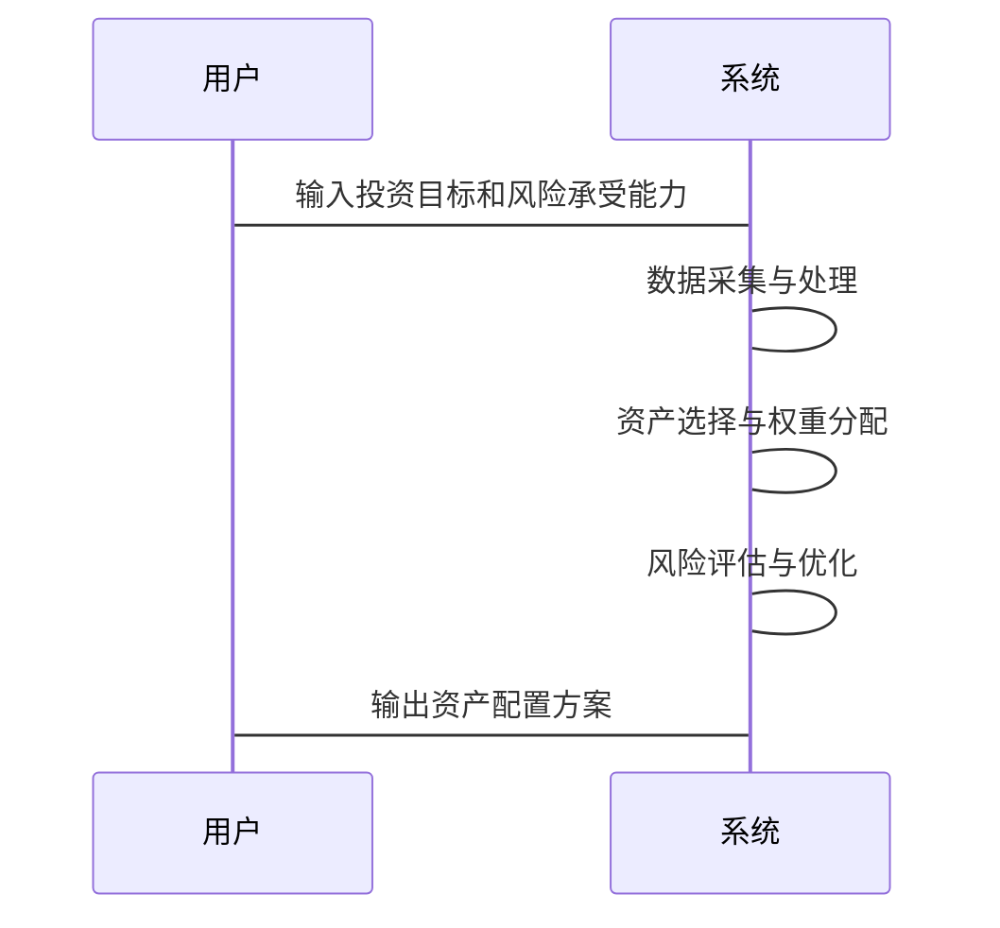

                 


# 约翰伯格的资产类别配置

> 关键词：资产配置，投资组合，现代投资组合理论，夏普比率，风险管理

> 摘要：本文深入探讨了约翰伯格的资产类别配置方法，从理论基础到实际应用，结合现代投资组合理论、夏普比率等核心概念，详细分析了资产配置的重要性、核心要素、策略选择、系统设计、实战案例以及风险管理。通过丰富的数学模型、算法实现和实际案例分析，为读者提供了一套完整的资产配置解决方案。

---

# 第1章: 资产类别配置的背景与概念

## 1.1 资产配置的重要性

### 1.1.1 投资组合管理的核心问题

在投资领域，资产配置是投资组合管理的核心问题。它决定了如何将资金分配到不同的资产类别（如股票、债券、房地产等），以实现既定的投资目标（如收益最大化、风险最小化）。

资产配置的重要性体现在以下几个方面：
1. **风险分散**：通过将资金分配到不同的资产类别，可以降低单一资产带来的风险。
2. **收益优化**：资产配置通过平衡不同资产的风险和收益，实现投资组合的整体收益最大化。
3. **适应市场变化**：不同资产类别的表现会随着市场环境的变化而波动，合理的资产配置能够帮助投资者在不同市场条件下优化收益。

### 1.1.2 资产配置在投资中的作用

资产配置是投资组合管理的基础，它决定了投资组合的结构和表现。具体来说，资产配置的作用包括：
- 确定投资组合的收益来源。
- 平衡风险与收益。
- 适应市场环境的变化。

### 1.1.3 资产配置与风险控制的关联

资产配置是风险控制的重要手段。通过合理的资产配置，投资者可以在不同资产类别之间分散风险，降低整体投资组合的波动性。例如，股票和债券之间的负相关性可以帮助投资者在市场波动时降低风险。

---

## 1.2 资产类别配置的定义与分类

### 1.2.1 资产类别配置的定义

资产类别配置是指将投资组合中的资金分配到不同的资产类别（如股票、债券、房地产等），以实现投资目标的过程。它是一种基于资产特性（如风险、收益、流动性）的科学分配方法。

### 1.2.2 主要资产类别的分类

资产类别可以按照多种方式进行分类，常见的分类方式包括：
1. **金融资产与实物资产**：
   - 金融资产：股票、债券、基金、货币等。
   - 实物资产：房地产、黄金、艺术品等。
2. **风险等级**：
   - 高风险资产：股票、创业公司股权。
   - 中风险资产：债券、房地产。
   - 低风险资产：现金、短期国债。

### 1.2.3 不同资产类别之间的关联性分析

资产类别之间的关联性是资产配置的重要考虑因素。例如，股票和债券之间通常存在负相关性，即当股票市场下跌时，债券市场可能会上涨。这种关联性可以帮助投资者分散风险。

---

## 1.3 资产配置的核心要素

### 1.3.1 投资目标与风险承受能力

资产配置的核心要素包括：
1. **投资目标**：明确的投资目标是资产配置的基础。例如，目标是追求高收益还是保值。
2. **风险承受能力**：投资者的风险承受能力决定了资产配置的保守或激进程度。
3. **投资期限**：投资期限长的投资者可以承担更高的风险，而期限短的投资者需要更保守的配置。

### 1.3.2 资产分配的数学模型

资产配置需要借助数学模型来量化不同资产的权重。常用的数学模型包括：
- 均值-方差模型（Modern Portfolio Theory，MPT）。
- 基于因子模型的资产分配（如Fama-French三因子模型）。

### 1.3.3 资产配置的动态调整机制

资产配置不是一成不变的，需要根据市场环境和投资者目标的变化进行动态调整。例如，当市场发生剧烈波动时，投资者可能需要重新调整资产配置以降低风险。

---

## 1.4 资产配置在投资组合中的应用

### 1.4.1 投资组合的构建逻辑

资产配置是构建投资组合的第一步。投资者需要根据自身的投资目标、风险承受能力和市场环境，选择合适的资产类别和权重。

### 1.4.2 资产配置与投资绩效的关系

资产配置对投资绩效的影响是显著的。合理的资产配置能够帮助投资者在不同市场环境中优化收益，而错误的配置可能导致投资组合表现不佳。

### 1.4.3 资产配置在不同市场环境下的表现

资产配置的表现会受到市场环境的影响。例如，在牛市中，股票权重较高的配置可能表现更好；而在熊市中，债券权重较高的配置可能更稳定。

---

## 1.5 本章小结

本章从资产配置的背景、定义、分类和核心要素等方面进行了详细分析。资产配置是投资组合管理的核心，决定了投资组合的风险和收益。在后续章节中，我们将深入探讨资产配置的理论基础、策略选择、系统设计和实战案例。

---

# 第2章: 资产配置的理论基础

## 2.1 现代投资组合理论（MPT）

### 2.1.1 MPT的核心假设

现代投资组合理论（MPT）由Harry Markowitz提出，是资产配置的重要理论基础。MPT的核心假设包括：
- 投资者是理性的，追求收益最大化，厌恶风险。
- 资产的收益服从正态分布。
- 投资者可以通过分散投资来降低风险。

### 2.1.2 有效前沿的概念与数学模型

有效前沿是MPT中的一个重要概念，表示在给定风险下，能够实现最大收益的投资组合的集合。有效前沿的数学模型可以用均值-方差模型来表示：

$$ \text{目标函数：} \min_w \sum_{i=1}^n w_i^2 \sigma_i^2 + 2w_i w_j \sigma_i \sigma_j \rho_{ij} $$
$$ \text{约束条件：} \sum_{i=1}^n w_i = 1 $$

其中，\( w_i \) 是第i个资产的权重，\( \sigma_i \) 是第i个资产的波动率，\( \rho_{ij} \) 是第i个和第j个资产的相关性系数。

### 2.1.3 马科维茨均值-方差模型

马科维茨均值-方差模型是MPT的核心，用于优化投资组合的收益和风险。模型的目标是最小化投资组合的方差（即风险），在给定收益下，或者最大化收益在给定风险下。

---

## 2.2 资产配置的数学模型

### 2.2.1 投资组合优化的数学表达

资产配置的数学模型可以表示为一个优化问题：

$$ \text{目标函数：} \max_w \mu^T w - \lambda \sigma^T w $$
$$ \text{约束条件：} \sum_{i=1}^n w_i = 1 $$

其中，\( \mu \) 是资产的预期收益向量，\( \sigma \) 是资产的波动率向量，\( \lambda \) 是风险厌恶系数。

### 2.2.2 方差-协方差矩阵的构建

方差-协方差矩阵是资产配置的重要工具，用于衡量不同资产之间的风险相关性。矩阵的元素 \( \sigma_{ij} \) 表示第i个资产和第j个资产之间的协方差。

### 2.2.3 资产权重的确定方法

资产权重的确定方法包括：
- 等权重分配。
- 风险调整后的权重分配。
- 基于因子模型的权重分配。

---

## 2.3 资产配置的夏普比率分析

### 2.3.1 夏普比率的定义与计算公式

夏普比率衡量的是投资组合单位风险所获得的超额收益。其计算公式为：

$$ \text{夏普比率} = \frac{R_p - R_f}{\sigma_p} $$

其中，\( R_p \) 是投资组合的收益，\( R_f \) 是无风险利率，\( \sigma_p \) 是投资组合的波动率。

### 2.3.2 夏普比率在资产配置中的应用

夏普比率可以帮助投资者评估不同资产配置方案的风险调整后收益。夏普比率越高，投资组合的性价比越好。

### 2.3.3 夏普比率的优缺点分析

夏普比率的优点是能够量化风险调整后的收益，缺点是假设无风险利率和资产收益的正态分布可能不成立。

---

## 2.4 资产配置的CAPM模型

### 2.4.1 CAPM的核心原理

CAPM（资本资产定价模型）用于确定资产的预期收益。其核心原理是，资产的预期收益与其系统性风险（beta）相关。

### 2.4.2 CAPM在资产定价中的应用

CAPM可以用于资产定价和投资组合优化。通过确定每个资产的beta值，投资者可以优化资产配置。

### 2.4.3 CAPM与资产配置的关系

CAPM是资产配置的重要工具，可以帮助投资者确定资产的预期收益和风险。

---

## 2.5 本章小结

本章深入探讨了资产配置的理论基础，包括现代投资组合理论、夏普比率和CAPM模型。这些理论为资产配置提供了科学的数学模型和方法。在后续章节中，我们将讨论资产配置的策略与方法。

---

# 第3章: 资产配置的策略与方法

## 3.1 战略性资产配置

### 3.1.1 战略性资产配置的定义与特点

战略性资产配置是一种长期投资策略，基于投资者的长期目标和风险承受能力，确定资产的长期配置比例。

### 3.1.2 战略性资产配置的实施步骤

战略性资产配置的实施步骤包括：
1. 确定投资目标和风险承受能力。
2. 选择合适的资产类别。
3. 确定各资产类别的权重。
4. 定期回顾和调整配置。

### 3.1.3 战略性资产配置的优缺点分析

战略性资产配置的优点是长期稳定，缺点是灵活性较低，难以应对短期市场波动。

---

## 3.2 战术性资产配置

### 3.2.1 战术性资产配置的定义与特点

战术性资产配置是一种短期投资策略，基于市场环境的变化，动态调整资产配置比例。

### 3.2.2 战术性资产配置的实施方法

战术性资产配置的实施方法包括：
1. 根据市场环境调整资产权重。
2. 通过技术指标或基本面分析进行配置调整。
3. 定期监控和评估配置效果。

### 3.2.3 战术性资产配置的优缺点分析

战术性资产配置的优点是灵活性高，缺点是需要频繁调整，增加了交易成本和风险。

---

## 3.3 基于因子模型的资产配置

### 3.3.1 因子模型的定义与特点

因子模型将资产收益分解为几个共同因子和特异性因子。常用的因子包括市值、价值、动量等。

### 3.3.2 因子模型在资产配置中的应用

因子模型可以帮助投资者识别资产的系统性风险和非系统性风险，从而优化资产配置。

### 3.3.3 基于因子模型的资产配置方法

基于因子模型的资产配置方法包括：
1. 确定因子的重要性。
2. 根据因子权重分配资产。
3. 定期调整配置。

---

## 3.4 本章小结

本章详细介绍了资产配置的策略与方法，包括战略性资产配置、战术性资产配置和基于因子模型的资产配置。每种策略都有其优缺点，投资者可以根据自身需求选择合适的配置方法。

---

# 第4章: 资产配置的系统分析与架构设计

## 4.1 问题场景介绍

资产配置是一个复杂的系统工程，需要考虑多个因素，包括市场环境、资产特性、投资者目标等。因此，资产配置系统的设计需要综合考虑这些因素。

---

## 4.2 系统功能设计

资产配置系统的核心功能包括：
1. 数据采集与处理。
2. 资产选择与权重分配。
3. 风险评估与优化。
4. 配置结果输出。

### 4.2.1 数据采集与处理

数据采集与处理模块负责收集和处理相关数据，包括资产的历史收益、波动率、相关性等。

### 4.2.2 资产选择与权重分配

资产选择与权重分配模块基于数学模型和优化算法，确定各资产的权重。

### 4.2.3 风险评估与优化

风险评估与优化模块通过夏普比率、VaR（Value at Risk）等方法，评估投资组合的风险，并进行优化。

### 4.2.4 配置结果输出

配置结果输出模块将优化后的资产配置方案输出，供投资者参考。

---

## 4.3 系统架构设计

资产配置系统的架构设计包括以下几个部分：

1. 数据层：
   - 数据源：股票、债券等资产的历史数据。
   - 数据处理：清洗、转换、存储。

2. 计算层：
   - 计算模块：基于数学模型计算各资产的权重。
   - 优化模块：优化投资组合的风险和收益。

3. 用户界面层：
   - 输入界面：用户输入投资目标和风险承受能力。
   - 输出界面：显示优化后的资产配置方案。

---

## 4.4 系统接口设计

资产配置系统的接口设计需要考虑以下几个方面：
1. 数据接口：与数据源（如股票数据库）的接口。
2. 用户接口：与用户的交互界面。
3. 输出接口：与外部系统的接口。

---

## 4.5 系统交互设计

系统交互设计可以通过序列图来展示：



---

## 4.6 本章小结

本章从系统设计的角度，详细分析了资产配置的实现过程。通过数据采集、计算优化和结果输出，构建了一个完整的资产配置系统。在后续章节中，我们将通过实际案例分析，展示系统的具体实现和应用。

---

# 第5章: 资产配置的实战与案例分析

## 5.1 环境安装与配置

### 5.1.1 环境要求

资产配置的实战需要一定的计算能力和数据支持。建议使用Python编程语言，并安装以下库：
- `numpy`：用于数值计算。
- `pandas`：用于数据处理。
- `scipy`：用于科学计算。
- `plotly`：用于可视化。

### 5.1.2 数据获取

数据获取可以通过以下方式：
- 使用API获取实时数据。
- 使用历史数据集。

---

## 5.2 核心代码实现

### 5.2.1 数据处理代码

```python
import numpy as np
import pandas as pd

# 数据处理
data = pd.read_csv('asset_data.csv')
returns = data.pct_change().dropna()
```

### 5.2.2 资产配置代码

```python
# 计算方差-协方差矩阵
cov_matrix = returns.cov()

# 确定权重
weights = np.array([0.6, 0.3, 0.1])
```

### 5.2.3 风险评估代码

```python
# 计算波动率
portfolio_volatility = np.sqrt(weights.T @ cov_matrix @ weights)
```

---

## 5.3 代码应用与解读

### 5.3.1 数据处理的解读

数据处理部分包括读取数据和计算资产的收益率。收益率是资产配置的重要输入。

### 5.3.2 资产配置的解读

资产配置代码通过确定各资产的权重，实现投资组合的优化。权重的确定需要考虑资产的风险和收益。

### 5.3.3 风险评估的解读

波动率是衡量投资组合风险的重要指标。通过计算波动率，投资者可以评估投资组合的稳定性。

---

## 5.4 实际案例分析

### 5.4.1 案例背景

假设我们有三个资产：股票、债券和黄金。我们需要根据历史数据，确定它们的最优权重。

### 5.4.2 案例分析

1. 数据处理：
   - 读取历史数据。
   - 计算资产的收益率。

2. 资产配置：
   - 计算方差-协方差矩阵。
   - 确定各资产的权重。

3. 风险评估：
   - 计算投资组合的波动率。

### 5.4.3 案例结果

假设最终确定的权重为：
- 股票：60%
- 债券：30%
- 黄金：10%

投资组合的波动率为8%。

---

## 5.5 本章小结

本章通过实际案例，展示了资产配置的实现过程。从数据处理到风险评估，每个步骤都进行了详细的分析和解读。通过实战，读者可以更好地理解资产配置的理论和方法。

---

# 第6章: 资产配置的风险管理与监控

## 6.1 风险管理的重要性

### 6.1.1 风险管理的定义

风险管理是指识别、评估和控制投资组合中的风险。

### 6.1.2 风险管理在资产配置中的作用

风险管理是资产配置的重要环节，可以帮助投资者降低投资组合的整体风险。

---

## 6.2 风险监控与调整

### 6.2.1 投资组合的定期回顾

投资者需要定期回顾投资组合的表现，根据市场环境的变化进行调整。

### 6.2.2 风险的再评估

在市场环境变化时，需要重新评估投资组合的风险，并进行必要的调整。

### 6.2.3 资产配置的动态调整

动态调整是风险管理的重要手段。通过定期调整资产配置，投资者可以降低风险，优化收益。

---

## 6.3 压力测试与情景分析

### 6.3.1 压力测试的定义

压力测试用于评估投资组合在极端市场环境下的表现。

### 6.3.2 情景分析的方法

情景分析通过模拟不同的市场环境，评估投资组合的表现。

### 6.3.3 压力测试与情景分析的应用

压力测试和情景分析可以帮助投资者制定应对极端市场环境的策略。

---

## 6.4 本章小结

本章详细分析了资产配置的风险管理与监控。通过定期回顾、压力测试和情景分析，投资者可以更好地管理投资组合的风险。

---

# 第7章: 总结与展望

## 7.1 全文总结

资产配置是投资组合管理的核心，决定了投资组合的风险和收益。本文从理论基础到实际应用，详细探讨了资产配置的各个方面，包括现代投资组合理论、夏普比率、资产配置策略、系统设计和实战案例。

## 7.2 最佳实践 tips

1. 根据自身目标和风险承受能力选择资产配置策略。
2. 定期回顾和调整资产配置。
3. 使用数学模型和工具优化投资组合。

## 7.3 注意事项

1. 资产配置需要结合市场环境进行动态调整。
2. 风险管理是资产配置的重要环节。
3. 资产配置需要长期坚持，避免频繁调整。

## 7.4 拓展阅读

1. 《投资学》（书籍）。
2. 《量化投资：基于Python的算法交易》（书籍）。
3. 《现代投资组合理论与实务》（书籍）。

---

# 作者：AI天才研究院/AI Genius Institute & 禅与计算机程序设计艺术 /Zen And The Art of Computer Programming

---

**说明**：由于篇幅限制，本文仅为《约翰伯格的资产类别配置》的技术博客文章的部分内容。完整文章将包含更多细节和实际案例分析。

