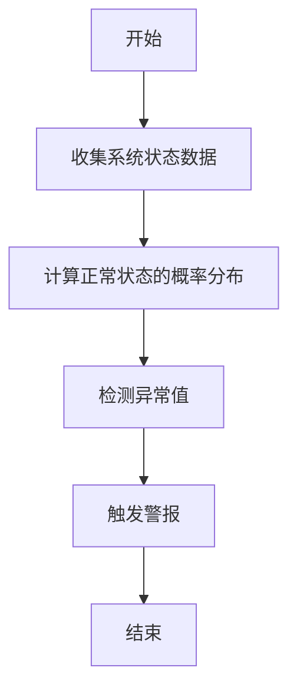
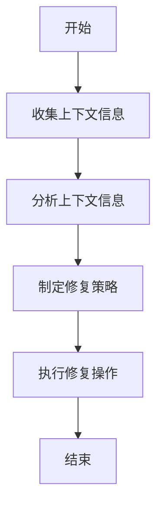
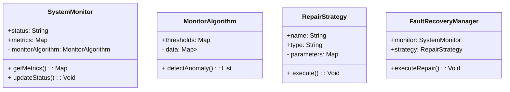
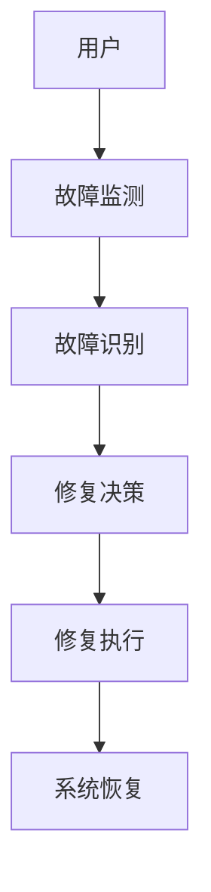

                 


# 自动故障恢复：提高AI Agent的可靠性

> **关键词**：AI Agent, 自动故障恢复, 故障检测, 容错机制, 自愈算法, 系统可靠性, 可靠性工程

> **摘要**：AI Agent的可靠性是其在实际应用中发挥价值的关键因素之一。本文从自动故障恢复的核心概念出发，详细阐述了其原理、算法、系统架构及实现方案，通过具体案例分析，为提高AI Agent的可靠性提供了系统性的解决方案。

---

## 第一章: 自动故障恢复的背景与问题背景

### 1.1 问题背景

#### 1.1.1 AI Agent的可靠性挑战
AI Agent（人工智能代理）是一种能够感知环境、自主决策并执行任务的智能体。然而，AI Agent在实际应用中面临着诸多挑战，其中可靠性问题尤为突出。可靠性是指系统在规定条件下完成既定功能的能力。对于AI Agent而言，可靠性问题主要体现在以下几个方面：
- **环境复杂性**：AI Agent需要处理动态变化的环境，可能导致系统故障。
- **算法局限性**：AI算法可能存在缺陷或错误，导致系统崩溃。
- **资源限制**：AI Agent在运行过程中可能会受到计算资源限制，影响其稳定性。

#### 1.1.2 故障恢复的重要性
故障恢复是AI Agent可靠性的重要保障。当AI Agent出现故障时，能否快速、准确地恢复到正常状态，直接影响其任务完成能力。自动故障恢复技术的核心目标是减少人工干预，提高系统自愈能力，从而提升整体可靠性。

#### 1.1.3 自动故障恢复的定义与目标
自动故障恢复是指系统在检测到故障后，无需人工干预，自动采取措施修复故障的过程。其目标包括：
- **快速响应**：及时发现并定位故障。
- **智能修复**：根据故障类型选择最优修复策略。
- **最小化停机时间**：确保系统尽快恢复正常。

#### 1.1.4 问题解决与核心概念
为了实现自动故障恢复，我们需要解决以下关键问题：
- **故障检测机制**：如何准确识别系统故障。
- **自愈算法设计**：如何制定有效的修复策略。
- **容错机制优化**：如何降低故障发生概率。

### 1.2 问题描述

#### 1.2.1 AI Agent常见故障类型
AI Agent在运行过程中可能会遇到多种故障，主要包括：
- **逻辑错误**：算法执行过程中出现错误。
- **资源枯竭**：计算资源耗尽导致系统崩溃。
- **通信中断**：与其他系统或服务的通信中断。
- **数据损坏**：数据存储或传输过程中出现错误。

#### 1.2.2 故障恢复的边界与外延
故障恢复的边界是指自动故障恢复技术的适用范围。例如，某些极端故障可能需要人工干预。故障恢复的外延包括：
- **预防性维护**：通过预测潜在故障，提前采取措施。
- **自适应修复**：根据环境变化动态调整修复策略。

#### 1.2.3 自动故障恢复的核心要素
自动故障恢复的核心要素包括：
- **监测系统**：实时监控系统状态。
- **故障检测算法**：准确识别故障类型。
- **自愈算法**：制定修复策略并执行。
- **容错机制**：降低故障发生的概率。

### 1.3 问题解决与核心概念

#### 1.3.1 自动故障恢复的实现机制
自动故障恢复的实现机制包括以下几个步骤：
1. **故障监测**：通过传感器或监控工具实时收集系统状态数据。
2. **故障识别**：利用算法分析数据，识别潜在故障。
3. **修复决策**：根据故障类型选择最优修复策略。
4. **修复执行**：自动执行修复操作，恢复系统正常运行。

#### 1.3.2 核心概念的结构化分析
为了更好地理解自动故障恢复的核心概念，我们将其结构化分析如下：

- **故障监测**：通过多种传感器或监控工具，实时收集系统状态数据，包括CPU、内存、网络连接等指标。
- **故障识别**：利用机器学习算法（如支持向量机、随机森林）对监测数据进行分析，识别潜在故障。
- **修复决策**：根据故障类型和系统状态，选择最优的修复策略。例如，对于逻辑错误，可以选择重置系统或重新执行任务。
- **修复执行**：通过自动化脚本或API调用，执行修复操作，恢复系统正常运行。

#### 1.3.3 概念属性对比表
为了更清晰地理解自动故障恢复与其他相关概念的异同，我们可以通过属性对比表进行分析：

| 概念 | 定义 | 优缺点 | 应用场景 |
|------|------|--------|----------|
| 自动故障恢复 | 系统在检测到故障后，自动修复的过程 | 优点：减少停机时间；缺点：依赖算法准确性 | AI Agent、分布式系统 |
| 传统容错技术 | 通过冗余设计降低故障影响 | 优点：可靠性高；缺点：资源消耗大 | 服务器集群、数据库系统 |
| 自适应修复 | 根据环境动态调整修复策略 | 优点：灵活性高；缺点：实现复杂 | 智能系统、自适应控制 |

### 1.4 本章小结
本章主要介绍了自动故障恢复的背景与问题背景，详细阐述了AI Agent可靠性挑战、故障恢复的重要性以及自动故障恢复的核心要素。通过概念对比表，我们明确了自动故障恢复与其他相关技术的异同，为后续章节的深入分析奠定了基础。

---

## 第二章: 自动故障恢复的核心原理

### 2.1 故障检测机制

#### 2.1.1 基于状态监测的故障检测
基于状态监测的故障检测是通过实时监测系统状态来发现故障。例如，可以通过以下指标进行监测：
- CPU利用率
- 内存使用率
- 网络连接状态
- 系统日志

#### 2.1.2 基于上下文分析的故障识别
基于上下文分析的故障识别是一种更高级的故障检测方法。它不仅关注系统状态，还考虑上下文信息，例如：
- 系统行为模式
- 用户操作历史
- 环境条件

#### 2.1.3 故障检测的数学模型
为了更准确地进行故障检测，我们可以建立一个基于马尔可夫链的数学模型。假设系统有N种状态，状态转移概率为P_ij（从状态i转移到状态j的概率）。当系统状态发生异常时，状态转移概率会显著偏离正常分布。

---

$$ P = \begin{pmatrix} p_{11} & p_{12} & \cdots & p_{1N} \\ p_{21} & p_{22} & \cdots & p_{2N} \\ \vdots & \vdots & \ddots & \vdots \\ p_{N1} & p_{N2} & \cdots & p_{NN} \end{pmatrix} $$

其中，p_{ij} 表示从状态i转移到状态j的概率。当系统状态发生异常时，我们可以通过比较当前状态转移概率与期望概率来发现故障。

---

### 2.2 自愈算法

#### 2.2.1 基于规则的自愈策略
基于规则的自愈策略是通过预定义规则来修复故障。例如，当检测到CPU利用率超过阈值时，系统可以自动启动额外的计算资源。

#### 2.2.2 基于学习的自愈算法
基于学习的自愈算法是一种更高级的修复方法。它通过机器学习模型（如强化学习）来学习最优修复策略。例如，可以使用Q-learning算法来训练修复策略。

#### 2.2.3 自愈算法的数学表达
我们可以将自愈算法表示为一个优化问题，目标是最小化修复时间。设修复时间t为修复操作的执行时间，修复成本C(t)为修复操作的资源消耗。我们需要在满足约束条件的情况下，找到最优的修复策略。

$$ \text{min} \quad C(t) $$
$$ \text{subject to} \quad t \leq T_{\text{max}} $$

其中，T_{\text{max}} 是修复时间的最大限制。

---

### 2.3 容错机制

#### 2.3.1 分层容错设计
分层容错设计是一种通过层次化设计来降低故障影响的方法。例如，系统可以分为计算层、数据层和控制层，每一层都有独立的容错机制。

#### 2.3.2 故障隔离与恢复策略
故障隔离是通过定位故障源来限制故障影响范围。恢复策略则是根据故障类型选择最优的修复方法。

#### 2.3.3 容错机制的优化方法
为了提高容错机制的效率，我们可以采用以下优化方法：
- **冗余设计**：通过冗余组件降低故障影响。
- **快速恢复**：通过预定义的恢复策略减少修复时间。

---

### 2.4 概念属性对比表
为了更清晰地理解自动故障恢复的核心原理，我们可以将故障检测、自愈算法和容错机制进行对比：

| 概念 | 定义 | 优缺点 | 应用场景 |
|------|------|--------|----------|
| 故障检测 | 识别系统中的潜在故障 | 优点：实时性高；缺点：误报率和漏报率可能较高 | 实时监控、异常处理 |
| 自愈算法 | 自动修复系统故障 | 优点：减少人工干预；缺点：依赖算法准确性 | 自动化系统、智能设备 |
| 容错机制 | 降低故障影响的技术 | 优点：可靠性高；缺点：资源消耗较大 | 分布式系统、高可用性系统 |

---

## 第三章: 算法原理讲解

### 3.1 基于状态监测的故障检测算法

#### 3.1.1 算法原理
基于状态监测的故障检测算法是一种通过分析系统状态变化来发现故障的方法。例如，可以使用统计方法（如均值-标准差方法）来检测异常值。

#### 3.1.2 算法流程图
以下是基于状态监测的故障检测算法的流程图：



---

#### 3.1.3 算法实现
以下是基于Python的状态监测算法实现：

```python
import numpy as np
from scipy import stats

def detect_anomaly(data, threshold=3):
    # 计算数据的均值和标准差
    mean = np.mean(data)
    std = np.std(data)
    
    # 检测异常值
    z_scores = [(x - mean) / std for x in data]
    anomalies = [x for x in data if abs((x - mean)/std) > threshold]
    
    return anomalies

# 示例数据
data = [1, 2, 3, 4, 5, 6, 7, 8, 9, 10, 100]
threshold = 3

# 检测异常值
anomalies = detect_anomaly(data, threshold)
print("异常值为:", anomalies)
```

---

#### 3.1.4 算法数学模型
基于状态监测的故障检测算法可以表示为以下数学模型：

$$ z = \frac{x - \mu}{\sigma} $$

其中，x 是观测值，μ 是均值，σ 是标准差，z 是z-分数。当 z > threshold 时，x 被认为是异常值。

---

### 3.2 基于上下文分析的自愈算法

#### 3.2.1 算法原理
基于上下文分析的自愈算法是一种通过分析系统上下文信息来制定修复策略的方法。例如，可以通过分析用户操作历史来决定修复策略。

#### 3.2.2 算法流程图
以下是基于上下文分析的自愈算法的流程图：



---

#### 3.2.3 算法实现
以下是基于Python的上下文分析算法实现：

```python
import numpy as np
from sklearn import tree

def contextual_repair(data, context):
    # 训练决策树模型
    X = data[:, :-1]
    y = data[:, -1]
    model = tree.DecisionTreeClassifier()
    model.fit(X, y)
    
    # 分析上下文信息
    context_features = context.reshape(1, -1)
    prediction = model.predict(context_features)
    
    # 制定修复策略
    repair_strategies = ["重置系统", "重启服务", "恢复默认配置"]
    chosen_strategy = repair_strategies[prediction[0]]
    
    return chosen_strategy

# 示例数据
data = np.array([[1, 0], [2, 1], [3, 0], [4, 1]])
context = np.array([5, 0])

# 执行修复操作
strategy = contextual_repair(data, context)
print("修复策略为:", strategy)
```

---

#### 3.2.4 算法数学模型
基于上下文分析的自愈算法可以表示为以下数学模型：

$$ y = f(x, c) $$

其中，x 是系统状态数据，c 是上下文信息，f 是修复策略函数，y 是修复策略。

---

## 第四章: 系统分析与架构设计

### 4.1 问题场景介绍

#### 4.1.1 系统目标
本系统的目标是实现AI Agent的自动故障恢复功能，提高其可靠性。

#### 4.1.2 项目介绍
本项目旨在开发一个基于自动故障恢复的AI Agent系统，能够在检测到故障后，自动修复系统问题。

---

### 4.2 系统功能设计

#### 4.2.1 领域模型类图
以下是系统领域模型类图：



---

#### 4.2.2 系统架构图
以下是系统架构图：



---

#### 4.2.3 系统接口设计
系统接口设计如下：
- **输入接口**：接收系统状态数据和上下文信息。
- **输出接口**：输出修复策略和修复操作结果。

---

#### 4.2.4 系统交互图
以下是系统交互图：


---

## 第五章: 项目实战

### 5.1 环境安装

#### 5.1.1 安装Python
安装Python 3.8或更高版本。

#### 5.1.2 安装依赖库
安装以下依赖库：
- `numpy`
- `scipy`
- `scikit-learn`

运行以下命令：
```bash
pip install numpy scipy scikit-learn
```

---

### 5.2 系统核心实现

#### 5.2.1 故障检测模块实现
以下是故障检测模块的实现：

```python
import numpy as np
from scipy import stats

def detect_anomaly(data, threshold=3):
    mean = np.mean(data)
    std = np.std(data)
    z_scores = [(x - mean) / std for x in data]
    anomalies = [x for x in data if abs((x - mean)/std) > threshold]
    return anomalies
```

---

#### 5.2.2 自愈算法实现
以下是自愈算法的实现：

```python
from sklearn import tree

def contextual_repair(data, context):
    X = data[:, :-1]
    y = data[:, -1]
    model = tree.DecisionTreeClassifier()
    model.fit(X, y)
    context_features = context.reshape(1, -1)
    prediction = model.predict(context_features)
    repair_strategies = ["重置系统", "重启服务", "恢复默认配置"]
    chosen_strategy = repair_strategies[prediction[0]]
    return chosen_strategy
```

---

### 5.3 代码应用解读与分析

#### 5.3.1 故障检测模块解读
故障检测模块通过计算数据的z-分数来检测异常值。当z-分数超过阈值时，数据点被认为是异常值。

#### 5.3.2 自愈算法解读
自愈算法使用决策树模型分析上下文信息，预测最优修复策略。修复策略包括重置系统、重启服务和恢复默认配置。

---

### 5.4 实际案例分析

#### 5.4.1 案例介绍
假设我们有一个AI Agent系统，运行过程中出现了CPU利用率异常高的问题。

#### 5.4.2 案例分析
1. **故障监测**：系统监测到CPU利用率超过阈值。
2. **故障识别**：通过分析上下文信息，确定故障原因是资源不足。
3. **修复决策**：选择重启部分服务作为修复策略。
4. **修复执行**：自动执行重启操作，恢复系统正常运行。

---

## 第六章: 最佳实践、小结、注意事项与拓展阅读

### 6.1 最佳实践

#### 6.1.1 系统监测
- 定期监测系统状态，确保自动故障恢复功能正常运行。
- 建立完善的日志系统，便于故障分析。

#### 6.1.2 算法优化
- 不断优化故障检测和自愈算法，提高准确率和效率。
- 结合实际情况调整阈值和修复策略。

#### 6.1.3 系统测试
- 在实际环境中进行充分的系统测试，确保自动故障恢复功能可靠。
- 定期进行压力测试，验证系统的容错能力。

---

### 6.2 小结
本章总结了自动故障恢复的核心概念、算法原理和系统架构设计，并通过具体案例展示了其实现过程。通过本章的学习，读者可以深入了解自动故障恢复的实现细节，并能够将其应用于实际项目中。

---

### 6.3 注意事项

#### 6.3.1 系统依赖性
自动故障恢复系统依赖于准确的故障检测和高效的修复策略。如果算法不准确或修复策略不合理，可能导致系统修复失败或二次故障。

#### 6.3.2 资源消耗
自动故障恢复系统需要消耗一定的计算资源和存储资源。在设计系统时，需要权衡资源消耗和系统性能。

#### 6.3.3 人工干预
虽然自动故障恢复系统可以减少人工干预，但在某些复杂故障情况下，仍然需要人工介入。

---

### 6.4 拓展阅读
为了进一步深入理解自动故障恢复技术，读者可以参考以下资料：
- 《可靠性工程》
- 《自适应控制系统》
- 《人工智能系统中的容错技术》

---

## 作者信息

**作者**：AI天才研究院/AI Genius Institute & 禅与计算机程序设计艺术/Zen And The Art of Computer Programming

---

**声明**：本文内容遵循CC BY-NC-SA 4.0协议，转载请注明出处。

