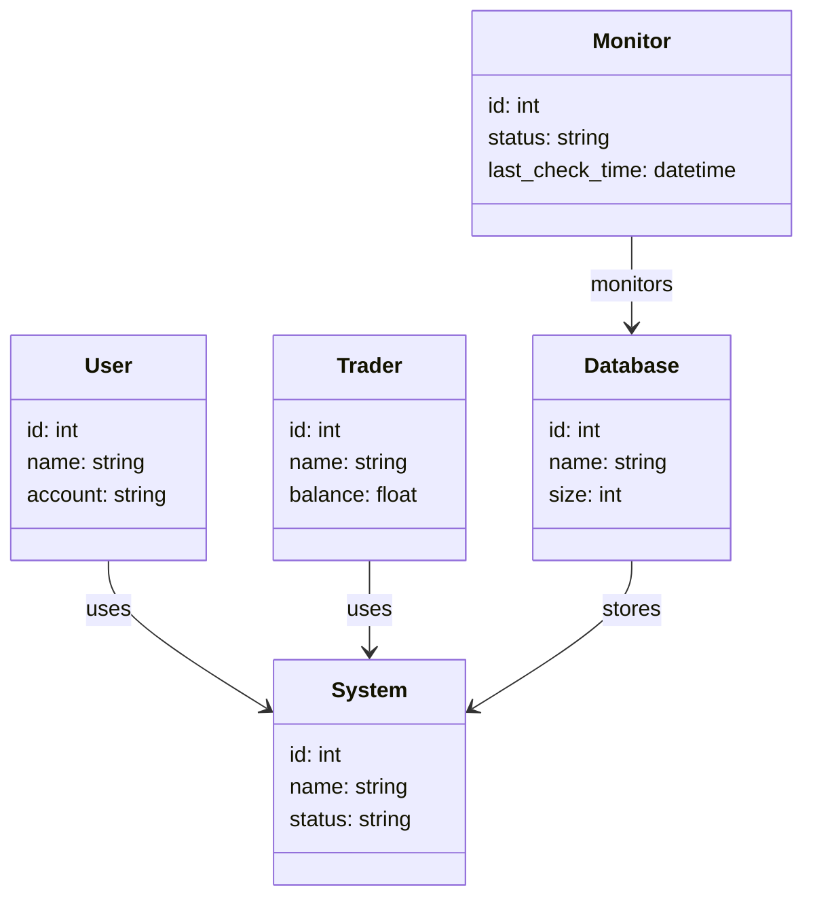
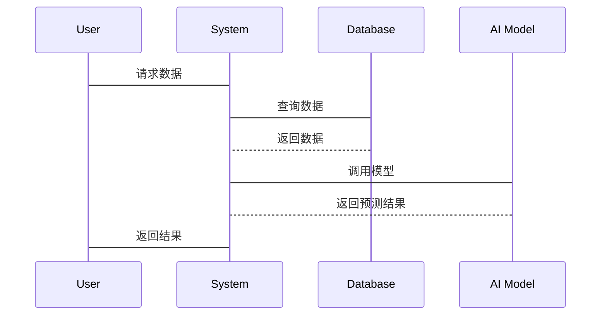
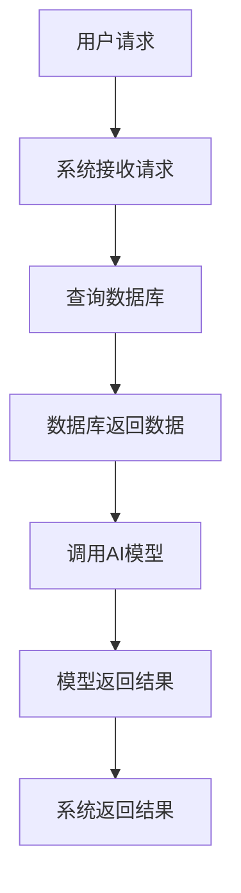

                 


# 设计高可用性金融AI系统架构

## 关键词：高可用性、金融AI、系统架构、容错设计、CAP定理、ACID原则、时间序列分析

## 摘要：
本文旨在探讨如何设计高可用性的金融AI系统架构。首先，我们将介绍高可用性系统的基本概念，分析金融行业对高可用性的特殊要求，以及AI在金融系统中的应用现状。接着，深入探讨高可用性系统的核心原理，包括CAP定理、ACID原则和容错设计。随后，对比传统金融系统和AI驱动系统的特点，并通过ER实体关系图展示系统组成部分。在算法原理部分，详细讲解时间序列分析算法，并通过mermaid流程图和Python代码示例展示实现过程。最后，通过股票价格预测的案例分析，展示如何设计和实现高可用性金融AI系统，并总结最佳实践和未来趋势。

---

# 第1章: 高可用性系统的基本概念

## 1.1 高可用性系统的基本概念

### 1.1.1 高可用性系统的定义
高可用性系统（High Availability System）是指在发生故障时，能够快速恢复并保持正常运行的系统。其目标是通过冗余设计和容错机制，确保系统在部分故障时仍能提供服务。

### 1.1.2 高可用性系统的核心目标
1. **持续可用性**：确保系统在故障发生时仍能提供服务。
2. **快速恢复**：在故障发生后，系统能够迅速恢复正常。
3. **高容错性**：能够容忍部分节点或组件的故障。

### 1.1.3 高可用性系统的关键特性
1. **冗余设计**：通过冗余组件确保系统在故障时仍能运行。
2. **容错机制**：通过检测和隔离故障节点，防止故障扩散。
3. **负载均衡**：均匀分配请求，避免单点过载。

---

## 1.2 金融行业的特殊要求

### 1.2.1 金融行业的高可用性需求
金融行业对系统的高可用性要求极高，任何服务中断都可能导致巨大的经济损失和声誉损害。因此，金融系统的高可用性通常要求达到99.999%的 uptime。

### 1.2.2 金融行业的合规性要求
金融行业受到严格的监管，系统设计必须符合相关法律法规，例如《支付机构反洗钱和反恐怖融资监管办法》等。

### 1.2.3 金融行业的数据安全要求
金融数据的高度敏感性要求系统具备强大的数据加密和访问控制机制，确保数据的安全性和隐私性。

---

## 1.3 AI在金融系统中的应用现状

### 1.3.1 AI在金融领域的典型应用
1. **智能投顾**：基于AI算法为用户提供个性化的投资建议。
2. **风险评估**：利用AI进行信用评估和风险预测。
3. **欺诈检测**：通过AI实时监控交易行为，识别潜在的欺诈行为。

### 1.3.2 金融AI系统的挑战
1. **数据质量**：金融数据的复杂性和噪声可能影响AI模型的准确性。
2. **模型解释性**：复杂的AI模型在金融领域需要具备可解释性，以满足监管要求。
3. **系统稳定性**：AI系统的高可用性要求在实时运行中保持稳定。

### 1.3.3 金融AI系统的未来趋势
1. **实时性增强**：未来的金融AI系统将更加注重实时性，支持毫秒级的响应。
2. **模型可解释性**：监管要求的提高将推动模型解释性的发展。
3. **多模态数据融合**：结合文本、图像等多种数据源，提升模型的预测能力。

---

# 第2章: 高可用性系统的核心原理

## 2.1 高可用性系统的CAP定理

### 2.1.1 CAP定理的定义
CAP定理（Consistency, Availability, Partition Tolerance）指出，分布式系统在一致性（C）、可用性（A）和分区容错性（P）三个方面无法同时满足。

### 2.1.2 CAP定理在高可用性系统中的应用
在金融AI系统中，通常需要在一致性与可用性之间做出权衡。例如，采用最终一致性（Eventual Consistency）来提高可用性，同时允许短暂的数据不一致。

### 2.1.3 CAP定理的权衡与选择
1. **一致性优先**：适用于需要严格数据一致性的场景，如银行交易系统。
2. **可用性优先**：适用于需要实时响应的场景，如在线支付系统。
3. **分区容错性优先**：适用于需要容忍网络分区的场景，如分布式存储系统。

---

## 2.2 高可用性系统的ACID原则

### 2.2.1 ACID原则的定义
ACID原则（Atomicity, Consistency, Isolation, Durability）是数据库事务的基本原则，确保事务的原子性、一致性、隔离性和持久性。

### 2.2.2 ACID原则在高可用性系统中的应用
在金融AI系统中，ACID原则用于确保事务的完整性和数据一致性，尤其是在处理高并发交易时。

### 2.2.3 ACID原则的实现方式
1. **原子性**：事务要么全部成功，要么全部失败。
2. **一致性**：事务完成后，系统状态必须一致。
3. **隔离性**：事务之间互不影响。
4. **持久性**：事务完成后，数据必须持久化。

---

## 2.3 高可用性系统的容错设计

### 2.3.1 容错设计的基本概念
容错设计（Fault-Tolerant Design）通过冗余和容错机制，确保系统在部分节点故障时仍能正常运行。

### 2.3.2 容错设计的实现方法
1. **冗余设计**：通过冗余组件确保系统的容错能力。
2. **故障检测**：实时检测系统故障，并进行隔离和修复。
3. **故障恢复**：在检测到故障后，自动启动备用组件，恢复系统运行。

### 2.3.3 容错设计的案例分析
以股票交易系统为例，系统通过冗余的交易节点和自动故障恢复机制，确保在单点故障时仍能正常处理交易请求。

---

# 第3章: 高可用性系统的核心概念与联系

## 3.1 高可用性系统的核心概念

### 3.1.1 高可用性系统的组成要素
1. **计算节点**：负责处理业务逻辑。
2. **存储节点**：负责数据的存储和管理。
3. **网络节点**：负责数据的传输和通信。
4. **监控节点**：负责系统状态的监控和故障检测。

### 3.1.2 高可用性系统的功能模块
1. **数据采集模块**：负责采集金融数据。
2. **数据处理模块**：负责数据的清洗和预处理。
3. **模型训练模块**：负责AI模型的训练和优化。
4. **实时处理模块**：负责实时的预测和决策。

### 3.1.3 高可用性系统的性能指标
1. **响应时间**：系统对请求的响应时间。
2. **吞吐量**：系统在单位时间内的处理能力。
3. **可用性**：系统在单位时间内的正常运行时间。

---

## 3.2 高可用性系统的核心概念对比

### 3.2.1 传统金融系统的对比
传统金融系统依赖于集中式架构，具有较高的稳定性和一致性，但扩展性和灵活性较差。

### 3.2.2 AI驱动系统的对比
AI驱动系统通过分布式架构和机器学习算法，具备更强的适应性和扩展性，但需要处理数据质量和模型解释性的问题。

### 3.2.3 两者结合的优势与劣势
结合两者的优势，可以构建一个既有高可用性又有强适应性的金融AI系统，但同时也需要解决两者的兼容性和集成问题。

---

## 3.3 高可用性系统的ER实体关系图

```mermaid
er
actor: User
role: Trader
actor: System
role: Monitor
actor: Database
role: Storage
```

---

# 第4章: 高可用性系统的算法原理

## 4.1 时间序列分析算法

### 4.1.1 时间序列分析的定义
时间序列分析（Time Series Analysis）是一种通过历史数据预测未来趋势的方法。

### 4.1.2 时间序列分析的实现步骤
1. **数据采集**：收集相关的历史数据。
2. **数据预处理**：清洗数据，去除噪声。
3. **模型训练**：选择合适的模型进行训练。
4. **预测与评估**：进行预测并评估模型的准确性。

### 4.1.3 时间序列分析的Python代码实现

```python
import pandas as pd
import numpy as np
from sklearn.metrics import mean_squared_error
import matplotlib.pyplot as plt

# 数据预处理
data = pd.read_csv('financial_data.csv')
data['date'] = pd.to_datetime(data['date'])
data.set_index('date', inplace=True)

# 分割训练集和测试集
train = data.iloc[:int(len(data) * 0.8)]
test = data.iloc[int(len(data) * 0.8):]

# 模型训练
from statsmodels.tsa.arima_model import ARIMA
model = ARIMA(train['value'], order=(5,1,0))
model_fit = model.fit()

# 预测
start_index = len(train)
end_index = len(train) + len(test)
forecast = model_fit.forecast(steps=end_index - start_index)

# 评估
rmse = np.sqrt(mean_squared_error(test['value'], forecast))
print(f'RMSE: {rmse}')

# 可视化
plt.plot(train.index, train['value'], label='Training Data')
plt.plot(test.index, test['value'], label='Test Data')
plt.plot(forecast.index, forecast, label='Forecast')
plt.legend()
plt.show()
```

### 4.1.4 时间序列分析的数学模型和公式
时间序列分析的ARIMA模型可以表示为：
$$ ARIMA(p, d, q) $$
其中：
- p：自回归阶数
- d：差分阶数
- q：移动平均阶数

---

# 第5章: 高可用性金融AI系统的分析与设计

## 5.1 领域模型设计

### 5.1.1 领域模型的定义
领域模型（Domain Model）是系统功能的抽象表示，用于描述系统的各个功能模块和它们之间的关系。

### 5.1.2 领域模型的mermaid类图



---

## 5.2 系统架构设计

### 5.2.1 系统架构设计的mermaid架构图


---

## 5.3 系统接口设计

### 5.3.1 系统接口设计的定义
系统接口设计（System Interface Design）是系统与其他组件或服务之间的交互界面。

### 5.3.2 系统接口设计的mermaid序列图



---

## 5.4 系统交互设计

### 5.4.1 系统交互设计的定义
系统交互设计（System Interaction Design）是系统与其他组件或服务之间的交互流程。

### 5.4.2 系统交互设计的mermaid流程图



---

# 第6章: 高可用性金融AI系统的项目实战

## 6.1 环境安装

### 6.1.1 系统环境要求
1. Python 3.8+
2. pip 20+
3. Jupyter Notebook
4. 数据库（MySQL/MongoDB）

### 6.1.2 安装依赖
```bash
pip install pandas numpy matplotlib statsmodels
```

---

## 6.2 核心代码实现

### 6.2.1 股票价格预测的Python代码实现

```python
import pandas as pd
import numpy as np
from statsmodels.tsa.arima_model import ARIMA
from sklearn.metrics import mean_squared_error
import matplotlib.pyplot as plt

# 数据加载
data = pd.read_csv('stock_prices.csv')
data['date'] = pd.to_datetime(data['date'])
data.set_index('date', inplace=True)

# 数据分割
train = data.iloc[:int(len(data) * 0.8)]
test = data.iloc[int(len(data) * 0.8):]

# 模型训练
model = ARIMA(train['close'], order=(5, 1, 0))
model_fit = model.fit()

# 预测
start_index = len(train)
end_index = len(train) + len(test)
forecast = model_fit.forecast(steps=end_index - start_index)

# 评估
rmse = np.sqrt(mean_squared_error(test['close'], forecast))
print(f'RMSE: {rmse}')

# 可视化
plt.plot(train.index, train['close'], label='Training Data')
plt.plot(test.index, test['close'], label='Test Data')
plt.plot(forecast.index, forecast, label='Forecast')
plt.legend()
plt.show()
```

### 6.2.2 代码解读与分析
1. **数据加载**：使用pandas读取CSV文件，并将日期转换为时间索引。
2. **数据分割**：将数据分为训练集和测试集。
3. **模型训练**：使用ARIMA模型进行训练。
4. **预测与评估**：进行预测并计算RMSE指标。
5. **可视化**：绘制训练数据、测试数据和预测数据的图形，直观展示预测效果。

---

## 6.3 案例分析与详细讲解

### 6.3.1 案例分析
以股票价格预测为例，我们使用ARIMA模型进行预测，并通过RMSE指标评估模型的准确性。

### 6.3.2 详细讲解
1. **数据预处理**：确保数据的完整性和准确性。
2. **模型选择**：选择适合金融数据的模型。
3. **模型训练**：通过历史数据训练模型。
4. **模型评估**：通过测试数据评估模型的性能。
5. **模型优化**：根据评估结果调整模型参数。

---

## 6.4 项目小结

### 6.4.1 项目总结
通过股票价格预测案例，我们展示了如何设计和实现一个高可用性金融AI系统。

### 6.4.2 项目意义
该项目不仅验证了高可用性系统的设计理念，还为金融行业提供了实际的应用案例。

### 6.4.3 项目经验
在实际项目中，需要注意数据质量、模型解释性和系统稳定性的平衡。

---

# 第7章: 高可用性金融AI系统的最佳实践

## 7.1 小结

### 7.1.1 核心内容回顾
本文详细探讨了高可用性金融AI系统的架构设计、算法实现和项目实战。

### 7.1.2 主要收获
通过本文的学习，读者可以掌握高可用性系统的原理和设计方法，并能够将其应用于实际项目中。

---

## 7.2 注意事项

### 7.2.1 数据安全
金融数据的高度敏感性要求我们必须重视数据安全，采用加密技术和访问控制机制。

### 7.2.2 模型解释性
在金融领域，模型的可解释性非常重要，尤其是在监管要求严格的场景中。

### 7.2.3 系统稳定性
高可用性系统的稳定性是确保系统正常运行的关键，需要通过冗余设计和容错机制来实现。

---

## 7.3 未来趋势

### 7.3.1 技术发展
随着AI技术的不断发展，未来的高可用性金融系统将更加智能化和自动化。

### 7.3.2 应用场景
AI在金融领域的应用将更加广泛，涵盖智能投顾、风险管理、欺诈检测等多个方面。

### 7.3.3 挑战与机遇
尽管面临数据质量和模型解释性等挑战，但AI技术的引入也为金融行业带来了新的发展机遇。

---

# 作者：AI天才研究院/AI Genius Institute & 禅与计算机程序设计艺术 /Zen And The Art of Computer Programming

