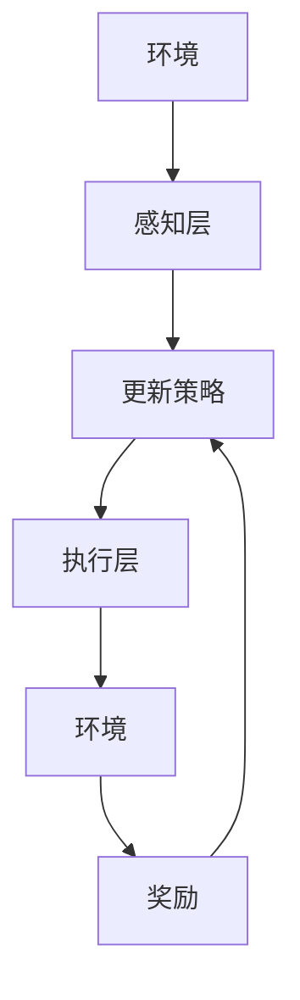
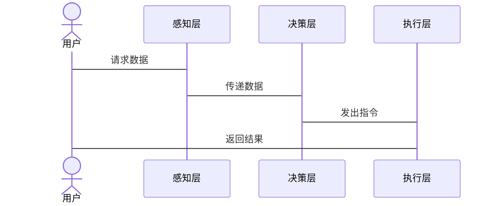
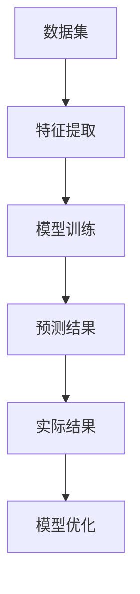
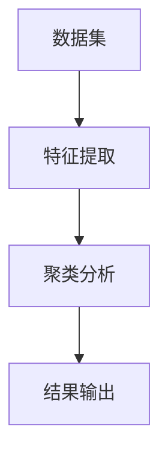

                 


# AI Agent在农业智能化管理中的应用

## 关键词：AI Agent，农业智能化，精准农业，农业生产，农业管理

## 摘要：  
本文详细探讨了AI Agent在农业智能化管理中的应用，从AI Agent的基本概念到其在精准农业、农业生产自动化以及农业供应链管理中的具体应用，再到系统架构设计和算法实现，层层深入。通过实际案例分析，展示了AI Agent如何帮助实现农业生产的智能化和高效化。本文旨在为农业智能化管理提供理论基础和实践指导，帮助读者理解AI Agent在农业中的潜力和价值。

---

# 第一部分：AI Agent与农业智能化管理概述

## 第1章：AI Agent的基本概念与农业智能化管理背景

### 1.1 AI Agent的基本概念

#### 1.1.1 什么是AI Agent  
AI Agent（人工智能代理）是指能够感知环境、自主决策并执行任务的智能实体。它能够通过传感器获取信息，利用算法进行分析，并通过执行器完成特定目标。AI Agent的核心在于其智能性，它能够根据环境变化动态调整行为。

#### 1.1.2 AI Agent的核心特征  
- **自主性**：能够在没有外部干预的情况下独立运行。  
- **反应性**：能够实时感知环境并做出反应。  
- **目标导向**：通过优化目标函数来实现最优决策。  
- **学习能力**：能够通过数据和经验不断优化自身的算法。  

#### 1.1.3 AI Agent与传统自动化系统的区别  
| 特性          | AI Agent                | 传统自动化系统          |  
|---------------|-------------------------|-------------------------|  
| 智能性        | 高                     | 低                     |  
| 自适应能力    | 强                     | 弱                     |  
| 决策能力      | 高度智能化              | 基于预设规则            |  

### 1.2 农业智能化管理的背景与需求

#### 1.2.1 农业现代化的现状与挑战  
随着人口增长和资源有限性，传统农业模式面临以下挑战：  
- 农作物产量不稳定。  
- 农业资源浪费严重。  
- 农业劳动力短缺。  

#### 1.2.2 农业智能化管理的重要性  
AI Agent的应用可以显著提升农业管理效率，例如：  
- 实现精准农业，优化资源利用。  
- 提高农业生产效率，降低成本。  
- 通过自动化决策减少人为错误。  

#### 1.2.3 AI Agent在农业中的潜在应用场景  
AI Agent可以在以下场景中发挥重要作用：  
- 农作物病虫害监测与防治。  
- 农业机器人自动化操作。  
- 农业供应链优化与市场预测。  

### 1.3 问题背景与问题描述

#### 1.3.1 农业生产中的主要问题  
- 农作物生长监测困难。  
- 病虫害防治不及时。  
- 农业资源浪费。  

#### 1.3.2 AI Agent如何解决这些问题  
通过实时监测和智能决策，AI Agent可以实现：  
- 精准病虫害防治。  
- 自动化资源优化配置。  
- 提高农业生产效率。  

#### 1.3.3 农业智能化管理的边界与外延  
农业智能化管理的边界包括：  
- 农作物种植与管理。  
- 农业资源优化配置。  
- 农业市场预测与决策。  

外延包括：  
- 农业机器人与自动化设备的应用。  
- 农业无人机的智能化管理。  

### 1.4 核心概念与联系

#### 1.4.1 AI Agent的核心要素组成  
AI Agent的核心要素包括：  
- **感知层**：通过传感器获取环境数据。  
- **决策层**：基于数据进行智能决策。  
- **执行层**：通过执行器完成任务。  

#### 1.4.2 AI Agent与农业系统的实体关系图（ER图）  
```mermaid
erDiagram
    actor 农业系统用户{}{
    }
    actor 环境传感器{}{
    }
    actor 农业执行器{}{
    }
    actor 数据存储{}{
    }
    actor 农业决策层{}{
    }
    农业系统用户 --> 环境传感器: 触发数据采集
    环境传感器 --> 数据存储: 存储环境数据
    数据存储 --> 农业决策层: 分析数据
    农业决策层 --> 农业执行器: 发出指令
    农业执行器 --> 农业系统用户: 返回执行结果
```

---

## 第2章：AI Agent的核心原理与技术实现

### 2.1 AI Agent的核心原理

#### 2.1.1 知识表示与推理  
知识表示是AI Agent理解环境的基础。常见的知识表示方法包括：  
- **规则表示**：通过预设规则进行推理。  
- **语义网络**：通过节点和边表示知识。  
- **概率推理**：基于概率模型进行推理。  

#### 2.1.2 感知与决策  
AI Agent通过传感器获取环境数据，利用算法进行分析和决策。  
- **感知层**：包括摄像头、温度传感器等。  
- **决策层**：基于感知数据进行推理和决策。  

#### 2.1.3 行为与执行  
AI Agent根据决策结果通过执行器完成任务。  
- **执行层**：包括机器人、无人机等。  
- **反馈机制**：通过反馈优化决策。  

### 2.2 AI Agent的关键技术

#### 2.2.1 机器学习与深度学习  
机器学习是AI Agent的核心技术之一。  
- **监督学习**：通过标记数据进行训练。  
- **无监督学习**：通过未标记数据进行聚类。  
- **强化学习**：通过奖励机制优化决策。  

#### 2.2.2 自然语言处理（NLP）  
NLP技术用于处理农业相关的文本数据。  
- **文本分类**：识别病虫害类型。  
- **信息抽取**：提取农业相关的知识。  

#### 2.2.3 计算机视觉（CV）  
计算机视觉技术用于图像分析。  
- **图像识别**：识别农作物病虫害。  
- **目标检测**：检测作物生长情况。  

### 2.3 AI Agent的算法原理

#### 2.3.1 强化学习算法  
强化学习通过奖励机制优化决策。  


#### 2.3.2 监督学习算法  
监督学习通过标记数据训练模型。  
- **线性回归**：用于预测农作物产量。  
- **支持向量机（SVM）**：用于分类病虫害类型。  

#### 2.3.3 无监督学习算法  
无监督学习用于处理未标记数据。  
- **聚类分析**：将相似的农作物分成同一类。  

---

## 第3章：AI Agent在农业中的应用场景

### 3.1 精准农业管理

#### 3.1.1 土地监测与优化  
AI Agent可以通过卫星图像分析土地状况。  
- **土壤湿度监测**：优化灌溉方案。  
- **土壤养分监测**：优化施肥方案。  

#### 3.1.2 农作物生长监测  
AI Agent可以通过无人机和传感器实时监测作物生长。  
- **生长周期分析**：制定最优收割时间。  

#### 3.1.3 病虫害智能识别与防治  
AI Agent可以通过图像识别技术识别病虫害。  
- **病虫害类型识别**：选择最优防治方案。  

### 3.2 农业生产自动化

#### 3.2.1 农业机器人与自动化设备  
AI Agent可以控制农业机器人完成播种、施肥等任务。  
- **机器人路径规划**：优化作业路径。  

#### 3.2.2 农作物播种与收割优化  
AI Agent可以通过优化算法提高播种和收割效率。  
- **播种密度优化**：提高产量。  

#### 3.2.3 农业无人机的应用  
AI Agent可以控制无人机进行病虫害监测和喷洒农药。  
- **无人机导航**：自动避开障碍物。  

### 3.3 农业供应链管理

#### 3.3.1 农产品流通优化  
AI Agent可以通过数据分析优化物流路径。  
- **物流成本优化**：降低运输成本。  

#### 3.3.2 农业资源优化配置  
AI Agent可以通过资源分配算法优化资源配置。  
- **水资源优化分配**：提高灌溉效率。  

#### 3.3.3 农业市场预测与决策  
AI Agent可以通过市场数据分析预测农产品价格。  
- **价格预测模型**：指导种植决策。  

---

## 第4章：AI Agent的系统架构与设计

### 4.1 系统功能设计

#### 4.1.1 数据采集与处理  
AI Agent需要采集环境数据并进行预处理。  
- **数据采集**：通过传感器获取数据。  
- **数据清洗**：去除噪声数据。  

#### 4.1.2 智能决策与控制  
AI Agent需要根据数据进行决策并控制执行器。  
- **决策算法**：基于机器学习模型。  
- **控制策略**：优化执行效率。  

#### 4.1.3 人机交互界面  
用户可以通过界面与AI Agent进行交互。  
- **用户界面设计**：直观展示数据。  
- **交互反馈**：实时显示决策结果。  

### 4.2 系统架构设计

#### 4.2.1 分层架构设计  
系统分为感知层、决策层和执行层。  
- **感知层**：负责数据采集。  
- **决策层**：负责数据处理和决策。  
- **执行层**：负责任务执行。  

#### 4.2.2 微服务架构设计  
系统分为多个微服务模块。  
- **数据采集服务**：负责采集环境数据。  
- **决策服务**：负责数据处理和决策。  
- **执行服务**：负责任务执行。  

#### 4.2.3 组件间的交互设计  
各组件之间通过API进行交互。  
- **数据接口**：传递环境数据。  
- **控制接口**：传递决策指令。  

### 4.3 系统接口设计

#### 4.3.1 数据接口  
- **输入接口**：接收传感器数据。  
- **输出接口**：输出处理后的数据。  

#### 4.3.2 控制接口  
- **输入接口**：接收用户指令。  
- **输出接口**：输出执行指令。  

#### 4.3.3 用户接口  
- **输入接口**：接收用户输入。  
- **输出接口**：显示系统状态。  

### 4.4 系统交互设计

#### 4.4.1 交互流程图  


---

## 第5章：AI Agent的算法实现与数学模型

### 5.1 算法原理与流程图

#### 5.1.1 强化学习算法流程图  


#### 5.1.2 监督学习算法流程图  


#### 5.1.3 无监督学习算法流程图  


### 5.2 数学模型与公式

#### 5.2.1 强化学习的数学模型  
强化学习的目标是最大化累积奖励。  
$$ V(s) = \max_{a} [ r(s, a) + \gamma V(s') ] $$  
其中，$V(s)$是状态$s$的价值函数，$r(s, a)$是状态$s$和动作$a$的奖励，$\gamma$是折扣因子，$s'$是下一个状态。  

#### 5.2.2 监督学习的数学模型  
监督学习的目标是最小化预测误差。  
$$ L(y, \hat{y}) = \frac{1}{2} (y - \hat{y})^2 $$  
其中，$y$是真实值，$\hat{y}$是预测值。  

#### 5.2.3 无监督学习的数学模型  
无监督学习的目标是优化聚类质量。  
$$ \arg\min_{C} \sum_{i=1}^{n} \sum_{j=1}^{k} w_{ij} d(c_i, c_j) $$  
其中，$C$是聚类结果，$w_{ij}$是样本$i$属于簇$j$的概率，$d(c_i, c_j)$是簇$i$和簇$j$之间的距离。  

---

## 第6章：AI Agent的项目实战

### 6.1 环境安装

#### 6.1.1 安装Python环境  
```bash
python --version
pip install --upgrade pip
```

#### 6.1.2 安装AI Agent相关库  
```bash
pip install numpy
pip install pandas
pip install scikit-learn
pip install tensorflow
```

### 6.2 系统核心实现源代码

#### 6.2.1 强化学习模型实现  
```python
import numpy as np
import gym

class AI-Agent:
    def __init__(self, env):
        self.env = env
        self.learning_rate = 0.01
        self.gamma = 0.99
        self.model = self.build_model()

    def build_model(self):
        # 简单的神经网络模型
        return np.random.rand(4, 1)

    def perceive(self, observation):
        return self.model.dot(observation)

    def choose_action(self, observation):
        q = self.perceive(observation)
        return np.argmax(q)

    def learn(self, observation, action, reward, next_observation):
        target = reward + self.gamma * np.max(self.perceive(next_observation))
        self.model[action] += self.learning_rate * (target - self.model[action])

env = gym.make('CartPole-v0')
agent = AI-Agent(env)
```

#### 6.2.2 监督学习模型实现  
```python
from sklearn import tree

# 数据集
data = [...]  # 特征数据
label = [...]  # 标签

# 训练模型
model = tree.DecisionTreeClassifier()
model.fit(data, label)

# 预测
new_data = [...]  # 新数据
prediction = model.predict(new_data)
```

### 6.3 实际案例分析与详细解读

#### 6.3.1 病虫害监测与防治案例  
通过AI Agent实现病虫害的智能识别与防治。  
- **数据采集**：使用无人机拍摄作物图像。  
- **图像识别**：利用CNN模型识别病虫害类型。  
- **决策与执行**：根据识别结果喷洒农药。  

#### 6.3.2 农业机器人控制案例  
通过AI Agent控制农业机器人进行播种。  
- **路径规划**：使用A*算法规划机器人路径。  
- **动作控制**：通过传感器反馈调整机器人动作。  

---

## 第7章：总结与展望

### 7.1 总结  
本文详细探讨了AI Agent在农业智能化管理中的应用，从基本概念到具体应用场景，再到系统架构设计和算法实现，全面分析了AI Agent在农业中的潜力和价值。

### 7.2 展望  
随着AI技术的不断进步，AI Agent在农业中的应用将更加广泛和深入。未来，AI Agent将在精准农业、农业生产自动化以及农业供应链管理等领域发挥更大的作用。

### 7.3 最佳实践Tips  
- 在实际应用中，需要结合具体场景选择合适的AI技术。  
- 数据质量和传感器精度对AI Agent的性能影响重大。  
- 需要注重系统的可扩展性和可维护性。  

---

## 作者：AI天才研究院/AI Genius Institute & 禅与计算机程序设计艺术 /Zen And The Art of Computer Programming

---

本文通过详细分析AI Agent在农业智能化管理中的应用，为读者提供了理论基础和实践指导，帮助读者更好地理解和应用AI Agent技术，推动农业智能化管理的发展。

