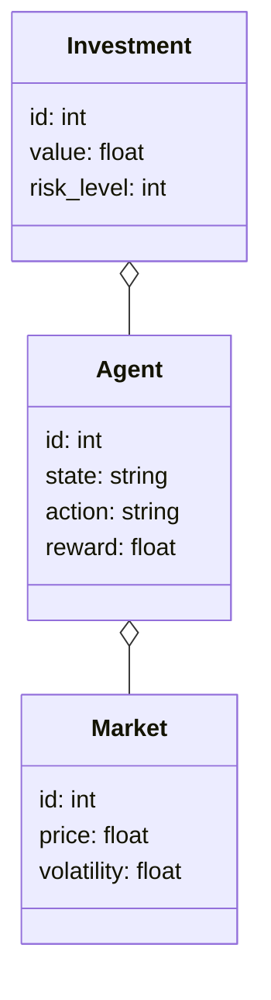
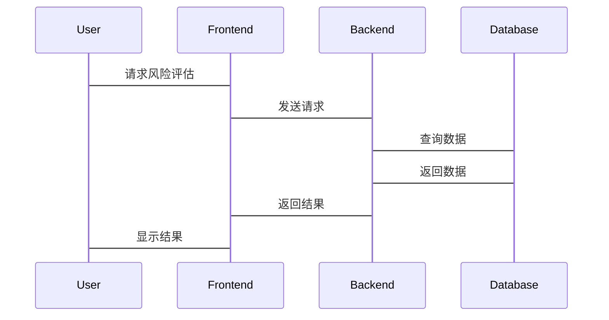

                 


# AI多智能体在价值投资中的风险管理和控制

> 关键词：AI多智能体，价值投资，风险管理，强化学习，金融模型

> 摘要：本文探讨了AI多智能体技术在价值投资中的风险管理与控制应用。通过分析传统风险管理的局限性，介绍了AI多智能体系统的优势，详细阐述了基于强化学习的多智能体算法、系统架构设计，并通过案例分析展示了实际应用效果。文章旨在为金融从业者提供一种新的风险管理思路。

---

# 第一部分: 背景与概述

## 第1章: AI多智能体与价值投资的概述

### 1.1 AI多智能体的基本概念

#### 1.1.1 多智能体系统（MAS）的定义
多智能体系统是由多个相互作用的智能体组成的分布式系统，这些智能体能够通过协作完成复杂任务。每个智能体都有自己的目标、知识和决策能力，并能够通过通信和协调实现整体目标。

#### 1.1.2 AI多智能体的核心特点
- **分布式计算**：每个智能体独立决策，减少单点故障。
- **协同优化**：智能体之间通过协作提高整体效率。
- **动态适应**：能够实时响应环境变化。

#### 1.1.3 多智能体在金融领域的应用潜力
- **实时数据分析**：快速处理市场信息。
- **复杂决策支持**：通过协同优化提供更优解决方案。
- **风险管理**：分散决策降低单点风险。

### 1.2 价值投资的基本概念

#### 1.2.1 价值投资的定义与特点
价值投资是一种投资策略，旨在通过寻找价格低于内在价值的股票进行投资。其核心在于长期视角和基本面分析。

#### 1.2.2 价值投资的核心理念
- **安全边际**：确保买入价格远低于内在价值。
- **长期持有**：避免短期市场波动影响决策。
- **分散投资**：降低单一投资的风险。

#### 1.2.3 价值投资中的风险管理挑战
- **市场波动**：价格可能长期偏离内在价值。
- **信息不对称**：获取可靠信息的难度。
- **决策延迟**：复杂分析可能导致决策滞后。

---

## 第2章: AI多智能体在金融风险管理中的应用背景

### 2.1 传统金融风险管理的局限性

#### 2.1.1 传统风险管理方法的不足
- **单点决策**：依赖少数决策者，风险集中。
- **静态模型**：难以适应快速变化的市场。
- **信息处理能力有限**：难以处理海量数据。

#### 2.1.2 数据驱动与模型驱动的局限性
- 数据驱动方法依赖历史数据，可能忽略新兴风险。
- 模型驱动方法依赖假设，可能在极端情况下失效。

#### 2.1.3 信息不对称问题
传统方法难以有效解决信息不对称，导致决策偏差。

### 2.2 AI技术在金融领域的应用现状

#### 2.2.1 AI在金融分析中的应用
- **自然语言处理**：分析新闻和报告。
- **模式识别**：识别市场趋势。

#### 2.2.2 AI在金融预测中的应用
- **时间序列分析**：预测市场走势。
- **机器学习模型**：分类和回归分析。

#### 2.2.3 AI在金融风险管理中的应用
- **风险评估**：使用AI进行信用评分。
- **实时监控**：识别市场异常波动。

### 2.3 多智能体系统在风险管理中的优势

#### 2.3.1 分散决策的优势
通过多个智能体独立决策，降低单一决策的风险。

#### 2.3.2 多智能体协同的优势
智能体之间的协作能够提供更全面的市场视角。

#### 2.3.3 多智能体系统在复杂环境中的适应性
能够实时调整策略，适应市场变化。

---

# 第二部分: 核心概念与算法原理

## 第3章: 风险管理的核心概念与模型

### 3.1 风险的定义与分类

#### 3.1.1 风险的定义
风险是投资可能损失的价值部分，通常表现为未来收益的不确定性。

#### 3.1.2 风险的分类
- **市场风险**：市场波动导致的损失。
- **信用风险**：债券发行人违约的风险。
- **操作风险**：操作失误导致的损失。

### 3.2 价值投资中的风险来源

#### 3.2.1 市场风险
市场整体波动影响股票价格。

#### 3.2.2 信用风险
公司信用状况变化影响股票价值。

#### 3.2.3 操作风险
交易错误或系统故障导致的损失。

### 3.3 多智能体系统在风险管理中的角色

#### 3.3.1 多智能体系统的风险管理能力
- **实时监控**：持续跟踪市场变化。
- **风险评估**：评估投资组合的风险。

#### 3.3.2 多智能体系统在风险管理中的决策优势
- **分散决策**：降低集中风险。
- **协同优化**：提供更优的风险控制方案。

#### 3.3.3 多智能体系统的风险管理模型
- **VaR模型**：衡量投资组合在正常市场条件下的潜在损失。
- **压力测试模型**：评估极端市场情况下的损失。

---

## 第4章: AI多智能体系统的核心算法与数学模型

### 4.1 基于多智能体的强化学习算法

#### 4.1.1 强化学习的基本原理
智能体通过与环境互动，学习策略以最大化累积奖励。

#### 4.1.2 多智能体强化学习的挑战
- **协调问题**：智能体之间需要有效协作。
- **竞争问题**：避免智能体之间的冲突。

#### 4.1.3 基于多智能体的Q-learning算法
```python
# 多智能体Q-learning算法伪代码
class MultiAgentQ-learning:
    def __init__(self, agents):
        self.agents = agents
        self.q_tables = {agent: defaultdict(dict) for agent in agents}
    
    def update_q_tables(self, agent, state, action, reward, next_state):
        current_q = self.q_tables[agent].get((state, action), 0)
        next_max_q = max(self.q_tables[agent].get((next_state, action), 0) for action in self.q_tables[agent][next_state].keys())
        new_q = current_q + learning_rate * (reward + discount_factor * next_max_q - current_q)
        self.q_tables[agent][(state, action)] = new_q

    def choose_action(self, agent, state):
        available_actions = get_available_actions(state)
        if random.random() < epsilon:
            return random.choice(available_actions)
        else:
            max_q = max(self.q_tables[agent].get((state, action), 0) for action in available_actions)
            return [action for action in available_actions if self.q_tables[agent].get((state, action), 0) == max_q][0]
```

#### 4.1.4 多智能体系统的协同优化
通过强化学习，智能体学习协同策略，优化整体风险控制。

### 4.2 风险管理中的数学模型

#### 4.2.1 风险价值（VaR）模型
$$ VaR = \text{投资组合在一定置信水平下的最大损失} $$

#### 4.2.2 风险调整后的收益（RAROC）模型
$$ RAROC = \frac{\text{净收益}}{\text{风险资本}} $$

#### 4.2.3 压力测试模型
评估极端市场情况下的投资组合损失。

### 4.3 基于多智能体的协同优化模型

#### 4.3.1 协同优化的基本原理
智能体通过协作，优化整体风险控制策略。

#### 4.3.2 多智能体协同优化的数学表达
$$ \text{目标函数} = \sum_{i=1}^{n} f_i(s_i, a_i) $$
其中，\( s_i \) 是智能体i的状态，\( a_i \) 是其行动。

#### 4.3.3 多智能体系统的数学模型
使用博弈论框架，分析智能体之间的互动和协作。

---

# 第三部分: 系统架构与项目实战

## 第5章: 系统架构设计与实现

### 5.1 项目介绍

#### 5.1.1 项目背景
设计一个基于多智能体的金融风险管理系统。

### 5.2 系统功能设计

#### 5.2.1 领域模型设计


#### 5.2.2 系统架构设计


#### 5.2.3 系统接口设计
- **API接口**：提供数据获取和策略执行接口。
- **用户界面**：供用户监控和调整策略。

#### 5.2.4 系统交互设计


### 5.3 项目核心实现

#### 5.3.1 环境安装与配置
安装必要的库：
```bash
pip install numpy pandas scikit-learn tensorflow matplotlib
```

#### 5.3.2 核心代码实现

##### 多智能体系统实现
```python
import numpy as np
import random

class Agent:
    def __init__(self, id, learning_rate=0.1, epsilon=0.1):
        self.id = id
        self.learning_rate = learning_rate
        self.epsilon = epsilon
        self.q_table = {}

    def get_action(self, state, actions):
        if random.random() < self.epsilon:
            return random.choice(actions)
        max_q = -float('inf')
        best_action = actions[0]
        for action in actions:
            q = self.q_table.get((state, action), 0)
            if q > max_q:
                max_q = q
                best_action = action
        return best_action

    def update_q_table(self, state, action, reward, next_state, actions):
        current_q = self.q_table.get((state, action), 0)
        next_max_q = max([self.q_table.get((next_state, act), 0) for act in actions]) if actions else 0
        new_q = current_q + self.learning_rate * (reward + 0.99 * next_max_q - current_q)
        self.q_table[(state, action)] = new_q
```

##### 风险评估模型实现
```python
import numpy as np

def calculate VaR(portfolio, confidence_level=0.95):
    returns = np.sort(portfolio.returns)
    var_level = int(len(returns) * (1 - confidence_level))
    return returns[var_level]

def calculate_risk_adjusted_return(portfolio, risk):
    return (portfolio.return_mean - risk) / portfolio.risk_capital
```

#### 5.3.3 项目实战分析

##### 案例分析
分析一个投资组合的风险，并使用多智能体系统进行优化。

##### 数据分析与结果展示
展示优化前后的风险变化。

---

## 第6章: 总结与展望

### 6.1 总结
本文详细探讨了AI多智能体技术在价值投资中的风险管理与控制应用，介绍了核心算法和系统架构设计，并通过案例展示了实际应用效果。

### 6.2 未来展望
- **算法优化**：改进多智能体协同优化算法。
- **应用场景扩展**：探索更多金融领域的应用。
- **技术融合**：结合其他AI技术提升风险管理能力。

---

# 作者
作者：AI天才研究院 & 禅与计算机程序设计艺术

---

本文通过详细分析和实际案例，展示了AI多智能体技术在价值投资风险管理中的潜力和优势，为金融从业者提供了新的思路和工具。

