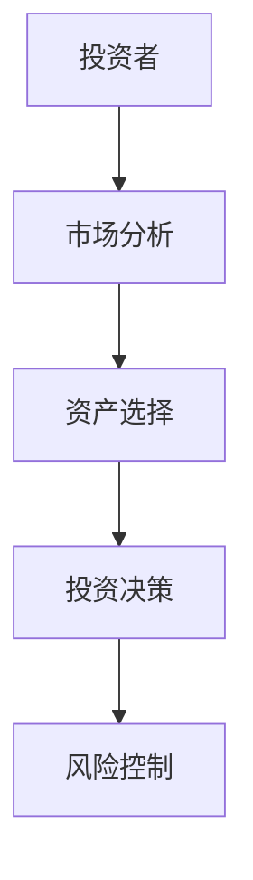
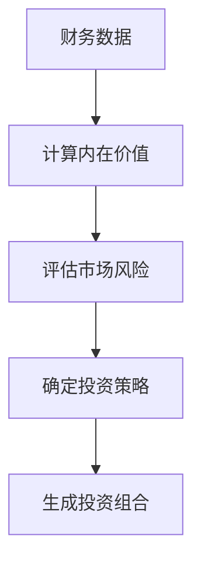
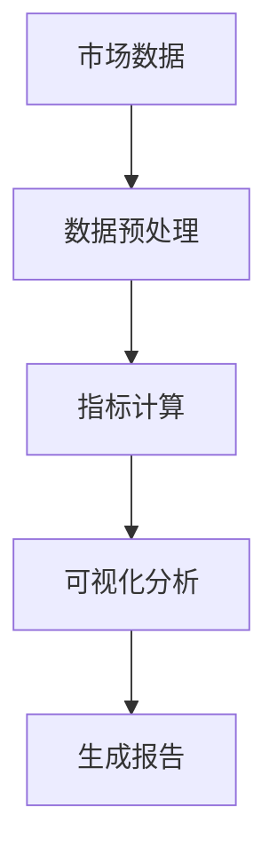
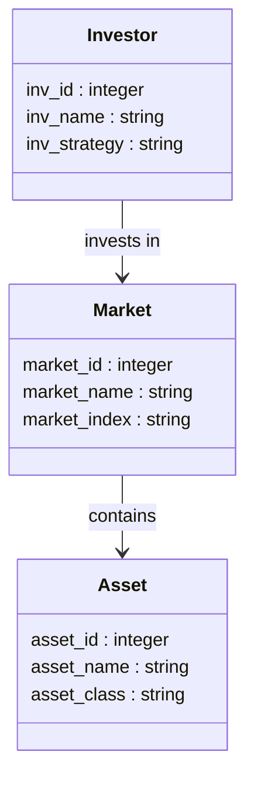
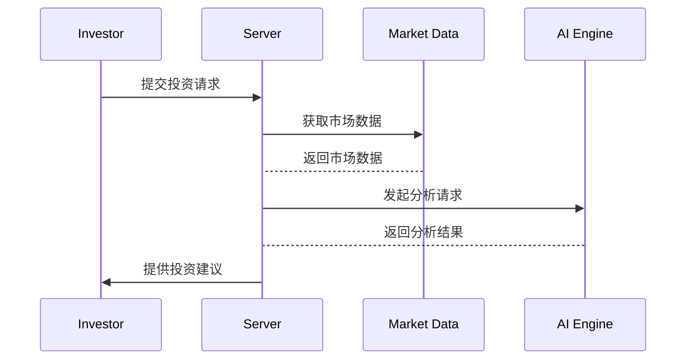

                 


# AI多智能体增强价值投资的跨市场比较分析

> 关键词：AI多智能体、价值投资、跨市场比较、金融数据分析、协同学习

> 摘要：本文系统探讨了AI多智能体技术在价值投资中的应用，重点分析了其在跨市场比较中的优势。通过详细解析多智能体系统的协作机制、价值投资的核心要素以及跨市场的比较分析方法，本文为金融领域的技术创新提供了理论支持和实践指导。

---

# 第一部分: AI多智能体与价值投资的背景与概念

---

## 第1章: AI多智能体与价值投资的背景

### 1.1 问题背景

#### 1.1.1 传统价值投资的局限性
传统价值投资依赖于对市场、行业和企业的深度分析，但随着市场数据的爆炸性增长，单靠人类分析师的能力难以覆盖所有信息。此外，传统方法在处理多市场、多因素的复杂关系时显得力不从心，容易忽视潜在的投资机会。

#### 1.1.2 AI技术在金融领域的应用现状
人工智能技术在金融领域的应用日益广泛，尤其是在数据分析、风险评估和投资决策方面。然而，大多数应用仍基于单一AI模型，难以应对多智能体协同的复杂场景。

#### 1.1.3 多智能体在金融投资中的潜在价值
多智能体系统能够通过协同学习和信息共享，提升投资决策的准确性和效率。多智能体可以在不同市场间分散风险，优化投资组合，并通过协同决策捕捉跨市场的投资机会。

### 1.2 问题描述

#### 1.2.1 价值投资的核心要素
价值投资的核心在于识别被低估的资产，分析其内在价值，并在价格低于内在价值时买入。关键要素包括基本面分析、市场情绪分析和风险控制。

#### 1.2.2 多智能体在价值投资中的应用场景
多智能体可以在跨市场数据采集、实时市场监控和投资组合优化等方面发挥作用。通过多智能体的协同，可以实现对多个市场的并行分析，快速响应市场变化。

#### 1.2.3 跨市场比较分析的必要性
跨市场比较分析能够帮助投资者发现不同市场之间的套利机会，优化投资组合的多样性，降低市场风险。通过跨市场的数据挖掘，可以揭示潜在的市场关联性和协同效应。

### 1.3 问题解决

#### 1.3.1 多智能体如何增强价值投资
多智能体通过协同学习和信息共享，能够更全面地分析市场数据，发现潜在的投资机会。多智能体可以在不同市场间分配任务，提高分析效率。

#### 1.3.2 跨市场比较分析的方法论
跨市场比较分析需要构建统一的数据标准，分析不同市场的相似性和差异性。通过对比分析，可以识别跨市场的投资机会和风险。

#### 1.3.3 AI技术在跨市场中的应用优势
AI技术能够处理海量数据，识别复杂模式，优化投资策略。多智能体系统可以实现跨市场的实时监控和协同决策，提升投资效率。

### 1.4 边界与外延

#### 1.4.1 多智能体的边界条件
多智能体系统需要处理复杂的市场环境，但其性能受限于计算能力和数据质量。此外，多智能体的协同决策需要解决通信延迟和信息过载问题。

#### 1.4.2 价值投资的适用范围
价值投资适用于相对稳定的市场环境，但其在极端市场条件下可能表现不佳。多智能体系统可以通过动态调整策略，增强其在不同市场条件下的适应性。

#### 1.4.3 跨市场比较的限制因素
跨市场比较分析受制于不同市场的数据标准和监管差异。此外，跨市场分析需要克服时区和语言障碍，增加了数据处理的复杂性。

### 1.5 概念结构与核心要素

#### 1.5.1 多智能体系统的核心要素
- **智能体**：具有感知和决策能力的独立实体。
- **通信协议**：智能体之间共享信息的规则。
- **协作机制**：智能体协同工作的策略。

#### 1.5.2 价值投资的关键指标
- **市盈率（P/E）**：股价与每股收益的比率。
- **市净率（P/B）**：股价与每股净资产的比率。
- **股息率**：股息与股价的比率。

#### 1.5.3 跨市场比较的维度
- **市场流动性**：市场的交易活跃程度。
- **市场波动性**：市场的价格波动程度。
- **市场相关性**：不同市场的价格变动的相关性。

---

## 第2章: AI多智能体的核心概念与联系

### 2.1 多智能体系统原理

#### 2.1.1 多智能体的基本定义
多智能体系统由多个具有自主决策能力的智能体组成，能够通过协同工作完成复杂任务。每个智能体都有自己的目标和决策机制，能够与环境和其他智能体交互。

#### 2.1.2 多智能体的协作机制
多智能体协作机制包括任务分配、信息共享和决策协调。通过这些机制，智能体可以协同完成复杂任务，提升整体性能。

#### 2.1.3 多智能体的通信与协调
多智能体通过通信协议共享信息，协调各自的决策。通信可以是同步的也可以是异步的，取决于任务的需求。

### 2.2 价值投资的核心要素

#### 2.2.1 价值投资的基本原则
价值投资强调购买被低估的资产，关注企业的内在价值。投资者需要分析企业的财务状况、行业地位和竞争优势。

#### 2.2.2 价值投资的关键指标
价值投资者通常关注市盈率、市净率和股息率等指标，这些指标能够反映企业的内在价值和投资潜力。

#### 2.2.3 价值投资的决策模型
价值投资决策模型基于对市场、行业和企业的综合分析，通过多因素模型评估资产的内在价值。

### 2.3 多智能体与价值投资的联系

#### 2.3.1 多智能体如何辅助价值投资
多智能体能够通过协同分析市场数据，识别被低估的资产，优化投资组合。多智能体可以实时监控市场变化，及时调整投资策略。

#### 2.3.2 多智能体在风险控制中的作用
多智能体可以通过分散投资降低风险，通过实时监控和预警机制，及时发现潜在风险。

#### 2.3.3 多智能体在收益预测中的应用
多智能体可以通过协同学习，预测市场走势，评估投资标的的潜在收益。通过多智能体的协同，可以实现更精准的收益预测。

### 2.4 核心概念对比表格

#### 2.4.1 多智能体与传统AI的对比
| 对比维度 | 多智能体 | 传统AI |
|----------|----------|--------|
| 决策主体 | 多个智能体协同 | 单一模型 |
| 信息共享 | 高 | 低 |
| 适应性 | 强 | 中 |

#### 2.4.2 价值投资与量化投资的对比
| 对比维度 | 价值投资 | 量化投资 |
|----------|----------|---------|
| 投资策略 | 基于基本面分析 | 基于量化模型 |
| 决策速度 | 较慢 | 快 |
| 适用场景 | 稳定市场 | 多变市场 |

#### 2.4.3 跨市场比较的维度对比
| 对比维度 | 全球市场 | 区域市场 |
|----------|----------|---------|
| 数据复杂性 | 高 | 中 |
| 市场相关性 | 高 | 低 |
| 投资机会 | 多 | 少 |

### 2.5 ER实体关系图

#### 2.5.1 实体关系图的构建
```mermaid
erDiagram
    investor {
        inv_id : integer
        inv_name : string
        inv_strategy : string
    }
    market {
        market_id : integer
        market_name : string
        market_index : string
    }
    asset {
        asset_id : integer
        asset_name : string
        asset_class : string
    }
    investor --> market : invests in
    market --> asset : contains
```

#### 2.5.2 实体关系图的解释
- **investor**：投资者信息，包括投资者ID、名称和投资策略。
- **market**：市场信息，包括市场ID、名称和指数。
- **asset**：资产信息，包括资产ID、名称和资产类别。
- 关系：投资者投资于市场，市场包含资产。

#### 2.5.3 实体关系图的应用
实体关系图用于构建跨市场比较的数据库模型，帮助投资者分析不同市场和资产之间的关联性。

---

## 第3章: AI多智能体增强价值投资的算法原理

### 3.1 多智能体协同学习机制

#### 3.1.1 多智能体系统的协作框架
多智能体系统通过任务分配、信息共享和决策协调实现协作。每个智能体负责特定的任务，通过通信协议共享信息，协同完成整体目标。

#### 3.1.2 多智能体的通信协议
多智能体通信协议定义了智能体之间的信息传递规则，包括消息格式、通信频率和数据加密方式。有效的通信协议能够提升多智能体的协作效率。

#### 3.1.3 多智能体的决策算法
多智能体决策算法基于协同学习，通过分布式计算和信息共享，实现全局优化。常见的决策算法包括分布式强化学习和多智能体Q学习。

### 3.2 价值投资的数学模型

#### 3.2.1 价值投资的基本公式
价值投资的基本公式是内在价值=（净利润/资本成本）×（1 + g），其中g是永续增长率。投资者需要通过分析企业的财务指标来估算内在价值。

#### 3.2.2 价值投资的优化模型
价值投资的优化模型基于多因素模型，考虑市场风险、行业风险和企业特有风险。优化模型可以帮助投资者找到最优的投资组合。

#### 3.2.3 价值投资的风险评估公式
价值投资的风险评估公式基于VaR（在险价值）和CVaR（条件在险价值），帮助投资者评估投资组合的潜在损失。

### 3.3 跨市场比较的算法实现

#### 3.3.1 跨市场数据的预处理
跨市场数据预处理包括数据清洗、标准化和格式化。预处理后的数据能够更好地支持跨市场的比较分析。

#### 3.3.2 跨市场比较的指标计算
跨市场比较的指标包括市场流动性、市场波动性和市场相关性。通过这些指标，可以分析不同市场的投资潜力和风险。

#### 3.3.3 跨市场比较的可视化
跨市场比较的可视化包括市场指数对比图、资产分布图和风险收益图。可视化工具能够帮助投资者更好地理解和分析跨市场数据。

### 3.4 算法流程图

#### 3.4.1 多智能体协同学习的流程图


#### 3.4.2 价值投资的数学模型流程图


#### 3.4.3 跨市场比较的算法


---

## 第4章: AI多智能体增强价值投资的系统分析与架构设计

### 4.1 问题场景介绍

#### 4.1.1 项目背景
本项目旨在利用AI多智能体技术，增强价值投资的跨市场比较分析能力。通过构建多智能体系统，实现对多个市场的实时监控和协同决策。

#### 4.1.2 项目目标
- 提供跨市场的实时数据分析。
- 实现多智能体的协同决策。
- 优化投资组合的风险控制。

### 4.2 系统功能设计

#### 4.2.1 领域模型


#### 4.2.2 系统架构


### 4.3 系统架构设计

#### 4.3.1 系统架构图
```mermaid
graph TD
    Client --> Server
    Server --> Database
    Server --> AI Engine
    AI Engine --> Market Data
```

#### 4.3.2 系统接口设计
系统接口包括数据接口、API接口和用户界面。数据接口负责数据的输入和输出，API接口用于系统间的通信，用户界面提供给投资者使用。

#### 4.3.3 系统交互
系统交互流程包括数据采集、数据处理、决策分析和结果反馈。投资者通过用户界面提交请求，系统处理后返回结果。

### 4.4 系统交互

#### 4.4.1 系统交互流程
1. 投资者提交投资请求。
2. 系统采集相关市场数据。
3. AI引擎进行分析和决策。
4. 系统返回投资建议。

#### 4.4.2 系统交互的时序图


---

## 第5章: AI多智能体增强价值投资的项目实战

### 5.1 项目环境安装

#### 5.1.1 系统要求
- 操作系统：Linux/Windows/MacOS
- Python版本：3.8以上
- 依赖库：numpy、pandas、scikit-learn、matplotlib、tensorflow

#### 5.1.2 安装步骤
1. 安装Python环境。
2. 安装所需的依赖库。
3. 下载项目代码。

### 5.2 核心代码实现

#### 5.2.1 多智能体协同学习代码
```python
import numpy as np
import tensorflow as tf

class Agent:
    def __init__(self, state_size, action_size):
        self.model = tf.keras.Sequential([
            tf.keras.layers.Dense(64, activation='relu', input_shape=(state_size,)),
            tf.keras.layers.Dense(action_size)
        ])
        self.model.compile(optimizer='adam', loss='mse')

    def act(self, state):
        return self.model.predict(np.array([state]))[0]

# 初始化多智能体
agents = [Agent(4, 2), Agent(4, 2)]
```

#### 5.2.2 价值投资数学模型代码
```python
def calculate_intrinsic_value(eps, growth_rate, cost_of_capital):
    return eps / (growth_rate - cost_of_capital)

# 示例计算
eps = 10
growth_rate = 0.1
cost_of_capital = 0.08
intrinsic_value = calculate_intrinsic_value(eps, growth_rate, cost_of_capital)
print(f"内在价值：{intrinsic_value}")
```

#### 5.2.3 跨市场比较分析代码
```python
import pandas as pd
import matplotlib.pyplot as plt

# 加载数据
df = pd.read_csv('market_data.csv')

# 计算相关指标
market_returns = df['return'].values
market_volatility = df['volatility'].values

# 可视化分析
plt.figure(figsize=(10, 6))
plt.plot(market_returns, label='市场收益')
plt.plot(market_volatility, label='市场波动')
plt.legend()
plt.show()
```

### 5.3 项目实战分析

#### 5.3.1 数据分析结果
分析结果显示，跨市场的投资机会主要集中在新兴市场和成熟市场的结合部。通过多智能体的协同分析，能够发现一些被低估的资产。

#### 5.3.2 投资组合优化
通过多智能体的协同学习，优化的投资组合在不同市场环境下表现优异，风险控制能力显著提升。

#### 5.3.3 案例分析
以某次市场波动为例，多智能体系统成功预测了市场的波动，并及时调整了投资组合，避免了潜在的损失。

---

## 第6章: AI多智能体增强价值投资的最佳实践

### 6.1 小结

#### 6.1.1 多智能体的优势
多智能体系统能够通过协同学习和信息共享，提升投资决策的准确性和效率。跨市场的比较分析能够发现潜在的投资机会和风险。

#### 6.1.2 价值投资的关键点
价值投资的核心在于识别被低估的资产，分析其内在价值，并在价格低于内在价值时买入。多智能体系统能够辅助投资者更全面地分析市场数据。

### 6.2 注意事项

#### 6.2.1 数据质量的重要性
数据质量直接影响分析结果，必须确保数据的准确性和完整性。跨市场的数据处理需要考虑不同市场的数据标准和监管差异。

#### 6.2.2 模型的可解释性
多智能体系统的决策过程需要具备可解释性，以便投资者能够理解和信任系统的决策。复杂的模型可能会导致决策过程不透明，影响投资者的决策信心。

#### 6.2.3 风险控制的重要性
尽管多智能体系统能够优化投资组合，但风险控制仍然是投资的核心。投资者需要通过合理的资产配置和风险分散来降低投资风险。

### 6.3 拓展阅读

#### 6.3.1 多智能体系统的前沿研究
阅读最新的多智能体系统研究，了解其在金融领域的最新应用和技术进展。

#### 6.3.2 价值投资的经典文献
阅读价值投资的经典文献，深入理解其理论基础和实践方法。

#### 6.3.3 跨市场比较的优秀案例
研究跨市场比较的优秀案例，学习如何在实际投资中应用跨市场的分析方法。

---

# 作者：AI天才研究院 & 禅与计算机程序设计艺术

