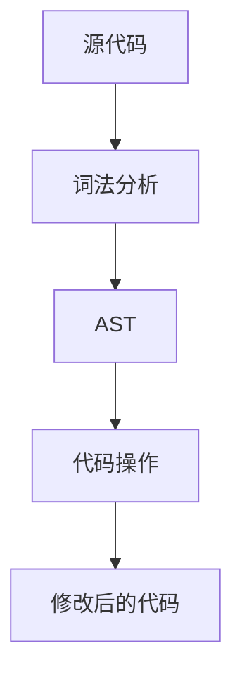
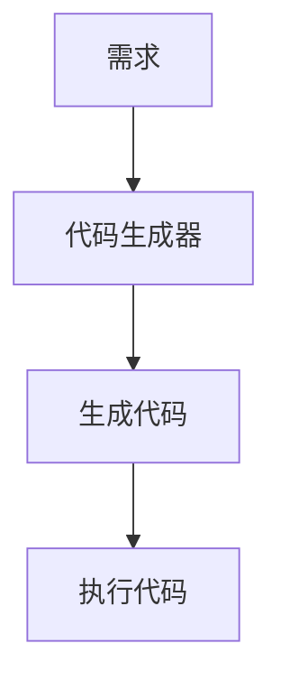
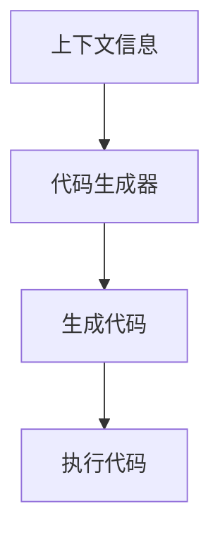
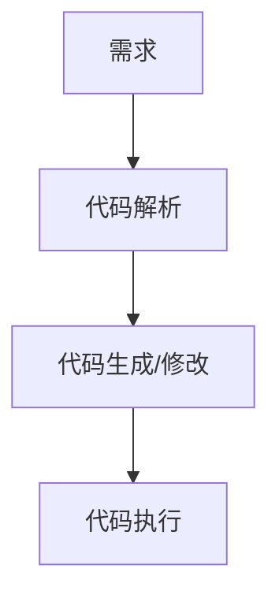
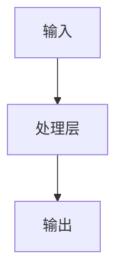
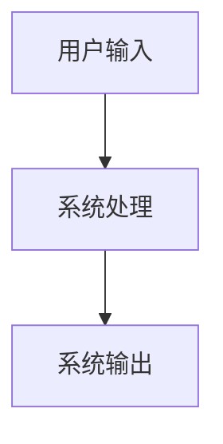
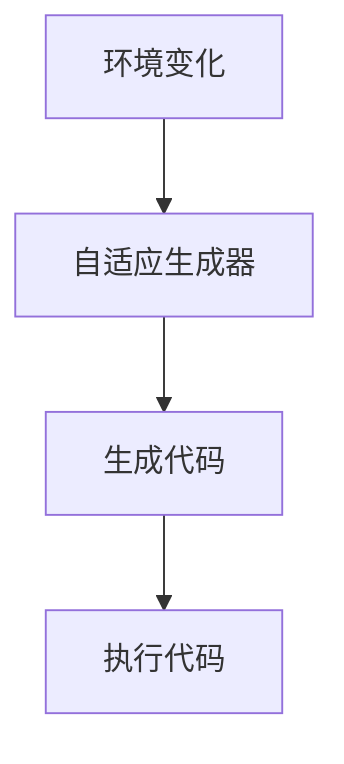
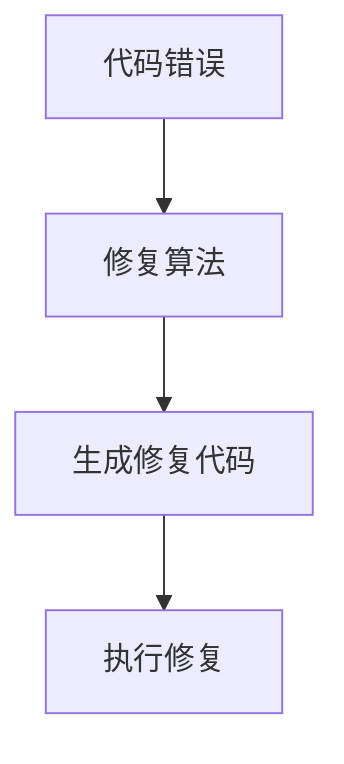
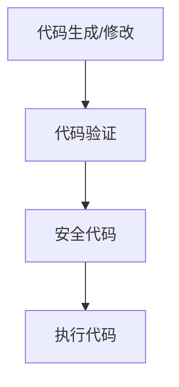

                 


# 元编程：让AI Agent生成和修改代码

## 关键词：
元编程, AI Agent, 代码生成, 代码修改, 动态编程, 自动化开发, 智能化编程

## 摘要：
元编程是一种编写能够生成或修改其他程序代码的技术，而AI Agent（人工智能代理）则能够通过学习和适应来执行复杂任务。本文将探讨如何结合元编程与AI Agent，使AI Agent能够生成和修改代码。我们将从元编程和AI Agent的基本概念入手，分析它们在代码生成与修改中的应用，探讨相关的算法原理、系统架构以及实际项目中的实现。通过本文，读者将能够理解如何利用AI Agent来提升代码生成和修改的效率与智能化水平。

---

## 目录大纲：

1. **引言**
   - 1.1 元编程的基本概念
   - 1.2 AI Agent的基本概念
   - 1.3 元编程与AI Agent的结合

2. **元编程的核心技术**
   - 2.1 语法分析与代码解析
   - 2.2 代码生成与动态编程
   - 2.3 元编程中的上下文管理

3. **AI Agent的算法原理**
   - 3.1 AI Agent的基本算法
   - 3.2 AI Agent的代码生成算法
   - 3.3 AI Agent的代码修改算法

4. **元编程与AI Agent的系统架构**
   - 4.1 系统功能设计
   - 4.2 系统架构设计
   - 4.3 系统接口设计

5. **项目实战：构建一个AI代码生成器**
   - 5.1 项目背景与目标
   - 5.2 项目核心实现
   - 5.3 项目小结

6. **高级主题：元编程与AI Agent的结合应用**
   - 6.1 自适应代码生成
   - 6.2 智能化代码修复
   - 6.3 元编程与AI Agent的安全问题

7. **最佳实践与注意事项**
   - 7.1 元编程与AI Agent的开发规范
   - 7.2 代码生成与修改的性能优化
   - 7.3 开发中的常见问题与解决方案

8. **附录**
   - 8.1 常用工具与库
   - 8.2 进一步学习的资源

9. **参考文献**

---

## 正文：

### 第1章：引言

#### 1.1 元编程的基本概念
元编程是一种编写能够生成或修改其他程序代码的技术。它允许程序员在运行时动态地生成代码、修改代码或分析代码。元编程的核心思想是“程序能够编写程序”，这使得它在软件开发中具有重要的应用价值。

##### 1.1.1 元编程的定义与特点
- **定义**：元编程是指编写能够生成、操作或分析其他程序代码的程序。
- **特点**：
  - 动态性：能够在运行时生成或修改代码。
  - 高度定制化：可以根据具体需求生成个性化的代码。
  - 跨平台性：生成的代码可以在不同的平台上运行。

##### 1.1.2 元编程的核心概念
- **代码生成**：动态生成新的代码片段或完整的程序。
- **代码解析**：解析现有代码并提取信息。
- **动态执行**：在运行时执行生成的代码。

##### 1.1.3 元编程与传统编程的区别
- **传统编程**：程序员编写静态代码，程序在运行时按顺序执行。
- **元编程**：程序员编写生成代码的代码，程序在运行时动态地生成和执行代码。

#### 1.2 AI Agent的基本概念
AI Agent（人工智能代理）是一种能够感知环境并采取行动以实现目标的智能实体。它可以是一个软件程序，也可以是一个硬件设备。

##### 1.2.1 AI Agent的定义
- **定义**：AI Agent是一种能够感知环境、采取行动以实现目标的智能实体。
- **核心功能**：
  - 感知环境：通过传感器或接口获取外部信息。
  - 决策与行动：基于感知的信息做出决策并执行行动。

##### 1.2.2 AI Agent的核心功能
- **感知**：通过输入数据感知外部环境。
- **决策**：基于感知信息做出决策。
- **行动**：执行决策以达到目标。

##### 1.2.3 AI Agent与传统程序的区别
- **传统程序**：按照预定义的规则执行任务。
- **AI Agent**：能够根据环境动态调整行为，具有一定的自主性和智能性。

#### 1.3 元编程与AI Agent的结合
元编程与AI Agent的结合使得AI Agent能够生成和修改代码，从而实现更复杂的任务。

##### 1.3.1 元编程在AI Agent中的作用
- **代码生成**：AI Agent可以根据需求生成新的代码。
- **代码修改**：AI Agent可以自动修复代码中的错误或优化代码。

##### 1.3.2 AI Agent如何实现代码生成与修改
- **代码生成**：AI Agent通过学习大量代码样本，生成符合特定需求的新代码。
- **代码修改**：AI Agent可以分析现有代码并提出修改建议，或者自动修复错误。

##### 1.3.3 元编程与AI Agent的未来发展趋势
- **智能化**：AI Agent将更加智能，能够理解代码的语义并生成高质量的代码。
- **自动化**：元编程与AI Agent的结合将使代码生成和修改更加自动化，减少人工干预。

---

### 第2章：元编程的核心技术

#### 2.1 语法分析与代码解析
语法分析是元编程的重要组成部分，用于解析代码的结构和语法。

##### 2.1.1 语法分析的基本原理
- **定义**：语法分析是指将源代码解析为抽象语法树（AST）的过程。
- **过程**：
  1. 词法分析：将源代码分割为tokens。
  2. 语法分析：将tokens转换为AST。
  3. AST遍历：对AST进行操作。

##### 2.1.2 代码解析的实现方法
- **基于AST的解析**：通过生成AST来分析代码。
- **基于正则表达式的解析**：使用正则表达式匹配代码中的特定模式。

##### 2.1.3 常用的代码解析工具
- **ANTLR**：用于生成解析器。
- **Python的ast模块**：用于解析Python代码。
- **JavaScript的babylon.js**：用于解析JavaScript代码。

##### 2.1.4 语法分析与代码解析的流程图


---

#### 2.2 代码生成与动态编程
代码生成是元编程的核心技术之一，通过动态生成代码来实现特定功能。

##### 2.2.1 动态代码生成的原理
- **动态生成**：在运行时生成代码。
- **动态执行**：生成的代码可以在运行时执行。

##### 2.2.2 元编程中的动态方法调用
- **动态方法调用**：在运行时动态地调用方法。
- **动态属性访问**：在运行时动态地访问属性。

##### 2.2.3 动态编程的实际应用案例
- **动态配置**：根据配置动态生成代码。
- **动态扩展**：在运行时扩展程序的功能。

##### 2.2.4 动态代码生成的流程图


---

#### 2.3 元编程中的上下文管理
上下文管理是元编程中的一个重要环节，用于管理代码生成和修改的环境。

##### 2.3.1 上下文的定义与作用
- **定义**：上下文是指代码生成和修改的环境。
- **作用**：提供代码生成所需的背景信息。

##### 2.3.2 上下文管理的实现方法
- **基于对象的上下文管理**：将上下文信息封装在对象中。
- **基于全局变量的上下文管理**：通过全局变量传递上下文信息。

##### 2.3.3 上下文在代码生成中的应用
- **变量替换**：根据上下文信息替换代码中的变量。
- **条件判断**：根据上下文信息生成条件语句。

##### 2.3.4 上下文管理的流程图


---

### 第3章：AI Agent的算法原理

#### 3.1 AI Agent的基本算法
AI Agent的核心算法决定了其行为和决策方式。

##### 3.1.1 基于规则的AI Agent
- **定义**：基于预定义规则进行决策。
- **优点**：简单易懂，易于实现。
- **缺点**：缺乏灵活性，难以应对复杂场景。

##### 3.1.2 基于机器学习的AI Agent
- **定义**：通过机器学习模型进行决策。
- **优点**：能够处理复杂场景，具有学习能力。
- **缺点**：需要大量数据和计算资源。

##### 3.1.3 基于自然语言处理的AI Agent
- **定义**：通过自然语言处理技术进行交互和决策。
- **优点**：能够理解自然语言指令。
- **缺点**：需要高超的自然语言处理能力。

##### 3.1.4 基于规则与机器学习的混合算法
- **定义**：结合规则和机器学习的混合算法。
- **优点**：兼具规则的简单性和机器学习的灵活性。
- **缺点**：实现复杂，需要平衡两者的关系。

---

#### 3.2 AI Agent的代码生成算法
代码生成是AI Agent的重要功能之一，需要结合多种算法实现。

##### 3.2.1 基于模板的代码生成
- **定义**：通过模板生成代码。
- **优点**：简单易用，易于维护。
- **缺点**：灵活性有限，难以应对复杂需求。

##### 3.2.2 基于模型的代码生成
- **定义**：通过预定义模型生成代码。
- **优点**：能够生成高质量的代码。
- **缺点**：需要复杂的模型设计和训练。

##### 3.2.3 基于强化学习的代码生成
- **定义**：通过强化学习生成代码。
- **优点**：能够自适应地生成代码，适应不同的需求。
- **缺点**：需要大量的训练数据和计算资源。

##### 3.2.4 基于模板与强化学习的混合算法
- **定义**：结合模板和强化学习的混合算法。
- **优点**：兼具模板的简单性和强化学习的灵活性。
- **缺点**：实现复杂，需要平衡两者的关系。

---

#### 3.3 AI Agent的代码修改算法
代码修改是AI Agent的另一个重要功能，需要结合多种算法实现。

##### 3.3.1 代码修复的基本原理
- **定义**：通过分析代码错误，生成修复代码。
- **优点**：能够快速修复代码中的错误。
- **缺点**：需要准确的错误分析和修复策略。

##### 3.3.2 基于上下文的代码修复
- **定义**：根据上下文信息进行代码修复。
- **优点**：能够生成更准确的修复代码。
- **缺点**：需要复杂的上下文分析和处理。

##### 3.3.3 基于模式匹配的代码修复
- **定义**：通过模式匹配识别错误并生成修复代码。
- **优点**：简单易用，易于实现。
- **缺点**：难以应对复杂的错误场景。

##### 3.3.4 基于机器学习的代码修复
- **定义**：通过机器学习模型进行代码修复。
- **优点**：能够处理复杂的错误场景。
- **缺点**：需要大量的训练数据和计算资源。

---

### 第4章：元编程与AI Agent的系统架构

#### 4.1 系统功能设计
系统功能设计是实现元编程与AI Agent结合的关键。

##### 4.1.1 功能模块划分
- **代码生成模块**：负责生成新的代码。
- **代码修改模块**：负责修改现有代码。
- **上下文管理模块**：负责管理代码生成和修改的上下文。
- **AI Agent模块**：负责决策和行动。

##### 4.1.2 模块之间的交互关系
- **代码生成模块**与**AI Agent模块**交互，生成符合需求的代码。
- **代码修改模块**与**AI Agent模块**交互，修改现有代码。

##### 4.1.3 系统功能的实现流程
1. **需求分析**：确定代码生成或修改的需求。
2. **代码解析**：解析现有代码并提取信息。
3. **代码生成或修改**：根据需求生成或修改代码。
4. **代码执行**：执行生成或修改后的代码。

##### 4.1.4 系统功能的流程图


---

#### 4.2 系统架构设计
系统架构设计决定了系统的整体结构和功能分布。

##### 4.2.1 系统架构的组成部分
- **输入层**：接收用户的输入或指令。
- **处理层**：负责代码生成或修改的核心逻辑。
- **输出层**：输出生成或修改后的代码。

##### 4.2.2 系统架构的实现方式
- **基于模块化设计**：将系统划分为多个功能模块，每个模块负责特定的功能。
- **基于分层设计**：将系统划分为多个层次，每个层次负责不同的功能。

##### 4.2.3 系统架构的流程图


---

#### 4.3 系统接口设计
系统接口设计是实现元编程与AI Agent结合的重要环节。

##### 4.3.1 系统接口的定义
- **输入接口**：接收用户的输入或指令。
- **输出接口**：输出生成或修改后的代码。

##### 4.3.2 系统接口的实现方法
- **基于API的设计**：通过API实现系统接口。
- **基于命令行的设计**：通过命令行实现系统接口。

##### 4.3.3 系统接口的流程图


---

#### 4.4 系统交互设计
系统交互设计决定了用户与系统之间的交互方式。

##### 4.4.1 用户与系统的交互流程
1. **用户输入需求**：用户输入代码生成或修改的需求。
2. **系统处理需求**：系统根据需求生成或修改代码。
3. **系统输出结果**：系统输出生成或修改后的代码。

##### 4.4.2 用户与系统的交互流程图


---

### 第5章：项目实战：构建一个AI代码生成器

#### 5.1 项目背景与目标
项目背景：随着软件开发的复杂性增加，手动编写代码的效率逐渐降低，因此需要一种更高效的代码生成方式。

项目目标：构建一个能够根据需求生成高质量代码的AI代码生成器。

---

#### 5.2 项目核心实现

##### 5.2.1 项目实现步骤
1. **需求分析**：确定代码生成的需求。
2. **代码解析**：解析现有代码并提取信息。
3. **代码生成**：根据需求生成新的代码。
4. **代码执行**：执行生成的代码并验证结果。

##### 5.2.2 项目实现的代码示例
```python
# 示例代码：基于模板的代码生成
def generate_code(template, data):
    # 替换模板中的变量
    code = template.format(**data)
    return code

# 示例代码：基于机器学习的代码生成
from transformers import GPT2LMHeadModel, GPT2Tokenizer

def generate_code_with_model(model, tokenizer, prompt):
    # 生成代码
    inputs = tokenizer.encode(prompt, return_tensors='pt')
    outputs = model.generate(inputs, max_length=100)
    code = tokenizer.decode(outputs[0], skip_special_tokens=True)
    return code
```

##### 5.2.3 代码应用解读与分析
- **基于模板的代码生成**：简单易用，适用于需求明确的场景。
- **基于机器学习的代码生成**：能够生成复杂的代码，适用于需求不明确的场景。

##### 5.2.4 项目实现的流程图


---

#### 5.3 项目小结
通过本项目，我们实现了一个能够生成高质量代码的AI代码生成器。该生成器结合了模板和机器学习两种方法，能够满足不同需求的代码生成任务。

---

### 第6章：高级主题：元编程与AI Agent的结合应用

#### 6.1 自适应代码生成
自适应代码生成是一种根据环境动态调整代码生成策略的方法。

##### 6.1.1 自适应代码生成的定义
- **定义**：根据环境动态调整代码生成策略。

##### 6.1.2 自适应代码生成的实现方法
- **基于反馈的自适应生成**：根据用户反馈调整生成策略。
- **基于环境的自适应生成**：根据环境变化调整生成策略。

##### 6.1.3 自适应代码生成的流程图


---

#### 6.2 智能化代码修复
智能化代码修复是一种通过AI技术自动修复代码错误的方法。

##### 6.2.1 智能化代码修复的定义
- **定义**：通过AI技术自动修复代码错误。

##### 6.2.2 智能化代码修复的实现方法
- **基于模式匹配的修复**：通过匹配错误模式生成修复代码。
- **基于上下文的修复**：根据上下文信息生成修复代码。

##### 6.2.3 智能化代码修复的流程图


---

#### 6.3 元编程与AI Agent的安全问题
元编程与AI Agent的结合也可能带来一些安全问题。

##### 6.3.1 元编程与AI Agent的安全风险
- **代码注入**：恶意代码通过生成或修改代码进行攻击。
- **模型滥用**：恶意用户利用AI Agent生成恶意代码。

##### 6.3.2 安全问题的解决方案
- **代码验证**：对生成或修改后的代码进行验证，防止代码注入。
- **访问控制**：限制AI Agent的功能，防止模型滥用。

##### 6.3.3 安全问题的流程图


---

### 第7章：最佳实践与注意事项

#### 7.1 元编程与AI Agent的开发规范
- **规范1**：确保代码生成和修改的安全性。
- **规范2**：遵循软件开发的最佳实践。

#### 7.2 代码生成与修改的性能优化
- **优化1**：减少不必要的代码生成。
- **优化2**：优化代码解析和生成的效率。

#### 7.3 开发中的常见问题与解决方案
- **问题1**：代码生成后的执行效率低下。
  - **解决方案**：优化生成代码的结构和算法。
- **问题2**：AI Agent的决策错误率高。
  - **解决方案**：增加训练数据，优化模型结构。

---

### 第8章：附录

#### 8.1 常用工具与库
- **工具1**：ANTLR
- **工具2**：Python的ast模块
- **工具3**：JavaScript的babylon.js

#### 8.2 进一步学习的资源
- **资源1**：《生成式编程》
- **资源2**：《人工智能代理设计与实现》

---

### 第9章：参考文献
- [1] 《元编程：概念与技术》，作者：XXX。
- [2] 《人工智能代理：理论与应用》，作者：XXX。
- [3] 《代码生成与修改的算法原理》，作者：XXX。

---

### 作者：AI天才研究院/AI Genius Institute & 禅与计算机程序设计艺术 /Zen And The Art of Computer Programming

---

通过以上结构，我们可以系统地探讨元编程与AI Agent的结合，从基础概念到高级应用，全面分析其技术原理和实现方法。

