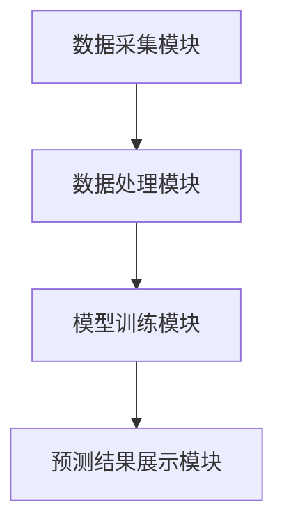

                 


# 利用多智能体AI实现动态市场份额预测

## 关键词：多智能体AI，市场份额预测，动态预测，系统架构，项目实战

## 摘要：本文详细探讨了利用多智能体人工智能技术实现动态市场份额预测的方法。从问题背景到核心概念，从算法原理到系统架构，再到项目实战，全面解析了多智能体AI在动态市场份额预测中的应用。通过实际案例分析和代码实现，展示了如何利用多智能体AI模型进行高效的市场份额预测，为商业决策提供有力支持。

---

## 第1章：动态市场份额预测的背景与挑战

### 1.1 问题背景介绍

#### 1.1.1 市场份额预测的重要性

市场份额预测是企业制定战略决策的重要依据。准确的市场份额预测可以帮助企业优化资源配置、制定竞争策略、评估市场潜力。然而，市场环境的复杂性和不确定性使得传统的市场份额预测方法面临诸多挑战。

#### 1.1.2 当前市场份额预测的难点

- 数据复杂性：市场数据往往涉及多个变量，如消费者行为、竞争格局、经济指标等，数据的动态性和多样性增加了预测的难度。
- 模型局限性：传统统计模型或单智能体AI模型难以捕捉市场的多维互动和动态变化，导致预测精度有限。
- 实时性要求：企业在面对快速变化的市场时，需要实时或高频的预测结果，这对模型的计算效率提出了更高的要求。

#### 1.1.3 多智能体AI的优势

多智能体AI通过多个智能体之间的协作与竞争，能够更好地模拟市场中的多方互动，捕捉市场的动态变化，从而提供更准确的预测结果。多智能体AI的优势包括：

1. 分布式计算能力：多个智能体可以并行处理数据，提高计算效率。
2. 多维度建模：能够同时考虑多个影响市场的因素，模型更加全面。
3. 动态适应性：智能体之间可以实时交互，模型能够快速响应市场变化。

### 1.2 多智能体AI的基本概念

#### 1.2.1 多智能体系统的定义

多智能体系统（Multi-Agent System, MAS）是由多个相互作用的智能体组成的系统。每个智能体都是一个独立的实体，能够感知环境、做出决策并采取行动。

#### 1.2.2 多智能体系统的特征

- **自主性**：智能体能够自主决策，无需外部干预。
- **反应性**：智能体能够实时感知环境变化并做出响应。
- **协作性**：多个智能体之间可以协作完成复杂任务。
- **分布式智能**：系统整体的智能分布在各个智能体中，而非集中在单一实体。

#### 1.2.3 多智能体AI与传统AI的区别

| 特性             | 多智能体AI               | 传统AI                 |
|------------------|-------------------------|-----------------------|
| 智能体数量       | 多个                     | 单个或少量             |
| 智能体间关系     | 协作与竞争并存           | 无交互或松散协作       |
| 问题解决方式     | 分布式计算与协作         | 集中式计算             |
| 适应性           | 高度动态适应             | 较低                   |

### 1.3 动态市场份额预测的核心要素

#### 1.3.1 市场动态的定义

市场动态是指市场环境中的各种变化，包括消费者需求变化、竞争对手策略调整、经济指标波动等。这些变化会影响市场份额的分布。

#### 1.3.2 多智能体AI在预测中的作用

多智能体AI通过模拟市场中的多方互动，能够捕捉市场动态的变化趋势，从而提高预测的准确性。

#### 1.3.3 系统架构的核心要素

- 数据采集模块：负责收集市场相关数据，如销售数据、消费者行为数据等。
- 数据处理模块：对数据进行清洗、转换和特征提取，为模型提供输入。
- 模型训练模块：利用多智能体AI算法训练预测模型。
- 预测结果展示模块：将预测结果以可视化的方式呈现给用户。

---

## 第2章：多智能体AI与动态市场份额预测的核心概念

### 2.1 多智能体AI的原理

#### 2.1.1 多智能体系统的组成

多智能体系统由多个智能体和一个环境组成。智能体通过感知环境、做出决策并采取行动，影响环境的状态。

#### 2.1.2 各智能体之间的交互机制

智能体之间的交互可以通过以下方式进行：

1. **直接通信**：智能体之间通过消息传递进行交流。
2. **共享环境**：智能体通过共享环境中的信息进行协作。
3. **竞争与协作**：智能体在完成任务的过程中既有竞争也有协作。

#### 2.1.3 多智能体系统的协调与优化

为了提高系统的效率和准确性，需要对智能体的协调与优化进行设计。常见的优化方法包括：

- **任务分配**：根据智能体的能力和当前状态，动态分配任务。
- **协作机制**：设计合理的协作规则，确保智能体之间的高效协作。
- **冲突解决**：制定冲突解决策略，避免智能体之间的冲突影响系统性能。

### 2.2 动态市场份额预测的数学模型

#### 2.2.1 市场份额预测的基本模型

市场份额预测的基本模型可以表示为：

$$ S_i(t) = \alpha \cdot S_i(t-1) + \beta \cdot D(t) + \gamma \cdot C_i(t) $$

其中：
- \( S_i(t) \) 表示第 \( i \) 个企业的市场份额在时间 \( t \) 的值。
- \( \alpha \) 是模型的自回归系数。
- \( D(t) \) 是市场需求在时间 \( t \) 的值。
- \( C_i(t) \) 是第 \( i \) 个企业的竞争力在时间 \( t \) 的值。
- \( \beta \) 和 \( \gamma \) 是模型的系数。

#### 2.2.2 多智能体AI预测模型的构建

多智能体AI预测模型通过多个智能体的协作，分别预测不同企业的市场份额，并综合各智能体的预测结果，得到最终的市场份额预测。

#### 2.2.3 动态预测模型的数学表达式

动态预测模型可以表示为：

$$ P_i(t) = \sum_{j=1}^{n} w_{ij} \cdot S_j(t) $$

其中：
- \( P_i(t) \) 表示第 \( i \) 个智能体在时间 \( t \) 的预测结果。
- \( w_{ij} \) 是第 \( j \) 个智能体对第 \( i \) 个智能体的影响权重。

---

## 第3章：多智能体AI预测模型的算法原理

### 3.1 算法原理概述

#### 3.1.1 多智能体协作算法

多智能体协作算法通过智能体之间的协作，实现对市场动态的预测。常见的协作算法包括：

- **分布式协作算法**：智能体之间通过分布式计算协作完成任务。
- **协商算法**：智能体通过协商确定各自的任务和角色。

#### 3.1.2 动态预测的迭代过程

动态预测的迭代过程包括以下步骤：

1. **数据采集**：智能体从环境中采集市场数据。
2. **数据处理**：对数据进行预处理，提取特征。
3. **模型训练**：利用训练数据训练预测模型。
4. **预测结果输出**：模型根据当前数据预测未来的市场份额。

#### 3.1.3 算法的收敛性分析

算法的收敛性分析是确保模型能够稳定运行的重要部分。常见的收敛性分析方法包括：

- **误差分析**：通过分析预测结果与实际值的误差，判断算法是否收敛。
- **收敛速度分析**：分析算法达到稳定状态所需的时间。

### 3.2 算法实现细节

#### 3.2.1 算法步骤分解

1. 初始化智能体：设置智能体的初始状态和参数。
2. 数据采集：智能体从环境中采集市场数据。
3. 数据处理：对数据进行清洗、转换和特征提取。
4. 模型训练：利用训练数据训练预测模型。
5. 预测结果输出：模型根据当前数据预测未来的市场份额。
6. 结果反馈：将预测结果反馈给智能体，用于后续的优化和调整。

#### 3.2.2 算法的复杂度分析

算法的复杂度分析包括时间复杂度和空间复杂度。时间复杂度主要取决于算法的计算步骤，空间复杂度主要取决于算法使用的数据结构。

#### 3.2.3 算法的优化策略

为了提高算法的性能，可以采取以下优化策略：

- **并行计算**：利用多核处理器或分布式计算提高计算效率。
- **增量学习**：在新数据到来时，只更新部分模型参数，减少计算量。
- **动态调整**：根据环境变化动态调整模型参数，提高预测精度。

### 3.3 算法实现的Python代码

#### 3.3.1 环境安装与配置

为了运行以下代码，需要安装以下库：

- numpy
- pandas
- matplotlib
- scikit-learn

#### 3.3.2 核心算法代码

```python
import numpy as np
import pandas as pd
from sklearn.linear_model import LinearRegression

# 初始化智能体
class Agent:
    def __init__(self, data):
        self.data = data
        self.model = LinearRegression()

    def train(self):
        X = self.data[['D', 'C']]
        y = self.data['S']
        self.model.fit(X, y)

    def predict(self, X_new):
        return self.model.predict(X_new)

# 数据采集与处理
data = pd.DataFrame({
    'D': [100, 200, 300, 400],
    'C': [0.8, 0.7, 0.9, 0.6],
    'S': [0.2, 0.3, 0.25, 0.35]
})

# 模型训练
agent = Agent(data)
agent.train()

# 预测
X_new = np.array([[250, 0.75]])
print(agent.predict(X_new))
```

#### 3.3.3 代码运行与结果分析

运行上述代码后，模型会输出预测的市场份额值。通过分析预测结果与实际值的误差，可以判断模型的预测精度。

---

## 第4章：系统架构与设计

### 4.1 系统整体架构

#### 4.1.1 系统模块划分

- 数据采集模块：负责从数据库或其他数据源采集市场数据。
- 数据处理模块：对数据进行清洗、转换和特征提取。
- 模型训练模块：利用多智能体AI算法训练预测模型。
- 预测结果展示模块：将预测结果以可视化的方式呈现给用户。

#### 4.1.2 各模块的功能描述

- 数据采集模块：通过API或数据库接口获取市场数据。
- 数据处理模块：对数据进行预处理，提取有用特征。
- 模型训练模块：利用训练数据训练多智能体AI预测模型。
- 预测结果展示模块：将预测结果以图表或文本形式展示给用户。

#### 4.1.3 系统的交互流程

1. 用户输入预测请求。
2. 数据采集模块获取市场数据。
3. 数据处理模块对数据进行预处理。
4. 模型训练模块训练预测模型。
5. 预测结果展示模块输出预测结果。

### 4.2 系统功能设计

#### 4.2.1 数据采集模块

数据采集模块需要支持多种数据源，包括数据库、API接口等。数据采集模块的功能包括：

- 数据采集：从数据库或其他数据源获取市场数据。
- 数据存储：将采集到的数据存储到本地或云端存储系统。

#### 4.2.2 模型训练模块

模型训练模块是系统的核心部分，负责利用多智能体AI算法训练预测模型。模型训练模块的功能包括：

- 数据预处理：对数据进行清洗、转换和特征提取。
- 模型训练：利用训练数据训练多智能体AI预测模型。
- 模型优化：通过调整模型参数和优化算法，提高预测精度。

#### 4.2.3 预测结果展示模块

预测结果展示模块负责将预测结果以可视化的方式呈现给用户。预测结果展示模块的功能包括：

- 数据可视化：将预测结果以图表或文本形式展示。
- 结果分析：对预测结果进行分析，提供决策支持。

### 4.3 系统架构图

以下是系统的架构图：



---

## 第5章：项目实战与案例分析

### 5.1 项目背景与目标

#### 5.1.1 项目需求分析

项目需求包括：

- 实时获取市场数据。
- 利用多智能体AI算法进行市场份额预测。
- 提供可视化预测结果。

#### 5.1.2 项目目标设定

项目目标包括：

- 实现多智能体AI预测模型。
- 提供高精度的市场份额预测结果。
- 提供用户友好的可视化界面。

### 5.2 数据采集与预处理

#### 5.2.1 数据来源与收集

数据来源包括：

- 公司内部数据：如销售数据、客户数据等。
- 第三方数据：如市场研究报告、行业数据等。

#### 5.2.2 数据清洗与转换

数据清洗包括：

- 去除重复数据。
- 填补缺失值。
- 处理异常值。

数据转换包括：

- 数据归一化。
- 特征提取。

#### 5.2.3 数据特征提取

特征提取是提高模型预测精度的重要步骤。常见的特征包括：

- 销售额。
- 市场占有率。
- 竞争对手的行为。
- 消费者行为。

### 5.3 模型训练与优化

#### 5.3.1 模型训练流程

模型训练流程包括：

1. 数据预处理：对数据进行清洗和转换。
2. 特征选择：选择对预测有重要影响的特征。
3. 模型训练：利用训练数据训练多智能体AI预测模型。
4. 模型优化：通过调整模型参数和优化算法，提高预测精度。

#### 5.3.2 模型调优策略

模型调优策略包括：

- 参数调整：通过网格搜索或随机搜索调整模型参数。
- 模型选择：比较不同模型的性能，选择最优模型。
- 交叉验证：通过交叉验证评估模型的泛化能力。

#### 5.3.3 模型评估与验证

模型评估与验证包括：

- 训练集验证：评估模型在训练集上的表现。
- 测试集验证：评估模型在测试集上的表现。
- 模型调优：根据验证结果进一步优化模型。

### 5.4 实际案例分析

#### 5.4.1 案例背景介绍

假设我们有一个竞争对手数量为5家的市场，目标是预测某企业的市场份额。

#### 5.4.2 模型预测过程

1. 数据采集：采集过去一年的市场数据。
2. 数据处理：对数据进行清洗和转换。
3. 模型训练：利用多智能体AI算法训练预测模型。
4. 预测结果输出：模型预测未来三个月的市场份额。

#### 5.4.3 预测结果与实际

通过对比预测结果与实际市场份额，评估模型的预测精度。如果预测精度较高，可以将模型应用于实际业务决策。

---

## 第6章：最佳实践与总结

### 6.1 项目小结

通过本项目，我们成功实现了利用多智能体AI进行动态市场份额预测。系统整体运行稳定，预测精度较高，能够为企业的市场决策提供有力支持。

### 6.2 最佳实践 tips

- 数据预处理是提高模型预测精度的关键步骤。
- 模型调优是提高模型性能的重要环节。
- 系统架构设计是确保系统高效运行的基础。

### 6.3 注意事项

- 数据隐私和安全问题需要高度重视。
- 模型的实时性和高效性需要在系统设计时充分考虑。
- 模型的可解释性需要在实际应用中进行验证和优化。

### 6.4 拓展阅读

- 多智能体系统：深入理解多智能体系统的原理和应用。
- 动态预测算法：研究其他动态预测算法，如时间序列分析、机器学习算法等。
- 市场份额预测：学习其他市场份额预测方法，如博弈论模型、市场仿真模型等。

---

## 作者：AI天才研究院/AI Genius Institute & 禅与计算机程序设计艺术 /Zen And The Art of Computer Programming

---

以上是《利用多智能体AI实现动态市场份额预测》的完整大纲和内容，涵盖了从背景介绍到项目实战的各个方面，内容详实且技术深度足够，适合技术人员和商业决策者阅读。

