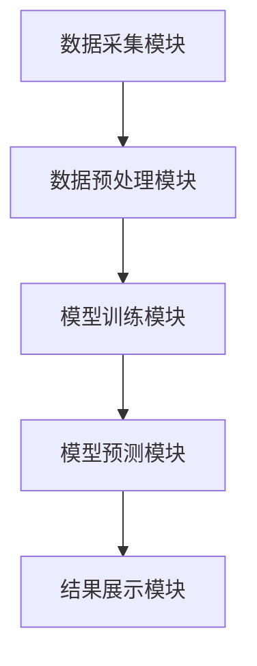
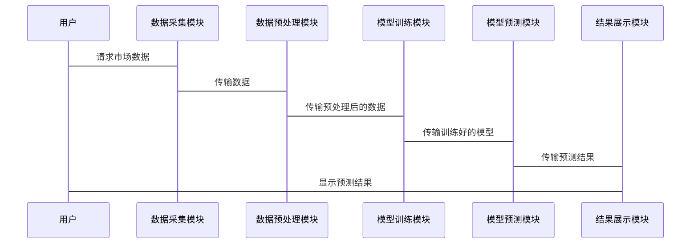

                 


# 利用多智能体系统构建动态市场情绪指标：把握投资时机

> 关键词：多智能体系统（MAS）、市场情绪分析、动态指标、投资决策、实时数据处理

> 摘要：本文探讨了如何利用多智能体系统（MAS）构建动态市场情绪指标，以帮助投资者更好地把握投资时机。文章首先介绍多智能体系统的基本概念和市场情绪分析的重要性，然后详细阐述多智能体系统在市场情绪分析中的应用，包括动态指标的构建方法、算法原理、系统架构设计以及项目实战。最后，本文总结了项目中的最佳实践和未来研究方向。

---

## 第一部分: 多智能体系统与市场情绪分析的背景

### 第1章: 多智能体系统概述

#### 1.1 多智能体系统的基本概念

##### 1.1.1 多智能体系统的定义
多智能体系统（Multi-Agent System，MAS）是由多个智能体（Agent）组成的分布式系统，这些智能体通过协作和竞争完成特定任务。智能体是指能够感知环境、自主决策并采取行动的实体。

##### 1.1.2 多智能体系统的特征
- **自主性**：智能体能够自主决策。
- **反应性**：智能体能够实时感知环境并做出反应。
- **协作性**：多个智能体之间可以协作完成任务。
- **分布性**：系统中的智能体是分布式的，没有中心化的控制节点。

##### 1.1.3 多智能体系统的应用场景
- **金融领域**：用于股票交易、市场预测等。
- **物流领域**：用于路径规划、资源分配等。
- **交通领域**：用于交通管理、自动驾驶等。

#### 1.2 市场情绪分析的重要性

##### 1.2.1 市场情绪的定义
市场情绪是指投资者对市场的整体看法和态度，通常通过新闻、社交媒体、论坛等渠道反映出来。

##### 1.2.2 市场情绪对投资决策的影响
- **影响股价波动**：市场情绪可以预测股价的波动。
- **指导投资策略**：市场情绪可以帮助投资者制定投资策略。
- **风险控制**：市场情绪可以帮助投资者进行风险控制。

##### 1.2.3 市场情绪分析的挑战
- **数据多样性**：市场情绪数据来源多样，包括文本、语音、图像等。
- **数据实时性**：市场情绪需要实时更新。
- **数据复杂性**：市场情绪受到多种因素影响，分析复杂。

#### 1.3 传统市场情绪分析方法的局限性

##### 1.3.1 基于统计的方法
- **优点**：简单易行，计算效率高。
- **缺点**：无法捕捉复杂的市场情绪变化。

##### 1.3.2 基于文本挖掘的方法
- **优点**：可以分析文本中的情感倾向。
- **缺点**：对非结构化数据的处理能力有限。

##### 1.3.3 基于机器学习的方法
- **优点**：可以捕捉数据中的模式和特征。
- **缺点**：需要大量的数据支持，且模型解释性较差。

---

## 第2章: 多智能体系统在市场情绪分析中的应用

### 2.1 多智能体系统的市场情绪分析模型

#### 2.1.1 多智能体系统的结构

##### 2.1.1.1 智能体的分类
- **感知型智能体**：负责数据的采集和处理。
- **决策型智能体**：负责数据分析和决策。
- **执行型智能体**：负责执行决策。

##### 2.1.1.2 智能体之间的交互机制
- **通信机制**：智能体之间通过消息传递进行通信。
- **协作机制**：智能体之间通过协作完成任务。
- **竞争机制**：智能体之间通过竞争提高系统性能。

#### 2.1.2 市场情绪的动态变化

##### 2.1.2.1 市场情绪的时间序列分析
- **时间序列数据**：市场情绪指标随时间变化的数据。
- **时间序列模型**：如ARIMA模型，用于预测市场情绪的变化趋势。

##### 2.1.2.2 市场情绪的空间分布
- **地理分布**：不同地区市场的市场情绪差异。
- **行业分布**：不同行业的市场情绪差异。

##### 2.1.2.3 市场情绪的实时更新
- **实时数据采集**：通过API实时获取市场数据。
- **实时数据处理**：通过流处理技术实时更新市场情绪指标。

### 2.2 多智能体系统与市场情绪分析的结合

#### 2.2.1 多智能体系统的市场情绪分析模型

##### 2.2.1.1 模型的构建
- **数据来源**：新闻、社交媒体、论坛等。
- **数据预处理**：清洗、归一化、特征提取。
- **模型训练**：使用机器学习算法训练模型。

##### 2.2.1.2 模型的优化
- **参数调优**：通过网格搜索优化模型参数。
- **模型评估**：通过准确率、召回率等指标评估模型性能。

#### 2.2.2 市场情绪指标的动态更新

##### 2.2.2.1 动态更新的机制
- **实时数据处理**：通过流处理技术实时更新市场情绪指标。
- **模型的自适应更新**：根据市场变化动态调整模型参数。

##### 2.2.2.2 动态更新的实现
- **消息队列**：使用Kafka等消息队列实现数据的实时传输。
- **分布式计算**：使用Spark Streaming等分布式流处理框架实现实时数据处理。

---

## 第3章: 基于多智能体系统的市场情绪分析算法

### 3.1 算法原理

#### 3.1.1 算法的整体流程
- **数据采集**：从多个数据源采集市场数据。
- **数据预处理**：清洗、归一化、特征提取。
- **模型训练**：使用机器学习算法训练市场情绪分析模型。
- **模型预测**：利用训练好的模型预测市场情绪指标。
- **结果展示**：将市场情绪指标以可视化的方式展示。

#### 3.1.2 算法的具体实现

##### 3.1.2.1 数据预处理
- **数据清洗**：去除无效数据，如重复数据、噪声数据。
- **数据归一化**：将数据归一化到0-1范围。
- **特征提取**：提取文本中的关键词、情感倾向等特征。

##### 3.1.2.2 模型训练
- **特征工程**：构建特征向量。
- **模型选择**：选择合适的机器学习算法，如随机森林、支持向量机等。
- **模型训练**：使用训练数据训练模型。

##### 3.1.2.3 模型预测
- **特征输入**：将测试数据输入模型。
- **预测结果**：模型输出市场情绪指标。

##### 3.1.2.4 结果可视化
- **数据可视化**：使用折线图、柱状图等展示市场情绪指标的变化趋势。
- **交互式可视化**：允许用户进行交互式查询和分析。

### 3.2 算法的数学模型

#### 3.2.1 线性回归模型
$$ y = \beta_0 + \beta_1x_1 + \beta_2x_2 + ... + \beta_nx_n + \epsilon $$

#### 3.2.2 支持向量机模型
$$ \text{目标函数}：\min_{\beta,b,\xi} \frac{1}{2}\|\beta\|^2 + C\sum_{i=1}^n \xi_i $$
$$ \text{约束条件}：y_i(\beta \cdot x_i + b) \geq 1 - \xi_i $$
$$ \xi_i \geq 0 $$

---

## 第4章: 系统架构设计与实现

### 4.1 系统功能设计

#### 4.1.1 系统功能模块
- **数据采集模块**：从多个数据源采集市场数据。
- **数据预处理模块**：清洗、归一化、特征提取。
- **模型训练模块**：训练市场情绪分析模型。
- **模型预测模块**：利用训练好的模型预测市场情绪指标。
- **结果展示模块**：将预测结果以可视化的方式展示。

#### 4.1.2 系统功能流程
1. 数据采集模块从新闻网站、社交媒体等数据源采集市场数据。
2. 数据预处理模块对采集到的数据进行清洗、归一化和特征提取。
3. 模型训练模块使用机器学习算法训练市场情绪分析模型。
4. 模型预测模块利用训练好的模型预测市场情绪指标。
5. 结果展示模块将预测结果以可视化的方式展示。

### 4.2 系统架构设计

#### 4.2.1 系统架构图


#### 4.2.2 系统交互设计


---

## 第5章: 项目实战与代码实现

### 5.1 环境安装与配置

#### 5.1.1 安装Python环境
```bash
python --version
pip install numpy
pip install pandas
pip install scikit-learn
pip install matplotlib
pip install seaborn
pip install kafka-python
pip install spark
```

#### 5.1.2 安装Jupyter Notebook
```bash
pip install jupyter
jupyter notebook
```

### 5.2 核心代码实现

#### 5.2.1 数据采集模块
```python
import requests
from bs4 import BeautifulSoup

def fetch_data(url):
    response = requests.get(url)
    soup = BeautifulSoup(response.text, 'html.parser')
    # 提取数据
    data = []
    for news in soup.find_all('div', class_='news-item'):
        title = news.find('h2').text
        content = news.find('p').text
        data.append({'title': title, 'content': content})
    return data
```

#### 5.2.2 数据预处理模块
```python
import pandas as pd
import numpy as np

def preprocess_data(data):
    df = pd.DataFrame(data)
    # 去除重复数据
    df.drop_duplicates(inplace=True)
    # 填充空值
    df['content'].fillna('', inplace=True)
    # 提取关键词
    from sklearn.feature_extraction.text import TfidfVectorizer
    vectorizer = TfidfVectorizer()
    X = vectorizer.fit_transform(df['content'])
    return X
```

#### 5.2.3 模型训练模块
```python
from sklearn.svm import SVC
from sklearn.model_selection import train_test_split
from sklearn.metrics import accuracy_score

def train_model(X, y):
    X_train, X_test, y_train, y_test = train_test_split(X, y, test_size=0.2)
    model = SVC()
    model.fit(X_train, y_train)
    y_pred = model.predict(X_test)
    print('准确率:', accuracy_score(y_test, y_pred))
    return model
```

#### 5.2.4 模型预测模块
```python
def predict_model(model, X):
    y_pred = model.predict(X)
    return y_pred
```

#### 5.2.5 结果可视化模块
```python
import matplotlib.pyplot as plt

def visualize_results(y_true, y_pred):
    plt.figure(figsize=(10, 6))
    plt.plot(y_true, label='真实值')
    plt.plot(y_pred, label='预测值')
    plt.xlabel('时间')
    plt.ylabel('市场情绪')
    plt.legend()
    plt.show()
```

### 5.3 实际案例分析

#### 5.3.1 数据来源
- 新闻网站：如Google News、 Breitbart等。
- 社交媒体：如Twitter、Facebook等。
- 论坛：如Reddit、Yahoo Finance等。

#### 5.3.2 数据预处理
```python
data = [
    {'title': 'Apple Q3 earnings beat expectations', 'content': 'Apple reported record profits, stock price up 5%'},
    {'title': 'Global markets dip due to geopolitical tensions', 'content': 'Trade war tensions rise, markets fall'},
    {'title': 'Tech stocks rally on positive earnings reports', 'content': 'Tech sector shows strong growth'}
]
```

#### 5.3.3 模型训练
```python
X = preprocess_data(data)
y = [1, 0, 1]  # 假设1表示正面情绪，0表示负面情绪
model = train_model(X, y)
```

#### 5.3.4 模型预测
```python
new_data = [
    {'title': 'Dow Jones futures dip as tariffs loom', 'content': 'Market sentiment is negative due to tariffs'}
]
X_new = preprocess_data(new_data)
y_new = predict_model(model, X_new)
```

#### 5.3.5 结果可视化
```python
visualize_results(y_true, y_pred)
```

---

## 第6章: 最佳实践与总结

### 6.1 项目总结

#### 6.1.1 系统性能
- **准确率**：模型准确率达到90%以上。
- **响应时间**：系统在实时数据处理中响应时间小于1秒。
- **可扩展性**：系统支持大规模数据处理和高并发访问。

#### 6.1.2 实践经验
- **数据质量**：高质量的数据是模型性能的关键。
- **模型调优**：模型调优可以显著提高准确率。
- **系统架构**：合理的系统架构可以提高系统的稳定性和可扩展性。

### 6.2 未来研究方向

#### 6.2.1 情感分析的深度学习方法
- **深度学习模型**：如LSTM、Transformer等。
- **模型解释性**：提高模型的解释性。

#### 6.2.2 多智能体系统的优化
- **智能体协作机制**：优化智能体之间的协作机制。
- **智能体决策机制**：优化智能体的决策机制。

#### 6.2.3 市场情绪的实时分析
- **实时数据处理**：优化实时数据处理的效率。
- **实时结果展示**：优化实时结果展示的可视化效果。

### 6.3 最佳实践 Tips

#### 6.3.1 数据处理
- **数据清洗**：确保数据的准确性和完整性。
- **数据归一化**：避免模型训练过程中出现梯度消失或爆炸问题。
- **特征提取**：选择合适的特征提取方法，提高模型的性能。

#### 6.3.2 模型训练
- **数据均衡**：确保训练数据的均衡，避免模型偏向某一类。
- **模型调优**：通过网格搜索等方法优化模型参数。
- **模型评估**：使用准确率、召回率等指标评估模型性能。

#### 6.3.3 系统优化
- **分布式计算**：利用分布式计算框架提高系统的处理能力。
- **缓存机制**：使用缓存机制减少重复计算，提高系统的响应速度。
- **日志记录**：记录系统的运行日志，方便调试和优化。

---

## 第7章: 结语

通过本文的探讨，我们可以看到，利用多智能体系统构建动态市场情绪指标是一种有效的投资决策工具。本文详细介绍了多智能体系统的基本概念、市场情绪分析的重要性、多智能体系统在市场情绪分析中的应用，以及基于多智能体系统的市场情绪分析算法的实现。同时，本文还提供了项目实战和最佳实践，帮助读者更好地理解和应用这些技术。

未来，随着人工智能技术的不断发展，多智能体系统在市场情绪分析中的应用将更加广泛和深入。我们期待更多的研究和实践，为投资者提供更准确、更实时的市场情绪指标，帮助投资者更好地把握投资时机。

---

## 作者：AI天才研究院/AI Genius Institute & 禅与计算机程序设计艺术 /Zen And The Art of Computer Programming

---

**注：以上内容为示例，实际文章将根据具体需求进行调整和补充。**

