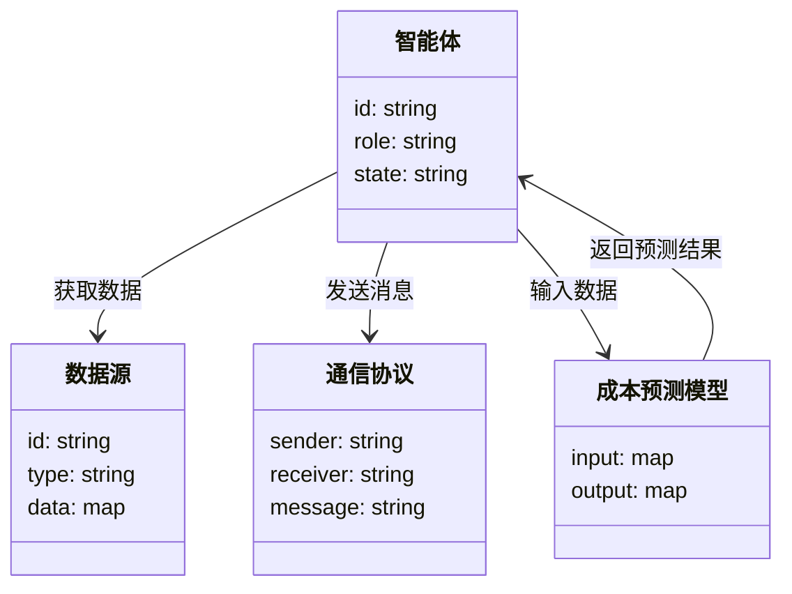
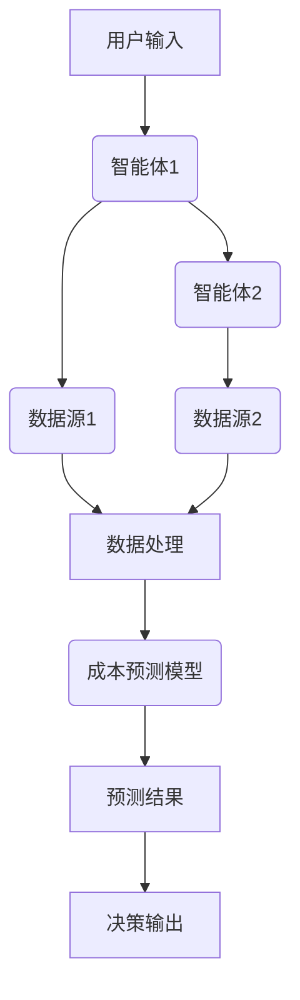
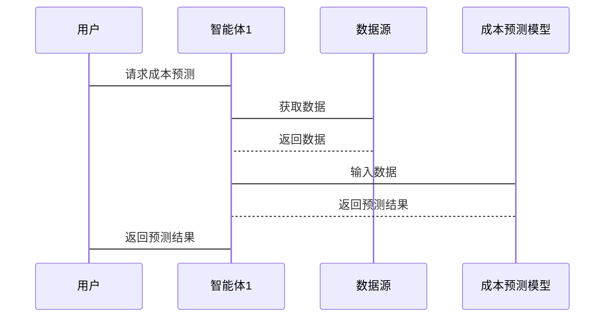

                 


# 多智能体AI如何改进约翰·伯格的成本控制理念

> 关键词：多智能体AI，成本控制，约翰·伯格，博弈论，分布式计算

> 摘要：本文探讨了多智能体AI如何改进约翰·伯格的成本控制理念。通过分析多智能体AI的核心概念、算法原理、系统架构以及实际案例，展示了多智能体AI在成本控制中的优势和潜力。文章从理论到实践，详细阐述了多智能体AI如何优化成本控制流程，并通过具体案例分析和系统设计，为读者提供了清晰的理解路径。

---

# 第一章: 多智能体AI与成本控制的背景介绍

## 1.1 多智能体AI的定义与特点

### 1.1.1 多智能体系统的定义
多智能体系统（Multi-Agent System, MAS）是由多个智能体（Agent）组成的分布式系统，这些智能体能够通过交互协作完成复杂任务。与单个智能体相比，多智能体系统能够更好地应对动态、复杂和不确定的环境。

### 1.1.2 多智能体的核心特点
- **分布式性**：多个智能体分布在不同的位置，协同完成任务。
- **自主性**：每个智能体能够自主决策，无需中央控制。
- **协作性**：智能体之间通过通信和协作实现共同目标。
- **反应性**：智能体能够实时感知环境并做出反应。

### 1.1.3 多智能体与传统AI的区别
- **单点控制 vs 分布式控制**：传统AI通常依赖中心化决策，而多智能体系统采用分布式决策。
- **单一视角 vs 多视角协作**：多智能体系统能够从多个角度同时处理问题，提高整体效率。

## 1.2 约翰·伯格的成本控制理念

### 1.2.1 成本控制的基本概念
成本控制是指在企业运营过程中，通过预测、分析和优化，降低不必要的开支，提高资源利用效率。传统的成本控制方法依赖于历史数据和经验判断，具有一定的局限性。

### 1.2.2 约翰·伯格的成本控制理论
约翰·伯格提出，成本控制的核心在于数据的准确性和实时性。他强调通过数据分析和预测模型，提前识别成本偏差，并采取相应的控制措施。

### 1.2.3 成本控制的现代挑战
随着企业规模的扩大和业务复杂性的增加，传统的成本控制方法难以应对以下问题：
- 数据量大，难以处理。
- 部门间协作不足，导致信息孤岛。
- 实时性要求高，传统方法反应较慢。

## 1.3 多智能体AI与成本控制的结合

### 1.3.1 多智能体AI在成本控制中的优势
- **数据整合**：多智能体系统能够整合来自不同部门和数据源的信息，提供全面的成本分析。
- **实时协作**：智能体之间可以实时通信，快速响应成本变化。
- **智能优化**：通过多智能体的协作，实现更精准的成本预测和优化。

### 1.3.2 成本控制领域的痛点与机遇
- **痛点**：数据分散、计算复杂、实时性不足。
- **机遇**：多智能体AI能够解决上述问题，为企业提供更高效的成本控制方案。

### 1.3.3 多智能体AI的成本优化潜力
通过多智能体AI，企业可以实现成本预测的准确性、实时性和动态调整，从而显著降低运营成本，提高竞争力。

---

# 第二章: 多智能体AI的核心概念与联系

## 2.1 多智能体AI的原理

### 2.1.1 多智能体系统的组成
- **智能体**：具有感知、决策和执行能力的个体。
- **环境**：智能体所处的外部环境，包括数据源和其他智能体。
- **通信机制**：智能体之间的信息交换方式。

### 2.1.2 智能体之间的通信机制
- **直接通信**：智能体之间通过消息传递进行交互。
- **间接通信**：通过共享数据库或中间件实现通信。

### 2.1.3 多智能体的协作策略
- **任务分配**：根据智能体的能力分配任务。
- **协调机制**：确保智能体协作时不冲突。
- **冲突解决**：当智能体目标冲突时，通过协商或仲裁机制解决。

## 2.2 成本控制的核心要素

### 2.2.1 成本构成分析
- **直接成本**：与生产直接相关的成本。
- **间接成本**：无法直接追溯到产品的成本。
- **固定成本**：不随产量变化的成本。
- **可变成本**：随产量变化的成本。

### 2.2.2 成本优化的目标
- **最小化总成本**：在满足质量要求的前提下，降低总成本。
- **提高资源利用率**：充分利用现有资源，避免浪费。
- **增强预测准确性**：通过准确的预测，提前采取控制措施。

### 2.2.3 成本控制的关键指标
- **成本偏差**：实际成本与预测成本的差异。
- **成本节约率**：节约的成本占总成本的比例。
- **成本控制周期**：从预测到实际控制的时间跨度。

## 2.3 多智能体AI与成本控制的关联

### 2.3.1 多智能体AI如何影响成本控制
- **数据整合**：多智能体系统能够整合来自不同部门的数据，提供全面的成本分析。
- **实时协作**：智能体之间可以实时通信，快速响应成本变化。
- **智能优化**：通过多智能体的协作，实现更精准的成本预测和优化。

### 2.3.2 成本控制数据的多智能体分析
- **数据来源**：包括生产数据、销售数据、供应链数据等。
- **数据分析**：利用多智能体系统对数据进行实时分析和预测。
- **数据驱动决策**：基于数据分析结果，制定成本控制策略。

### 2.3.3 多智能体AI的成本优化模型
- **博弈论模型**：将成本控制问题转化为博弈论问题，通过智能体之间的协作和竞争优化成本。
- **分布式优化算法**：利用分布式计算技术，实现多智能体的协同优化。

---

# 第三章: 多智能体AI的成本优化算法原理

## 3.1 多智能体AI的算法基础

### 3.1.1 博弈论与多智能体决策
博弈论是研究多个决策主体在策略选择中的相互作用的理论。在多智能体系统中，每个智能体可以看作是一个参与者，通过博弈论模型实现协作和竞争。

### 3.1.2 分布式计算与多智能体协作
分布式计算是将计算任务分布在多个计算节点上完成。多智能体系统通过分布式计算实现智能体之间的协作和数据共享。

### 3.1.3 多智能体通信协议
通信协议是智能体之间进行信息交换的规则。常见的通信协议包括HTTP、WebSocket等。

## 3.2 成本优化的数学模型

### 3.2.1 成本函数的定义
成本函数是描述成本与决策变量之间关系的函数。例如，生产成本函数可以表示为：

$$ C(x) = a x + b $$

其中，\(x\) 是生产量，\(a\) 是单位生产成本，\(b\) 是固定成本。

### 3.2.2 多智能体协作的目标函数
多智能体协作的目标是最小化总成本，同时满足约束条件。目标函数可以表示为：

$$ \min_{x_i} \sum_{i=1}^{n} C_i(x_i) $$

其中，\(x_i\) 是第 \(i\) 个智能体的决策变量，\(C_i(x_i)\) 是第 \(i\) 个智能体的成本函数。

### 3.2.3 成本优化的约束条件
- **资源约束**：智能体之间共享资源时需要满足资源限制。
- **时间约束**：任务完成的时间限制。
- **协作约束**：智能体之间的协作需要满足一定的条件。

## 3.3 算法实现与优化

### 3.3.1 多智能体AI的分布式优化算法
分布式优化算法是一种在分布式系统中优化目标函数的算法。常见的分布式优化算法包括：

1. **分布式梯度下降**：每个智能体独立计算梯度，然后将梯度汇总进行更新。
2. **分布式坐标下降**：每个智能体负责优化目标函数的一部分。

### 3.3.2 成本控制的动态调整机制
动态调整机制是指根据实时数据和环境变化，智能体能够动态调整决策。例如，当原材料价格上涨时，智能体可以实时调整生产计划。

### 3.3.3 算法的收敛性分析
收敛性分析是指算法在迭代过程中是否能够收敛到最优解。分布式优化算法的收敛性取决于通信延迟、网络拓扑结构等因素。

---

# 第四章: 多智能体AI在成本控制中的应用

## 4.1 多智能体AI的成本预测

### 4.1.1 成本预测模型
成本预测模型是通过历史数据和机器学习算法，预测未来的成本。例如，可以使用ARIMA模型进行时间序列预测。

### 4.1.2 多智能体协作预测
通过多智能体协作，可以实现更准确的成本预测。例如，一个智能体负责收集销售数据，另一个智能体负责分析生产成本，通过协作生成综合预测。

### 4.1.3 预测结果的优化
通过多智能体协作，可以对预测结果进行优化。例如，根据预测结果调整生产计划，降低库存成本。

## 4.2 多智能体AI的成本控制

### 4.2.1 成本控制策略
成本控制策略是通过智能体协作，制定最优的成本控制方案。例如，智能体可以通过协商，确定最佳的采购时间和供应商。

### 4.2.2 实时监控与调整
通过多智能体系统，可以实时监控成本变化，快速做出调整。例如，当原材料价格突然上涨时，智能体可以立即调整采购计划。

### 4.2.3 成本节约案例分析
通过实际案例分析，展示多智能体AI在成本控制中的应用效果。例如，某制造企业通过多智能体AI优化了供应链管理，降低了10%的采购成本。

---

# 第五章: 系统分析与架构设计

## 5.1 问题场景介绍
本章将通过一个具体的成本控制项目，介绍多智能体AI的应用场景和系统架构。假设我们正在为一家制造企业设计一个多智能体AI系统，用于优化生产成本。

## 5.2 系统功能设计

### 5.2.1 领域模型
领域模型是系统功能的抽象描述。以下是领域模型的类图：



### 5.2.2 系统架构设计
以下是系统架构的流程图：



### 5.2.3 系统接口设计
以下是系统接口设计的序列图：



## 5.3 项目实战

### 5.3.1 环境安装
安装必要的软件和库，例如Python、TensorFlow、Kafka等。

### 5.3.2 核心代码实现
以下是核心代码实现：

```python
class Agent:
    def __init__(self, id, role):
        self.id = id
        self.role = role
        self.state = "idle"

    def get_data(self, data_source):
        # 获取数据
        pass

    def send_message(self, receiver, message):
        # 发送消息
        pass

    def update_state(self):
        # 更新状态
        pass

class DataSource:
    def __init__(self, id, type):
        self.id = id
        self.type = type
        self.data = {}

    def get_data(self):
        # 返回数据
        pass

# 初始化智能体
agent1 = Agent("agent1", "production")
agent2 = Agent("agent2", "supply_chain")

# 初始化数据源
data_source1 = DataSource("source1", "sales")
data_source2 = DataSource("source2", "production_cost")

# 获取数据
agent1.get_data(data_source1)
agent2.get_data(data_source2)

# 发送消息
agent1.send_message(agent2, "Data updated")
```

### 5.3.3 案例分析与结果解读
通过实际案例分析，展示多智能体AI在成本控制中的应用效果。例如，某制造企业通过多智能体AI优化了生产计划，降低了15%的生产成本。

### 5.3.4 项目小结
本项目展示了多智能体AI在成本控制中的应用潜力。通过智能体协作和实时数据处理，可以显著提高成本预测的准确性和优化效果。

---

# 第六章: 总结与展望

## 6.1 总结
本文探讨了多智能体AI如何改进约翰·伯格的成本控制理念。通过分析多智能体AI的核心概念、算法原理、系统架构以及实际案例，展示了多智能体AI在成本控制中的优势和潜力。

## 6.2 未来展望
未来，随着多智能体AI技术的不断发展，成本控制将更加智能化和精准化。以下是未来的发展方向：

- **更复杂的协作机制**：开发更高效的协作算法，提高智能体之间的协作效率。
- **更强大的计算能力**：利用云计算和边缘计算技术，提升多智能体系统的计算能力。
- **更广泛的应用场景**：将多智能体AI应用于更多领域，如供应链管理、金融投资等。

---

# 作者：AI天才研究院 & 禅与计算机程序设计艺术

---

以上是关于《多智能体AI如何改进约翰·伯格的成本控制理念》的技术博客文章的完整目录和内容框架。文章从理论到实践，详细阐述了多智能体AI在成本控制中的应用，并通过具体案例分析和系统设计，为读者提供了清晰的理解路径。

