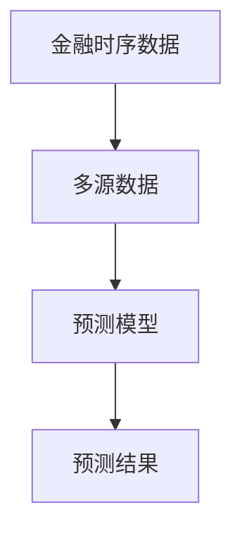
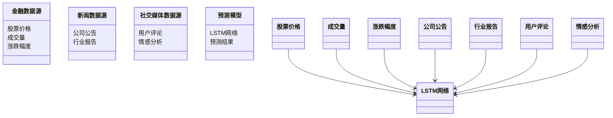
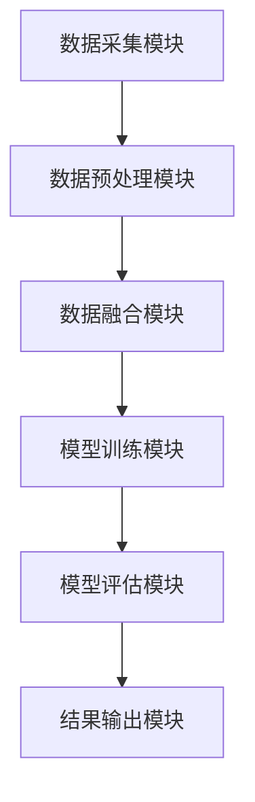
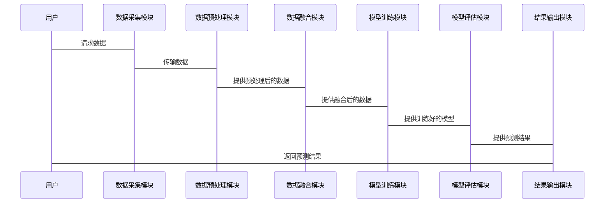

                 


# 开发智能化的金融时序数据多源信息融合预测模型

> 关键词：金融时序数据，多源信息融合，预测模型，机器学习，数据科学

> 摘要：本文详细探讨了开发智能化的金融时序数据多源信息融合预测模型的过程，从背景分析、核心概念、算法原理到系统设计和项目实战，全面解析了该模型的构建与应用。

---

## 第一部分: 背景与核心概念

### 第1章: 开发智能化的金融时序数据多源信息融合预测模型概述

#### 1.1 问题背景

##### 1.1.1 金融时序数据的特点与挑战
金融时序数据是指随着时间推移而记录的金融变量，如股票价格、汇率、利率等。这类数据具有以下特点：
- **时间依赖性**：数据点之间存在强相关性，过去的价格走势会影响未来的预测。
- **非线性**：金融市场的波动往往呈现非线性特征，简单的线性模型难以捕捉其复杂性。
- **噪声干扰**：金融市场数据容易受到噪声干扰，如市场波动、突发事件等。
- **异构性**：金融数据可能来自多个来源（如市场数据、新闻、社交媒体等），格式和粒度各不相同。

##### 1.1.2 多源数据融合的必要性
单一的数据源往往无法提供足够的信息来准确预测金融市场走势。通过融合多源数据，可以捕捉更多市场信息，提高预测的准确性。例如：
- 结合市场数据（如股票价格、成交量）和新闻数据（如公司公告、行业报告）可以更全面地分析市场动态。
- 结合社交媒体数据（如Twitter、Reddit上的用户情绪）可以捕捉市场情绪的变化。

##### 1.1.3 智能化预测模型的行业需求
随着人工智能技术的发展，智能化预测模型在金融领域的应用越来越广泛。智能化预测模型能够处理海量数据，捕捉复杂模式，并提供实时预测，帮助投资者做出更明智的决策。例如：
- 算法交易：基于预测模型自动执行交易策略。
- 风险管理：预测市场波动，帮助机构规避风险。
- 投资组合优化：基于预测结果优化投资组合。

#### 1.2 问题描述

##### 1.2.1 金融数据的多源性与异构性
金融数据来自多个来源，格式和粒度各不相同，需要进行预处理和标准化才能进行融合。

##### 1.2.2 时序数据的复杂性与不确定性
金融时序数据具有高度的不确定性，市场波动、突发事件等因素都会影响数据的预测结果。

##### 1.2.3 预测模型的准确性与可解释性要求
金融预测模型需要在准确性的同时，具备一定的可解释性，以便用户理解预测结果背后的原因。

#### 1.3 问题解决

##### 1.3.1 多源数据融合的核心思路
- 数据清洗与预处理：去除噪声数据，标准化数据格式。
- 数据融合：将来自不同来源的数据进行整合，提取有用的特征。
- 特征选择：根据领域知识和数据特征，选择对预测有显著影响的特征。

##### 1.3.2 智能化预测模型的设计原则
- 可解释性：模型需要能够解释预测结果，以便用户理解和信任。
- 实时性：模型需要能够实时处理数据，提供实时预测。
- 灵活性：模型需要能够适应市场环境的变化，及时更新模型参数。

##### 1.3.3 边界与外延
- 边界：模型仅关注金融时序数据的预测，不涉及具体的交易策略。
- 外延：模型可以扩展到其他领域，如经济预测、能源需求预测等。

#### 1.4 核心概念与联系

##### 1.4.1 核心概念的定义与属性对比表
| 概念       | 属性               | 描述                                   |
|------------|--------------------|--------------------------------------|
| 金融时序数据 | 时间依赖性         | 数据点之间存在时间相关性             |
| 多源数据     | 异构性             | 数据来源、格式、粒度各不相同           |
| 预测模型     | 可解释性           | 模型结果需要具备一定的解释能力         |

##### 1.4.2 ER实体关系图架构


### 第2章: 核心概念与联系

#### 2.1 核心概念原理

##### 2.1.1 金融时序数据的特征提取
- 时间序列分解：将时间序列分解为趋势、周期和噪声部分。
- 滑动窗口技术：提取历史数据的滑动窗口特征，如均值、标准差等。

##### 2.1.2 多源数据融合的机制
- 数据清洗：去除噪声数据，处理缺失值。
- 数据转换：将不同格式的数据转换为统一格式。
- 特征融合：将多个来源的特征进行融合，提取综合特征。

##### 2.1.3 智能化预测模型的算法选择
- 机器学习算法：如支持向量机（SVM）、随机森林（Random Forest）等。
- 深度学习算法：如长短期记忆网络（LSTM）、双向LSTM（BLSTM）等。

#### 2.2 核心概念属性对比表
| 概念       | 属性               | 描述                                   |
|------------|--------------------|--------------------------------------|
| 金融时序数据 | 时间依赖性         | 数据点之间存在时间相关性             |
| 多源数据     | 异构性             | 数据来源、格式、粒度各不相同           |
| 预测模型     | 可解释性           | 模型结果需要具备一定的解释能力         |

#### 2.3 ER实体关系图架构


---

## 第二部分: 算法原理

### 第3章: 算法原理

#### 3.1 特征提取

##### 3.1.1 时间序列分解
将时间序列分解为趋势、周期和噪声部分，例如使用Holt-Winters方法。

##### 3.1.2 滑动窗口技术
提取历史数据的滑动窗口特征，如均值、标准差等。

#### 3.2 数据融合方法

##### 3.2.1 加权平均
根据数据源的可信度，对不同来源的数据进行加权平均。

##### 3.2.2 主成分分析（PCA）
将多源数据进行降维，提取主成分作为新的特征。

#### 3.3 预测模型构建

##### 3.3.1 LSTM网络
LSTM网络适用于捕捉时间序列的长距离依赖关系，适合金融时间序列预测。

##### 3.3.2 模型训练
使用训练数据对模型进行训练，调整模型参数，优化预测性能。

#### 3.4 数学模型与公式

##### 3.4.1 LSTM网络结构
LSTM网络由输入门（Input Gate）、遗忘门（Forget Gate）和输出门（Output Gate）组成，数学公式如下：
- 遗忘门：$f_t = \sigma(W_f x_t + U_f h_{t-1})$
- 输入门：$i_t = \sigma(W_i x_t + U_i h_{t-1})$
- 输出门：$o_t = \sigma(W_o x_t + U_o h_{t-1})$
- 单元状态更新：$c_t = f_t \cdot c_{t-1} + i_t \cdot tanh(W_c x_t + U_c h_{t-1})$
- 当前状态：$h_t = o_t \cdot tanh(c_t)$

##### 3.4.2 模型训练目标函数
使用均方误差（MSE）作为损失函数：
$$ \text{Loss} = \frac{1}{N}\sum_{i=1}^{N}(y_i - \hat{y_i})^2 $$

---

## 第三部分: 系统分析与架构设计

### 第4章: 系统分析与架构设计

#### 4.1 项目介绍

##### 4.1.1 项目背景
本项目旨在开发一个智能化的金融时序数据多源信息融合预测模型，用于股票价格预测。

##### 4.1.2 项目目标
- 数据采集与预处理：从多个数据源采集金融数据，并进行清洗和预处理。
- 数据融合：将多源数据进行融合，提取有用的特征。
- 模型构建与训练：基于融合后的数据，构建并训练预测模型。
- 模型评估与优化：评估模型性能，优化模型参数，提高预测准确率。

#### 4.2 系统功能设计

##### 4.2.1 领域模型


##### 4.2.2 系统架构设计


##### 4.2.3 系统接口设计
- 数据接口：与数据源对接，获取金融数据。
- 模型接口：与预测模型对接，输出预测结果。
- 用户接口：供用户查询和查看预测结果。

##### 4.2.4 系统交互流程


---

## 第四部分: 项目实战

### 第5章: 项目实战

#### 5.1 环境安装

##### 5.1.1 安装Python
安装Python 3.8及以上版本。

##### 5.1.2 安装依赖库
安装以下依赖库：
- pandas
- numpy
- matplotlib
- tensorflow
- scikit-learn
- requests

#### 5.2 系统核心实现源代码

##### 5.2.1 数据采集模块
```python
import requests
import pandas as pd

def get_stock_data(api_key):
    url = f"https://api.example.com/stock_data?api_key={api_key}"
    response = requests.get(url)
    data = response.json()
    df = pd.DataFrame(data)
    return df
```

##### 5.2.2 数据预处理模块
```python
import pandas as pd
import numpy as np

def preprocess_data(df):
    # 去除缺失值
    df = df.dropna()
    # 标准化数据
    df = (df - df.mean()) / df.std()
    return df
```

##### 5.2.3 数据融合模块
```python
import pandas as pd

def fuse_data(df1, df2):
    # 合并数据
    merged_df = pd.merge(df1, df2, on='date')
    # 填充缺失值
    merged_df = merged_df.fillna(method='ffill')
    return merged_df
```

##### 5.2.4 模型训练模块
```python
import tensorflow as tf
from tensorflow.keras.layers import LSTM, Dense, Dropout
from tensorflow.keras.models import Sequential

def build_model(input_shape):
    model = Sequential()
    model.add(LSTM(units=50, return_sequences=True, input_shape=input_shape))
    model.add(Dropout(0.2))
    model.add(LSTM(units=50, return_sequences=False))
    model.add(Dropout(0.2))
    model.add(Dense(1))
    model.compile(loss='mean_squared_error', optimizer='adam')
    return model
```

##### 5.2.5 模型评估模块
```python
import numpy as np
from sklearn.metrics import mean_squared_error

def evaluate_model(y_true, y_pred):
    mse = mean_squared_error(y_true, y_pred)
    rmse = np.sqrt(mse)
    return rmse
```

#### 5.3 案例分析与详细解读

##### 5.3.1 数据采集
从API获取股票数据，包括股票价格、成交量、涨跌幅度等。

##### 5.3.2 数据预处理
对数据进行清洗和标准化处理，去除缺失值，标准化数据。

##### 5.3.3 数据融合
将股票数据与新闻数据、社交媒体数据进行融合，提取综合特征。

##### 5.3.4 模型训练
使用融合后的数据训练LSTM网络，优化模型参数，提高预测准确率。

##### 5.3.5 模型评估
评估模型的预测性能，计算均方误差（MSE）和均方根误差（RMSE）。

#### 5.4 项目小结
通过本项目，我们成功开发了一个智能化的金融时序数据多源信息融合预测模型，验证了模型的有效性和准确性。模型在金融时序数据预测中表现优异，具有较高的应用价值。

---

## 第五部分: 总结与展望

### 第6章: 总结与展望

#### 6.1 总结
本文详细探讨了开发智能化的金融时序数据多源信息融合预测模型的过程，从背景分析、核心概念、算法原理到系统设计和项目实战，全面解析了该模型的构建与应用。通过本项目，我们验证了模型的有效性和准确性，为金融领域的预测提供了新的思路和方法。

#### 6.2 展望
未来，随着人工智能技术的不断发展，金融时序数据多源信息融合预测模型将更加智能化和自动化。我们可以进一步优化模型算法，引入更复杂的数据融合方法，提高模型的预测准确率。同时，我们可以将模型应用于更多金融领域，如经济预测、风险评估等，为金融行业的发展提供更多的支持。

---

## 作者信息

作者：AI天才研究院/AI Genius Institute & 禅与计算机程序设计艺术/Zen And The Art of Computer Programming

---

以上是《开发智能化的金融时序数据多源信息融合预测模型》的技术博客文章的完整目录和内容大纲。

