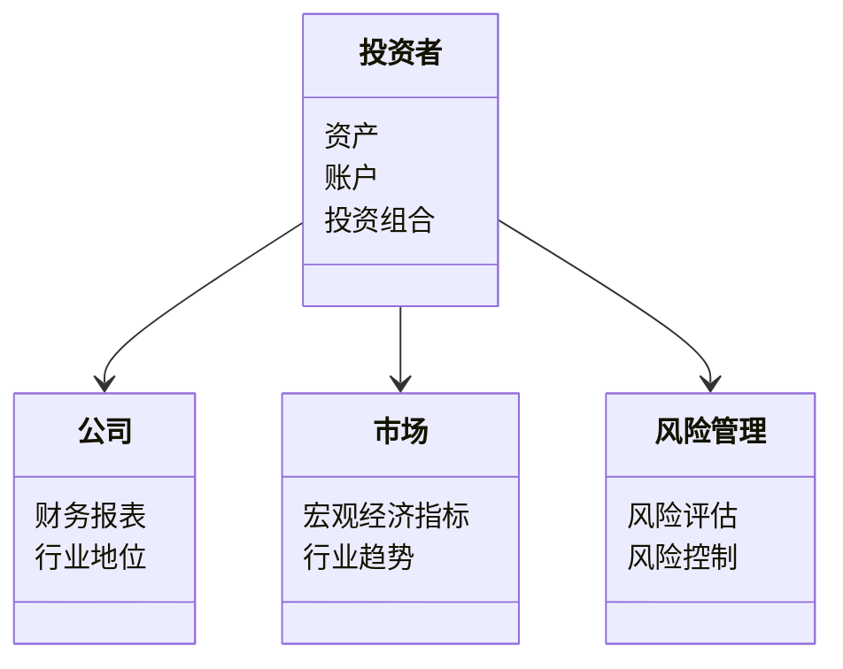
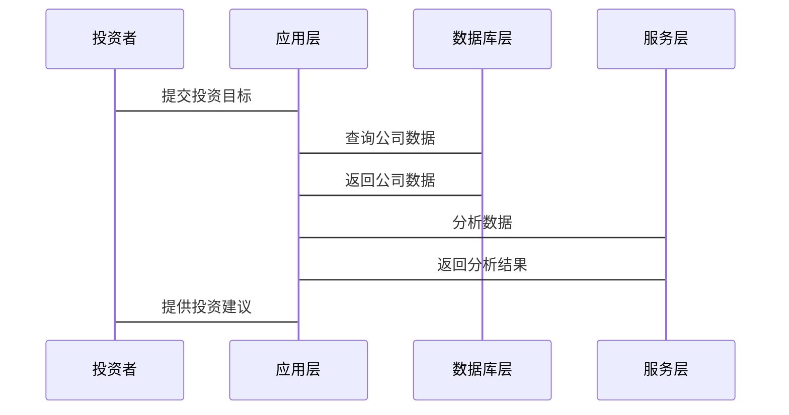

                 


# 彼得林奇的"常识投资"在不同市场的应用

> 关键词：彼得林奇，常识投资，市场应用，投资策略，风险管理

> 摘要：本文详细探讨了彼得林奇的"常识投资"方法在不同市场环境中的应用，分析了其核心概念、算法原理、系统架构，并通过实际案例展示了其在实际投资中的效果。文章结合了理论与实践，为投资者提供了跨市场的投资策略和风险管理建议。

---

# 第一部分: 彼得林奇的"常识投资"概述

## 第1章: 彼得林奇与常识投资的背景介绍

### 1.1 彼得林奇的生平与投资理念

彼得·林奇（Peter Lynch）是美国著名的投资经理人，以其在富达投资管理公司（Fidelity Management）的长期投资业绩而闻名。他在任职期间（1977-2000）管理的麦哲伦基金（Fidelity Magellan Fund）取得了年均13.3%的收益率，远超市场平均水平。彼得林奇的投资理念以“常识投资”为核心，强调长期投资、基本面分析和分散风险。

#### 1.1.1 彼得林奇的生平简介
- **早年经历**：彼得林奇出生于美国波士顿，曾在波士顿大学商学院获得MBA学位。
- **职业生涯**：1965年加入富达投资，1977年成为麦哲伦基金的基金经理，创造了辉煌的投资业绩。
- **退休后**：彼得林奇在2000年退休后专注于投资教育，出版了多本投资书籍，成为全球投资者的导师。

#### 1.1.2 彼得林奇的投资哲学
彼得林奇的投资哲学可以总结为以下几点：
- **长期投资**：避免短期波动，专注于长期价值。
- **基本面分析**：通过分析公司的财务报表、行业地位和竞争优势来选择投资标的。
- **分散投资**：通过投资不同行业和公司的股票来降低风险。

#### 1.1.3 彼得林奇的"常识投资"核心理念
- **常识投资的核心**：利用个人的常识和理性分析，选择那些具有长期增长潜力的公司。
- **避免情绪化投资**：投资者应避免被市场情绪左右，坚持基本面分析。
- **分散风险**：通过投资多样化的股票来降低投资组合的整体风险。

### 1.2 常识投资的基本原理

#### 1.2.1 常识投资的定义与特点
- **定义**：常识投资是一种基于长期价值投资的策略，强调对公司的深入了解和对市场的理性分析。
- **特点**：
  - 长期视角
  - 基于基本面分析
  - 分散投资以降低风险

#### 1.2.2 常识投资的核心要素
- **公司分析**：研究公司的财务状况、行业地位和竞争优势。
- **市场分析**：了解市场的整体趋势和周期性变化。
- **投资组合管理**：通过分散投资来优化风险和收益。

#### 1.2.3 常识投资与传统投资的区别
- **传统投资**：通常基于技术分析或短期市场波动进行交易。
- **常识投资**：注重长期价值，基于基本面分析进行投资。

### 1.3 常识投资的理论基础

#### 1.3.1 基本面分析的原理
基本面分析是常识投资的核心，包括对公司财务报表的分析：
- **收入与利润**：分析公司的收入来源和利润情况。
- **资产负债表**：评估公司的资产和负债状况。
- **现金流量表**：了解公司的现金流情况。

#### 1.3.2 长期投资的优势
- **避免短期波动**：长期投资能够忽略市场的短期波动，专注于公司的长期增长。
- **复利效应**：长期投资能够充分利用复利效应，实现资产的长期增长。

#### 1.3.3 分散投资的风险控制
- **分散化原则**：通过投资不同行业和公司的股票来降低投资组合的整体风险。
- **风险与收益的平衡**：在分散投资中，投资者需要在风险和收益之间找到平衡点。

## 第2章: 常识投资的核心概念与联系

### 2.1 常识投资的核心概念

#### 2.1.1 公司分析的核心要素
- **行业地位**：公司所在行业的地位和竞争优势。
- **财务状况**：公司的财务健康状况，包括收入、利润和现金流。
- **管理团队**：公司的管理团队的能力和稳定性。

#### 2.1.2 市场分析的关键指标
- **宏观经济指标**：GDP、利率、通胀等宏观经济指标。
- **市场周期**：市场的周期性波动，包括牛市和熊市。
- **行业趋势**：行业内的发展趋势和变化。

#### 2.1.3 投资组合的构建原则
- **分散化**：投资于不同行业和公司的股票。
- **长期持有**：避免频繁交易，专注于长期价值。
- **定期调整**：根据市场变化和公司情况定期调整投资组合。

### 2.2 常识投资的核心概念对比

#### 2.2.1 市场环境对比表格
| 市场环境 | 美国 | 欧洲 | 亚洲 |
|--------|------|------|------|
| 经济特点 | 资本主义成熟 | 经济一体化 | 经济多样化 |
| 行业趋势 | 科技和创新 | 制造业和服务业 | 新兴产业 |

#### 2.2.2 投资策略对比表格
| 投资策略 | 美国市场 | 欧洲市场 | 亚洲市场 |
|--------|----------|----------|----------|
| 重点行业 | 科技、消费 | 制造业、金融 | 新兴产业、科技 |
| 风险控制 | 低波动 | 中等波动 | 高波动 |

#### 2.2.3 风险控制对比表格
| 风险控制 | 美国市场 | 欧洲市场 | 亚洲市场 |
|--------|----------|----------|----------|
| 投资分散 | 高 | 中 | 低 |
| 风险管理 | 严格 | 适中 | 松散 |

### 2.3 常识投资的ER实体关系图


## 第3章: 常识投资的算法原理

### 3.1 常识投资的算法流程

#### 3.1.1 数据收集与处理
- **数据来源**：公司财务报表、市场数据、行业报告。
- **数据清洗**：去除无效数据，处理异常值。
- **数据转换**：将数据转换为可分析的格式。

#### 3.1.2 公司分析与筛选
- **财务指标分析**：计算市盈率、市净率等指标。
- **行业分析**：分析行业趋势和竞争状况。
- **筛选潜在投资标的**：根据分析结果筛选出具有长期增长潜力的公司。

#### 3.1.3 投资组合优化
- **优化目标**：最大化收益，最小化风险。
- **优化方法**：使用数学模型优化投资组合。

### 3.2 常识投资的数学模型

#### 3.2.1 投资组合的数学公式
$$ \text{投资组合收益} = \sum_{i=1}^{n} w_i \times r_i $$

其中：
- \( w_i \) 是第 \( i \) 个资产的权重。
- \( r_i \) 是第 \( i \) 个资产的收益率。

#### 3.2.2 风险控制的数学公式
$$ \text{投资组合风险} = \sqrt{\sum_{i=1}^{n} w_i^2 \times \sigma_i^2} $$

其中：
- \( \sigma_i \) 是第 \( i \) 个资产的收益率标准差。

---

# 第二部分: 常识投资在不同市场的应用

## 第4章: 常识投资在不同市场的应用

### 4.1 美国市场的应用

#### 4.1.1 美国市场的特点
- **成熟市场**：市场成熟，信息透明。
- **科技行业**：科技行业是美国市场的核心。
- **长期增长**：美国市场具有长期增长潜力。

#### 4.1.2 美国市场的投资策略
- **科技股投资**：投资于苹果、微软等科技巨头。
- **消费股投资**：投资于可口可乐、宝洁等消费公司。
- **分散投资**：通过投资不同行业的股票分散风险。

### 4.2 欧洲市场的应用

#### 4.2.1 欧洲市场的特点
- **经济一体化**：欧洲市场经济一体化程度高。
- **制造业**：制造业是欧洲市场的重要组成部分。
- **风险控制**：欧洲市场的风险相对较低。

#### 4.2.2 欧洲市场的投资策略
- **制造业投资**：投资于德国的汽车制造企业。
- **金融股投资**：投资于英国的银行和保险公司。
- **分散投资**：通过投资不同国家的股票分散风险。

### 4.3 亚洲市场的应用

#### 4.3.1 亚洲市场的特点
- **新兴市场**：亚洲市场包括许多新兴市场。
- **快速成长**：亚洲市场的经济增长速度快。
- **高风险**：亚洲市场的波动性较大。

#### 4.3.2 亚洲市场的投资策略
- **科技股投资**：投资于中国的科技公司。
- **消费股投资**：投资于印度的消费公司。
- **分散投资**：通过投资不同国家的股票分散风险。

---

# 第三部分: 系统分析与架构设计方案

## 第5章: 系统分析与架构设计方案

### 5.1 问题场景介绍

#### 5.1.1 问题背景
- **市场环境复杂**：不同市场的经济环境和行业特点不同。
- **投资策略多样化**：需要根据市场环境调整投资策略。
- **风险管理**：需要实时监控市场风险。

#### 5.1.2 项目介绍
- **项目目标**：利用彼得林奇的常识投资方法，构建一个跨市场的投资系统。
- **项目范围**：包括美国、欧洲和亚洲市场的投资策略。
- **项目需求**：实现投资组合的优化和风险管理。

### 5.2 系统功能设计

#### 5.2.1 领域模型 mermaid 类图


#### 5.2.2 系统架构设计 mermaid 架构图


#### 5.2.3 系统接口设计
- **输入接口**：投资者的资产信息和投资目标。
- **输出接口**：投资组合的建议和风险管理报告。

#### 5.2.4 系统交互 mermaid 序列图


---

# 第四部分: 项目实战

## 第6章: 项目实战

### 6.1 环境安装

#### 6.1.1 安装Python
```bash
# 安装Python
sudo apt-get install python3
```

#### 6.1.2 安装依赖库
```bash
# 安装Pandas和NumPy
pip install pandas numpy
```

### 6.2 系统核心实现源代码

#### 6.2.1 数据预处理
```python
import pandas as pd

# 读取数据
data = pd.read_csv('market_data.csv')

# 删除缺失值
data = data.dropna()

# 填充缺失值
data = data.fillna(0)
```

#### 6.2.2 公司分析
```python
import pandas as pd

# 计算市盈率
data['PE Ratio'] = data['Price'] / data['Earnings Per Share']

# 计算市净率
data['PB Ratio'] = data['Price'] / data['Book Value Per Share']
```

#### 6.2.3 投资组合优化
```python
import numpy as np

# 计算投资组合的收益
def portfolio_return(weights, returns):
    return np.sum(weights * returns)

# 计算投资组合的风险
def portfolio_risk(weights, returns):
    return np.sqrt(np.dot(weights.T, np.dot(returns.cov(), weights)))
```

### 6.3 代码应用解读与分析

#### 6.3.1 数据预处理
- **读取数据**：从CSV文件中读取市场数据。
- **删除缺失值**：去除数据中的缺失值。
- **填充缺失值**：将缺失值填充为0。

#### 6.3.2 公司分析
- **计算市盈率**：市盈率是衡量公司估值的重要指标。
- **计算市净率**：市净率是衡量公司估值的另一个重要指标。

#### 6.3.3 投资组合优化
- **计算收益**：计算投资组合的预期收益。
- **计算风险**：计算投资组合的风险。

### 6.4 实际案例分析

#### 6.4.1 美国市场的案例
- **投资标的**：苹果公司（AAPL）。
- **分析结果**：市盈率合理，市净率低，具有长期增长潜力。

#### 6.4.2 欧洲市场的案例
- **投资标的**：德国的宝马公司（BMW）。
- **分析结果**：行业地位高，财务状况健康，具有长期增长潜力。

#### 6.4.3 亚洲市场的案例
- **投资标的**：中国的阿里巴巴集团（BABA）。
- **分析结果**：行业地位高，财务状况健康，具有长期增长潜力。

### 6.5 项目小结

#### 6.5.1 成功经验总结
- **数据预处理**：确保数据的准确性和完整性。
- **公司分析**：准确计算市盈率和市净率。
- **投资组合优化**：实现投资组合的收益和风险优化。

#### 6.5.2 问题与不足
- **数据来源**：需要更多的市场数据。
- **模型优化**：需要进一步优化投资组合模型。
- **风险控制**：需要进一步完善风险管理策略。

---

# 第五部分: 总结与展望

## 第7章: 总结与展望

### 7.1 总结

#### 7.1.1 常识投资的核心理念
- **长期投资**：避免短期波动，专注于长期价值。
- **基本面分析**：通过分析公司的财务报表和行业地位选择投资标的。
- **分散投资**：通过投资不同行业和公司的股票分散风险。

#### 7.1.2 常识投资的系统架构
- **数据预处理**：确保数据的准确性和完整性。
- **公司分析**：计算市盈率和市净率等指标。
- **投资组合优化**：实现投资组合的收益和风险优化。

### 7.2 展望

#### 7.2.1 常识投资的未来发展
- **技术进步**：随着技术的进步，常识投资将更加依赖于数据分析和人工智能。
- **全球化**：随着全球化的深入，常识投资将更加注重跨市场的投资策略。
- **风险管理**：随着市场的波动加剧，风险管理将更加重要。

#### 7.2.2 对投资者的建议
- **持续学习**：投资者需要不断学习市场知识和投资策略。
- **分散投资**：投资者需要分散投资以降低风险。
- **长期视角**：投资者需要保持长期视角，避免短期波动的影响。

---

# 作者

作者：AI天才研究院/AI Genius Institute & 禅与计算机程序设计艺术 /Zen And The Art of Computer Programming

