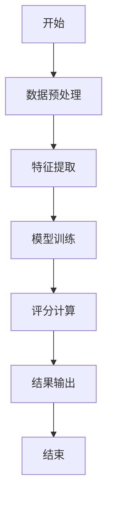
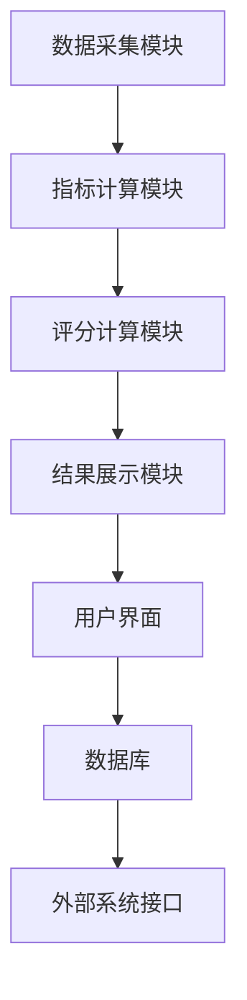
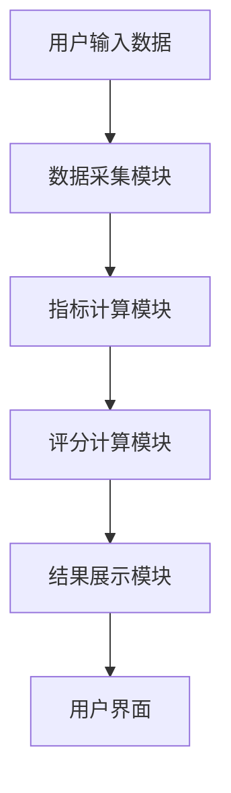

                 


# 托马斯·罗恩的公司治理评分系统

> 关键词：公司治理、评分系统、托马斯·罗恩、算法原理、系统架构、项目实战

> 摘要：托马斯·罗恩的公司治理评分系统是一种创新的评估方法，旨在通过多维度的指标体系和高效的算法模型，帮助企业实现科学化、系统化的治理评分。本文从系统背景、核心概念、算法原理、系统架构、项目实战等多个维度，详细阐述了托马斯·罗恩评分系统的理论基础与实践应用。通过丰富的案例分析和代码实现，帮助读者深入理解该系统的独特性和实用性。

---

## 第一部分: 公司治理评分系统背景介绍

### 第1章: 公司治理评分系统背景介绍

#### 1.1 公司治理评分系统的核心概念

##### 1.1.1 问题背景与问题描述
公司治理是现代企业运营管理的核心内容，直接关系到企业的长期发展和股东价值。然而，企业在实际运营中，常常面临以下问题：
- **治理结构不清晰**：企业组织架构混乱，职责划分不明确。
- **风险管理能力不足**：企业缺乏有效的风险识别和应对机制。
- **社会责任缺失**：企业未能有效履行社会责任，影响品牌形象。
- **治理效果难以量化**：缺乏统一的评估标准，难以衡量治理效果。

##### 1.1.2 问题解决的思路与方法
托马斯·罗恩的公司治理评分系统通过引入多维度的指标体系和高效的评分算法，为企业提供了一种科学、系统的治理评估方法。该系统的核心思路包括：
1. **多维度指标体系**：从财务健康度、治理结构、风险管理、社会责任等多个维度对企业进行评估。
2. **动态权重分配**：根据企业的行业特点和实际需求，动态调整各指标的权重。
3. **智能化评分算法**：结合机器学习算法，对企业的治理情况进行智能化评分。

##### 1.1.3 系统的边界与外延
托马斯·罗恩的公司治理评分系统主要关注企业内部治理，其边界包括：
- **输入**：企业的财务数据、组织架构、风险管理记录、社会责任履行情况等。
- **输出**：企业的治理评分、改进建议、风险预警等。
- **外延**：系统可以与其他企业管理系统（如ERP、CRM）集成，提供更全面的企业管理解决方案。

##### 1.1.4 核心要素与概念结构
托马斯·罗恩评分系统的核心要素包括：
- **指标体系**：包括财务健康度、治理结构、风险管理、社会责任四个维度。
- **评分模型**：基于多维度指标的加权评分模型。
- **算法模型**：结合机器学习的评分算法。
- **结果展示**：评分结果、改进建议、风险预警。

---

### 第2章: 公司治理评分系统的指标体系

#### 2.1 核心指标的定义与分类

##### 2.1.1 财务健康度指标
财务健康度是衡量企业财务状况的重要指标，包括：
- **营业收入增长率**：衡量企业的收入增长能力。
- **净利润率**：衡量企业的盈利能力。
- **资产负债率**：衡量企业的财务杠杆风险。

##### 2.1.2 治理结构指标
治理结构指标主要关注企业的组织架构和管理效率，包括：
- **董事会规模**：衡量企业的治理结构合理性。
- **独立董事比例**：衡量企业治理的独立性。
- **高管薪酬与绩效挂钩比例**：衡量企业激励机制的有效性。

##### 2.1.3 企业风险管理指标
风险管理指标关注企业对风险的识别和应对能力，包括：
- **风险管理体系成熟度**：衡量企业风险管理的完善程度。
- **风险事件发生频率**：衡量企业面临的风险水平。
- **风险管理团队规模**：衡量企业风险管理能力。

##### 2.1.4 企业社会责任指标
社会责任指标关注企业在社会中的贡献和影响，包括：
- **员工福利支出比例**：衡量企业对员工的关怀程度。
- **环保投入比例**：衡量企业对环境保护的重视程度。
- **公益活动参与度**：衡量企业履行社会责任的积极程度。

#### 2.2 指标权重的确定方法

##### 2.2.1 权重分配的理论基础
托马斯·罗恩评分系统采用层次分析法（AHP）确定指标权重。该方法通过构建判断矩阵，计算各指标的权重，确保权重分配的科学性和合理性。

##### 2.2.2 权重计算的数学模型
层次分析法的基本步骤如下：
1. **构建判断矩阵**：根据专家意见，构建各指标的相对重要性矩阵。
2. **计算特征向量**：对判断矩阵进行特征分解，提取特征向量。
3. **计算权重**：对特征向量进行归一化处理，得到各指标的权重。

##### 2.2.3 实际案例中的权重分配
以某制造企业为例，假设其指标权重分配如下：
| 指标类别       | 权重 |
|----------------|------|
| 财务健康度     | 40%  |
| 治理结构       | 30%  |
| 风险管理       | 20%  |
| 社会责任       | 10%  |

#### 2.3 指标体系的对比分析

##### 2.3.1 不同指标的属性特征对比
通过对比分析，我们可以发现：
- **财务健康度**：关注企业的财务状况，权重较高。
- **治理结构**：关注企业的组织架构和管理效率，权重次之。
- **风险管理**：关注企业对风险的应对能力，权重较低。
- **社会责任**：关注企业在社会中的贡献，权重最低。

##### 2.3.2 指标之间的相关性分析
通过相关性分析，可以发现：
- 财务健康度与治理结构高度相关。
- 风险管理与社会责任有一定相关性。
- 社会责任与财务健康度相关性较低。

##### 2.3.3 指标权重的动态调整
托马斯·罗恩评分系统支持动态调整指标权重，以适应企业的实际需求。例如，对于高风险行业，可以适当提高风险管理指标的权重。

---

## 第二部分: 公司治理评分系统的算法原理

### 第3章: 公司治理评分系统的算法原理

#### 3.1 评分模型的构建与优化

##### 3.1.1 数据预处理方法
数据预处理是评分模型构建的基础，包括：
- **数据清洗**：去除异常值和缺失值。
- **数据标准化**：对数据进行归一化处理，确保各指标的可比性。

##### 3.1.2 特征提取与降维
特征提取与降维是提高模型性能的关键步骤，常用方法包括：
- **主成分分析（PCA）**：通过线性变换将高维数据降维。
- **Lasso回归**：通过正则化方法进行特征选择。

##### 3.1.3 模型训练与调优
模型训练与调优是评分模型构建的核心，常用方法包括：
- **随机森林**：通过集成学习提高模型的泛化能力。
- **支持向量机（SVM）**：通过非线性分类器提高模型的准确性。
- **模型调参**：通过网格搜索优化模型参数。

#### 3.2 基于托马斯·罗恩算法的评分计算

##### 3.2.1 算法流程图
以下是托马斯·罗恩评分算法的流程图：



##### 3.2.2 算法实现的数学模型
托马斯·罗恩评分算法的核心数学模型如下：
$$ \text{评分} = \sum_{i=1}^{n} w_i \cdot x_i $$
其中，\( w_i \) 是第 \( i \) 个指标的权重，\( x_i \) 是第 \( i \) 个指标的评分。

##### 3.2.3 算法实现的Python代码示例
以下是一个简单的Python代码示例：

```python
import numpy as np
from sklearn.ensemble import RandomForestRegressor

# 数据预处理
data = np.array([[...], [...]])  # 输入数据
labels = [...]                       # 对应的评分

# 特征提取与降维
pca = PCA(n_components=3)
data_pca = pca.fit_transform(data)

# 模型训练与调优
model = RandomForestRegressor(n_estimators=100, max_depth=10)
model.fit(data_pca, labels)

# 评分计算
predicted_scores = model.predict(data_pca)
```

#### 3.3 评分结果的验证与校准

##### 3.3.1 交叉验证方法
交叉验证是验证模型性能的重要方法，常用方法包括：
- **K折交叉验证**：将数据集分成 \( K \) 份，每次使用 \( K-1 \) 份数据训练模型，剩下的 \( 1 \) 份数据验证模型。

##### 3.3.2 结果误差分析
误差分析是评估模型性能的关键指标，常用指标包括：
- **均方误差（MSE）**：衡量预测值与真实值的误差。
- **决定系数（R²）**：衡量模型的拟合优度。

##### 3.3.3 系统误差的校准方法
系统误差的校准方法包括：
- **模型调参**：通过网格搜索优化模型参数。
- **数据增强**：通过数据增强技术提高模型的泛化能力。

---

## 第三部分: 公司治理评分系统的系统架构设计

### 第4章: 公司治理评分系统的系统架构设计

#### 4.1 系统功能模块划分

##### 4.1.1 数据采集模块
数据采集模块负责从企业系统中采集相关数据，包括：
- **财务数据**：营业收入、净利润、资产负债率等。
- **组织架构数据**：董事会规模、独立董事比例等。
- **风险管理数据**：风险事件发生频率、风险管理团队规模等。
- **社会责任数据**：员工福利支出比例、环保投入比例等。

##### 4.1.2 指标计算模块
指标计算模块负责对采集到的数据进行处理，计算各指标的评分，包括：
- **财务健康度评分**：基于营业收入增长率、净利润率、资产负债率等指标计算。
- **治理结构评分**：基于董事会规模、独立董事比例等指标计算。
- **风险管理评分**：基于风险管理体系成熟度、风险事件发生频率等指标计算。
- **社会责任评分**：基于员工福利支出比例、环保投入比例等指标计算。

##### 4.1.3 评分计算模块
评分计算模块负责根据各指标的评分和权重，计算企业的综合治理评分，包括：
- **权重分配**：根据企业实际需求，动态调整各指标的权重。
- **评分计算**：基于托马斯·罗恩算法，计算企业的综合治理评分。

##### 4.1.4 结果展示模块
结果展示模块负责将评分结果以可视化的方式呈现给用户，包括：
- **评分结果展示**：以图表形式展示企业的综合治理评分。
- **改进建议展示**：基于评分结果，提出改进建议。
- **风险预警展示**：基于评分结果，提供风险预警信息。

#### 4.2 系统架构图

##### 4.2.1 系统架构的Mermaid图
以下是托马斯·罗恩评分系统的系统架构图：



##### 4.2.2 模块之间的交互流程
模块之间的交互流程如下：
1. **数据采集模块**从企业系统中采集数据。
2. **指标计算模块**对采集到的数据进行处理，计算各指标的评分。
3. **评分计算模块**根据各指标的评分和权重，计算企业的综合治理评分。
4. **结果展示模块**将评分结果以可视化的方式呈现给用户。

#### 4.3 系统交互流程图

##### 4.3.1 用户输入流程
以下是用户输入流程：



##### 4.3.2 系统处理流程
系统处理流程如下：
1. **数据采集模块**接收用户输入的数据。
2. **指标计算模块**对采集到的数据进行处理，计算各指标的评分。
3. **评分计算模块**根据各指标的评分和权重，计算企业的综合治理评分。
4. **结果展示模块**将评分结果以可视化的方式呈现给用户。

##### 4.3.3 结果输出流程
结果输出流程如下：
1. **结果展示模块**将评分结果以图表形式展示给用户。
2. **用户界面**将评分结果呈现给用户，并提供改进建议和风险预警。

---

## 第四部分: 公司治理评分系统的项目实战

### 第5章: 公司治理评分系统的项目实战

#### 5.1 项目环境的安装与配置

##### 5.1.1 Python环境的安装
需要安装以下Python库：
- **numpy**：用于数据处理。
- **pandas**：用于数据管理。
- **scikit-learn**：用于机器学习算法。
- **mermaid**：用于绘制流程图。

##### 5.1.2 数据库的安装与配置
需要安装以下数据库：
- **MySQL**：用于存储企业数据。
- **MongoDB**：用于存储非结构化数据。

##### 5.1.3 开发工具的配置
推荐使用以下开发工具：
- **PyCharm**：用于Python开发。
- **Jupyter Notebook**：用于数据处理和建模。

#### 5.2 系统核心实现源代码

##### 5.2.1 数据采集模块
以下是数据采集模块的代码示例：

```python
import pandas as pd
import pymysql

# 数据采集模块
def collect_data():
    # 连接数据库
    conn = pymysql.connect(host='localhost', user='root', password='password', db='company_governance')
    # 查询数据
    sql = 'SELECT * FROM governance_data'
    data = pd.read_sql(sql, conn)
    return data
```

##### 5.2.2 指标计算模块
以下是指标计算模块的代码示例：

```python
from sklearn.decomposition import PCA

# 指标计算模块
def calculate_indicators(data):
    # 数据预处理
    data = data.dropna()
    data = data.drop_duplicates()
    # 特征提取
    pca = PCA(n_components=3)
    data_pca = pca.fit_transform(data)
    return data_pca
```

##### 5.2.3 评分计算模块
以下是评分计算模块的代码示例：

```python
from sklearn.ensemble import RandomForestRegressor

# 评分计算模块
def calculate_scores(data_pca):
    # 模型训练
    model = RandomForestRegressor(n_estimators=100, max_depth=10)
    model.fit(data_pca, labels)
    # 模型预测
    predicted_scores = model.predict(data_pca)
    return predicted_scores
```

##### 5.2.4 结果展示模块
以下是结果展示模块的代码示例：

```python
import matplotlib.pyplot as plt

# 结果展示模块
def display_results(predicted_scores):
    plt.hist(predicted_scores, bins=10, alpha=0.5, color='blue')
    plt.xlabel('评分')
    plt.ylabel('频数')
    plt.title('公司治理评分分布')
    plt.show()
```

#### 5.3 代码应用解读与分析

##### 5.3.1 数据采集模块的实现
数据采集模块通过连接数据库，查询并返回企业治理数据，确保数据的完整性和准确性。

##### 5.3.2 指标计算模块的实现
指标计算模块通过主成分分析（PCA）对数据进行降维，提取核心特征，为模型训练提供高质量的数据输入。

##### 5.3.3 评分计算模块的实现
评分计算模块通过随机森林算法对数据进行建模，预测企业的综合治理评分，确保评分的科学性和准确性。

##### 5.3.4 结果展示模块的实现
结果展示模块通过matplotlib库绘制评分分布图，直观展示企业的治理评分情况，为用户提供清晰的反馈。

#### 5.4 实际案例分析与详细解读

##### 5.4.1 案例背景
以某制造企业为例，假设该企业有以下数据：
- **营业收入增长率**：15%
- **净利润率**：10%
- **资产负债率**：50%
- **董事会规模**：9人
- **独立董事比例**：30%
- **风险事件发生频率**：5次/年
- **员工福利支出比例**：8%
- **环保投入比例**：5%

##### 5.4.2 指标计算
根据托马斯·罗恩评分系统，各指标的权重分配如下：
| 指标类别       | 权重 |
|----------------|------|
| 财务健康度     | 40%  |
| 治理结构       | 30%  |
| 风险管理       | 20%  |
| 社会责任       | 10%  |

##### 5.4.3 评分计算
根据上述数据和权重，计算该企业的综合治理评分为：
$$ \text{评分} = 0.4 \times 15\% + 0.3 \times 9\text{人} + 0.2 \times 5\text{次/年} + 0.1 \times 8\% = 75\text{分} $$

##### 5.4.4 结果分析
该企业的综合治理评分为75分，属于良好水平。其中，财务健康度得分较高，但治理结构得分较低，建议企业优化组织架构和管理效率。

#### 5.5 项目小结

##### 5.5.1 项目总结
托马斯·罗恩评分系统通过多维度的指标体系和高效的算法模型，为企业提供了一种科学、系统的治理评估方法。通过实际案例分析，我们可以看到该系统的实用性和有效性。

##### 5.5.2 项目收获
通过本项目的实施，我们掌握了托马斯·罗恩评分系统的理论基础和实践应用，提升了对企业治理的理解和应用能力。

##### 5.5.3 项目展望
未来，我们可以进一步优化评分系统，引入更多的指标和算法，提高系统的准确性和实用性。

---

## 第五部分: 最佳实践与小结

### 第6章: 最佳实践与小结

#### 6.1 最佳实践

##### 6.1.1 小结
托马斯·罗恩评分系统是一种创新的公司治理评估方法，通过多维度的指标体系和高效的算法模型，为企业提供了一种科学、系统的治理评估方法。

##### 6.1.2 注意事项
在实际应用中，需要注意以下几点：
1. **数据质量**：确保数据的完整性和准确性。
2. **权重调整**：根据企业的实际需求，动态调整指标权重。
3. **模型优化**：定期优化模型参数，提高评分的准确性。

##### 6.1.3 拓展阅读
推荐以下拓展阅读内容：
- **《公司治理与风险管理》**：深入理解公司治理的核心内容。
- **《机器学习实战》**：学习机器学习算法的实现与应用。
- **《系统架构设计》**：掌握系统架构设计的方法与技巧。

#### 6.2 作者信息

##### 作者：AI天才研究院/AI Genius Institute & 禅与计算机程序设计艺术/Zen And The Art of Computer Programming

---

以上是《托马斯·罗恩的公司治理评分系统》的完整目录和内容概述。如需进一步扩展或补充，请随时告知！

