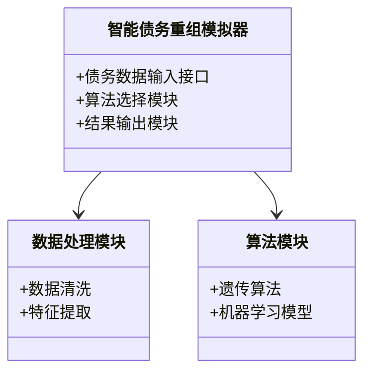
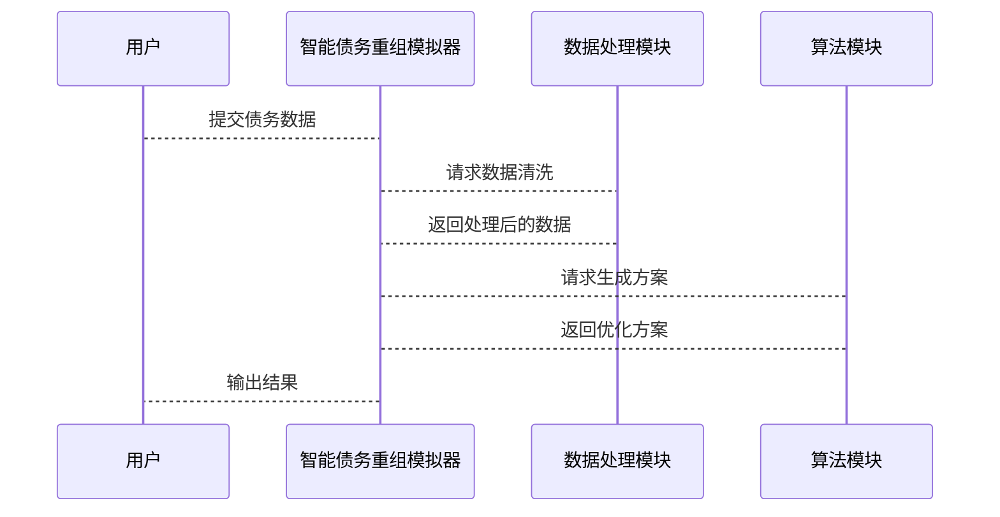

                 


# 智能债务重组方案效果模拟器

## 关键词：智能债务重组，模拟器，算法原理，系统架构，项目实战

## 摘要：本文介绍了一种智能债务重组方案效果模拟器的设计与实现，从背景、核心概念、算法原理、系统架构到项目实战，全面剖析了该模拟器的工作原理和应用场景。文章详细讲解了遗传算法在债务重组中的应用，通过实际案例分析，展示了该模拟器在优化债务方案、降低债务风险方面的重要作用，并对未来的发展方向进行了展望。

---

# 第一部分：智能债务重组方案效果模拟器的背景与概念

## 第1章：债务重组的背景与问题

### 1.1 债务重组的基本概念

#### 1.1.1 债务重组的定义
债务重组是指在债务人无法按期偿还债务的情况下，通过调整债务的本金、利息、期限等条款，以降低债务人的偿债压力，实现债权人和债务人共赢的一种金融操作。

#### 1.1.2 债务重组的常见场景
- 企业因经营不善导致资金链断裂，无法按时偿还债务。
- 债权人因债务人还款能力下降，希望通过债务重组降低损失。
- 大型企业集团内部资产重组，优化资产负债结构。

#### 1.1.3 债务重组的经济意义
- 帮助企业渡过短期资金困难，维持经营。
- 优化债权人资产质量，降低坏账风险。
- 促进企业间资源整合，提高经济效率。

### 1.2 智能债务重组的必要性

#### 1.2.1 传统债务重组的局限性
- 传统债务重组过程复杂，涉及多方协商，耗时长且效率低。
- 传统方法依赖人工经验，难以全面考虑各种可能的重组方案。
- 缺乏系统化的数据分析支持，容易导致次优解或风险遗漏。

#### 1.2.2 智能化技术在债务重组中的优势
- 利用人工智能技术快速生成多种重组方案，提高效率。
- 通过大数据分析，全面评估债务人的还款能力，降低风险。
- 自适应优化算法能够找到最优解，提高重组方案的效果。

#### 1.2.3 智能债务重组的市场前景
- 随着企业融资需求增加，债务重组市场潜力巨大。
- 人工智能技术的成熟为债务重组提供了新的工具和方法。
- 智能债务重组模拟器能够为金融机构和企业提供高效、可靠的解决方案。

## 第2章：智能债务重组模拟器的核心概念

### 2.1 智能债务重组模拟器的定义

#### 2.1.1 模拟器的功能定位
智能债务重组模拟器是一种基于人工智能技术的工具，用于辅助用户生成和评估多种债务重组方案，优化债务结构，降低风险。

#### 2.1.2 模拟器的核心目标
- 提供多种债务重组方案的生成和评估功能。
- 利用算法优化，找到最优的债务重组方案。
- 提供可视化界面，方便用户理解和操作。

#### 2.1.3 模拟器的用户群体
- 企业财务管理人员
- 银行和金融机构的信贷经理
- 律师事务所的债务重组顾问

### 2.2 智能债务重组模拟器的核心要素

#### 2.2.1 数据输入与处理
- 债务人信息：企业财务数据、信用评分、还款能力评估。
- 债权人信息：债权人类型、债权金额、债权期限。
- 市场环境：经济指标、行业趋势、政策变化。

#### 2.2.2 算法模型的选择
- 遗传算法：用于生成和优化重组方案。
- 机器学习模型：用于评估方案的风险和效果。
- 线性规划模型：用于约束条件下的优化。

#### 2.2.3 结果输出与反馈
- 重组方案的详细说明：包括本金调整、利息调整、还款期限优化。
- 方案效果评估：包括偿债压力、债权人收益、企业经营状况改善情况。
- 反馈机制：根据用户反馈调整模拟器参数。

## 第3章：智能债务重组模拟器的边界与外延

### 3.1 模拟器的功能边界

#### 3.1.1 核心功能范围
- 方案生成：根据输入数据生成多种重组方案。
- 方案优化：利用算法优化方案效果。
- 方案评估：评估方案的可行性和风险。

#### 3.1.2 辅助功能范围
- 数据可视化：以图表形式展示债务结构和重组效果。
- 报告生成：生成详细的重组方案报告。
- 在线协作：支持多人协作编辑和讨论。

#### 3.1.3 不属于模拟器的功能
- 实际债务重组操作：模拟器仅提供方案建议，不涉及实际交易。
- 法律咨询：模拟器不提供法律建议，仅提供技术分析。
- 财务审计：模拟器不进行财务审计，仅提供数据分析。

### 3.2 模拟器的外延与扩展

#### 3.2.1 技术扩展方向
- 引入强化学习算法，进一步优化重组方案。
- 结合区块链技术，提高数据安全性和透明度。
- 集成自然语言处理技术，支持文本数据的分析和处理。

#### 3.2.2 应用场景扩展
- 支持个体工商户的债务重组需求。
- 应用于跨国企业的全球债务管理。
- 服务于政府的债务管理政策制定。

#### 3.2.3 用户需求扩展
- 提供定制化方案生成功能。
- 支持多语言界面，满足国际化需求。
- 提供历史数据查询和趋势分析功能。

---

# 第二部分：智能债务重组模拟器的核心概念与联系

## 第4章：核心概念的原理与联系

### 4.1 智能债务重组模拟器的原理

#### 4.1.1 数据流分析
- 数据输入：债务人和债权人的基本信息、财务数据、市场环境数据。
- 数据处理：数据清洗、特征提取、数据标准化。
- 数据输出：优化后的债务重组方案、效果评估报告。

#### 4.1.2 算法流分析
- 方案生成：利用遗传算法生成初始重组方案。
- 方案优化：通过迭代优化算法，逐步调整方案参数。
- 方案评估：利用机器学习模型评估方案的风险和可行性。

#### 4.1.3 结果反馈机制
- 反馈收集：收集用户的反馈意见和建议。
- 模型调整：根据反馈调整算法参数和模型结构。
- 持续优化：通过不断优化算法，提高模拟器的效果。

### 4.2 核心概念的属性对比

#### 4.2.1 数据输入属性对比表

| 属性                | 传统债务重组 | 智能债务重组模拟器 |
|---------------------|--------------|---------------------|
| 数据来源            | 人工收集     | 系统自动采集       |
| 数据处理方式        | 人工分析     | 系统自动处理       |
| 数据范围            | 局部         | 全局               |

#### 4.2.2 算法模型属性对比表

| 属性                | 遗传算法      | 机器学习模型        |
|---------------------|--------------|--------------------|
| 输入                | 初始方案      | 历史数据            |
| 输出                | 优化方案      | 预测结果            |
| 优势                | 全局优化      | 高度个性化          |

#### 4.2.3 输出结果属性对比表

| 属性                | 传统债务重组 | 智能债务重组模拟器 |
|---------------------|--------------|---------------------|
| 方案数量            | 少            | 多                  |
| 方案优化程度        | 有限          | 高                  |
| 方案评估准确性      | 低            | 高                  |

### 4.3 ER实体关系图

```mermaid
erd
  entity 债务重组模拟器 {
    债务重组方案ID
    债务人信息
    债权人信息
    重组方案
  }
  entity 债务数据 {
    债务ID
    债务金额
    债务期限
    债务状态
  }
  entity 算法模型 {
    模型ID
    模型类型
    模型参数
  }
  债务重组模拟器 -- 债务数据
  债务重组模拟器 -- 算法模型
```

---

## 第5章：算法原理的数学模型与实现

### 5.1 遗传算法在债务重组中的应用

#### 5.1.1 遗传算法的基本原理
- 初始化：随机生成初始方案集合。
- 适应度评估：计算每个方案的适应度值。
- 选择：根据适应度值选择优秀的方案。
- 交叉：将优秀方案进行交叉组合，生成新方案。
- 变异：对新方案进行随机变异，提高多样性。
- 迭代：重复上述步骤，直到达到终止条件。

#### 5.1.2 遗传算法的数学模型

$$
适应度函数：f(x) = \frac{1}{x} + \frac{1}{y}
$$

其中，$x$ 表示债务重组后的偿债压力，$y$ 表示债权人收益。

#### 5.1.3 遗传算法的实现步骤


#### 5.1.4 Python代码实现

```python
import random

def fitness(solution):
    return 1.0 / solution['偿债压力'] + 1.0 / solution['债权人收益']

def generate_initial_solution():
    solution = {
        '偿债压力': random.uniform(0.5, 1.0),
        '债权人收益': random.uniform(0.5, 1.0)
    }
    return solution

# 初始化
population = [generate_initial_solution() for _ in range(10)]

# 迭代优化
for _ in range(100):
    population = [fitness(solution) for solution in population]
    # 选择、交叉、变异操作

# 输出最优方案
best_solution = max(population, key=lambda x: fitness(x))
print(best_solution)
```

---

## 第6章：系统架构与接口设计

### 6.1 系统架构设计

#### 6.1.1 系统功能模块



#### 6.1.2 系统架构图


### 6.2 系统接口设计

#### 6.2.1 数据输入接口
- 债务人信息接口：接受债务人的财务数据和信用评分。
- 债权人信息接口：接受债权人的基本信息和债权数据。

#### 6.2.2 算法接口
- 遗传算法接口：接受初始方案和参数设置。
- 机器学习模型接口：接受历史数据和预测需求。

#### 6.2.3 结果输出接口
- 方案输出接口：返回优化后的债务重组方案。
- 评估报告接口：返回方案的详细评估结果。

### 6.3 系统交互流程图



---

## 第7章：项目实战

### 7.1 环境安装与配置

#### 7.1.1 安装Python环境
- 安装Python 3.8及以上版本。
- 安装必要的Python库：numpy、pandas、scikit-learn、deap。

#### 7.1.2 安装遗传算法库
- 使用pip安装deap库：`pip install deap`

### 7.2 核心代码实现

#### 7.2.1 数据处理模块

```python
import pandas as pd

def data_cleaning(data):
    # 数据清洗
    data.dropna(inplace=True)
    data['偿债压力'] = data['偿债压力'].apply(lambda x: max(0.5, x))
    return data

# 示例数据
data = pd.DataFrame({
    '债务人': ['A', 'B', 'C'],
    '债务金额': [100, 200, 150],
    '偿债压力': [0.8, 0.6, 0.7]
})
data = data_cleaning(data)
print(data)
```

#### 7.2.2 算法实现模块

```python
from deap import algorithms, base,.creator, tools

# 定义适应度函数
creator.create("FitnessMax", base.Fitness, weights=(1.0, 1.0))

# 定义个体
creator.create("Individual", list, fitness=[0.0, 0.0])

# 初始化种群
toolbox = base.Toolbox()
toolbox.register("attr_bool", lambda: random.uniform(0.5, 1.0))
toolbox.register("individual", tools.initRepeat, creator.Individual, toolbox.attr_bool, 2)
toolbox.register("population", tools.initRepeat, list, toolbox.individual, 10)

# 定义算法
def genetic_algorithm(population):
    algorithms.eaSimple(population, toolbox, cxpb=0.5, mutpb=0.2, ngen=20, verbose=False)
    return population

# 执行算法
population = toolbox.population()
best = genetic_algorithm(population)[0]
print(best)
```

---

## 第8章：总结与展望

### 8.1 总结

#### 8.1.1 核心内容回顾
- 智能债务重组模拟器的基本概念和核心要素。
- 遗传算法在债务重组中的应用。
- 系统架构设计与实现。

#### 8.1.2 实战案例分析
- 实际案例中的模拟器应用。
- 方案优化效果对比。

### 8.2 展望

#### 8.2.1 技术发展
- 结合区块链技术，提高数据安全性和透明度。
- 引入强化学习算法，进一步优化重组方案。

#### 8.2.2 应用场景扩展
- 支持个体工商户的债务重组需求。
- 应用于跨国企业的全球债务管理。

---

## 作者：AI天才研究院/AI Genius Institute & 禅与计算机程序设计艺术/Zen And The Art of Computer Programming

