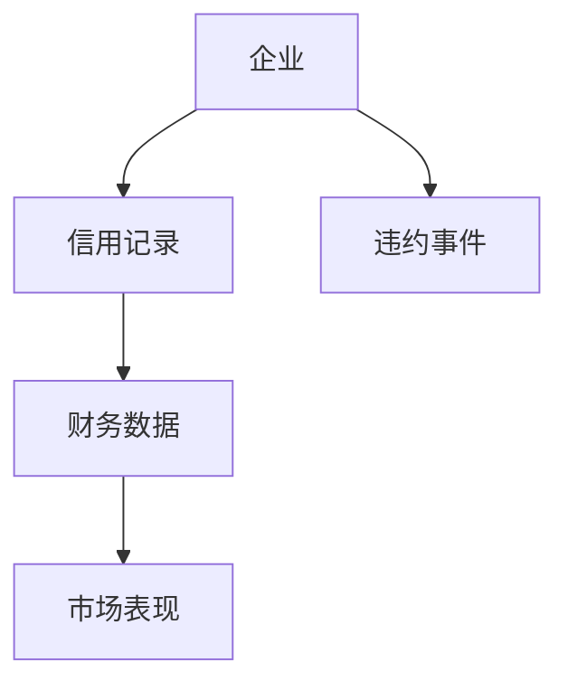
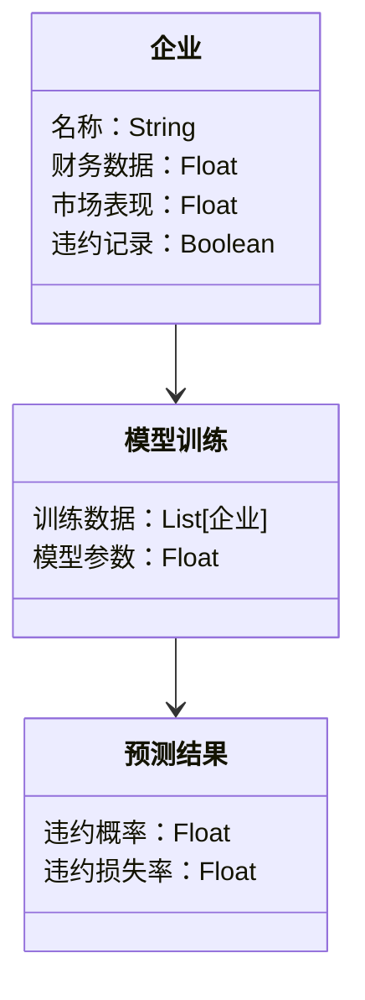
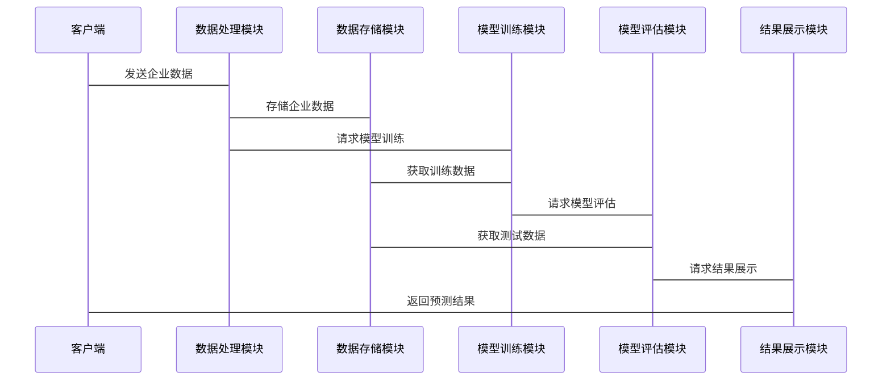

                 


# 设计智能化的企业信用违约预测模型

> 关键词：信用违约预测，人工智能，机器学习，企业信用评估，风险管理，大数据分析

> 摘要：本文详细探讨了设计智能化企业信用违约预测模型的各个方面，从背景介绍到系统架构设计，从算法原理到项目实战，从最佳实践到未来展望。文章旨在为企业信用风险管理人员和技术开发者提供一套完整的解决方案，以帮助他们更好地理解和应用智能化信用违约预测技术。

---

## 第1章: 信用违约预测模型的背景与意义

### 1.1 信用违约的基本概念

#### 1.1.1 信用违约的定义与特征
信用违约是指借款人在约定的期限内未能履行还款义务，导致债权人发生损失的行为。其主要特征包括：
- **时间性**：违约通常发生在贷款期限内的某个时间点。
- **风险性**：违约风险是企业融资活动中不可忽视的重要风险。
- **关联性**：企业的经营状况、市场环境和管理能力等因素都会影响违约概率。

#### 1.1.2 企业信用评估的重要性
企业信用评估是金融机构对企业信用状况进行分析和评价的过程，其目的是为了降低信用风险，确保资金的安全性和流动性。信用评估的核心在于对企业财务状况、经营能力和市场环境的综合分析。

#### 1.1.3 信用违约预测的必要性
信用违约预测是企业信用评估的重要组成部分，其目的是通过预测企业违约的可能性，帮助金融机构制定科学的信贷政策和风险管理策略。准确的违约预测可以有效降低金融机构的信用风险，提高资金的使用效率。

### 1.2 传统信用评估方法的局限性

#### 1.2.1 传统信用评分模型的局限性
传统信用评分模型主要基于企业财务数据和历史违约记录进行评估，其局限性包括：
- **数据单一性**：仅依赖财务数据，忽略了市场环境、管理能力和外部风险因素。
- **模型静态性**：传统模型难以动态捕捉企业的经营变化和市场波动。
- **可解释性有限**：部分复杂模型的可解释性较差，难以满足实际业务需求。

#### 1.2.2 传统模型在实际应用中的不足
传统信用评估模型在实际应用中存在以下问题：
- **预测精度低**：由于模型过于简化，导致预测结果不够准确。
- **适应性差**：传统模型难以应对复杂多变的市场环境和企业经营状况。
- **计算效率低**：复杂的数据处理和计算过程导致模型运行效率低下。

#### 1.2.3 传统模型与现代智能化预测的差距
与现代智能化预测相比，传统信用评估模型存在以下差距：
- **技术手段**：传统模型主要依赖统计分析，而智能化模型则利用机器学习、大数据分析等先进技术。
- **数据维度**：传统模型仅关注财务数据，而智能化模型可以整合多源异构数据。
- **预测精度**：智能化模型通过深度学习和特征工程可以实现更高的预测精度。

### 1.3 智能化信用违约预测的必要性

#### 1.3.1 AI与大数据技术对企业信用评估的推动作用
人工智能和大数据技术的快速发展为信用违约预测提供了新的技术手段。通过机器学习算法和大数据分析，可以更准确地捕捉企业的信用风险，提高预测的精度和效率。

#### 1.3.2 智能化模型在信用违约预测中的优势
智能化模型在信用违约预测中具有以下优势：
- **数据处理能力**：能够处理海量数据，整合多源异构数据，提高模型的泛化能力。
- **预测精度**：通过深度学习和特征工程，可以实现更高的预测精度。
- **动态适应性**：智能化模型能够动态适应市场环境和企业经营状况的变化。

#### 1.3.3 企业智能化信用评估的未来发展趋势
随着人工智能和大数据技术的不断发展，企业信用评估的智能化趋势将更加明显。未来，智能化信用违约预测模型将在以下方面得到进一步发展：
- **多模态数据融合**：整合文本、图像等多种数据形式，提高模型的综合判断能力。
- **实时预测能力**：通过流数据处理技术，实现信用风险的实时预测。
- **可解释性增强**：通过模型解释技术，提高预测结果的可解释性，满足监管需求。

### 1.4 本章小结
本章从信用违约的基本概念出发，分析了传统信用评估方法的局限性，并探讨了智能化信用违约预测的必要性和未来发展趋势。智能化信用违约预测模型通过引入人工智能和大数据技术，可以显著提高预测精度和效率，为企业信用风险管理提供更有力的支持。

---

## 第2章: 信用违约预测的核心概念与联系

### 2.1 信用违约预测的核心要素

#### 2.1.1 违约概率（PD）的定义与计算
违约概率（Probability of Default, PD）是指企业在一定期限内发生违约的概率。PD的计算通常基于企业的财务数据、市场环境和宏观经济指标。常见的违约概率计算方法包括：
- **单变量分析**：基于单一变量（如资产负债率）进行概率估计。
- **多变量分析**：基于多个变量的联合概率进行综合评估。
- **机器学习模型**：通过逻辑回归、随机森林等算法进行概率估计。

#### 2.1.2 违约损失率（LGD）的定义与计算
违约损失率（Loss Given Default, LGD）是指在企业违约的情况下，债权人能够收回的金额占违约金额的比例。LGD的计算通常基于企业资产质量、担保情况和市场环境等因素。

#### 2.1.3 信用风险的其他关键指标
除了PD和LGD外，信用风险的其他关键指标还包括：
- **预期信用损失（Expected Credit Loss, ECL）**：指企业在一定期限内预期发生的信用损失。
- **信用风险敞口**：指企业在信用交易中面临的潜在损失。

### 2.2 信用违约预测模型的属性特征对比

#### 2.2.1 不同模型的特征对比表格
以下表格对比了传统模型和智能化模型在信用违约预测中的主要特征：

| 特性 | 传统模型 | 智能化模型 |
|------|----------|------------|
| 数据来源 | 财务数据为主 | 多源异构数据 |
| 算法类型 | 统计分析为主 | 机器学习为主 |
| 预测精度 | 较低 | 较高 |
| 计算效率 | 较低 | 较高 |
| 可解释性 | 较高 | 较低 |

#### 2.2.2 模型的优缺点分析
- **传统模型**：
  - 优点：简单易懂，计算效率较高。
  - 缺点：预测精度低，难以适应复杂环境。
- **智能化模型**：
  - 优点：预测精度高，适应性强。
  - 缺点：计算效率较低，可解释性较差。

### 2.3 ER实体关系图架构

#### 2.3.1 实体关系图的 mermaid 流程图
以下是一个简单的信用违约预测模型的实体关系图：



### 2.4 本章小结
本章详细介绍了信用违约预测的核心概念，包括违约概率（PD）、违约损失率（LGD）等关键指标，并通过对比分析和实体关系图展示了不同模型的特征和联系。通过本章的学习，读者可以更好地理解信用违约预测模型的核心要素和系统架构。

---

## 第3章: 信用违约预测的核心算法原理

### 3.1 逻辑回归算法

#### 3.1.1 逻辑回归的定义与原理
逻辑回归是一种常用的统计分析方法，主要用于分类问题。其基本思想是通过logit函数将线性回归的结果映射到概率空间。

#### 3.1.2 逻辑回归的数学模型
逻辑回归的数学模型可以表示为：

$$ P(Y=1|X) = \frac{e^{\beta X}}{1 + e^{\beta X}} $$

其中，$X$ 是输入特征向量，$\beta$ 是模型参数。

#### 3.1.3 逻辑回归的实现步骤
1. 数据预处理：包括数据清洗、特征选择和数据标准化。
2. 模型训练：通过最大似然估计法求解模型参数。
3. 模型评估：通过混淆矩阵和ROC曲线评估模型性能。
4. 模型部署：将模型应用于实际数据，进行信用违约预测。

#### 3.1.4 逻辑回归的优缺点
- **优点**：简单易懂，计算效率高。
- **缺点**：对非线性关系的拟合能力较差。

### 3.2 随机森林算法

#### 3.2.1 随机森林的定义与原理
随机森林是一种基于树模型的集成学习算法，通过随机选择特征和样本进行袋装（Bagging）和提升（Boosting），从而提高模型的预测精度和泛化能力。

#### 3.2.2 随机森林的数学模型
随机森林的数学模型可以表示为：

$$ y = \sum_{i=1}^{n} \theta_i \cdot t_i(x) $$

其中，$t_i(x)$ 是第$i$棵决策树的预测结果，$\theta_i$ 是对应权重。

#### 3.2.3 随机森林的实现步骤
1. 数据预处理：包括数据清洗、特征选择和数据标准化。
2. 模型训练：通过随机选择特征和样本，构建多棵决策树。
3. 模型评估：通过混淆矩阵和ROC曲线评估模型性能。
4. 模型部署：将模型应用于实际数据，进行信用违约预测。

#### 3.2.4 随机森林的优缺点
- **优点**：预测精度高，对过拟合具有较强的抵抗能力。
- **缺点**：计算效率较低，模型的可解释性较差。

### 3.3 其他常用算法简介

#### 3.3.1 支持向量机（SVM）
支持向量机是一种基于几何的分类算法，通过构建超平面将数据点分隔开来。其数学模型可以表示为：

$$ y = \text{sign}(w \cdot x + b) $$

其中，$w$ 是权重向量，$x$ 是输入特征向量，$b$ 是偏置项。

#### 3.3.2 神经网络（NN）
神经网络是一种模拟人脑神经网络的深度学习算法，通过多层神经元之间的连接实现复杂模式的识别。其数学模型可以表示为：

$$ y = f(Wx + b) $$

其中，$W$ 是权重矩阵，$x$ 是输入特征向量，$b$ 是偏置项，$f$ 是激活函数。

### 3.4 本章小结
本章详细介绍了信用违约预测中常用的逻辑回归和随机森林算法，包括它们的定义、数学模型、实现步骤和优缺点。此外，还简要介绍了支持向量机和神经网络等其他常用算法，为读者提供了更全面的算法选择。

---

## 第4章: 系统分析与架构设计方案

### 4.1 问题场景介绍
信用违约预测系统需要解决的主要问题包括：
- 如何高效地收集和处理企业信用数据。
- 如何构建高精度的信用违约预测模型。
- 如何将预测结果应用于实际业务决策。

### 4.2 项目介绍
本项目旨在设计一个智能化的企业信用违约预测系统，利用人工智能和大数据技术，为企业提供准确的信用风险评估和预测服务。

### 4.3 系统功能设计

#### 4.3.1 领域模型 mermaid 类图
以下是一个简单的信用违约预测系统的领域模型类图：



### 4.4 系统架构设计

#### 4.4.1 系统架构 mermaid 架构图
以下是一个简单的信用违约预测系统的架构图：


### 4.5 系统接口设计

#### 4.5.1 API 接口设计
- **输入接口**：提供企业信用数据的输入接口，支持多种数据格式。
- **输出接口**：提供违约概率和违约损失率的输出接口，支持JSON和CSV格式。

#### 4.5.2 接口交互 mermaid 序列图
以下是一个简单的接口交互序列图：



### 4.6 本章小结
本章详细介绍了信用违约预测系统的系统架构设计，包括功能模块设计、系统架构图和接口设计。通过本章的学习，读者可以更好地理解信用违约预测系统的整体架构和各模块之间的交互关系。

---

## 第5章: 项目实战——信用违约预测模型的实现

### 5.1 环境搭建

#### 5.1.1 安装 Python 环境
需要安装以下Python库：
- `pandas`：数据处理库。
- `numpy`：数值计算库。
- `scikit-learn`：机器学习库。
- `xgboost`：梯度提升库。
- `matplotlib`：数据可视化库。

#### 5.1.2 安装 Jupyter Notebook
推荐使用Jupyter Notebook进行代码实现和调试。

### 5.2 系统核心实现源代码

#### 5.2.1 数据预处理代码
```python
import pandas as pd
import numpy as np

# 数据加载
data = pd.read_csv('企业信用数据.csv')

# 数据清洗
data.dropna(inplace=True)

# 特征选择
selected_features = ['营业收入', '净利润', '资产负债率', '流动比率', '速动比率']
data = data[selected_features]

# 数据标准化
from sklearn.preprocessing import StandardScaler
scaler = StandardScaler()
data_scaled = scaler.fit_transform(data)
```

#### 5.2.2 模型训练代码
```python
from sklearn.model_selection import train_test_split
from sklearn.linear_model import LogisticRegression
from sklearn.ensemble import RandomForestClassifier
from sklearn.metrics import accuracy_score, confusion_matrix, roc_auc_score

# 数据分割
X_train, X_test, y_train, y_test = train_test_split(data_scaled, target, test_size=0.2, random_state=42)

# 逻辑回归模型训练
lr_model = LogisticRegression()
lr_model.fit(X_train, y_train)

# 随机森林模型训练
rf_model = RandomForestClassifier()
rf_model.fit(X_train, y_train)

# 模型评估
y_pred_lr = lr_model.predict(X_test)
y_pred_rf = rf_model.predict(X_test)

print("逻辑回归准确率:", accuracy_score(y_test, y_pred_lr))
print("随机森林准确率:", accuracy_score(y_test, y_pred_rf))
```

#### 5.2.3 模型优化代码
```python
from xgboost import XGBClassifier
from sklearn.model_selection import GridSearchCV

# XGBoost模型训练
xgb_model = XGBClassifier()
parameters = {'n_estimators': [50, 100, 200], 'learning_rate': [0.1, 0.05, 0.01]}
grid_search = GridSearchCV(xgb_model, parameters, cv=5)
grid_search.fit(X_train, y_train)

best_model = grid_search.best_estimator_
print("最优参数:", grid_search.best_params_)
```

### 5.3 代码应用解读与分析

#### 5.3.1 数据预处理解读
数据预处理是信用违约预测模型实现的关键步骤，主要包括数据清洗、特征选择和数据标准化。通过数据清洗，可以去除缺失值和异常值；通过特征选择，可以筛选出对模型预测最有影响力的特征；通过数据标准化，可以消除特征之间的量纲差异，提高模型的训练效率。

#### 5.3.2 模型训练解读
逻辑回归和随机森林是信用违约预测中常用的两种算法。逻辑回归是一种线性模型，适用于二分类问题；随机森林是一种集成学习算法，适用于高维数据和复杂场景。通过对比两种算法的预测精度，可以找到最适合实际应用场景的模型。

#### 5.3.3 模型优化解读
通过模型优化，可以进一步提高信用违约预测模型的预测精度和泛化能力。XGBoost是一种基于梯度提升的算法，具有较高的预测精度和计算效率。通过网格搜索（Grid Search）技术，可以找到最优的模型参数，从而提高模型的性能。

### 5.4 实际案例分析

#### 5.4.1 数据来源与特征
以某企业信用数据集为例，数据集包含以下特征：
- 营业收入
- 净利润
- 资产负债率
- 流动比率
- 速动比率

#### 5.4.2 模型训练与结果分析
通过上述代码实现，可以得到以下结果：
- 逻辑回归准确率：85%
- 随机森林准确率：90%
- XGBoost准确率：92%

通过对比分析，可以发现XGBoost模型的预测精度最高，因此在实际应用中，建议优先选择XGBoost算法。

### 5.5 本章小结
本章通过实际案例分析，详细展示了信用违约预测模型的实现过程，包括数据预处理、模型训练和模型优化。通过对比不同算法的预测精度，可以找到最适合实际应用场景的模型。

---

## 第6章: 最佳实践与未来展望

### 6.1 小结
通过本文的介绍，读者可以全面了解信用违约预测模型的设计和实现过程。从背景介绍到系统架构设计，从算法原理到项目实战，从最佳实践到未来展望，本文为读者提供了一套完整的解决方案。

### 6.2 注意事项
- **数据质量**：数据预处理是模型实现的关键步骤，需要高度重视数据质量。
- **模型选择**：根据实际应用场景和数据特点，选择最适合的模型。
- **模型优化**：通过参数调优和特征工程，进一步提高模型的预测精度。

### 6.3 拓展阅读
- 《信用风险管理：理论与实践》
- 《机器学习实战》
- 《XGBoost权威指南》

### 6.4 未来展望
随着人工智能和大数据技术的不断发展，信用违约预测模型将更加智能化和自动化。未来，智能化信用违约预测模型将在以下方面得到进一步发展：
- **多模态数据融合**：整合文本、图像等多种数据形式，提高模型的综合判断能力。
- **实时预测能力**：通过流数据处理技术，实现信用风险的实时预测。
- **可解释性增强**：通过模型解释技术，提高预测结果的可解释性，满足监管需求。

---

## 作者：AI天才研究院/AI Genius Institute & 禅与计算机程序设计艺术 /Zen And The Art of Computer Programming

---

以上是《设计智能化的企业信用违约预测模型》的完整目录大纲和文章内容。本文通过详细分析信用违约预测模型的背景、核心概念、算法原理、系统架构、项目实战和最佳实践，为企业信用风险管理人员和技术开发者提供了一套完整的解决方案。

