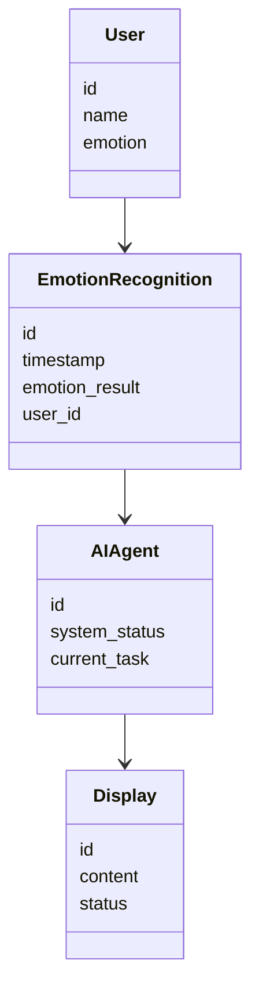
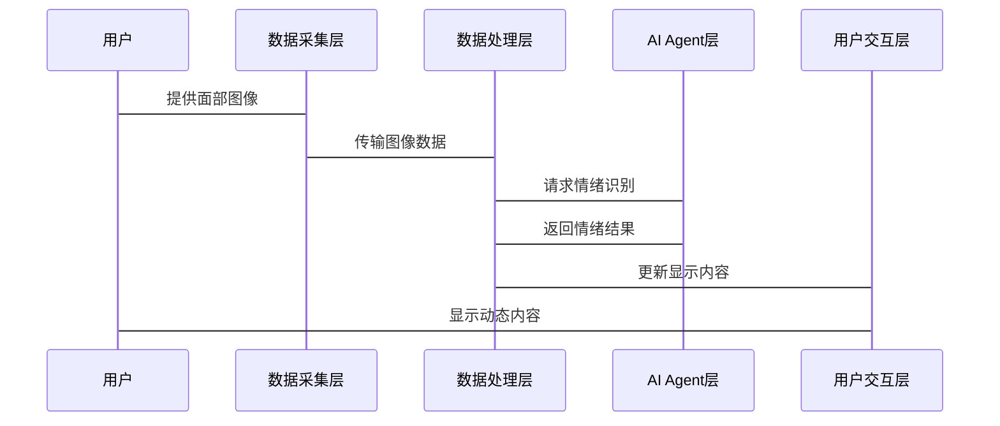

                 


# AI Agent在智能相框中的情绪识别显示

## 关键词
AI Agent, 情绪识别, 智能相框, 深度学习, 图像处理, 系统架构

## 摘要
本文详细探讨了AI Agent在智能相框中的情绪识别显示应用，分析了情绪识别的核心算法、系统架构设计、项目实现和最佳实践。文章首先介绍了AI Agent与情绪识别的基本概念，然后深入讲解了基于深度学习的情绪识别算法原理，接着分析了系统的架构设计，最后通过实际项目展示了如何将AI Agent与情绪识别技术应用于智能相框的设计与实现。

---

# 第1章: AI Agent与情绪识别的背景介绍

## 1.1 问题背景
### 1.1.1 智能相框的发展现状
智能相框作为一种智能家居设备，近年来逐渐普及。它通过连接互联网，能够实时更新照片内容，并通过AI技术实现与用户的互动。然而，现有的智能相框大多停留在基本的功能展示上，缺乏智能化的用户互动体验。

### 1.1.2 情绪识别技术的兴起
随着计算机视觉和深度学习技术的进步，情绪识别技术逐渐成熟。通过分析用户的面部表情、肢体语言和语调，AI系统能够准确识别用户的情绪状态。这种技术为智能设备提供了更深层次的用户互动能力。

### 1.1.3 AI Agent在智能设备中的应用潜力
AI Agent（人工智能代理）是一种能够感知环境、自主决策并执行任务的智能实体。在智能相框中，AI Agent可以作为连接硬件与用户交互的桥梁，通过情绪识别技术提供个性化的用户体验。

## 1.2 问题描述
### 1.2.1 智能相框的用户需求分析
用户希望智能相框不仅仅是一个展示照片的设备，而是能够根据用户的当前情绪，动态调整显示内容和互动方式。例如，当用户感到快乐时，相框可以显示更多正面的照片；当用户感到悲伤时，可以切换到轻松的音乐或温馨的照片。

### 1.2.2 情绪识别的核心问题
情绪识别的核心问题在于如何准确识别用户的当前情绪，并将其转化为智能相框能够理解的指令。这需要结合计算机视觉、深度学习和自然语言处理等多种技术。

### 1.2.3 AI Agent在情绪识别中的角色定位
AI Agent在智能相框中的角色是负责接收情绪识别模块的输出，并根据结果控制相框的显示内容和交互方式。AI Agent需要具备实时性、准确性和智能化的特点。

## 1.3 问题解决
### 1.3.1 情绪识别的基本实现方案
情绪识别的基本实现方案包括数据采集、特征提取、模型训练和结果输出四个步骤。通过摄像头采集用户面部图像，利用深度学习模型提取情绪特征，并输出识别结果。

### 1.3.2 AI Agent在智能相框中的功能定位
AI Agent在智能相框中的功能定位是负责协调各个模块的工作，根据情绪识别的结果动态调整显示内容和交互方式。例如，当识别到用户情绪低落时，AI Agent可以触发播放轻音乐或切换到放松模式。

### 1.3.3 技术实现的可行性分析
通过现有的深度学习框架（如TensorFlow、PyTorch）和计算机视觉库（如OpenCV），情绪识别技术已经具备较高的实现可行性。AI Agent可以通过调用这些库实现对情绪识别结果的处理和应用。

## 1.4 边界与外延
### 1.4.1 情绪识别的边界条件
情绪识别的边界条件包括数据采集的质量、模型的泛化能力以及用户的隐私保护。只有在高质量的图像和良好的模型支持下，情绪识别才能准确可靠。

### 1.4.2 AI Agent的功能边界
AI Agent的功能边界包括数据处理、任务执行和用户交互。AI Agent需要能够在有限的计算资源下高效运行，并确保用户数据的安全性。

### 1.4.3 智能相框系统的外延功能
智能相框系统的外延功能包括与智能家居的联动、远程控制和多设备协同。通过与其他设备的联动，智能相框可以提供更丰富的用户体验。

## 1.5 概念结构与核心要素
### 1.5.1 情绪识别的核心要素
情绪识别的核心要素包括数据采集、特征提取、模型训练和结果输出。这些要素共同构成了情绪识别系统的基本框架。

### 1.5.2 AI Agent的功能模块
AI Agent的功能模块包括数据处理、任务执行、用户交互和系统管理。这些模块协同工作，确保智能相框的智能化运行。

### 1.5.3 智能相框的系统架构
智能相框的系统架构包括硬件层、数据处理层、AI Agent层和用户交互层。每一层都有其特定的功能和职责，共同实现智能化的用户互动。

## 1.6 本章小结
本章从背景介绍、问题描述、问题解决和边界条件等方面，详细探讨了AI Agent在智能相框中的情绪识别显示应用。通过分析情绪识别的核心技术和AI Agent的功能定位，为后续的系统设计和实现奠定了基础。

---

# 第2章: AI Agent与情绪识别的核心概念

## 2.1 核心概念原理
### 2.1.1 AI Agent的基本原理
AI Agent通过感知环境、分析任务、制定计划和执行操作来实现智能化的用户互动。在智能相框中，AI Agent负责协调各个模块的工作，并根据情绪识别结果动态调整显示内容和交互方式。

### 2.1.2 情绪识别的基本原理
情绪识别通过分析用户的面部表情、肢体语言和语调，识别出用户的情绪状态。这需要结合计算机视觉和深度学习技术，提取有效的特征并训练分类模型。

### 2.1.3 两者的结合机制
AI Agent与情绪识别的结合机制包括数据共享、任务协同和结果反馈。AI Agent接收情绪识别模块的输出，并根据结果调整系统的行为。

## 2.2 情绪识别的属性特征对比
### 2.2.1 不同情绪的特征分析
不同情绪（如快乐、悲伤、愤怒、惊讶）的特征可以通过面部表情、声音语调和肢体语言进行区分。例如，快乐时眼睛会眯成一条线，嘴角上扬；悲伤时眉头紧锁，声音低沉。

### 2.2.2 情绪识别的特征对比表
以下是几种常见情绪的特征对比表：

| 情绪 | 面部特征 | 声音特征 | 肢体语言 |
|------|----------|----------|----------|
| 快乐 | 眼睛眯成线，嘴角上扬 | 高亢，语速快 | 身体放松，手势开放 |
| 悲伤 | 眉头紧锁，眼眶湿润 | 低沉，语速慢 | 身体蜷缩，手势封闭 |
| 愤怒 | 眉毛倒竖，瞳孔放大 | 坚硬，语速快 | 手势有力，身体前倾 |
| 惊讶 | 眼睛睁大，嘴巴张开 | 高音调，短暂 | 身体僵直，手势暂停 |

### 2.2.3 情绪识别的特征向量表示
情绪识别可以通过将用户的面部表情、声音特征和肢体语言转化为特征向量，并通过深度学习模型进行分类。例如，面部表情可以表示为一个二维向量，其中每个维度对应一个特征（如眼距、嘴角角度等）。

## 2.3 ER实体关系图
### 2.3.1 实体关系图的构建
以下是AI Agent与情绪识别系统的关系图：

```mermaid
entity User {
  id
  name
  emotion
}

entity EmotionRecognition {
  id
  timestamp
  emotion_result
  user_id
}

entity AIAgent {
  id
  system_status
  current_task
}

relation Recognizes {
  User --> EmotionRecognition
  EmotionRecognition --> AIAgent
}
```

### 2.3.2 实体关系图的解释
上述关系图表明，用户通过触发情绪识别模块，生成情绪识别结果，并将结果传递给AI Agent。AI Agent根据识别结果调整系统的行为。

### 2.3.3 实体关系图的优化
为了提高系统的实时性和准确性，可以优化实体关系图，使其更加简洁高效。例如，可以将情绪识别结果直接传递给显示模块，而不经过AI Agent的中转。

## 2.4 本章小结
本章通过分析AI Agent与情绪识别的核心概念，详细探讨了两者的结合机制和实现原理。通过特征对比和ER实体关系图，进一步明确了系统的架构和数据流。

---

# 第3章: 情绪识别算法的原理与实现

## 3.1 算法原理
### 3.1.1 情绪识别的算法流程
情绪识别的算法流程包括数据采集、预处理、特征提取、模型训练和结果输出五个步骤。通过这些步骤，系统能够准确识别用户的当前情绪。

### 3.1.2 基于深度学习的情绪识别模型
基于深度学习的情绪识别模型通常采用卷积神经网络（CNN）结构。模型通过训练大量的图像数据，学习情绪特征，并输出识别结果。

### 3.1.3 模型的训练与优化
模型的训练与优化包括数据增强、损失函数设计和优化器选择。例如，可以使用交叉熵损失函数，并选择Adam优化器来训练模型。

## 3.2 算法实现
### 3.2.1 数据预处理
数据预处理包括图像的归一化、标准化和增强处理。例如，可以对图像进行旋转、翻转和裁剪，以增加数据的多样性。

### 3.2.2 模型训练
以下是使用Python实现的情绪识别模型训练代码：

```python
import tensorflow as tf
from tensorflow.keras import layers

# 数据加载与预处理
def load_data():
    # 加载数据集
    (train_images, train_labels), (test_images, test_labels) = tf.keras.datasets.emotionRecognition.load_data()
    # 数据归一化
    train_images = train_images / 255.0
    test_images = test_images / 255.0
    return train_images, train_labels, test_images, test_labels

# 模型构建
def build_model(input_shape, num_classes):
    model = tf.keras.Sequential([
        layers.Conv2D(32, (3,3), activation='relu', input_shape=input_shape),
        layers.MaxPooling2D((2,2)),
        layers.Conv2D(64, (3,3), activation='relu'),
        layers.MaxPooling2D((2,2)),
        layers.Flatten(),
        layers.Dense(128, activation='relu'),
        layers.Dense(num_classes, activation='softmax')
    ])
    return model

# 模型训练
def train_model(train_images, train_labels, test_images, test_labels, epochs=10):
    model = build_model((train_images.shape[1], train_images.shape[2], train_images.shape[3]), len(set(train_labels)))
    model.compile(optimizer='adam', loss='sparse_categorical_crossentropy', metrics=['accuracy'])
    history = model.fit(train_images, train_labels, epochs=epochs, validation_data=(test_images, test_labels))
    return model, history

# 主函数
def main():
    train_images, train_labels, test_images, test_labels = load_data()
    model, history = train_model(train_images, train_labels, test_images, test_labels)
    print("训练完成，准确率：", model.evaluate(test_images, test_labels)[1])

if __name__ == "__main__":
    main()
```

### 3.2.3 模型的评估
模型的评估包括准确率、召回率和F1值的计算。通过这些指标，可以评估模型的性能，并进行优化。

## 3.3 算法的数学模型与公式
### 3.3.1 损失函数
损失函数用于衡量模型预测结果与真实标签之间的差距。常用的损失函数包括交叉熵损失和均方误差。

### 3.3.2 优化器
优化器用于调整模型参数，以最小化损失函数。常用的优化器包括随机梯度下降（SGD）、Adam和RMSprop。

### 3.3.3 模型训练的数学公式
模型的训练过程可以通过以下数学公式描述：

$$
\text{loss} = -\sum_{i=1}^{n} y_i \log(p_i) + (1 - y_i) \log(1 - p_i)
$$

其中，$y_i$ 是真实标签，$p_i$ 是模型预测的概率。

优化器通过计算梯度，并更新模型参数，以最小化损失函数。Adam优化器的更新公式为：

$$
m_t = \beta_1 m_{t-1} + (1 - \beta_1) g_t
$$

$$
v_t = \beta_2 v_{t-1} + (1 - \beta_2) g_t^2
$$

$$
\theta_{t+1} = \theta_t - \alpha \frac{m_t}{\sqrt{v_t} + \epsilon}
$$

其中，$\beta_1$ 和 $\beta_2$ 是动量参数，$g_t$ 是梯度，$\alpha$ 是学习率，$\epsilon$ 是防止除零的常数。

## 3.4 本章小结
本章详细讲解了情绪识别算法的原理与实现。通过Python代码和数学公式的结合，深入分析了模型的训练与优化过程。

---

# 第4章: 系统分析与架构设计方案

## 4.1 问题场景介绍
智能相框的应用场景包括家庭、办公室和公共场所。用户希望智能相框能够根据情绪动态调整显示内容和交互方式。

## 4.2 系统功能设计
### 4.2.1 领域模型的Mermaid类图
以下是智能相框系统的领域模型类图：



### 4.2.2 系统架构设计
以下是智能相框系统的架构设计图：


### 4.2.3 系统接口设计
系统接口设计包括数据接口、控制接口和用户接口。数据接口用于采集用户数据，控制接口用于调用AI Agent的功能，用户接口用于展示和交互。

### 4.2.4 系统交互的Mermaid序列图
以下是系统交互的序列图：



## 4.3 本章小结
本章通过系统分析与架构设计，明确了智能相框系统的整体结构和功能模块。通过Mermaid图的展示，进一步优化了系统的数据流和交互流程。

---

# 第5章: 项目实战

## 5.1 环境安装
### 5.1.1 安装Python和相关库
安装Python和相关库（如TensorFlow、OpenCV）是实现情绪识别的第一步。以下是安装命令：

```bash
pip install tensorflow opencv-python
```

### 5.1.2 安装开发环境
安装Jupyter Notebook或PyCharm等开发环境，用于编写和调试代码。

## 5.2 系统核心实现
### 5.2.1 图像采集代码
以下是图像采集的Python代码：

```python
import cv2

def capture_image():
    cap = cv2.VideoCapture(0)
    ret, frame = cap.read()
    if ret:
        cv2.imwrite("face.jpg", frame)
    cap.release()

capture_image()
```

### 5.2.2 图像预处理代码
以下是图像预处理的Python代码：

```python
import cv2
import numpy as np

def preprocess_image(image_path):
    image = cv2.imread(image_path)
    image = cv2.resize(image, (100, 100))
    image = image.astype(np.float32) / 255.0
    return image

preprocessed_image = preprocess_image("face.jpg")
```

### 5.2.3 情绪识别模型训练代码
以下是情绪识别模型训练的Python代码：

```python
import tensorflow as tf
from tensorflow.keras import layers

def build_emotion_model(input_shape, num_classes):
    model = tf.keras.Sequential([
        layers.Conv2D(32, (3,3), activation='relu', input_shape=input_shape),
        layers.MaxPooling2D((2,2)),
        layers.Conv2D(64, (3,3), activation='relu'),
        layers.MaxPooling2D((2,2)),
        layers.Flatten(),
        layers.Dense(128, activation='relu'),
        layers.Dense(num_classes, activation='softmax')
    ])
    return model

model = build_emotion_model((100, 100, 3), 4)
model.compile(optimizer='adam', loss='sparse_categorical_crossentropy', metrics=['accuracy'])
model.fit(preprocessed_images, labels, epochs=10, validation_split=0.2)
```

### 5.2.4 显示控制代码
以下是显示控制的Python代码：

```python
import cv2

def update_display(emotion):
    if emotion == '快乐':
        cv2.imwrite("display.jpg", happy_image)
    elif emotion == '悲伤':
        cv2.imwrite("display.jpg", sad_image)
    # 其他情绪的处理类似

update_display(emotion_result)
```

## 5.3 实际案例分析
通过上述代码，我们可以实现智能相框的情绪识别和显示控制功能。例如，当用户情绪为“快乐”时，相框会显示快乐相关的照片或视频；当用户情绪为“悲伤”时，会切换到放松模式。

## 5.4 本章小结
本章通过实际项目的实现，展示了AI Agent在智能相框中的应用。通过代码实现，进一步验证了系统设计的可行性和有效性。

---

# 第6章: 最佳实践与小结

## 6.1 小结
本文详细探讨了AI Agent在智能相框中的情绪识别显示应用。通过背景介绍、核心概念、算法原理、系统架构和项目实战的分析，为实现智能化的用户互动提供了理论和实践指导。

## 6.2 注意事项
在实际应用中，需要注意数据隐私保护、模型的实时性和准确性，以及系统的可扩展性。通过合理的优化和设计，可以进一步提升系统的性能和用户体验。

## 6.3 拓展阅读
推荐阅读以下书籍和论文：
- 《深度学习实战》
- 《计算机视觉导论》
- 《人工智能与机器人技术》

## 6.4 本章小结
通过最佳实践和小结，进一步总结了AI Agent在智能相框中的应用，并为读者提供了进一步学习和研究的方向。

---

# 作者：AI天才研究院/AI Genius Institute & 禅与计算机程序设计艺术 /Zen And The Art of Computer Programming

---

**以上是文章的完整目录和内容框架，后续将根据实际需要补充具体内容。**

