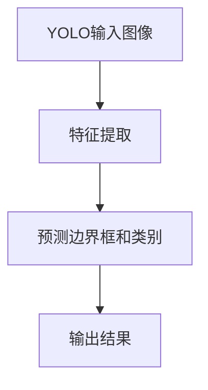
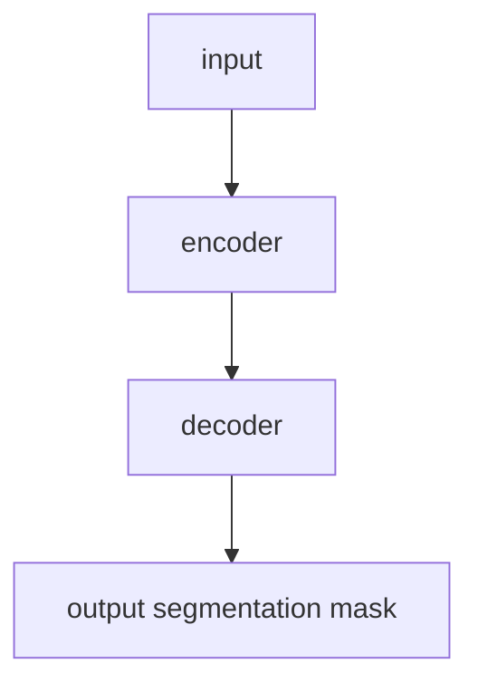
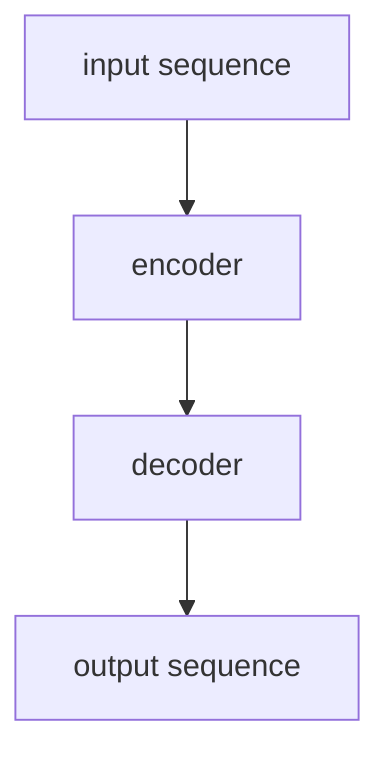
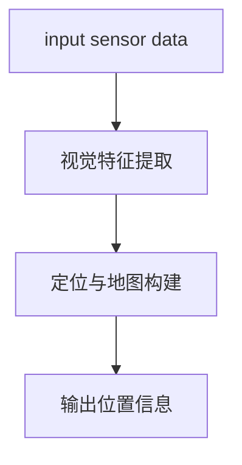

                 


# AI Agent在智能眼镜中的增强现实应用

---

## 关键词：AI Agent，增强现实，智能眼镜，图像识别，实时跟踪，自然语言处理

---

## 摘要：本文深入探讨AI Agent在智能眼镜中的增强现实应用，分析其核心算法、系统架构设计以及实际应用场景。文章从基础概念出发，逐步解析AI Agent如何与AR技术结合，提升智能眼镜的功能与用户体验。通过详细的技术分析和案例研究，展示AI Agent在智能眼镜中的潜力与未来发展方向。

---

# 第1章: 增强现实（AR）概述

## 1.1 增强现实的基本概念

### 1.1.1 AR的定义与核心特征

增强现实（Augmented Reality，AR）是一种将数字信息叠加在真实世界上的技术。其核心特征包括实时性、交互性和沉浸性。AR通过将虚拟信息与真实环境无缝结合，为用户创造丰富的视觉体验。

### 1.1.2 AR与虚拟现实（VR）的区别

- **VR**：完全沉浸于虚拟环境，脱离现实世界。
- **AR**：将虚拟元素叠加在真实环境中，保持与现实世界的联系。

### 1.1.3 AR技术的发展历程

从早期的军用头盔到如今的智能手机应用，AR技术经历了从简单图形叠加到深度学习驱动的图像识别的演变。

---

## 1.2 AI Agent的基本概念

### 1.2.1 AI Agent的定义与特点

AI Agent是一种具备自主决策能力的智能体，能够感知环境、执行任务并适应变化。

### 1.2.2 AI Agent的核心功能与应用场景

- **感知与理解**：通过传感器和摄像头获取环境信息。
- **决策与推理**：基于数据做出最优决策。
- **执行与反馈**：通过动作或信息输出影响环境。

### 1.2.3 AI Agent与传统计算机程序的区别

AI Agent具备自主性、反应性和社会性，能够适应动态环境并与其他实体交互。

---

## 1.3 AI Agent在增强现实中的作用

### 1.3.1 AI Agent如何增强AR体验

通过实时数据分析和智能决策，AI Agent能够提供更精准的AR内容。

### 1.3.2 AI Agent在AR系统中的功能模块

- **感知模块**：识别环境中的物体和用户行为。
- **决策模块**：生成AR内容并指导显示。
- **反馈模块**：收集用户反馈优化系统。

### 1.3.3 AI Agent与AR技术的结合方式

通过软硬件结合，AI Agent能够实时处理环境信息并生成AR效果。

---

## 1.4 本章小结

本章介绍了AR和AI Agent的基本概念，阐述了AI Agent在AR系统中的作用与结合方式，为后续章节奠定了基础。

---

# 第2章: 智能眼镜与增强现实技术

## 2.1 智能眼镜的基本结构

### 2.1.1 智能眼镜的硬件组成

- **显示屏**：用于显示AR内容。
- **摄像头**：捕捉环境信息。
- **传感器**：收集用户行为数据。
- **处理器**：执行AI算法。

### 2.1.2 智能眼镜的操作系统与软件架构

- **操作系统**：如Android或定制系统。
- **软件架构**：分为用户层、系统层和硬件层。

### 2.1.3 智能眼镜的主要功能模块

- **AR显示模块**：渲染AR内容。
- **AI处理模块**：执行实时计算。
- **用户交互模块**：处理用户输入。

---

## 2.2 增强现实技术在智能眼镜中的实现

### 2.2.1 AR显示技术的原理

通过透明显示屏将虚拟内容叠加在真实环境中。

### 2.2.2 AR图像处理算法

- **图像分割**：识别环境中的物体。
- **图像增强**：提升显示效果。

### 2.2.3 AR与智能眼镜的结合方式

通过摄像头捕捉环境，AI Agent生成AR内容并驱动显示。

---

## 2.3 智能眼镜中的AI Agent实现

### 2.3.1 AI Agent在智能眼镜中的角色

作为系统的核心，AI Agent负责实时处理环境数据并生成AR内容。

### 2.3.2 AI Agent与智能眼镜硬件的交互

通过传感器获取数据，AI Agent分析后驱动显示屏输出AR效果。

### 2.3.3 AI Agent在AR中的功能实现

- **环境感知**：识别用户周围的物体和场景。
- **用户行为分析**：预测用户的下一步操作。
- **AR内容生成**：根据环境数据生成相应的AR效果。

---

## 2.4 本章小结

本章详细介绍了智能眼镜的硬件结构和AR技术的实现方式，重点阐述了AI Agent在其中的核心作用。

---

# 第3章: AI Agent在增强现实中的核心算法

## 3.1 图像识别与物体检测

### 3.1.1 基于深度学习的图像识别算法

**目标检测算法：**

使用YOLO算法进行目标检测：



**YOLO核心公式：**

$$ loss = \lambda_1 \text{confidence\_loss} + \lambda_2 \text{classification\_loss} $$

### 3.1.2 目标检测算法（如YOLO、Faster R-CNN）

- **YOLO**：实时性高，适合移动设备。
- **Faster R-CNN**：精度高，适合复杂场景。

### 3.1.3 图像分割算法（如U-Net）

**U-Net网络结构：**



---

## 3.2 语义理解与自然语言处理

### 3.2.1 基于Transformer的自然语言处理模型

**Transformer模型结构：**



### 3.2.2 语义理解在AR中的应用

通过NLP技术分析用户指令，生成相应的AR内容。

### 3.2.3 基于上下文的语义分析

结合环境信息和用户行为，优化AR内容的生成。

---

## 3.3 实时跟踪与定位

### 3.3.1 基于SLAM的实时定位技术

**SLAM流程：**



### 3.3.2 基于视觉惯性里程计的定位算法

结合视觉和惯性数据，提升定位精度。

### 3.3.3 实时跟踪的优化方法

- **数据融合**：结合多传感器数据。
- **模型优化**：使用轻量化模型提升实时性。

---

## 3.4 本章小结

本章详细介绍了AI Agent在AR中的核心算法，包括图像识别、语义理解和实时跟踪技术，并通过mermaid图表和代码示例展示了算法的实现过程。

---

# 第4章: AI Agent与增强现实的系统架构设计

## 4.1 系统整体架构

### 4.1.1 AR智能眼镜的系统组成

- **硬件层**：摄像头、显示屏、传感器。
- **系统层**：操作系统、驱动程序。
- **应用层**：AI Agent、AR显示模块。

### 4.1.2 AI Agent的系统架构

- **感知模块**：负责环境数据采集。
- **决策模块**：处理数据并生成AR内容。
- **执行模块**：驱动硬件输出结果。

### 4.1.3 系统的模块划分与功能分配

通过模块化设计，确保系统高效运行。

---

## 4.2 系统功能设计

### 4.2.1 用户界面设计

直观的UI设计提升用户体验。

### 4.2.2 数据处理模块设计

高效的数据处理算法确保实时性。

### 4.2.3 AI Agent的交互逻辑设计

优化用户与系统的交互流程。

---

## 4.3 系统接口设计

### 4.3.1 硬件接口设计

标准化接口便于硬件扩展。

### 4.3.2 软件接口设计

定义清晰的API提升系统可编程性。

### 4.3.3 网络通信接口设计

支持多种通信协议确保数据实时传输。

---

## 4.4 系统交互流程

### 4.4.1 用户操作流程

从用户发起操作到系统反馈的完整流程。

### 4.4.2 系统内部交互流程

系统各模块之间的协作流程。

### 4.4.3 错误处理与异常处理流程

确保系统稳定运行。

---

## 4.5 本章小结

本章详细设计了AI Agent在智能眼镜中的系统架构，包括功能模块划分、接口设计和交互流程，为后续的项目实现奠定了基础。

---

# 第5章: 项目实战

## 5.1 环境安装

### 5.1.1 操作系统安装

选择适合的Linux发行版或Windows系统。

### 5.1.2 工具链安装

安装Python、TensorFlow、OpenCV等开发工具。

### 5.1.3 智能眼镜硬件驱动安装

确保硬件设备能够被系统识别。

---

## 5.2 系统核心实现源代码

### 5.2.1 AI Agent核心算法实现

```python
import tensorflow as tf
from tensorflow.keras import layers

model = tf.keras.Sequential([
    layers.Conv2D(32, (3,3), activation='relu'),
    layers.MaxPooling2D((2,2)),
    layers.Flatten(),
    layers.Dense(128, activation='relu'),
    layers.Dense(num_classes, activation='softmax')
])
```

### 5.2.2 AR显示模块实现

```python
import cv2

def overlay_ar_element(image, overlay_image, position):
    # 将overlay_image叠加到image的指定位置
    result = image.copy()
    rows, cols = overlay_image.shape[:2]
    y1, x1 = position
    y2 = y1 + rows
    x2 = x1 + cols
    alpha_mask = overlay_image[:, :, 3] / 255.0
    alpha_image = 1 - alpha_mask
    result[y1:y2, x1:x2] = (result[y1:y2, x1:x2] * alpha_image + overlay_image[:, :, :3] * alpha_mask)
    return result
```

### 5.2.3 传感器数据处理模块

```python
import numpy as np

def process_sensor_data(sensor_data):
    # 对传感器数据进行处理
    processed_data = []
    for data in sensor_data:
        processed_data.append(data * 0.5 + 0.2)
    return processed_data
```

---

## 5.3 代码应用解读与分析

通过上述代码实现AI Agent的核心功能，包括图像识别、AR显示和传感器数据处理。

### 5.3.1 图像识别模块

使用预训练的神经网络模型进行目标检测和图像分割。

### 5.3.2 AR显示模块

将虚拟元素叠加到真实环境中，实现增强现实效果。

### 5.3.3 传感器数据处理模块

对传感器数据进行预处理，确保系统稳定运行。

---

## 5.4 实际案例分析和详细讲解剖析

### 5.4.1 案例背景

在智能眼镜中实现AR导航功能。

### 5.4.2 系统实现

通过摄像头捕捉环境信息，AI Agent分析路径并生成AR导航指示。

### 5.4.3 系统优化

优化算法提升实时性和准确性。

---

## 5.5 项目小结

本章通过实际案例展示了AI Agent在智能眼镜中的应用，详细讲解了系统实现的关键步骤和优化方法。

---

# 第6章: 最佳实践与总结

## 6.1 最佳实践 tips

- **硬件选择**：选择性能稳定的硬件设备。
- **算法优化**：使用轻量化模型提升实时性。
- **用户体验**：注重界面设计和交互逻辑。

## 6.2 总结

本文详细探讨了AI Agent在智能眼镜中的增强现实应用，从算法实现到系统架构设计，再到项目实战，全面展示了技术细节和实现方法。

## 6.3 注意事项

- 确保系统安全性，防止数据泄露。
- 优化算法以适应不同场景需求。
- 提供良好的用户反馈机制。

## 6.4 拓展阅读

推荐相关书籍和论文，供读者深入学习。

---

# 作者：AI天才研究院 & 禅与计算机程序设计艺术

---

# 图片说明

图1: AI Agent与AR系统的交互流程图

图2: YOLO目标检测算法流程图

图3: Transformer模型结构图

---

# 扩展阅读

- [深度学习入门](https://example.com/deep_learning)
- [增强现实技术详解](https://example.com/ar_tutorial)
- [Transformer模型的应用](https://example.com/transformer_application)

--- 

# 图片


---

