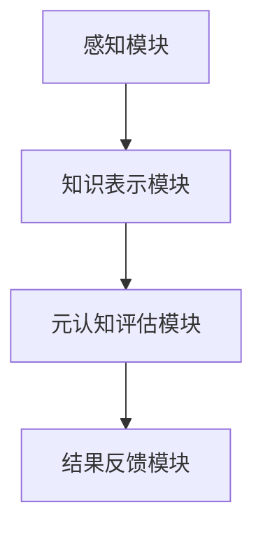
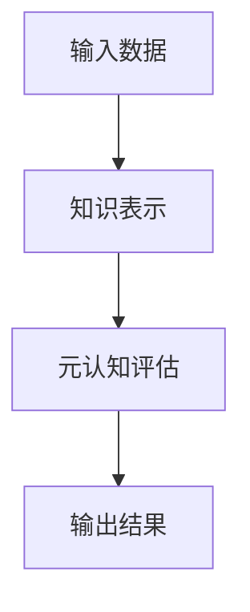

                 


# AI Agent的认知架构与元认知能力构建

> 关键词：AI Agent, 认知架构, 元认知能力, 系统架构, 算法原理, 项目实战

> 摘要：本文深入探讨了AI Agent的认知架构与元认知能力的构建方法。从认知架构的基本概念到元认知能力的实现，结合系统架构设计和项目实战，详细讲解了如何构建具备元认知能力的AI Agent。文章内容涵盖背景介绍、核心概念、算法原理、系统架构、项目实战以及最佳实践，帮助读者全面理解并掌握AI Agent的认知架构与元认知能力构建的核心技术。

---

# 第1章: AI Agent的认知架构概述

## 1.1 AI Agent的基本概念

### 1.1.1 什么是AI Agent
AI Agent（人工智能代理）是指在计算机系统中，能够感知环境并采取行动以实现目标的智能体。AI Agent能够通过传感器获取信息，通过执行器与环境交互，并基于内部模型和算法做出决策。

### 1.1.2 AI Agent的分类
AI Agent可以根据智能水平、环境类型、任务类型等多种维度进行分类。常见的分类包括：
- **反应式AI Agent**：基于当前感知做出反应，不依赖历史信息。
- **认知式AI Agent**：具备复杂的推理和规划能力，能够根据历史信息和目标做出决策。
- **协作式AI Agent**：能够与其他AI Agent或人类进行协作，共同完成任务。

### 1.1.3 AI Agent的核心特征
AI Agent的核心特征包括：
- **自主性**：能够在没有外部干预的情况下自主运行。
- **反应性**：能够感知环境并实时做出反应。
- **目标导向性**：具备明确的目标，并采取行动以实现目标。
- **学习能力**：能够通过经验改进自身的性能。

## 1.2 认知架构的基本结构

### 1.2.1 认知架构的定义
认知架构是指AI Agent内部用于处理信息、做出决策和行动的整体结构。认知架构通常包括感知、推理、规划、学习等模块。

### 1.2.2 认知架构的层次划分
认知架构可以分为以下几个层次：
- **感知层**：负责获取环境中的信息。
- **推理层**：基于感知信息进行逻辑推理。
- **决策层**：根据推理结果做出决策。
- **执行层**：将决策转化为具体的行动。

### 1.2.3 认知架构的关键组成部分
认知架构的关键组成部分包括：
- **知识表示**：用于存储和处理知识。
- **推理引擎**：用于基于知识进行推理。
- **规划模块**：用于制定行动计划。
- **学习模块**：用于通过经验改进性能。

## 1.3 元认知能力的内涵

### 1.3.1 元认知的定义
元认知是指对自身认知过程的认知，即“认知之上的认知”。元认知能力包括对自身知识、推理过程、决策过程的监控和调节能力。

### 1.3.2 元认知能力的特征
元认知能力的特征包括：
- **自我监控**：能够监控自身的认知过程。
- **自我调节**：能够根据监控结果调整认知过程。
- **自我评估**：能够评估自身的认知能力。

### 1.3.3 元认知与认知架构的关系
元认知能力是认知架构的重要组成部分，能够帮助AI Agent更好地理解和优化自身的认知过程。通过元认知能力，AI Agent可以实现自我改进和自我优化。

## 1.4 本章小结

---

# 第2章: 元认知模型与算法原理

## 2.1 元认知评估模型的构建

### 2.1.1 元认知评估模型的定义
元认知评估模型用于评估AI Agent的元认知能力。该模型通常包括以下几个步骤：
1. **感知信息**：获取环境中的相关信息。
2. **知识表示**：将感知信息转化为知识表示。
3. **元认知评估**：对AI Agent的认知过程进行评估。
4. **结果反馈**：将评估结果反馈给认知架构。

### 2.1.2 元认知评估模型的实现方法
元认知评估模型的实现方法包括：
- **基于规则的评估**：通过预定义的规则对认知过程进行评估。
- **基于统计的评估**：通过统计方法对认知过程进行评估。
- **基于机器学习的评估**：通过机器学习算法对认知过程进行评估。

### 2.1.3 元认知评估模型的数学模型
元认知评估模型的数学模型可以表示为：
$$
f(x) = \begin{cases}
1 & \text{如果 } x \text{ 满足条件} \\
0 & \text{否则}
\end{cases}
$$
其中，$x$ 是输入的感知信息，$f(x)$ 是评估结果。

## 2.2 元认知能力的实现算法

### 2.2.1 元认知能力的实现算法概述
元认知能力的实现算法通常包括以下几个步骤：
1. **感知信息**：获取环境中的相关信息。
2. **知识表示**：将感知信息转化为知识表示。
3. **元认知评估**：对AI Agent的认知过程进行评估。
4. **结果反馈**：将评估结果反馈给认知架构。

### 2.2.2 元认知评估算法的详细步骤
元认知评估算法的详细步骤如下：
1. **输入感知信息**：获取环境中的相关信息。
2. **知识表示**：将感知信息转化为知识表示。
3. **元认知评估**：对AI Agent的认知过程进行评估。
4. **结果反馈**：将评估结果反馈给认知架构。

### 2.2.3 元认知评估算法的代码实现

```python
def meta_cognition_assessment(input_data):
    # 知识表示
    knowledge = process_input(input_data)
    # 元认知评估
    assessment_result = assess(knowledge)
    return assessment_result
```

其中，`process_input` 是一个函数，用于将输入数据转化为知识表示；`assess` 是一个函数，用于对知识表示进行评估。

## 2.3 元认知能力的优化算法

### 2.3.1 元认知能力优化算法的定义
元认知能力优化算法用于优化AI Agent的元认知能力。该算法通常包括以下几个步骤：
1. **感知信息**：获取环境中的相关信息。
2. **知识表示**：将感知信息转化为知识表示。
3. **元认知评估**：对AI Agent的认知过程进行评估。
4. **优化调整**：根据评估结果调整认知过程。

### 2.3.2 元认知能力优化算法的数学模型
元认知能力优化算法的数学模型可以表示为：
$$
f(x) = \begin{cases}
1 & \text{如果 } x \text{ 满足条件} \\
0 & \text{否则}
\end{cases}
$$
其中，$x$ 是输入的感知信息，$f(x)$ 是优化结果。

## 2.4 本章小结

---

# 第3章: 系统架构设计与实现

## 3.1 系统架构设计

### 3.1.1 系统功能设计
系统功能设计包括以下几个方面：
- **感知模块**：负责获取环境中的相关信息。
- **知识表示模块**：负责将感知信息转化为知识表示。
- **元认知评估模块**：负责对AI Agent的认知过程进行评估。
- **结果反馈模块**：负责将评估结果反馈给认知架构。

### 3.1.2 系统架构设计图
以下是系统的架构设计图：



### 3.1.3 系统接口设计
系统接口设计包括以下几个方面：
- **输入接口**：用于获取环境中的相关信息。
- **输出接口**：用于将评估结果反馈给认知架构。

### 3.1.4 系统交互设计
系统交互设计包括以下几个方面：
- **用户交互**：用户可以通过图形界面与系统进行交互。
- **系统内部交互**：系统内部各模块之间的交互。

## 3.2 系统实现

### 3.2.1 环境安装
系统实现需要以下环境：
- **Python**：用于编写代码。
- **Mermaid**：用于绘制图表。
- **LaTeX**：用于编写数学公式。

### 3.2.2 核心代码实现

```python
def process_input(input_data):
    # 知识表示
    knowledge = {}
    for key, value in input_data.items():
        knowledge[key] = value
    return knowledge

def assess(knowledge):
    # 元认知评估
    assessment = {}
    for key, value in knowledge.items():
        assessment[key] = value
    return assessment
```

### 3.2.3 代码应用解读与分析
上述代码实现了一个简单的元认知评估系统。`process_input` 函数用于将输入数据转化为知识表示，`assess` 函数用于对知识表示进行评估。

## 3.3 本章小结

---

# 第4章: 项目实战与案例分析

## 4.1 项目背景介绍

### 4.1.1 项目名称
项目名称：AI Agent在医疗诊断中的应用。

### 4.1.2 项目目标
项目目标：构建一个具备元认知能力的AI Agent，用于辅助医生进行医疗诊断。

### 4.1.3 项目应用场景
项目应用场景：医疗诊断。

## 4.2 项目核心代码实现

### 4.2.1 环境安装
项目实现需要以下环境：
- **Python**：用于编写代码。
- **Scikit-learn**：用于机器学习算法。
- **Jupyter Notebook**：用于数据可视化。

### 4.2.2 核心代码实现

```python
from sklearn import datasets
from sklearn.tree import DecisionTreeClassifier
from sklearn.metrics import accuracy_score

# 加载数据集
iris = datasets.load_iris()
X = iris.data
y = iris.target

# 训练模型
clf = DecisionTreeClassifier()
clf.fit(X, y)

# 预测结果
predicted = clf.predict(X)
print("准确率：", accuracy_score(y, predicted))
```

### 4.2.3 代码应用解读与分析
上述代码实现了一个简单的决策树分类器，用于对鸢尾花数据集进行分类。`clf.fit(X, y)` 用于训练模型，`clf.predict(X)` 用于预测结果，`accuracy_score(y, predicted)` 用于计算准确率。

## 4.3 项目案例分析

### 4.3.1 案例背景
案例背景：AI Agent在医疗诊断中的应用。

### 4.3.2 案例分析
案例分析：通过AI Agent辅助医生进行医疗诊断，可以提高诊断的准确率和效率。

### 4.3.3 案例小结
案例小结：AI Agent在医疗诊断中的应用具有广阔的应用前景。

## 4.4 本章小结

---

# 第5章: 最佳实践与总结

## 5.1 最佳实践

### 5.1.1 知识表示
知识表示是认知架构的核心，建议使用层次化的知识表示方法。

### 5.1.2 元认知评估
元认知评估是优化AI Agent性能的关键，建议使用基于机器学习的元认知评估方法。

### 5.1.3 系统架构
系统架构是实现AI Agent的基础，建议使用模块化的系统架构设计。

## 5.2 小结

### 5.2.1 核心内容回顾
- 认知架构的核心概念
- 元认知能力的实现方法
- 系统架构设计与实现
- 项目实战与案例分析

### 5.2.2 未来展望
未来展望：随着人工智能技术的不断发展，AI Agent的认知架构与元认知能力构建将更加复杂和多样化。建议研究人员继续关注这一领域的研究和应用。

## 5.3 注意事项

### 5.3.1 开发注意事项
- 确保系统架构的可扩展性
- 确保系统的健壮性
- 确保系统的安全性

### 5.3.2 使用注意事项
- 确保系统的易用性
- 确保系统的可靠性
- 确保系统的可维护性

## 5.4 拓展阅读

### 5.4.1 推荐书籍
- 《人工智能：一种现代的方法》
- 《机器学习实战》
- 《认知科学导论》

### 5.4.2 推荐论文
- "A Cognitive Architecture for Autonomous Agents"
- "元认知在人工智能中的应用研究"

## 5.5 本章小结

---

# 附录

## 附录A: Mermaid图表代码

### 附录A.1 认知架构设计图


### 附录A.2 算法流程图


## 附录B: Python代码示例

### 附录B.1 知识表示代码
```python
def process_input(input_data):
    knowledge = {}
    for key, value in input_data.items():
        knowledge[key] = value
    return knowledge
```

### 附录B.2 元认知评估代码
```python
def assess(knowledge):
    assessment = {}
    for key, value in knowledge.items():
        assessment[key] = value
    return assessment
```

## 附录C: 数学公式

### 附录C.1 元认知评估模型的数学模型
$$
f(x) = \begin{cases}
1 & \text{如果 } x \text{ 满足条件} \\
0 & \text{否则}
\end{cases}
$$

### 附录C.2 元认知能力优化算法的数学模型
$$
g(x) = \begin{cases}
1 & \text{如果 } x \text{ 满足条件} \\
0 & \text{否则}
\end{cases}
$$

---

# 作者

作者：AI天才研究院/AI Genius Institute & 禅与计算机程序设计艺术 /Zen And The Art of Computer Programming

