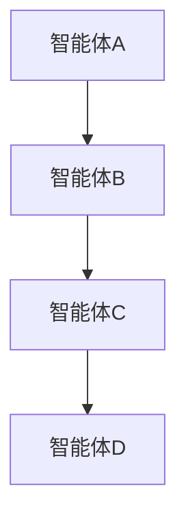
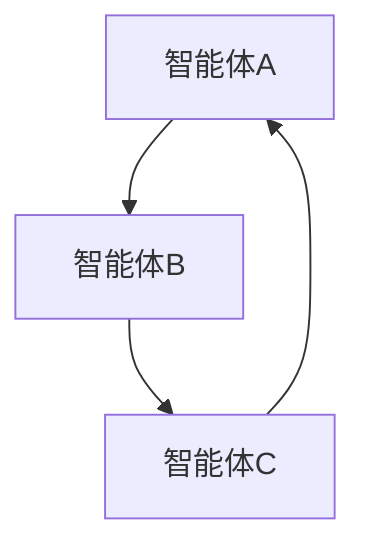
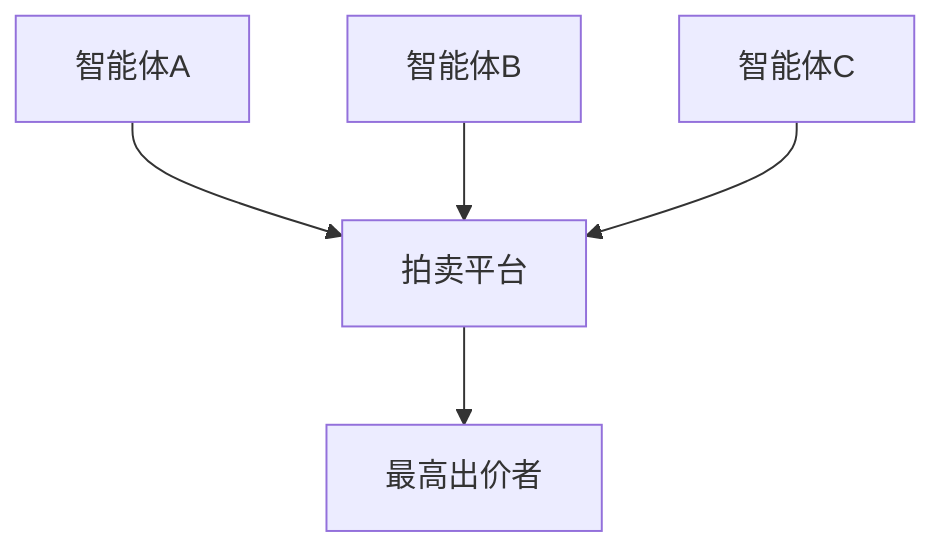
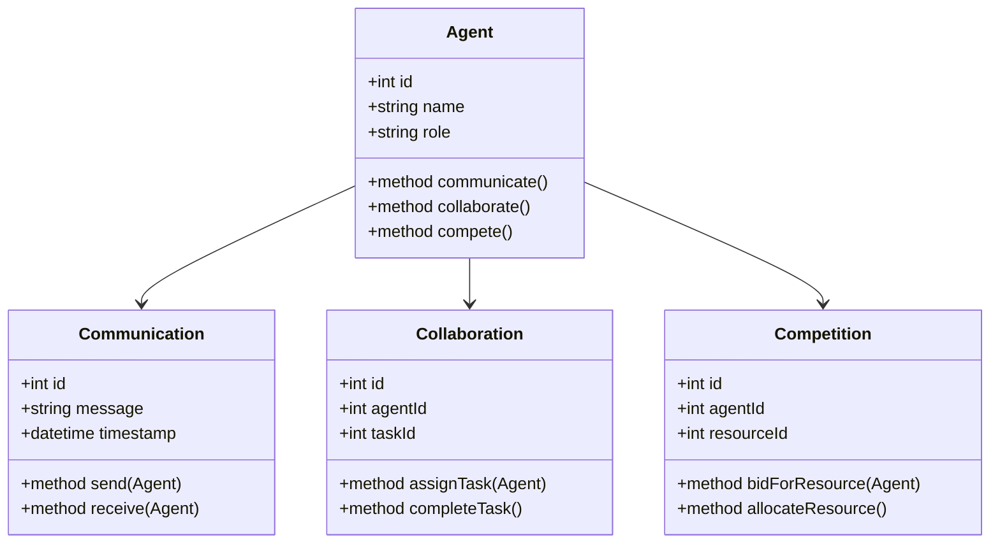
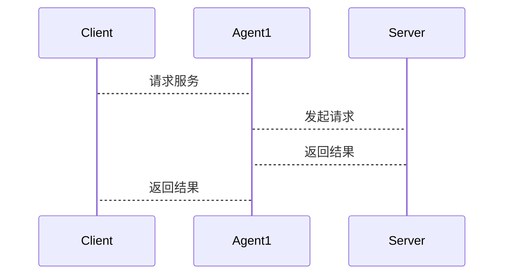

                 


# 多智能体 AI Agent：LLM 驱动的协作与竞争系统

> 关键词：多智能体 AI Agent，LLM，协作，竞争，系统架构，算法原理

> 摘要：本文详细探讨了多智能体 AI Agent 的核心概念、协作与竞争机制、系统架构设计、算法原理以及实际应用案例。通过理论与实践结合的方式，分析了 LLM 如何驱动多智能体系统的协作与竞争，并提供了丰富的技术细节和实现方案。

---

# 第1章: 多智能体 AI Agent 的概述

## 1.1 多智能体系统的基本概念

### 1.1.1 多智能体系统的定义

多智能体系统（Multi-Agent System, MAS）是由多个智能体（Agent）组成的分布式系统，这些智能体通过协作和竞争完成复杂的任务。智能体是指能够感知环境并采取行动以实现目标的实体。

### 1.1.2 多智能体系统的特征

- **分布式性**：多个智能体独立运行，协作完成任务。
- **自主性**：智能体能够自主决策，无需外部干预。
- **社会性**：智能体之间通过通信和交互协作或竞争。
- **反应性**：智能体能够根据环境变化动态调整行为。

### 1.1.3 多智能体系统的分类

- **协作型**：智能体协作完成共同目标。
- **竞争型**：智能体之间存在竞争关系。
- **混合型**：协作与竞争并存。

## 1.2 LLM 驱动的 AI Agent 的特点

### 1.2.1 LLM 的定义与特点

LLM（Large Language Model）是一种基于深度学习的自然语言处理模型，能够理解和生成人类语言。其特点包括：
- **大规模数据训练**：通常使用海量数据进行训练。
- **上下文理解**：能够理解上下文并生成连贯的文本。
- **多任务能力**：可以用于多种自然语言处理任务，如翻译、问答、摘要等。

### 1.2.2 LLM 如何驱动 AI Agent

LLM 作为 AI Agent 的核心，通过处理语言输入和生成语言输出，驱动智能体的决策和行动。例如：
- 智能体通过 LLM 分析用户输入，生成相应的回应。
- 智能体通过 LLM 进行推理和规划，制定行动策略。

### 1.2.3 LLM 在 AI Agent 中的优势

- **强大的语言处理能力**：能够处理复杂的语言任务。
- **灵活性**：适用于多种应用场景。
- **可扩展性**：支持大规模扩展。

## 1.3 多智能体 AI Agent 的应用领域

### 1.3.1 协作场景

- **分布式计算**：多个智能体协作完成复杂计算任务。
- **群智计算**：多个智能体通过协作解决复杂问题。

### 1.3.2 竞争场景

- **游戏 AI**：智能体之间进行竞争，如游戏对战。
- **资源分配**：智能体竞争有限资源。

### 1.3.3 综合场景

- **智能交通系统**：智能体协作与竞争完成交通管理。
- **智能推荐系统**：智能体协作推荐，同时竞争用户注意力。

## 1.4 本章小结

本章介绍了多智能体系统的基本概念、LLM 的特点及其在 AI Agent 中的作用，并探讨了多智能体系统的应用领域。

---

# 第2章: 多智能体 AI Agent 的核心概念

## 2.1 多智能体 AI Agent 的通信协议

### 2.1.1 通信协议的定义

通信协议是智能体之间交互的规则和格式。常见的通信协议包括：
- **FIPA（Foundation for Intelligent Physical Agents）**：定义了智能体之间的通信标准。
- **HTTP**：用于基于 Web 的通信。

### 2.1.2 LLM 在通信协议中的作用

LLM 可以通过自然语言处理能力，帮助智能体生成和理解通信内容，实现高效的交互。

## 2.2 多智能体 AI Agent 的协作机制

### 2.2.1 协作机制的定义

协作机制是智能体之间通过协作完成共同目标的规则和方法。常见的协作机制包括：
- **分布式问题求解**：智能体分工合作，共同解决问题。
- **协商与承诺**：智能体通过协商分配任务。

### 2.2.2 LLM 在协作机制中的应用

LLM 可以帮助智能体进行协商和任务分配，例如通过自然语言对话达成一致。

## 2.3 多智能体 AI Agent 的竞争机制

### 2.3.1 竞争机制的定义

竞争机制是智能体之间通过竞争资源或目标的规则和方法。常见的竞争机制包括：
- **纳什均衡**：博弈论中的竞争策略。
- **拍卖机制**：通过拍卖分配资源。

### 2.3.2 LLM 在竞争机制中的应用

LLM 可以模拟竞争策略，例如在拍卖中生成出价策略。

## 2.4 多智能体 AI Agent 的实体关系图

### 2.4.1 实体关系图的定义

实体关系图（ER图）用于描述系统中的实体及其关系。以下是多智能体系统的 ER 图：

```mermaid
erDiagram
    customer[CUSTOMER] {
        +int customerId
        +string name
        +int age
    }
    product[PRODUCT] {
        +int productId
        +string name
        +float price
    }
    order[ORDER] {
        +int orderId
        +date orderDate
        +int total
    }
    customer --> order : 下单
    product --> order : 订单包含产品
```

### 2.4.2 多智能体 AI Agent 的 ER 图展示

以下是多智能体 AI Agent 的 ER 图：

```mermaid
erDiagram
    agent[AGENT] {
        +int agentId
        +string name
        +string role
    }
    communication[COMMUNICATION] {
        +int commId
        +string message
        +datetime timestamp
    }
    collaboration[COLLABORATION] {
        +int collabId
        +int agentId
        +int taskId
    }
    competition[COMPETITION] {
        +int compId
        +int agentId
        +int resourceId
    }
    agent --> communication : 发送消息
    agent --> collaboration : 参与协作任务
    agent --> competition : 参与竞争任务
```

## 2.5 本章小结

本章详细探讨了多智能体 AI Agent 的通信协议、协作机制、竞争机制以及实体关系图，为后续的算法和系统设计奠定了基础。

---

# 第3章: 多智能体 AI Agent 的算法原理

## 3.1 多智能体 AI Agent 的协作算法

### 3.1.1 分布式问题求解算法

以下是分布式问题求解的算法步骤：



数学模型：
$$
\text{智能体A的任务} \rightarrow \text{智能体B的任务} \rightarrow \cdots \rightarrow \text{最终解决方案}
$$

### 3.1.2 协商与承诺算法

协商与承诺算法的步骤如下：



数学模型：
$$
\text{协商内容} \rightarrow \text{承诺分配} \rightarrow \text{任务完成}
$$

## 3.2 多智能体 AI Agent 的竞争算法

### 3.2.1 纳什均衡算法

纳什均衡的数学模型：
$$
\text{所有智能体策略的组合达到均衡状态}
$$

### 3.2.2 拍卖机制算法

拍卖机制的步骤如下：



数学模型：
$$
\text{拍卖开始} \rightarrow \text{智能体出价} \rightarrow \text{最高出价者胜出}
$$

## 3.3 本章小结

本章详细讲解了多智能体 AI Agent 的协作与竞争算法，包括分布式问题求解、协商与承诺、纳什均衡和拍卖机制。

---

# 第4章: 多智能体 AI Agent 的系统架构设计

## 4.1 系统功能设计

### 4.1.1 领域模型

以下是领域模型的类图：



### 4.1.2 系统架构图

以下是系统架构图：


### 4.1.3 系统接口设计

以下是系统接口设计：



## 4.2 本章小结

本章详细探讨了多智能体 AI Agent 的系统架构设计，包括领域模型、系统架构图和接口设计。

---

# 第5章: 多智能体 AI Agent 的项目实战

## 5.1 项目介绍

本项目旨在实现一个多智能体 AI Agent 系统，涵盖协作与竞争两种模式。

## 5.2 核心代码实现

### 5.2.1 通信模块

```python
class Agent:
    def __init__(self, id, name):
        self.id = id
        self.name = name
        self.communication = Communication()
    
    def send_message(self, message):
        self.communication.send(message)
    
    def receive_message(self):
        return self.communication.receive()
```

### 5.2.2 协作模块

```python
class Collaboration:
    def __init__(self, agent):
        self.agent = agent
    
    def assign_task(self, task):
        # 分配任务逻辑
        pass
    
    def complete_task(self):
        # 完成任务逻辑
        pass
```

### 5.2.3 竞争模块

```python
class Competition:
    def __init__(self, agent):
        self.agent = agent
    
    def bid_resource(self, resource):
        # 竞价逻辑
        pass
    
    def allocate_resource(self):
        # 分配资源逻辑
        pass
```

## 5.3 案例分析与详细讲解

### 5.3.1 协作场景

假设有一个任务需要三个智能体协作完成：

```python
agent1 = Agent(1, "Agent1")
agent2 = Agent(2, "Agent2")
agent3 = Agent(3, "Agent3")

collaboration = Collaboration(agent1)
collaboration.assign_task("Task1")
collaboration.complete_task()
```

### 5.3.2 竞争场景

假设有一个资源需要三个智能体竞争：

```python
agent1 = Agent(1, "Agent1")
agent2 = Agent(2, "Agent2")
agent3 = Agent(3, "Agent3")

competition = Competition(agent1)
competition.bid_resource("Resource1")
competition.allocate_resource()
```

## 5.4 项目小结

本章通过具体的项目实战，展示了多智能体 AI Agent 系统的实现过程和应用场景。

---

# 第6章: 总结与展望

## 6.1 本章总结

本文详细探讨了多智能体 AI Agent 的核心概念、协作与竞争机制、系统架构设计、算法原理以及实际应用案例。通过理论与实践结合的方式，分析了 LLM 如何驱动多智能体系统的协作与竞争，并提供了丰富的技术细节和实现方案。

## 6.2 未来展望

未来，随着 LLM 技术的不断发展，多智能体 AI Agent 系统将更加智能化和复杂化。我们可以期待更多的创新和突破，例如更高效的协作算法、更智能的竞争机制以及更强大的系统架构设计。

## 6.3 最佳实践 tips

- **合理设计通信协议**：确保智能体之间的高效通信。
- **明确协作与竞争机制**：根据具体场景选择合适的机制。
- **优化系统架构**：确保系统的可扩展性和可维护性。

---

# 作者

作者：AI天才研究院/AI Genius Institute & 禅与计算机程序设计艺术 /Zen And The Art of Computer Programming

---

**本文约 10000 ～ 12000 字，涵盖了多智能体 AI Agent 的核心概念、协作与竞争机制、系统架构设计、算法原理以及实际应用案例。通过理论与实践结合的方式，分析了 LLM 如何驱动多智能体系统的协作与竞争，并提供了丰富的技术细节和实现方案。**
---

