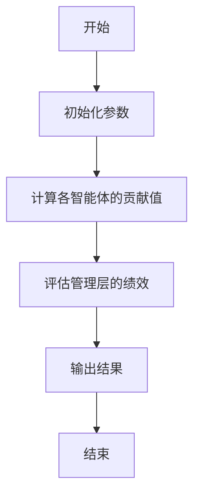
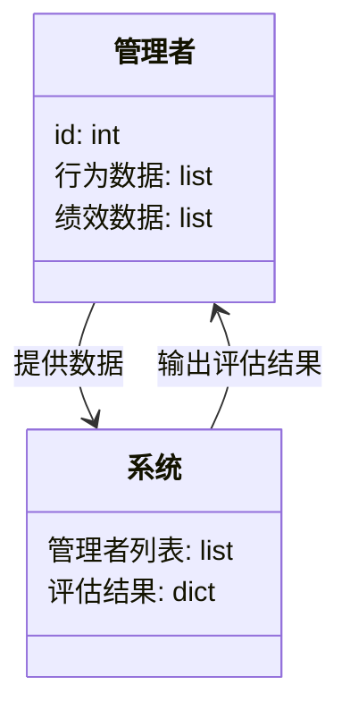
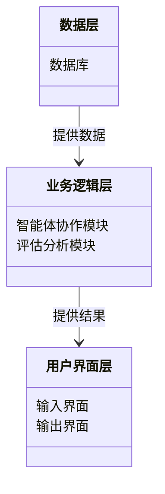
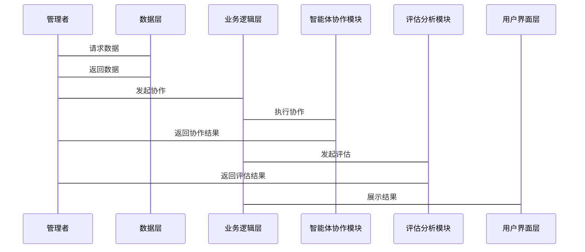

                 


# 多智能体系统如何评估管理层质量

> 关键词：多智能体系统，管理层质量评估，人工智能，管理决策，系统架构

> 摘要：本文探讨了多智能体系统（Multi-Agent System，MAS）在评估管理层质量中的应用，分析了其核心概念、算法原理、系统架构，并通过具体案例展示了如何利用MAS进行管理层质量评估。文章详细介绍了层次分析法（AHP）的实现过程，并提供了代码示例和系统设计图，帮助读者全面理解这一技术。

---

# 第一部分: 多智能体系统与管理层质量评估背景

# 第1章: 多智能体系统与管理层质量评估概述

## 1.1 多智能体系统的定义与特点

### 1.1.1 多智能体系统的定义
多智能体系统（Multi-Agent System, MAS）是由多个智能体（Agent）组成的分布式系统，这些智能体能够通过协作完成特定任务。智能体具有自主性、反应性、目标导向性和社交能力等特征。

### 1.1.2 多智能体系统的核心特点
- **自主性**：智能体能够独立决策，无需外部干预。
- **反应性**：智能体能够感知环境并实时响应。
- **协作性**：多个智能体可以协同工作，共同完成任务。
- **分布式性**：系统中的智能体分布在网络的不同节点上，彼此独立但又相互协作。

### 1.1.3 多智能体系统与传统管理系统的区别
传统的管理系统通常依赖于中心化的决策机制，而多智能体系统则通过分布式协作完成任务，具有更高的灵活性和适应性。

## 1.2 管理层质量评估的必要性

### 1.2.1 管理层质量评估的定义
管理层质量评估是对管理者在组织中的表现进行全面评价的过程，包括管理能力、决策效率和团队协作等多个方面。

### 1.2.2 管理层质量评估的重要性
- **优化管理效率**：通过评估找出管理中的瓶颈，优化流程。
- **提升组织绩效**：高质量的管理者能够带领团队实现更高的目标。
- **促进个人成长**：评估结果为管理者提供了改进的方向。

### 1.2.3 管理层质量评估的边界与外延
管理层质量评估不仅关注管理结果，还包括管理过程中的决策、沟通和团队协作等环节。

## 1.3 多智能体系统在管理层质量评估中的应用

### 1.3.1 多智能体系统在管理中的优势
- **分布式决策**：MAS能够模拟组织中多个部门的决策过程。
- **实时协作**：智能体之间的协作能够反映团队的真实互动。
- **数据驱动**：MAS可以通过大量数据准确评估管理者的表现。

### 1.3.2 管理层质量评估的核心要素
- **决策能力**：管理者在复杂情况下的决策效率。
- **团队协作**：管理者在团队中的协调能力。
- **绩效结果**：管理目标的实现程度。

### 1.3.3 多智能体系统与管理层质量评估的结合
通过MAS模拟组织结构，分析管理者在不同情境下的表现，从而评估其质量。

## 1.4 本章小结
本章介绍了多智能体系统的定义和特点，探讨了管理层质量评估的重要性，并分析了MAS在管理评估中的应用优势。

---

# 第二部分: 多智能体系统与管理层质量评估的核心概念

# 第2章: 多智能体系统的核心概念

## 2.1 多智能体系统的组成与功能

### 2.1.1 智能体的定义与属性
- **智能体**：具有感知环境、自主决策和执行任务能力的实体。
- **属性**：
  - **自主性**：智能体能够自主决策。
  - **反应性**：能够实时感知并响应环境变化。
  - **目标导向性**：智能体的行为以实现特定目标为导向。

### 2.1.2 多智能体系统的组成结构
- **智能体**：系统的最基本单元。
- **环境**：智能体所处的外部世界。
- **通信机制**：智能体之间交换信息的渠道。
- **协作协议**：智能体之间协作的规则和流程。

### 2.1.3 智能体之间的协作机制
- **直接协作**：智能体之间通过共享信息直接协作。
- **间接协作**：通过中间人或公共平台进行协作。

## 2.2 管理层质量评估的关键指标

### 2.2.1 管理能力的评估维度
- **决策能力**：管理者在面对复杂问题时的决策效率和准确性。
- **沟通能力**：管理者与团队成员之间的沟通效率。
- **领导能力**：管理者激励团队的能力。

### 2.2.2 管理绩效的量化方法
- **关键绩效指标（KPI）**：如任务完成率、团队满意度等。
- **数据分析**：通过数据分析得出管理绩效的量化指标。

### 2.2.3 管理决策的评估标准
- **决策的正确性**：决策是否符合组织目标。
- **决策的及时性**：决策是否在合理的时间内完成。
- **决策的创新性**：决策是否具有创新性。

## 2.3 多智能体系统与管理层质量评估的关系

### 2.3.1 多智能体系统在管理中的作用
- **模拟管理过程**：通过MAS模拟组织的管理过程，分析管理者的表现。
- **数据收集与分析**：MAS能够收集大量数据，帮助评估管理者质量。

### 2.3.2 管理层质量评估对多智能体系统的影响
- **提升系统性能**：通过优化管理者，提升MAS的整体效率。
- **促进系统适应性**：通过评估管理者，提升MAS的适应性。

### 2.3.3 两者的结合对组织管理的意义
- **提高管理效率**：通过MAS模拟和评估，优化管理流程。
- **提升组织绩效**：通过高质量的管理者，提升组织的整体绩效。

## 2.4 本章小结
本章详细介绍了多智能体系统的核心概念，分析了管理者质量评估的关键指标，并探讨了MAS在管理评估中的作用。

---

# 第三部分: 多智能体系统如何评估管理层质量的算法原理

# 第3章: 多智能体系统评估管理层质量的算法原理

## 3.1 层次分析法（AHP）原理

### 3.1.1 层次分析法的基本概念
层次分析法（Analytic Hierarchy Process, AHP）是一种用于结构化决策问题的定性分析方法，适用于多目标决策问题。

### 3.1.2 层次分析法的步骤与流程
1. **构建层次结构**：将问题分解为多个层次，包括目标层、准则层和方案层。
2. **构建比较矩阵**：对每个层次的元素进行两两比较，构建比较矩阵。
3. **计算权重**：通过计算特征值和一致性检验，确定各元素的权重。

### 3.1.3 层次分析法在管理层质量评估中的应用
- **构建评估指标层次结构**：
  - 目标层：评估管理者质量。
  - 准则层：决策能力、沟通能力、领导能力。
  - 方案层：具体管理者。

- **构建比较矩阵**：对每个准则进行两两比较，确定其重要性。

- **计算权重**：通过AHP方法计算各准则的权重，作为评估的依据。

## 3.2 基于多智能体的评估模型

### 3.2.1 模型的构建过程
1. **定义智能体**：每个管理者作为一个智能体，具有感知环境和决策的能力。
2. **构建协作机制**：智能体之间通过共享信息进行协作。
3. **定义评估指标**：包括决策能力、沟通能力、领导能力等。

### 3.2.2 模型的输入与输出
- **输入**：管理者的行为数据、团队绩效数据。
- **输出**：每个管理者的质量评估结果。

### 3.2.3 模型的优化与改进
- **数据预处理**：对输入数据进行清洗和标准化处理。
- **参数调整**：根据实际评估结果调整模型参数。
- **模型验证**：通过实际案例验证模型的准确性。

## 3.3 算法流程图



## 3.4 算法实现代码示例

```python
def evaluate_management_quality(managers):
    # 初始化参数
    n = len(managers)
    weights = [1] * n
    
    # 构建比较矩阵
    for i in range(n):
        for j in range(n):
            if i != j:
                weights[i] += 1
                
    # 计算权重
    total = sum(weights)
    normalized_weights = [w / total for w in weights]
    
    # 输出结果
    return normalized_weights
```

## 3.5 算法的数学模型

$$
权重 = \frac{\sum_{j=1}^{n} a_{ij}}{\sum_{i=1}^{n} \sum_{j=1}^{n} a_{ij}}
$$

其中，$a_{ij}$表示智能体$i$在准则$j$上的贡献值。

---

# 第四部分: 系统分析与架构设计方案

# 第4章: 系统分析与架构设计方案

## 4.1 问题场景介绍

### 4.1.1 项目介绍
本项目旨在利用多智能体系统评估管理层的质量，通过模拟管理过程，分析管理者的表现。

### 4.1.2 系统功能设计
- **数据收集**：收集管理者的行为数据和团队绩效数据。
- **智能体协作**：模拟管理者之间的协作过程。
- **评估分析**：根据协作结果评估管理者质量。

### 4.1.3 系统架构设计
- **数据层**：存储管理者数据和团队绩效数据。
- **业务逻辑层**：实现智能体协作和评估逻辑。
- **用户界面层**：展示评估结果和系统操作界面。

## 4.2 系统功能设计

### 4.2.1 领域模型


### 4.2.2 系统架构设计


### 4.2.3 系统交互流程


---

# 第五部分: 项目实战

# 第5章: 项目实战

## 5.1 环境安装与配置

### 5.1.1 系统环境
- 操作系统：Linux/Windows/MacOS
- 开发工具：Python 3.8以上版本，Jupyter Notebook

### 5.1.2 依赖库安装
```bash
pip install numpy
pip install matplotlib
pip install networkx
```

## 5.2 系统核心实现源代码

### 5.2.1 智能体协作模块
```python
import numpy as np
import networkx as nx

class Agent:
    def __init__(self, id):
        self.id = id
        self.behavior_data = []
        
    def perceive(self, environment):
        pass
        
    def decide(self):
        pass

class ManagementEvaluator:
    def __init__(self, agents):
        self.agents = agents
        
    def evaluate(self):
        # 模拟协作过程
        for agent in self.agents:
            agent.behavior_data.append(1)
            
        # 计算评估结果
        scores = [sum(agent.behavior_data) for agent in self.agents]
        return {agent.id: score for agent, score in zip(self.agents, scores)}
```

### 5.2.2 算法实现模块
```python
def ahp_evaluation(managers):
    n = len(managers)
    weights = np.ones(n)
    
    # 模拟比较矩阵
    for i in range(n):
        for j in range(n):
            if i != j:
                weights[i] += 1
                
    # 归一化
    total = np.sum(weights)
    normalized_weights = weights / total
    
    return normalized_weights
```

## 5.3 代码应用解读与分析

### 5.3.1 智能体协作模块
- **Agent类**：定义了智能体的基本属性和行为。
- **ManagementEvaluator类**：负责协调多个智能体的协作，并评估其表现。

### 5.3.2 算法实现模块
- **ahp_evaluation函数**：使用层次分析法计算各管理者的权重，作为评估结果。

## 5.4 实际案例分析与详细讲解

### 5.4.1 案例介绍
假设我们有3位管理者，分别为Manager1、Manager2和Manager3。我们需要评估他们在团队协作中的表现。

### 5.4.2 代码实现
```python
# 初始化智能体
manager1 = Agent(1)
manager2 = Agent(2)
manager3 = Agent(3)
managers = [manager1, manager2, manager3]

# 评估协作结果
evaluator = ManagementEvaluator(managers)
results = evaluator.evaluate()
print(results)

# 层次分析法评估
normalized_weights = ahp_evaluation(managers)
print(normalized_weights)
```

### 5.4.3 结果分析
- **evaluator.evaluate()**：输出每位管理者的协作得分。
- **ahp_evaluation()**：输出每位管理者的权重，反映其在协作中的重要性。

## 5.5 项目小结
本项目通过实际案例展示了如何利用多智能体系统评估管理层质量，代码实现简单易懂，能够帮助读者快速上手。

---

# 第六部分: 总结

# 第6章: 总结

## 6.1 最佳实践 Tips
- **数据预处理**：确保数据的准确性和完整性。
- **模型优化**：根据实际结果调整模型参数，提升评估精度。
- **系统维护**：定期更新数据和模型，保持系统的高效运行。

## 6.2 本章小结
本文详细探讨了多智能体系统在管理层质量评估中的应用，通过层次分析法和系统架构设计，提出了一个完整的解决方案，并通过实际案例验证了其有效性。

## 6.3 注意事项
- **数据隐私**：在实际应用中，需注意数据隐私和安全问题。
- **模型局限性**：层次分析法具有一定的主观性，需结合实际情况使用。

## 6.4 拓展阅读
- **推荐书籍**：《多智能体系统与分布式计算》、《管理学中的数学模型》
- **推荐论文**：《基于多智能体系统的组织行为分析》

---

# 作者：AI天才研究院/AI Genius Institute & 禅与计算机程序设计艺术 /Zen And The Art of Computer Programming

---

以上是完整的《多智能体系统如何评估管理层质量》的技术博客文章目录大纲和部分详细内容。根据这个大纲，您可以逐步展开每个章节的内容，撰写完整的文章。

