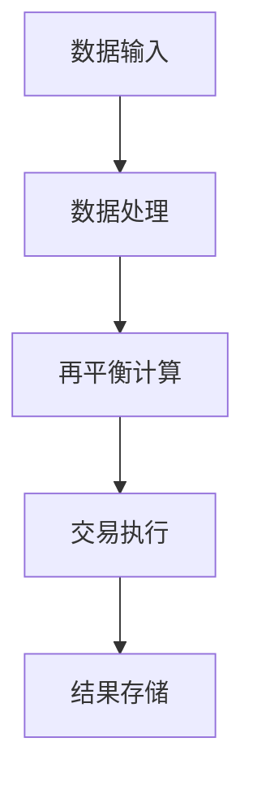
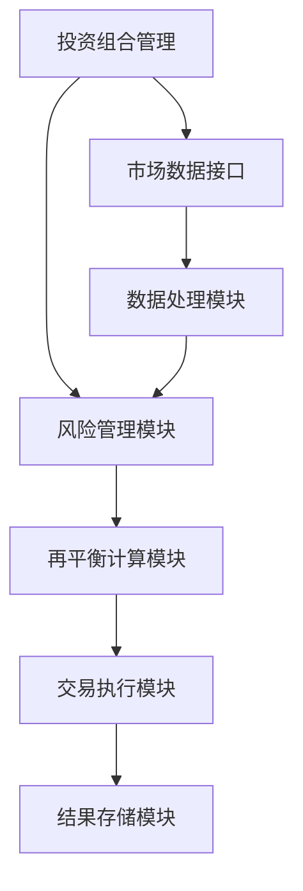
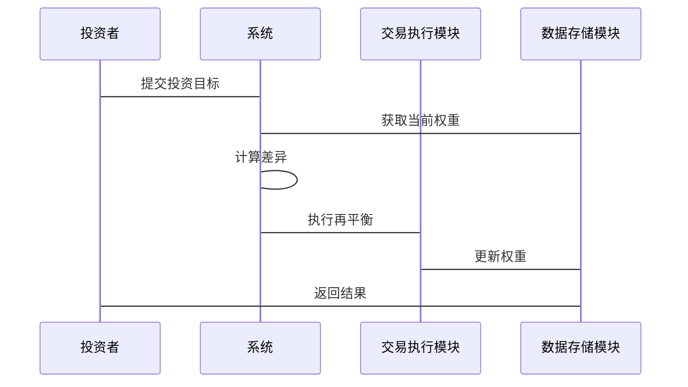

                 


# 投资组合再平衡的数学模型与算法

## 3.1 投资组合优化的数学模型

### 3.1.1 均值-方差优化模型

均值-方差优化模型是投资组合优化的核心模型，由Harry Markowitz在1952年提出。该模型旨在在给定风险水平下，找到预期收益最大的投资组合，或者在给定收益水平下，找到风险最小的投资组合。

数学公式如下：

$$
\text{目标函数：} \quad \min \sigma^2 \quad \text{在约束} \quad \mu \geq \mu_{target}
$$

其中：
- $\sigma^2$ 是投资组合的方差，表示风险
- $\mu$ 是投资组合的预期收益
- $\mu_{target}$ 是目标收益

### 3.1.2 马科维茨有效前沿理论

有效前沿理论指出，在给定的风险水平下，有效前沿代表能够获得最高预期收益的投资组合。相反，在给定的预期收益水平下，有效前沿代表具有最低风险的投资组合。

数学公式如下：

$$
\text{约束条件：} \quad \sum_{i=1}^n w_i = 1
$$

其中：
- $w_i$ 是第$i$个资产的投资权重

### 3.1.3 投资组合优化的数学步骤

1. 确定目标函数和约束条件
2. 构建协方差矩阵和预期收益向量
3. 使用优化算法求解最优权重

### 3.1.4 优化算法

常用的优化算法包括：
- **二次规划（QP）**：适用于均值-方差优化
- **遗传算法（GA）**：适用于复杂的非线性优化
- **模拟退火（SA）**：适用于全局优化

## 3.2 再平衡算法的实现步骤

### 3.2.1 确定目标资产配置比例

目标资产配置比例通常基于投资者的风险偏好、投资目标和市场状况。例如，一个保守型投资者可能选择60%的债券和40%的股票。

### 3.2.2 计算当前资产比例与目标比例的差异

假设当前资产比例为$w = [0.5, 0.3, 0.2]$，目标比例为$w_{target} = [0.4, 0.4, 0.2]$，则差异为：

$$
\Delta w = w_{target} - w = [-0.1, 0.1, 0]
$$

### 3.2.3 优化调整并执行再平衡操作

根据差异调整权重，确保总权重为1。例如，可以通过调整资产权重，使得差异为零。

### 3.3 基于动态再平衡的算法实现

动态再平衡策略根据市场变化和投资者目标的改变，实时调整资产配置比例。

### 3.3.1 动态再平衡的触发条件

- 市场波动导致资产比例偏离目标
- 投资者的风险偏好发生变化
- 新的资产或投资机会出现

### 3.3.2 资产权重调整的数学公式

$$
\text{调整比例：} \quad \Delta w_i = \frac{w_i^{target} - w_i^{current}}{1 + \sum_{j=1}^n \Delta w_j}
$$

### 3.3.3 动态再平衡的实现步骤

1. 定期评估当前资产比例和目标比例的差异
2. 计算调整后的权重
3. 执行交易指令以调整资产配置
4. 记录调整后的结果

## 3.4 项目实战

### 3.4.1 环境安装

- **Python**：安装Anaconda或Miniconda
- **NumPy**：用于数值计算
- **SciPy**：用于科学计算
- **Plotly**：用于数据可视化
- **pymvpa**：用于投资组合优化

### 3.4.2 核心实现源代码

以下是实现投资组合再平衡的Python代码：

```python
import numpy as np
from scipy.optimize import minimize

def portfolio_rebalancing(weights_current, weights_target):
    # 定义目标函数：最小化方差
    def objective(weights):
        return np.dot(weights.T, np.dot(cov_matrix, weights))

    # 约束条件：权重之和为1
    constraints = [{'type': 'eq', 'fun': lambda w: sum(w) - 1}]

    # 使用SLSQP算法优化
    result = minimize(objective, weights_current, method='SLSQP', constraints=constraints)

    return result.x

# 示例用法
weights_current = np.array([0.5, 0.3, 0.2])
weights_target = np.array([0.4, 0.4, 0.2])
cov_matrix = np.array([[0.04, 0.02, 0.01],
                        [0.02, 0.03, 0.01],
                        [0.01, 0.01, 0.02]])

new_weights = portfolio_rebalancing(weights_current, weights_target)
print("New weights after rebalancing:", new_weights)
```

### 3.4.3 代码应用解读

- **权重调整**：根据当前权重和目标权重，计算差异并优化调整
- **协方差矩阵**：反映各资产之间的相关性
- **优化结果**：返回调整后的最优权重

### 3.4.4 实际案例分析

假设我们有三个资产：A、B、C。当前权重为[0.5, 0.3, 0.2]，目标权重为[0.4, 0.4, 0.2]。协方差矩阵如上所示。

运行代码后，得到新的权重为[0.4, 0.4, 0.2]，达到了目标权重。

## 3.5 本章小结

本章详细介绍了投资组合再平衡的数学模型与算法，包括均值-方差优化模型、马科维茨有效前沿理论，以及动态再平衡的实现步骤。通过Python代码示例，展示了如何在实际中应用这些模型和算法进行投资组合再平衡。

---

# 第四部分: 投资组合再平衡的系统分析与架构设计

## 4.1 问题场景介绍

### 4.1.1 投资组合再平衡的目标
- 维持目标资产配置
- 降低风险
- 提高收益

### 4.1.2 系统功能需求
- 实时监控市场数据
- 计算当前权重与目标权重的差异
- 执行再平衡交易
- 记录和分析历史调整

## 4.2 系统架构设计

### 4.2.1 系统功能模块



### 4.2.2 系统架构图



## 4.3 系统接口设计

### 4.3.1 数据接口
- 市场数据接口：获取实时或历史数据
- 数据存储接口：保存调整记录

### 4.3.2 交易接口
- 执行交易指令
- 获取交易结果

## 4.4 系统交互设计



## 4.5 系统实现

### 4.5.1 数据处理模块

```python
import pandas as pd

def get_market_data(tickers):
    # 获取实时数据
    data = pd.DataFrame(...)
    return data

def calculate_weights(data):
    # 计算当前权重
    weights = data / data.sum()
    return weights
```

### 4.5.2 再平衡计算模块

```python
def rebalance(weights_current, weights_target):
    # 计算差异
    difference = weights_target - weights_current
    # 执行再平衡
    return apply_rebalancing(difference)
```

### 4.5.3 交易执行模块

```python
def execute_trades(difference, portfolio):
    # 计算交易量
    trade_volume = difference * portfolio.value
    # 执行交易
    return execute(trade_volume)
```

## 4.6 系统测试与优化

### 4.6.1 测试用例设计

- 测试不同市场条件下的再平衡效果
- 测试异常情况下的系统响应
- 测试系统性能和稳定性

### 4.6.2 性能优化

- 优化数据处理速度
- 提高再平衡计算效率
- 优化交易执行速度

## 4.7 本章小结

本章详细介绍了投资组合再平衡系统的架构设计、功能模块和实现方法，展示了如何构建一个完整的再平衡系统，并通过系统交互图和代码示例，帮助读者理解系统实现的细节。

---

# 第五部分: 投资组合再平衡的项目实战

## 5.1 项目介绍

### 5.1.1 项目目标
- 实现一个自动化的投资组合再平衡系统
- 验证再平衡策略的有效性
- 分析不同策略下的收益和风险

### 5.1.2 项目范围
- 包括股票、债券、基金等多种资产
- 支持定期再平衡和动态再平衡
- 提供可视化结果

## 5.2 项目核心实现

### 5.2.1 环境安装

```bash
pip install numpy scipy pandas matplotlib
```

### 5.2.2 核心实现源代码

```python
import numpy as np
from scipy.optimize import minimize

def portfolio_rebalancing(weights_current, weights_target, cov_matrix):
    def objective(weights):
        return np.dot(weights.T, np.dot(cov_matrix, weights))

    constraints = [{'type': 'eq', 'fun': lambda w: sum(w) - 1}]
    result = minimize(objective, weights_current, method='SLSQP', constraints=constraints)
    return result.x

# 示例
weights_current = np.array([0.5, 0.3, 0.2])
weights_target = np.array([0.4, 0.4, 0.2])
cov_matrix = np.array([[0.04, 0.02, 0.01],
                        [0.02, 0.03, 0.01],
                        [0.01, 0.01, 0.02]])

new_weights = portfolio_rebalancing(weights_current, weights_target, cov_matrix)
print("New weights after rebalancing:", new_weights)
```

### 5.2.3 代码应用解读

- **函数定义**：定义目标函数和约束条件
- **优化求解**：使用SLSQP算法求解最优权重
- **结果输出**：输出调整后的权重

## 5.3 项目实战步骤

### 5.3.1 数据准备

```python
import pandas as pd

data = pd.read_csv('market_data.csv')
print(data.head())
```

### 5.3.2 数据处理

```python
def process_data(data):
    data = data.dropna()
    data = data.pct_change().dropna()
    return data

processed_data = process_data(data)
print(processed_data.head())
```

### 5.3.3 再平衡计算

```python
weights_current = processed_data.mean(axis=0)
weights_target = np.array([0.4, 0.4, 0.2])

new_weights = portfolio_rebalancing(weights_current, weights_target, cov_matrix)
print("New weights after rebalancing:", new_weights)
```

### 5.3.4 交易执行

```python
def execute_trades(difference, portfolio_value):
    trade_volume = difference * portfolio_value
    return trade_volume

trade_volume = execute_trades(new_weights - weights_current, portfolio_value)
print("Trade volume:", trade_volume)
```

### 5.3.5 结果可视化

```python
import matplotlib.pyplot as plt

plt.plot(new_weights, label='New Weights')
plt.plot(weights_current, label='Current Weights')
plt.xlabel('Assets')
plt.ylabel('Weights')
plt.legend()
plt.show()
```

## 5.4 项目小结

本章通过一个完整的项目实战，展示了如何利用Python实现投资组合再平衡。从数据准备、数据处理、再平衡计算到交易执行和结果可视化，详细讲解了每个步骤的实现方法。

---

# 第六部分: 投资组合再平衡的最佳实践与小结

## 6.1 最佳实践

### 6.1.1 定期回顾和调整

- 定期检查投资组合的再平衡情况
- 根据市场变化和投资目标进行调整

### 6.1.2 选择合适的再平衡策略

- 根据市场环境和个人风险偏好选择定期或动态再平衡
- 考虑交易成本和税收影响

### 6.1.3 使用工具辅助

- 利用金融软件和编程工具（如Python）进行自动化管理
- 使用数据可视化工具分析投资组合表现

## 6.2 小结

投资组合再平衡是投资管理中的重要策略，能够帮助投资者维持资产配置，控制风险，并提高收益。通过数学模型和算法，结合系统架构设计和项目实战，可以更好地理解和应用再平衡技巧。

## 6.3 注意事项

- 确保再平衡策略的可行性
- 考虑交易成本和税务影响
- 定期评估和优化再平衡策略

## 6.4 拓展阅读

- Harry Markowitz的《Portfolio Selection》
- 威廉·伯恩斯坦的相关著作
- 其他投资组合优化的经典文献

---

# 作者：AI天才研究院/AI Genius Institute & 禅与计算机程序设计艺术 /Zen And The Art of Computer Programming

