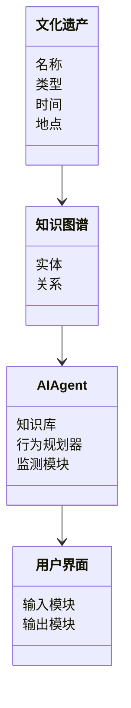
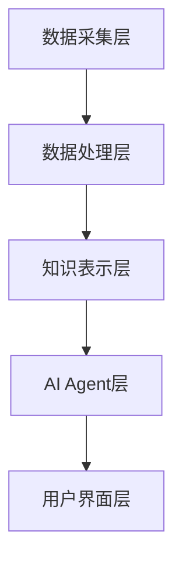
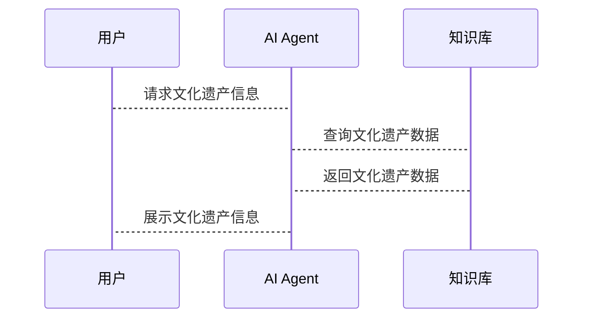

                 


# 实现基于AI Agent的智能文化遗产保护系统

> 关键词：AI Agent, 文化遗产保护, 智能系统, 知识图谱, 强化学习, 自然语言处理

> 摘要：本文将探讨如何利用AI Agent技术构建智能文化遗产保护系统。通过分析文化遗产保护的背景与挑战，介绍AI Agent的基本概念与核心原理，详细阐述系统的数学模型与算法，设计系统的整体架构，并通过项目实战展示系统的实现过程。最后，将总结系统的最佳实践与未来发展方向。

---

# 第一部分: 基于AI Agent的智能文化遗产保护系统概述

## 第1章: 文化遗产保护的背景与挑战

### 1.1 文化遗产保护的重要性

#### 1.1.1 文化遗产的定义与价值

文化遗产是指人类在历史上创造的物质和非物质财富，包括建筑、艺术品、历史文献等。这些遗产不仅是人类文明的见证，也是未来发展的宝贵资源。文化遗产的保护对于维护文化多样性、传承历史记忆以及促进经济发展具有重要意义。

#### 1.1.2 当前文化遗产保护的主要挑战

尽管文化遗产的重要性不言而喻，但在实际保护过程中仍然面临诸多挑战：

1. **技术局限性**：传统的文化遗产保护手段依赖人工操作，效率低下且难以覆盖大规模数据。
2. **资源有限性**：文化遗产的数量庞大，而保护资源（如人力、资金）有限，难以实现全面保护。
3. **环境变化**：自然环境的变化（如气候变化、自然灾害）对文化遗产造成威胁。
4. **人为破坏**：文化遗产可能因战争、盗窃或非法开发而受到破坏。

#### 1.1.3 AI技术在文化遗产保护中的潜力

人工智能（AI）技术的快速发展为文化遗产保护提供了新的可能性。AI可以通过自动化处理、数据分析和智能决策帮助解决上述挑战。例如：

- **自动化监测**：利用AI实时监测文化遗产的状态，及时发现潜在风险。
- **智能修复**：通过AI算法模拟历史环境，辅助修复人员进行精准修复。
- **数字化保护**：利用3D建模、图像识别等技术对文化遗产进行数字化存档，便于长期保护和传播。

### 1.2 AI Agent的基本概念

#### 1.2.1 什么是AI Agent

AI Agent（智能体）是指能够感知环境并采取行动以实现特定目标的实体。AI Agent可以是软件程序，也可以是硬件设备，其核心特征包括：

1. **自主性**：能够自主决策，无需外部干预。
2. **反应性**：能够实时感知环境并做出反应。
3. **目标导向**：所有行动都以实现特定目标为导向。

#### 1.2.2 AI Agent的核心特征

- **知识表示**：AI Agent需要通过知识表示技术来理解和处理复杂信息。
- **推理能力**：能够根据已有知识进行逻辑推理，推导出新的结论。
- **行为规划**：能够根据目标制定行动计划并执行。
- **人机交互**：能够与人类或其他系统进行有效沟通与协作。

#### 1.2.3 AI Agent与传统AI的区别

传统AI主要依赖规则和模式匹配来完成任务，而AI Agent则更加注重自主性和目标导向。传统AI通常是静态的，而AI Agent能够动态适应环境变化，并根据目标调整行为。

### 1.3 基于AI Agent的智能文化遗产保护系统

#### 1.3.1 系统的目标与意义

智能文化遗产保护系统的目标是通过AI Agent技术实现文化遗产的智能化保护与管理。具体目标包括：

1. 实现文化遗产的实时监测与预警。
2. 提供智能化的保护策略与修复方案。
3. 促进文化遗产的数字化传播与教育。

#### 1.3.2 系统的总体架构

智能文化遗产保护系统的总体架构包括以下几个部分：

1. **数据采集模块**：负责收集文化遗产的相关数据，如图像、文本、环境参数等。
2. **知识库模块**：存储文化遗产的数字化信息，如知识图谱、历史文献等。
3. **AI Agent模块**：负责系统的自主决策与行动，包括监测、修复、交互等功能。
4. **用户界面模块**：提供人机交互界面，方便用户与系统进行互动。

#### 1.3.3 系统的核心功能模块

- **监测模块**：实时监测文化遗产的状态，发现潜在风险并发出预警。
- **修复模块**：根据监测结果生成修复方案，并指导修复人员进行操作。
- **传播模块**：通过数字化手段传播文化遗产信息，促进文化传承。

---

## 第2章: AI Agent与文化遗产保护的核心概念

### 2.1 AI Agent的基本原理

#### 2.1.1 知识表示与推理

知识表示是AI Agent的核心技术之一。常用的知识表示方法包括：

1. **逻辑表示**：使用谓词逻辑表示知识，如“ isa（长城，建筑）”。
2. **知识图谱**：通过图结构表示实体及其关系，如“长城 - 建造于 明朝”。
3. **概率表示**：使用概率模型表示不确定知识，如“下雨的概率为80%”。

逻辑推理是AI Agent根据已有知识推导新结论的过程。常用的推理方法包括：

1. **演绎推理**：从一般到具体的推理，如“所有鸟都会飞，因此鸽子会飞”。
2. **归纳推理**：从具体到一般的推理，如“观察到多次下雨后打雷，推断下雨会打雷”。
3. **概率推理**：基于概率模型进行推理，如“如果下雨的概率为80%，则下雨的可能性较大”。

#### 2.1.2 行为规划与决策

行为规划是AI Agent根据目标制定行动计划的过程。常用的规划方法包括：

1. **基于规则的规划**：根据预定义的规则生成行动计划。
2. **基于逻辑的规划**：通过逻辑推理生成行动计划。
3. **基于强化学习的规划**：通过强化学习优化行动策略。

#### 2.1.3 人机交互与协作

人机交互是AI Agent与人类或其他系统进行沟通的过程。常用的交互方式包括：

1. **自然语言交互**：通过对话理解用户需求，如“请告诉我如何保护古建筑”。
2. **图形界面交互**：通过可视化界面与用户进行互动，如点击按钮触发操作。
3. **多模态交互**：结合多种交互方式，如语音、图像、文本等。

### 2.2 文化遗产保护中的关键问题

#### 2.2.1 文化遗产的数字化与建模

数字化是文化遗产保护的基础工作。通过3D建模、图像识别等技术，可以将文化遗产转化为数字形式，便于长期保存和传播。例如，可以通过3D扫描技术对古建筑进行建模，生成数字档案。

#### 2.2.2 文化遗产的保护与修复

文化遗产的保护与修复需要结合历史信息和现代技术。AI Agent可以通过分析历史文献和环境数据，制定最优的修复方案。例如，AI Agent可以根据古建筑的历史照片和当前状态，生成修复建议。

#### 2.2.3 文化遗产的传播与教育

文化遗产的传播与教育是文化遗产保护的重要组成部分。通过数字化手段，可以将文化遗产以多种形式传播给公众。例如，可以通过虚拟现实技术让用户“亲身体验”古代建筑的建造过程。

### 2.3 基于AI Agent的解决方案

#### 2.3.1 知识图谱构建与应用

知识图谱是一种结构化的知识表示方法，广泛应用于AI Agent中。通过构建文化遗产的知识图谱，可以实现文化遗产的语义理解与推理。例如，可以通过知识图谱关联“长城”与“明朝”的关系，推断出“长城建造于明朝”。

#### 2.3.2 自动化保护与修复策略

AI Agent可以通过行为规划技术制定自动化保护策略。例如，AI Agent可以根据环境监测数据，自动触发保护措施，如在检测到地震风险时，启动应急保护机制。

#### 2.3.3 智能交互与用户教育

通过人机交互技术，AI Agent可以与用户进行自然对话，提供文化遗产的相关信息。例如，用户可以询问“这幅画的历史背景是什么？”，AI Agent可以根据知识图谱生成回答。

---

## 第3章: 基于AI Agent的文化遗产保护系统的数学模型与算法原理

### 3.1 知识表示与推理的数学模型

#### 3.1.1 知识图谱的构建与表示

知识图谱的构建涉及实体识别、关系抽取等自然语言处理技术。常用的构建流程包括：

1. **文本预处理**：对文化遗产相关的文本进行分词、去停用词等处理。
2. **实体识别**：识别文本中的实体，如“长城”、“明朝”等。
3. **关系抽取**：识别实体之间的关系，如“长城建造于明朝”。
4. **知识融合**：将抽取的关系和实体整合成知识图谱。

知识图谱的表示可以使用图论中的图结构，节点表示实体，边表示关系。

#### 3.1.2 逻辑推理的数学基础

逻辑推理是AI Agent的核心能力之一。常用的逻辑推理方法包括：

1. **谓词逻辑**：通过谓词和量词表示知识，如“所有鸟都会飞”可以表示为∀x（鸟(x) → 飞(x)）。
2. **命题逻辑**：通过命题和逻辑连接词表示知识，如“如果下雨，则地湿”可以表示为雨 → 地湿。
3. **模态逻辑**：通过模态词表示可能性、必然性等，如“可能下雨”可以表示为□雨。

#### 3.1.3 概率推理与不确定性处理

在实际应用中，文化遗产保护涉及许多不确定性因素，如环境变化、数据缺失等。概率推理是处理不确定性的重要方法。常用的概率推理方法包括：

1. **贝叶斯网络**：通过概率分布和条件概率建模不确定性。
2. **马尔可夫链**：通过状态转移建模动态系统。
3. ** Dempster-Shafer 理论**：通过信任函数处理不确定性。

### 3.2 行为规划与决策的算法

#### 3.2.1 基于强化学习的决策算法

强化学习是一种通过试错机制优化决策策略的方法。在文化遗产保护中，强化学习可以应用于保护策略的优化。例如，AI Agent可以通过强化学习选择最优的保护措施。

##### 强化学习的基本流程

1. **状态表示**：将文化遗产的状态表示为一个向量，如“损坏程度”、“环境条件”等。
2. **动作选择**：AI Agent根据当前状态选择一个动作，如“修复”、“监测”等。
3. **奖励机制**：根据动作的结果给予奖励或惩罚，如“成功修复”给予正奖励，“修复失败”给予负奖励。
4. **策略优化**：通过更新策略参数，使奖励最大化。

##### 强化学习的数学模型

强化学习的核心是通过优化目标函数来更新策略参数。常用的强化学习算法包括Q-learning和Deep Q-Network（DQN）。

##### Q-learning算法

Q-learning是一种基于值函数的强化学习算法。其目标是找到最优策略，使累计奖励最大化。Q-learning的更新公式为：

$$ Q(s, a) = Q(s, a) + \alpha [r + \gamma \max Q(s', a') - Q(s, a)] $$

其中，$\alpha$是学习率，$\gamma$是折扣因子，$r$是奖励，$s$是当前状态，$a$是当前动作，$s'$是下一步状态。

##### DQN算法

DQN是一种基于深度学习的强化学习算法。其核心是使用神经网络近似值函数，将状态空间映射到动作空间。DQN的网络结构包括两个部分：策略网络和价值网络。

### 3.3 自然语言处理技术

#### 3.3.1 语义理解与知识提取

自然语言处理（NLP）技术在文化遗产保护中主要用于语义理解与知识提取。例如，可以通过NLP技术从历史文献中提取实体、事件等信息，构建知识图谱。

#### 3.3.2 基于Transformer的模型

Transformer模型是一种基于自注意力机制的深度学习模型，广泛应用于NLP任务。在文化遗产保护中，可以使用Transformer模型进行文本生成、语义理解等任务。例如，可以通过Transformer模型生成文化遗产的描述文本。

##### Transformer模型的基本结构

Transformer模型由编码器和解码器两部分组成。编码器负责将输入文本映射到一个固定长度的向量，解码器负责根据编码器的输出生成目标文本。

##### 自注意力机制

自注意力机制是Transformer模型的核心。其基本公式为：

$$ \text{Attention}(Q, K, V) = \text{softmax}\left(\frac{QK^T}{\sqrt{d_k}}\right)V $$

其中，$Q$是查询向量，$K$是键向量，$V$是值向量，$d_k$是向量维度。

---

## 第4章: 系统分析与架构设计方案

### 4.1 系统功能设计

#### 4.1.1 领域模型设计

领域模型是文化遗产保护系统的核心部分。通过领域模型可以明确系统的功能模块及其之间的关系。

##### 领域模型的类图

以下是一个简化的领域模型类图，展示了系统中的主要实体及其关系：



#### 4.1.2 系统架构设计

系统的整体架构设计如下：

1. **数据采集层**：负责采集文化遗产的相关数据，如图像、文本、环境参数等。
2. **数据处理层**：对采集的数据进行预处理、特征提取等操作。
3. **知识表示层**：将处理后的数据转化为知识图谱，构建文化遗产的知识库。
4. **AI Agent层**：基于知识图谱进行推理、规划和决策，实现文化遗产的保护与修复。
5. **用户界面层**：提供人机交互界面，方便用户与系统进行互动。

##### 系统架构图

以下是一个简化的系统架构图：



#### 4.1.3 系统接口设计

系统接口设计需要考虑模块之间的交互方式。例如，数据采集模块需要与知识表示模块进行数据交互，AI Agent模块需要与用户界面模块进行信息展示与反馈。

##### 接口交互流程

以下是一个简化的接口交互流程：



---

## 第5章: 项目实战

### 5.1 环境安装与配置

#### 5.1.1 安装Python环境

首先需要安装Python环境，推荐使用Anaconda。安装步骤如下：

1. 下载并安装Anaconda：[https://www.anaconda.com](https://www.anaconda.com)
2. 配置环境变量，确保可以使用conda命令。

#### 5.1.2 安装必要的库

安装以下库：

```bash
pip install numpy
pip install pandas
pip install matplotlib
pip install networkx
pip install transformers
```

### 5.2 系统核心实现

#### 5.2.1 知识图谱构建代码

以下是一个简单的知识图谱构建代码示例：

```python
import networkx as nx

# 创建知识图谱
G = nx.DiGraph()

# 添加节点
G.add_node("长城")
G.add_node("明朝")
G.add_node("建筑")

# 添加边
G.add_edge("长城", "建筑")
G.add_edge("长城", "明朝")

# 可视化
nx.draw(G, with_labels=True, edge_labels=True)
plt.show()
```

#### 5.2.2 强化学习算法实现

以下是一个基于Q-learning的强化学习算法实现代码示例：

```python
import numpy as np

# 初始化参数
learning_rate = 0.1
gamma = 0.9
epsilon = 0.1

# 状态空间和动作空间
state_space = 5
action_space = 3

# Q表初始化
Q = np.zeros((state_space, action_space))

# 训练过程
for episode in range(1000):
    state = env.reset()
    done = False
    while not done:
        # 选择动作
        if np.random.random() < epsilon:
            action = np.random.randint(action_space)
        else:
            action = np.argmax(Q[state])
        
        # 执行动作并获得奖励
        next_state, reward, done = env.step(action)
        
        # 更新Q表
        Q[state][action] = Q[state][action] + learning_rate * (reward + gamma * np.max(Q[next_state]) - Q[state][action])
        
        # 探索率衰减
        epsilon = max(epsilon * 0.99, 0.01)
```

### 5.3 代码应用解读与分析

#### 5.3.1 知识图谱构建代码解读

上述代码使用了networkx库构建了一个简单的知识图谱，节点包括“长城”、“明朝”、“建筑”，边表示“长城属于建筑”和“长城属于明朝”。通过networkx的draw函数可以将图谱可视化。

#### 5.3.2 强化学习算法实现解读

上述代码实现了一个基于Q-learning的强化学习算法。Q表用于存储状态-动作对的值，通过不断更新Q表使奖励最大化。训练过程包括状态初始化、动作选择、奖励获得和Q表更新。

---

## 第6章: 最佳实践与总结

### 6.1 最佳实践

1. **数据质量**：确保文化遗产数据的准确性和完整性，数据质量直接影响系统性能。
2. **模型优化**：根据实际需求优化AI Agent的算法参数，提高系统的决策能力。
3. **人机协作**：AI Agent与人类专家的协作可以显著提高文化遗产保护的效果。
4. **系统维护**：定期更新系统知识库，适应新的文化遗产保护需求。

### 6.2 小结

基于AI Agent的智能文化遗产保护系统通过结合人工智能技术与文化遗产保护需求，实现了文化遗产的智能化保护与管理。本文详细探讨了系统的背景、核心概念、算法原理、系统架构和项目实战，为文化遗产保护提供了新的思路和方法。

### 6.3 注意事项

- **数据隐私**：文化遗产数据可能涉及敏感信息，需要注意数据隐私保护。
- **系统稳定性**：AI Agent系统的稳定性直接影响文化遗产保护的效果，需要进行充分的测试和优化。
- **多学科协作**：文化遗产保护涉及多个学科领域，需要多学科专家的协作。

### 6.4 拓展阅读

- **强化学习**：深入学习强化学习的原理与应用，了解最新的研究成果。
- **知识图谱**：研究知识图谱的构建与应用，探索更先进的知识表示方法。
- **自然语言处理**：学习自然语言处理技术，了解其在文化遗产保护中的更多应用。

---

# 作者：AI天才研究院/AI Genius Institute & 禅与计算机程序设计艺术 /Zen And The Art of Computer Programming

