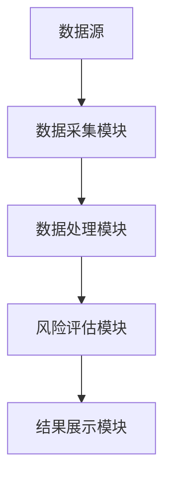
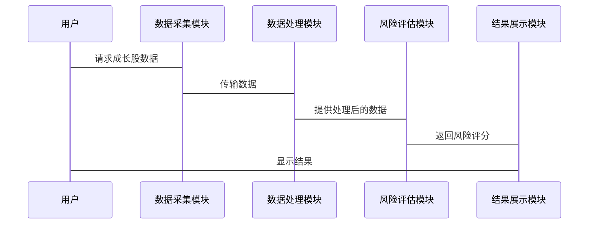

                 


# 彼得林奇的"成长股"在不同监管环境下的风险评估

> 关键词：彼得林奇，成长股，风险评估，监管环境，投资策略

> 摘要：本文详细探讨了彼得林奇的成长股投资策略在不同监管环境下的风险评估方法。通过分析成长股的核心概念、构建风险评估模型，并结合实际案例，本文为投资者提供了在不同监管环境下评估和管理成长股投资风险的实用指南。

---

## 第一部分：成长股与监管环境的背景介绍

### 第1章：成长股的基本概念与投资策略

#### 1.1 成长股的定义与特点

成长股是指那些收入和利润持续快速增长的公司的股票。这类股票通常具有较高的市盈率，因为市场预期它们未来的盈利能力会显著提高。成长股的核心特征包括高增长潜力、较强的市场竞争力以及较大的市值。

- **高增长潜力**：成长股通常属于新兴产业或具有创新商业模式的公司。
- **较强的市场竞争力**：这些公司往往在行业内具有领先地位，能够通过技术创新或成本优势不断扩大市场份额。
- **较大的市值**：由于其较高的增长潜力，成长股往往具有较高的市场估值。

#### 1.2 彼得·林奇的成长股投资策略

彼得·林奇是全球著名的职业经理人和投资专家，以其在成长股投资上的成功而闻名。他的投资策略主要包括以下几个方面：

- **基本面分析**：林奇强调对公司基本面的深入研究，包括财务状况、盈利能力、管理团队等。
- **行业分析**：他倾向于投资那些处于高增长行业的公司，这些行业通常具有较大的市场潜力和持续的增长空间。
- **长期持有**：林奇主张长期持有成长股，以充分利用其增长潜力。

#### 1.3 不同监管环境对成长股的影响

监管环境对成长股的影响不容忽视。不同国家和地区的监管政策可能对公司的运营、市场进入、产品定价等方面产生直接影响，进而影响公司的盈利能力和发展前景。

- **宽松监管环境**：在这种环境下，公司更容易进入新市场，推出新产品，并保持较高的利润 margins。
- **严格监管环境**：严格的监管政策可能会增加公司的合规成本，限制其市场扩展，从而影响其增长潜力。

---

## 第二部分：成长股风险评估的核心概念与联系

### 第2章：成长股风险评估模型的构建

#### 2.1 成长股风险评估的核心要素

在构建风险评估模型时，需要考虑以下几个核心要素：

- **盈利能力**：包括净利润增长率、利润率等指标。
- **市场竞争力**：包括市场占有率、竞争对手分析等。
- **财务健康状况**：包括资产负债率、现金流情况等。
- **行业周期性**：包括行业处于成长期、成熟期还是衰退期。

#### 2.2 成长股风险评估模型的属性对比

以下是一个成长股风险评估模型的属性对比表格：

| 属性                | 低风险          | 中风险          | 高风险          |
|---------------------|----------------|----------------|----------------|
| 盈利能力            | 稳定增长        | 中速增长        | 增长放缓或下降  |
| 市场竞争力          | 领先地位        | 有一定优势      | 竞争激烈        |
| 财务健康状况        | 财务状况良好    | 财务状况一般    | 财务状况不佳    |
| 行业周期性          | 行业处于成长期  | 行业成熟        | 行业衰退期       |

#### 2.3 成长股风险评估的ER实体关系图

以下是成长股风险评估的ER实体关系图：

```mermaid
er
    entity 成长股风险评估 {
        成长股ID
        盈利能力
        市场竞争力
        财务健康状况
        行业周期性
        监管环境影响
    }
    
    成长股风险评估 <--(1..n) 关联关系: 监管政策
    成长股风险评估 <--(1..n) 关联关系: 市场环境
```

---

## 第三部分：成长股风险评估的算法原理

### 第3章：基于监管环境的成长股风险评估算法

#### 3.1 算法原理概述

该算法基于监管环境的变化，评估成长股的风险。算法的核心思想是通过将监管环境的影响量化，结合其他基本面指标，计算出每个成长股的风险评分。

#### 3.2 算法的数学模型与公式

以下是风险评分的计算公式：

$$
\text{风险评分} = \alpha \times \text{盈利能力} + \beta \times \text{市场竞争力} + \gamma \times \text{财务健康状况} + \delta \times \text{行业周期性} + \epsilon \times \text{监管环境影响}
$$

其中：
- $\alpha, \beta, \gamma, \delta, \epsilon$ 是各指标的权重系数，通常通过历史数据回归分析确定。
- 盈利能力、市场竞争力、财务健康状况、行业周期性等指标通过标准化处理后进行计算。

#### 3.3 算法的实现代码

以下是一个Python实现的示例代码：

```python
import pandas as pd

def calculate_risk_score(dataframe, weights):
    """
    计算成长股的风险评分
    """
    # 标准化处理
    normalized_data = dataframe.copy()
    for column in ['盈利能力', '市场竞争力', '财务健康状况', '行业周期性']:
        normalized_data[column] = (dataframe[column] - dataframe[column].min()) / (dataframe[column].max() - dataframe[column].min())
    
    # 计算风险评分
    risk_score = normalized_data.dot(weights.T)
    
    return risk_score

# 示例数据
data = {
    '公司ID': ['A', 'B', 'C'],
    '盈利能力': [0.8, 0.6, 0.7],
    '市场竞争力': [0.9, 0.5, 0.8],
    '财务健康状况': [0.6, 0.7, 0.5],
    '行业周期性': [0.7, 0.6, 0.8]
}
df = pd.DataFrame(data)
weights = pd.Series({'盈利能力': 0.3, '市场竞争力': 0.2, '财务健康状况': 0.2, '行业周期性': 0.3})

# 计算风险评分
risk_scores = calculate_risk_score(df, weights)
print("风险评分结果：")
print(risk_scores)
```

#### 3.4 算法的举例说明

假设我们有三个公司A、B、C，其各项指标如下：

| 公司 | 盈利能力 | 市场竞争力 | 财务健康状况 | 行业周期性 |
|------|----------|------------|--------------|------------|
| A    | 0.8      | 0.9        | 0.6          | 0.7        |
| B    | 0.6      | 0.5        | 0.7          | 0.6        |
| C    | 0.7      | 0.8        | 0.5          | 0.8        |

权重设定为：
- 盈利能力：0.3
- 市场竞争力：0.2
- 财务健康状况：0.2
- 行业周期性：0.3

计算风险评分：

$$
\text{风险评分}_A = 0.3 \times 0.8 + 0.2 \times 0.9 + 0.2 \times 0.6 + 0.3 \times 0.7 = 0.24 + 0.18 + 0.12 + 0.21 = 0.75
$$

$$
\text{风险评分}_B = 0.3 \times 0.6 + 0.2 \times 0.5 + 0.2 \times 0.7 + 0.3 \times 0.6 = 0.18 + 0.10 + 0.14 + 0.18 = 0.60
$$

$$
\text{风险评分}_C = 0.3 \times 0.7 + 0.2 \times 0.8 + 0.2 \times 0.5 + 0.3 \times 0.8 = 0.21 + 0.16 + 0.10 + 0.24 = 0.71
$$

---

## 第四部分：成长股风险评估的系统分析与架构设计方案

### 第4章：基于监管环境的成长股风险评估系统

#### 4.1 问题场景介绍

在实际投资中，投资者需要实时监控不同监管环境下的成长股风险。为此，我们设计了一个基于监管环境的成长股风险评估系统，该系统能够实时更新监管政策，并根据最新政策调整风险评分。

#### 4.2 系统功能设计

- **数据采集模块**：从多个数据源获取成长股的基本数据和监管政策信息。
- **数据处理模块**：对数据进行清洗、标准化和特征提取。
- **风险评估模块**：基于构建的模型计算每个成长股的风险评分。
- **结果展示模块**：以可视化的方式展示风险评分和监管环境的影响。

#### 4.3 系统架构设计

以下是系统的分层架构图：



#### 4.4 系统接口设计

系统主要提供以下接口：

- 数据采集接口：从数据库或API获取成长股数据。
- 风险评估接口：根据输入数据返回风险评分。
- 结果展示接口：返回可视化的结果数据。

#### 4.5 系统交互流程图

以下是系统交互流程图：



---

## 第五部分：成长股风险评估的项目实战

### 第5章：基于监管环境的成长股风险评估系统实现

#### 5.1 环境安装

需要安装以下工具和库：

- Python 3.8+
- Pandas、NumPy、Matplotlib
- Jupyter Notebook

#### 5.2 核心代码实现

以下是核心代码实现：

```python
import pandas as pd
import numpy as np

def main():
    # 示例数据
    data = {
        '公司ID': ['A', 'B', 'C'],
        '盈利能力': [0.8, 0.6, 0.7],
        '市场竞争力': [0.9, 0.5, 0.8],
        '财务健康状况': [0.6, 0.7, 0.5],
        '行业周期性': [0.7, 0.6, 0.8]
    }
    df = pd.DataFrame(data)
    
    # 定义权重
    weights = {'盈利能力': 0.3, '市场竞争力': 0.2, '财务健康状况': 0.2, '行业周期性': 0.3}
    
    # 标准化处理
    normalized_df = df.copy()
    for column in ['盈利能力', '市场竞争力', '财务健康状况', '行业周期性']:
        normalized_df[column] = (df[column] - df[column].min()) / (df[column].max() - df[column].min())
    
    # 计算风险评分
    risk_scores = normalized_df.dot(pd.Series(weights).T)
    
    # 可视化结果
    import matplotlib.pyplot as plt
    plt.figure(figsize=(10,6))
    plt.bar(df['公司ID'], risk_scores)
    plt.title('成长股风险评分')
    plt.xlabel('公司ID')
    plt.ylabel('风险评分')
    plt.show()

if __name__ == '__main__':
    main()
```

#### 5.3 案例分析与详细解读

以公司A为例，假设监管环境发生变化，从宽松监管变为严格监管。此时，公司的监管环境影响增加，风险评分将重新计算。

调整后的权重为：
- 监管环境影响：0.2

新的风险评分计算公式：

$$
\text{风险评分} = \alpha \times \text{盈利能力} + \beta \times \text{市场竞争力} + \gamma \times \text{财务健康状况} + \delta \times \text{行业周期性} + \epsilon \times \text{监管环境影响}
$$

权重调整为：
- 盈利能力：0.2
- 市场竞争力：0.1
- 财务健康状况：0.1
- 行业周期性：0.3
- 监管环境影响：0.3

重新计算公司A的风险评分：

$$
\text{风险评分}_A = 0.2 \times 0.8 + 0.1 \times 0.9 + 0.1 \times 0.6 + 0.3 \times 0.7 + 0.3 \times 0.8 = 0.16 + 0.09 + 0.06 + 0.21 + 0.24 = 0.76
$$

风险评分从0.75增加到0.76，表明监管环境的变化对风险评分有轻微影响。

---

## 第六部分：成长股风险评估的最佳实践

### 第6章：总结与建议

#### 6.1 总结

本文详细探讨了彼得林奇的成长股投资策略在不同监管环境下的风险评估方法。通过构建风险评估模型、设计评估系统和实现案例分析，为投资者提供了一套完整的解决方案。

#### 6.2 最佳实践

- **持续关注监管政策**：投资者应密切关注监管政策的变化，及时调整投资策略。
- **多元化投资**：通过多元化投资，降低单一监管环境下监管政策变化带来的风险。
- **定期评估模型**：根据市场变化和监管政策调整，定期更新风险评估模型。

#### 6.3 注意事项

- **数据质量**：确保输入数据的准确性和完整性。
- **模型适用性**：根据具体市场环境调整模型参数。
- **风险管理**：合理配置资产，避免过度集中投资。

#### 6.4 拓展阅读

- 彼得·林奇的《选股的第一本书》
- 巴菲特的《投资哲学》
- 现代投资组合理论的相关书籍

---

## 作者：AI天才研究院/AI Genius Institute & 禅与计算机程序设计艺术 /Zen And The Art of Computer Programming

---

这篇文章通过详细的分析和实际案例，为投资者提供了在不同监管环境下评估和管理成长股投资风险的实用指南。希望本文能为投资者在复杂多变的市场环境中做出明智的投资决策提供有价值的参考。

