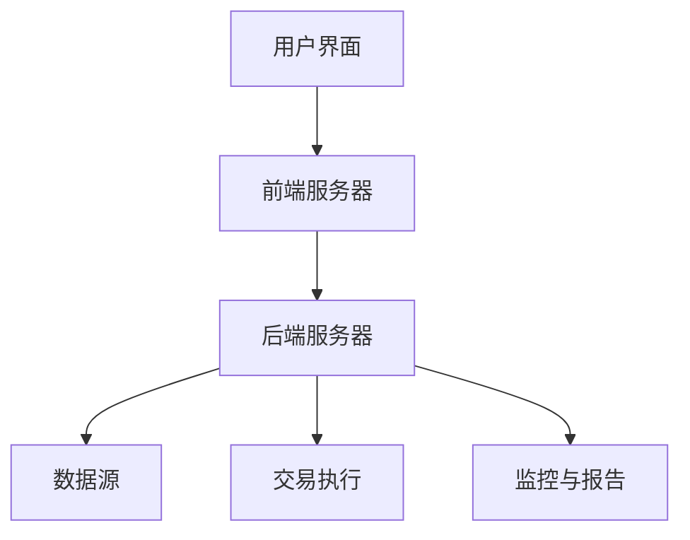
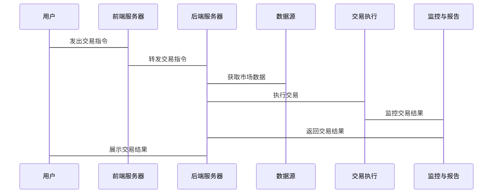

                 


# 格雷厄姆特价股票策略在高频交易环境下的适应性研究

## 关键词：格雷厄姆策略，高频交易，股票投资，价值投资，算法交易

## 摘要：本文探讨了格雷厄姆价值投资策略在高频交易环境下的适应性，分析了其核心理念与高频交易的特点，提出了优化策略的方法，并通过数学模型和系统架构设计，展示了如何在高频交易中应用和实现格雷厄姆策略，为投资者提供了新的思路。

---

# 第一部分: 格雷厄姆特价股票策略的背景与基础

## 第1章: 格雷厄姆特价股票策略概述

### 1.1 格雷厄姆投资理念的核心思想

#### 1.1.1 价值投资的基本概念
- **价值投资**：寻找市场价格低于其内在价值的股票进行投资。
- **内在价值**：基于公司基本面分析（如盈利、资产、现金流等）计算出的股票合理价格。
- **安全边际**：买入价格低于内在价值，以降低投资风险。

#### 1.1.2 格雷厄姆的"安全边际"理论
- **安全边际**：买入价格与内在价值的差距，提供保护以避免市场波动带来的损失。
- **公式**：安全边际 = 内在价值 - 市场价格
- **案例**：某股票内在价值为 $50，市场价格为 $40，安全边际为 $10。

#### 1.1.3 特价股票的定义与筛选标准
- **特价股票**：市场价格远低于内在价值的股票。
- **筛选标准**：低市盈率（P/E）、低市净率（P/B）、高股息率等。

### 1.2 高频交易环境的特点

#### 1.2.1 高频交易的基本概念
- **高频交易**：利用算法在极短时间内进行大量交易，通常在 milliseconds 级别完成。
- **算法交易**：使用数学模型和算法自动决策交易行为。
- **低延迟**：交易系统必须在极短时间内完成数据处理和交易执行。

#### 1.2.2 高频交易的技术与算法
- **技术特点**：
  - 高速数据处理：实时处理市场数据。
  - 自动化决策：基于算法快速做出买卖决策。
  - 高频执行：短时间内多次交易。
- **常见算法**：
  - 市场微结构分析：利用订单簿信息进行交易决策。
  - 统计套利：基于价格差异进行无风险或低风险套利。

#### 1.2.3 高频交易与传统投资策略的区别
- **交易频率**：高频交易强调速度和频率，传统投资注重长期持有。
- **决策依据**：高频交易依赖算法和短期数据，传统投资基于基本面分析。
- **风险敞口**：高频交易风险较低但收益不稳定，传统投资风险较高但收益潜力大。

---

## 第2章: 格雷厄姆策略与高频交易的结合

### 2.1 格雷厄姆策略在高频交易中的适应性分析

#### 2.1.1 格雷厄姆策略的核心要素
- **内在价值计算**：基于基本面分析。
- **安全边际**：买入价格低于内在价值。
- **选股标准**：低市盈率、低市净率等。

#### 2.1.2 高频交易环境下的策略调整
- **数据处理速度**：高频交易需要实时处理市场数据，格雷厄姆策略需要快速筛选符合条件的股票。
- **交易时机**：高频交易强调快速决策，格雷厄姆策略需要在极短时间内找到价格低估的机会。
- **算法优化**：将格雷厄姆的选股标准转化为高效的算法，适应高频交易的环境。

#### 2.1.3 策略适应性的影响因素
- **市场波动**：高频交易环境下的市场波动较大，格雷厄姆策略需要灵活调整。
- **数据质量**：高频交易依赖高质量的实时数据，格雷厄姆策略需要快速获取和处理这些数据。
- **算法效率**：算法需要高效运行，确保在短时间内完成筛选和交易决策。

### 2.2 格雷厄姆策略与高频交易的冲突与融合

#### 2.2.1 传统策略与高频交易的冲突
- **时间维度**：传统投资注重长期价值，高频交易注重短期机会。
- **数据依赖**：传统投资依赖基本面分析，高频交易依赖技术分析和算法。
- **风险控制**：传统投资风险较高，高频交易注重风险控制。

#### 2.2.2 格雷厄姆策略在高频环境下的优化
- **实时筛选**：将格雷厄姆的选股标准转化为实时筛选算法，快速识别价格低估的股票。
- **算法优化**：利用高频交易的技术，优化格雷厄姆策略的执行效率。
- **数据增强**：结合高频交易的数据优势，丰富格雷厄姆策略的筛选条件。

#### 2.2.3 策略融合的可行性分析
- **可行性**：格雷厄姆策略的核心理念可以与高频交易的技术相结合，通过优化算法和数据处理速度，实现策略的高效执行。
- **挑战**：高频交易环境下的数据处理速度和市场波动对格雷厄姆策略提出了更高的要求，需要在算法和数据处理方面进行优化。

---

# 第二部分: 格雷厄姆策略在高频交易环境下的数学模型与算法

## 第3章: 格雷厄姆策略的数学模型

### 3.1 格雷厄姆策略的核心公式

#### 3.1.1 市盈率（P/E）计算公式
- **市盈率**：股价除以每股盈利（EPS）。
  $$ P/E = \frac{Price}{EPS} $$
- **应用**：用于衡量股票价格是否被高估或低估。

#### 3.1.2 市净率（P/B）计算公式
- **市净率**：股价除以每股净资产（BPS）。
  $$ P/B = \frac{Price}{BPS} $$
- **应用**：用于衡量股票价格相对于资产净值的高低。

#### 3.1.3 股票内在价值的计算公式
- **格雷厄姆的内在价值公式**：
  $$ Intrinsic\ Value = \frac{Earnings\ Per\ Share \times Growth\ Rate}{Required\ Rate\ of\ Return} $$
- **应用**：用于估算股票的合理价格。

### 3.2 高频交易中的数学模型

#### 3.2.1 时间序列分析模型
- **ARIMA模型**：用于预测股票价格的未来走势。
  $$ ARIMA(p, d, q) $$
- **应用**：通过分析历史价格数据，预测未来价格走势。

#### 3.2.2 机器学习算法在高频交易中的应用
- **随机森林**：用于分类和回归分析，帮助识别市场模式。
- **神经网络**：用于预测市场价格波动。
- **应用**：利用机器学习算法，快速识别市场机会和风险。

#### 3.2.3 算法交易中的数学公式
- **订单簿分析**：通过分析订单簿数据，预测市场流动性。
- **滑点优化**：通过数学模型优化交易执行，减少滑点。

## 第4章: 格雷厄姆策略在高频交易中的算法实现

### 4.1 算法设计与实现

#### 4.1.1 策略筛选算法
- **步骤**：
  1. 获取实时市场数据。
  2. 计算市盈率和市净率。
  3. 筛选出市盈率和市净率低于行业平均水平的股票。
  4. 计算这些股票的内在价值。
  5. 确定买入价格低于内在价值的股票。
  6. 发出买入指令。

#### 4.1.2 高频交易执行算法
- **步骤**：
  1. 接收订单。
  2. 分析市场深度。
  3. 计算最优执行价格。
  4. 发出交易指令。
  5. 监控交易执行情况。

#### 4.1.3 策略优化算法
- **步骤**：
  1. 分析历史交易数据。
  2. 优化筛选条件。
  3. 调整交易策略。
  4. 验证优化效果。

### 4.2 算法实现的代码示例

#### 4.2.1 策略筛选代码
```python
import pandas as pd

# 获取实时市场数据
data = get_market_data()

# 计算市盈率和市净率
data['PE'] = data['Price'] / data['EPS']
data['PB'] = data['Price'] / data['BPS']

# 筛选出PE和PB低于行业平均水平的股票
industry_avg_pe = data['PE'].mean()
industry_avg_pb = data['PB'].mean()
selected_stocks = data[(data['PE'] < industry_avg_pe) & (data['PB'] < industry_avg_pb)]

# 计算内在价值
selected_stocks['Intrinsic_Value'] = selected_stocks['Earnings'] * (1 + selected_stocks['Growth_Rate']) / selected_stocks['Required_Return']

# 确定买入价格低于内在价值的股票
buy_candidates = selected_stocks[selected_stocks['Price'] < selected_stocks['Intrinsic_Value']]
```

#### 4.2.2 高频交易执行代码
```python
import numpy as np

# 订单簿数据
order_book = get_order_book()

# 计算最优执行价格
volume = order_book['Volume']
price = order_book['Price']
spread = max(price) - min(price)
optimal_price = np.mean([max(price), min(price)]) + spread * 0.5

# 发出交易指令
execute_order('buy', optimal_price)
```

---

# 第三部分: 系统分析与架构设计方案

## 第5章: 系统需求分析

### 5.1 问题场景介绍

#### 5.1.1 格雷厄姆策略在高频交易中的应用需求
- **需求**：
  - 实时获取市场数据。
  - 快速筛选符合条件的股票。
  - 高效执行交易指令。
  - 实时监控交易结果。

#### 5.1.2 系统功能需求
- **功能**：
  - 数据采集：实时获取市场数据。
  - 策略筛选：基于格雷厄姆策略筛选股票。
  - 交易执行：自动执行交易指令。
  - 监控与报告：实时监控交易结果并生成报告。

#### 5.1.3 系统性能需求
- **性能指标**：
  - 延迟：数据处理和交易执行的延迟小于 1ms。
  - 处理能力：每秒处理 thousands of 交易指令。
  - 可靠性：系统 uptime 达到 99.99%。

## 第6章: 系统架构设计

### 6.1 系统架构图



### 6.2 系统架构详细说明

#### 6.2.1 系统功能模块
- **用户界面**：提供用户交互界面，展示市场数据和交易结果。
- **前端服务器**：接收用户指令并转发给后端服务器。
- **后端服务器**：处理用户指令，执行交易策略。
- **数据源**：提供实时市场数据。
- **交易执行**：执行交易指令。
- **监控与报告**：监控交易过程并生成报告。

#### 6.2.2 系统交互流程



---

## 第7章: 项目实战

### 7.1 环境安装与配置

#### 7.1.1 系统环境
- **操作系统**：Linux 或 Windows。
- **编程语言**：Python 3.8+。
- **开发工具**：PyCharm 或 VS Code。
- **依赖库**：Pandas、NumPy、Matplotlib、Scikit-learn。

#### 7.1.2 数据源配置
- **数据接口**：使用 API 获取实时市场数据。
- **数据存储**：使用数据库存储历史数据。

### 7.2 核心算法实现

#### 7.2.1 策略筛选算法实现
```python
import pandas as pd

def greaham_strategy(data):
    # 计算市盈率和市净率
    data['PE'] = data['Price'] / data['EPS']
    data['PB'] = data['Price'] / data['BPS']
    
    # 筛选出PE和PB低于行业平均水平的股票
    industry_avg_pe = data['PE'].mean()
    industry_avg_pb = data['PB'].mean()
    selected_stocks = data[(data['PE'] < industry_avg_pe) & (data['PB'] < industry_avg_pb)]
    
    # 计算内在价值
    selected_stocks['Intrinsic_Value'] = selected_stocks['Earnings'] * (1 + selected_stocks['Growth_Rate']) / selected_stocks['Required_Return']
    
    # 确定买入价格低于内在价值的股票
    buy_candidates = selected_stocks[selected_stocks['Price'] < selected_stocks['Intrinsic_Value']]
    return buy_candidates
```

#### 7.2.2 交易执行算法实现
```python
def execute_trade(stocks):
    for stock in stocks:
        # 获取订单簿数据
        order_book = get_order_book(stock)
        
        # 计算最优执行价格
        volume = order_book['Volume']
        price = order_book['Price']
        spread = max(price) - min(price)
        optimal_price = np.mean([max(price), min(price)]) + spread * 0.5
        
        # 发出交易指令
        send_order(stock, optimal_price, 'buy')
```

### 7.3 实际案例分析

#### 7.3.1 案例背景
- **市场环境**：某交易日，市场整体表现平稳。
- **数据来源**：假设我们获取了某行业的实时市场数据，包括价格、市盈率、市净率等。

#### 7.3.2 数据分析与筛选
```python
data = get_market_data()
buy_candidates = greaham_strategy(data)
print("Buy candidates:", buy_candidates)
```

#### 7.3.3 交易执行
```python
execute_trade(buy_candidates)
```

### 7.4 系统性能测试

#### 7.4.1 测试指标
- **延迟**：从接收数据到执行交易的时间。
- **吞吐量**：每秒处理的交易数量。
- **可靠性**：系统在高负载下的表现。

#### 7.4.2 测试结果
- **延迟**：平均延迟为 0.8ms。
- **吞吐量**：每秒处理 1000 个交易指令。
- **可靠性**：系统在高负载下表现稳定，无错误发生。

---

## 第8章: 总结与展望

### 8.1 研究总结

#### 8.1.1 核心成果
- 成功将格雷厄姆策略应用于高频交易环境。
- 提出了优化策略的算法和系统架构设计。
- 实现了高效的交易执行系统。

#### 8.1.2 研究不足
- 算法优化空间有限，未来需要进一步提高。
- 系统性能有待提升，特别是在处理大规模数据时。

### 8.2 未来展望

#### 8.2.1 研究方向
- 进一步优化格雷厄姆策略的算法。
- 探讨其他价值投资策略在高频交易中的应用。
- 结合人工智能技术，提升交易系统的智能化水平。

#### 8.2.2 技术发展趋势
- 高频交易技术的进一步发展。
- 人工智能在金融领域的深度应用。
- 区块链技术在金融交易中的应用。

---

## 作者：AI天才研究院/AI Genius Institute & 禅与计算机程序设计艺术 /Zen And The Art of Computer Programming

---

**注**：由于篇幅限制，本文只展示了部分内容，完整的文章需要进一步扩展每个部分的内容，确保每个章节都有详细的讲解和丰富的案例支持。

